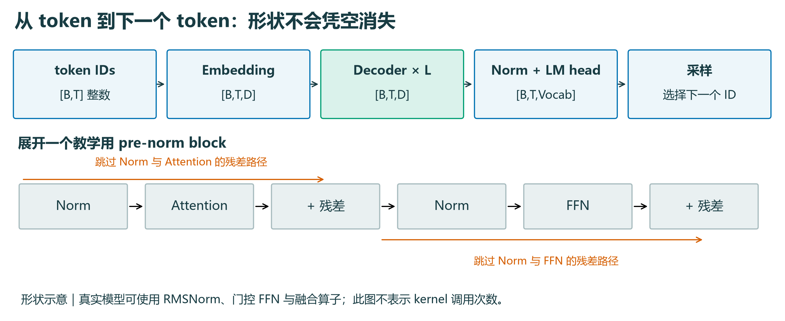
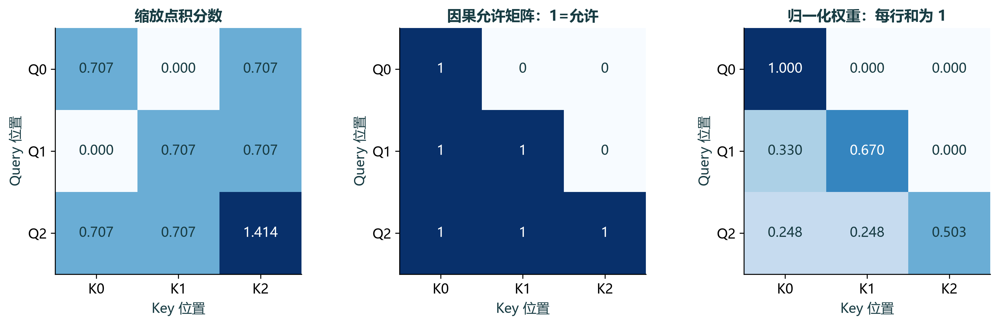
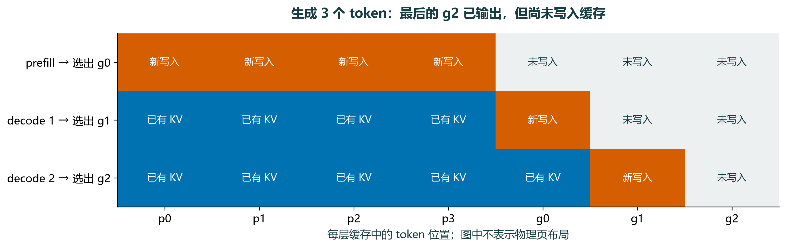
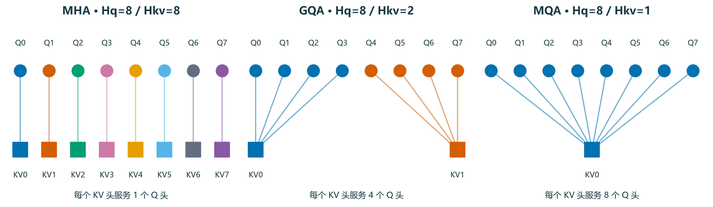
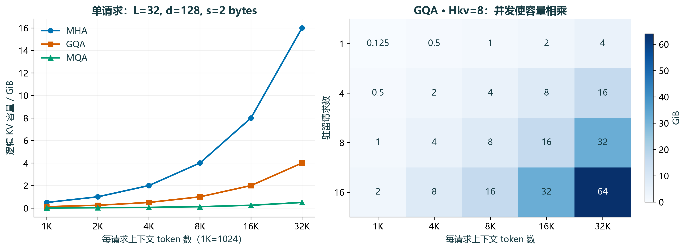
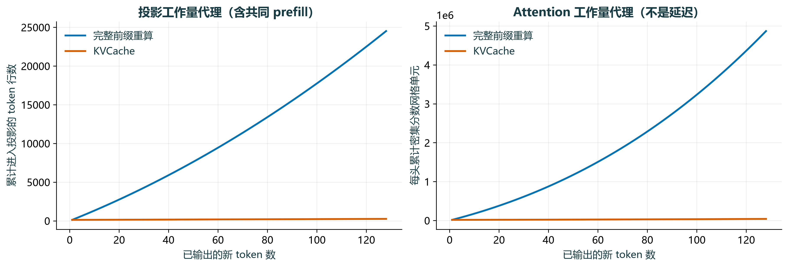
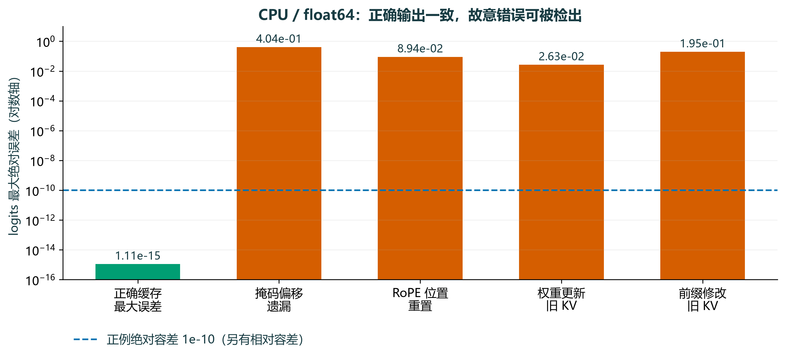

# 第一周：Attention 与 KVCache 基础

> 学完这一周，你应该能沿着张量形状解释一次生成，手算一个 Attention 输出，独立实现 KVCache，并用数据说明它节省了什么、仍然花费什么。

**阅读方式**：本页是完整图文讲义；下载并打开同目录的 [index.html](index.html) 可使用离线交互版。GitHub 文件页不会执行 HTML，需要下载后用浏览器打开。无需 GPU、模型权重、账号或联网服务。

**配套实验**：[代码与复现说明](../../experiments/w01-attention/README.md)。本文的容量、运算量是公式计算；正确性误差来自本机 CPU / float64 实验。没有 GPU 延迟或加速倍数测量。教学模型随机初始化，只用于数值验证，不具备语言能力。

## 0 · 学习地图与本周产物

首次阅读按“主线 → 手算 → 实验 → 闭卷解释”推进。看到源码扩展和边界讨论时可以先做标记，不要求第一遍全部背下。

| 启动周 | 时间 | 阅读与实践 | 当天完成的证据 |
| --- | --- | --- | --- |
| 周三 10-07 | 2 h | 第 1、2 节；完成形状表与手算 | 一张推理路径图、一行 softmax 手算 |
| 周四 10-08 | 2 h | 第 3 节；逐步跟踪 4 个 prompt token | prefill/decode 时间线、缓存正确性解释 |
| 周五 10-09 | 2 h | 第 4、5 节；容量练习与交互计算 | 三种头结构对照、容量和搬运估算 |
| 周六 10-10 | 3 h | 第 6 节；读代码、运行、修改实验 | 输出一致性记录与一个故障定位 |
| 周日 10-11 | 3 h | 第 7 节；闭卷复述、验收与补漏 | 本周 Attention 验证包 |

完整周的 7 次任务拆分为：①路径与形状，②Q/K/V 与掩码，③prefill/decode，④MHA/GQA/MQA，⑤容量，⑥实验，⑦验收。启动周将①②、④⑤合并；基础不熟时顺延，不删掉练习。工作日仍用 15/35/50/20 分钟节奏。

本周只交一个“Attention 验证包”：自己的形状图、手算过程、实验命令与结果、缓存复用边界。教材准备完成不等于你已通过验收。

**衔接你已有的 MiniMind / Pyre 笔记**：已核对你的模型分析、RoPE 笔记及 Pyre 的 Attention、因果掩码、GQA 资料。可以先用第 7 节自测；能独立解释的内容快速复习，把时间留给增量推理和故障实验。具体路径、形状差异及一处 softmax 修正见[旧笔记对照阅读](prior-notes.md)。文件存在不代表已经掌握，仍以你的回答和实验作为验收依据。

## 1 · 先沿着张量走一遍

### 1.1 我们讨论哪一种 Transformer

本周讨论 **decoder-only、因果自注意力、自回归推理**，先假设没有 padding、没有跨设备切分、没有 dropout。原始 Transformer 论文还包含 encoder 与 cross-attention；不要把那套完整架构直接套到所有现代语言模型。Attention 的核心定义见原论文 §3.2；下文的形状和算例是为本课程构造的教学例子。[原始论文](https://arxiv.org/html/1706.03762v7)

自回归的意思是：模型根据已经给定的 token，预测下一个 token 的分布。一次 forward 输出的是 **logits**，选择 token 的采样器才把 logits 变成新的 token ID。token 不一定对应一个汉字或一个英文单词；本周直接使用整数 ID，暂不引入 tokenizer。



读图时区分三件事：ID 是整数；隐藏状态是向量；logits 是对词表中每个候选的分数。embedding 将离散 ID 查表变成向量。每层 decoder block 先让当前位置汇聚上下文信息，再经过逐位置的前馈网络。残差连接把旧表示加回来，因此被相加的两条路径必须形状相同。

教学模型采用 pre-norm：`x ← x + Attention(Norm(x))`，再做 `x ← x + FFN(Norm(x))`。真实 mini-sglang 的 Llama 实现使用 RMSNorm、融合残差及门控 FFN；配套最小模型使用 LayerNorm 和 GELU FFN，保留理解缓存所需的因果结构，不声称复现 Llama 的数值。

### 1.2 统一符号，不靠猜维度

| 符号 | 含义 | 本节例子 |
| --- | --- | ---: |
| B | batch 中的序列数 | 2 |
| T | 本次输入 token 数 | 3 |
| P | 已缓存的历史 token 数 | 首次为 0 |
| S | 当前可见 key 数，S=P+T | 首次为 3 |
| D | 隐藏维度 | 16 |
| Hq、Hkv | Query 头数、KV 头数 | MHA 时均为 4 |
| d | 每个头的维度 | 4 |
| L | decoder 层数 | 随模型定义 |
| Vocab | 词表大小，避免与 Value 的 V 混淆 | 32 |

先设 `D = Hq × d`。所有权重都用数学上的右乘记法 `X @ W`；PyTorch `nn.Linear` 实际存储的 weight 形状是 `[out_features, in_features]`，forward 中等效使用转置。读源码时不要因此认为公式写反了。

| 操作 | 符号形状 | B=2、T=3 的具体形状 |
| --- | --- | --- |
| token IDs | [B,T] | [2,3] |
| embedding 后 X | [B,T,D] | [2,3,16] |
| WQ、WK、WV（此处 MHA） | [D,Hq×d] | [16,16] |
| Q、K、V 投影后 | [B,T,Hq×d] | [2,3,16] |
| 拆头并重排 | [B,Hq,T,d] | [2,4,3,4] |
| K 转置最后两维 | [B,Hq,d,T] | [2,4,4,3] |
| QKᵀ | [B,Hq,T,T] | [2,4,3,3] |
| softmax 权重 A | [B,Hq,T,T] | [2,4,3,3] |
| AV | [B,Hq,T,d] | [2,4,3,4] |
| 合并头及输出投影 | [B,T,D] | [2,3,16] |
| LM head logits | [B,T,Vocab] | [2,3,32] |

生成时通常只需要最后一个有效位置的 logits 来选择下一个 token。实现可能只计算必要位置的 LM head；表中列出的是教学模型保留全部位置的形状。

**停下来做**：把 T 从 3 改成 5，逐行重写。哪些权重矩阵不变？把 D=16 改成 24、Hq=4，d 应是多少？不要跳到答案再回头“觉得懂了”。

<details><summary>核对答案</summary>

T 的变化影响序列轴以及 Attention 矩阵的两个序列轴，不改变任何已训练权重的形状。Q/K/V 拆头后为 [2,4,5,4]，分数为 [2,4,5,5]。D=24、Hq=4 时 d=6；若模型没有特殊投影设计，这些宽度变化会要求不同形状的权重。

</details>

## 2 · Attention：从一行分数到一个输出

### 2.1 Q、K、V 各自参与什么计算

Q 和 K 用来算匹配分数，V 用来形成加权输出。它们是**三个可学习投影产生的张量**，不是三个固定的语义标签，也不是数据库中用户手工填写的键值。一个位置的 Q 会和所有允许位置的 K 做点积，得到对各个 V 的权重。

```text
Q = X WQ        K = X WK        V = X WV
scores = Q Kᵀ / √d
A = softmax(scores + causal_mask, axis=key_position)
O = A V

causal_mask[i,j] = 0     当 j ≤ i
causal_mask[i,j] = -∞    当 j > i
```

softmax **沿 key 的位置轴**归一化：一行回答“当前 query 把注意力分给哪些 key”。不是跨 batch，也不是跨头。它先减去这一行的最大值再指数化，可以提高数值稳定性；减去同一个常数不改变结果。

`1/√d` 控制点积尺度：若各分量独立、均值为 0、方差为 1，则点积方差为 d，除以 √d 后方差为 1。这是一种初始化尺度的解释，并不保证训练后的真实激活永远满足这些统计假设。

掩码要在 softmax **之前**施加。把被禁止位置的分数乘以 0 并不能排除它，因为 `exp(0)=1`。本实验里布尔值 `True` 表示允许；不同 API 的布尔掩码约定可能不同，要查当前接口。

### 2.2 用 3 个 token、2 个维度亲手算

下面直接给出已经投影后的 Q/K/V，以便把注意力放在 Attention 运算上。这是数值例子，不是从训练模型提取的数据。

```text
Q = K = [[1,0],       V = [[1,0],
         [0,1],            [0,2],
         [1,1]]            [3,1]]

QKᵀ / √2 = [[0.7071, 0,      0.7071],
             [0,      0.7071, 0.7071],
             [0.7071, 0.7071, 1.4142]]
```



第一行只允许看自己，因此权重是 `[1,0,0]`，输出为 `[1,0]`。第二行只对前两项归一化；第三行允许三项。每一行的可见性不同，不能给每行套相同分母。

第三行减去最大值后，指数项为 `[exp(-0.7071), exp(-0.7071), 1]`，约为 `[0.4931,0.4931,1]`。除以总和后得到约 `[0.2483,0.2483,0.5035]`。于是输出约为：

```text
0.2483 × [1,0] + 0.2483 × [0,2] + 0.5035 × [3,1]
= [1.7587, 1.0000]
```

图的数据来自 [attention_example.json](../../experiments/w01-attention/data/attention_example.json)。查看小数时允许四舍五入；实际检查使用未四舍五入的 float64 数据。

<!-- interactive-attention -->

**停下来做**：手算第二行；再故意取消因果掩码，说明第一行为什么会变。未来 token 明明已经在 prompt 数组里，为什么仍要遮住它？

<details><summary>核对答案</summary>

第二行前两项权重约为 `[0.3302,0.6698]`，第三项为 0；输出约 `[0.3302,1.3395]`。去掉掩码后第一行也能读取后两项，输出会改变。因果模型在所有阶段都要遵守相同的依赖结构；prefill 能并行不意味着允许读取未来位置。更换“未来”token 不应改变过去位置的表示，这是配套实验的一条正确性检查。

</details>

## 3 · Prefill、decode 与 KVCache 的理由

### 3.1 为什么过去的 KV 可以不重算

固定权重、位置规则和输入前缀后，因果模型中位置 i 只能依赖 `token[0:i+1]`。追加 token 不会改变这个前缀。第一层的历史表示不变，第二层接收的历史输入也不变，依此类推，每层历史 K/V 都不变。因此缓存的是**每一层**已经算过的 K/V。[Hugging Face 缓存说明](https://huggingface.co/docs/transformers/main/cache_explanation)

这个推理用到了因果掩码与逐位置运算。如果是允许双向信息流的 encoder，追加输入可能改变过去位置的表示，就不能直接套用。

为什么一般不保存历史 Q？下一步只需要新位置的输出，因此只需要新位置的 Q；过去输出已经计算过。未来的 Q 仍要读取历史 K/V。跨多个 block 使用缓存，还避免了对历史位置反复执行投影、FFN 等运算，不只是省下两个线性层。

### 3.2 首 token 是 prefill 产出的

给定 4 个 prompt token `p0 p1 p2 p3`，要输出 3 个新 token `g0 g1 g2`：

| 调用 | 本次送入模型 | 当前 query 数 | 可见 key 数 | 调用结束缓存长度 | 由最后 logits 选择 |
| --- | --- | ---: | ---: | ---: | --- |
| prefill | p0 p1 p2 p3 | 4 | 4 | 4 | g0 |
| decode 1 | g0 | 1 | 5 | 5 | g1 |
| decode 2 | g1 | 1 | 6 | 6 | g2 |



**选择出一个 token，不等于已经算过这个 token 的 KV。** g0 要在下一次 forward 中作为输入，才生成自己的 K/V。若输出 g2 后立刻结束，则不必再把 g2 送回模型；显示给用户的 token 总数是 7，缓存中却只有 6 个位置。继续会话时要按引擎实际约定处理这个尚未消费的末尾 token。

<!-- interactive-decode -->

### 3.3 单步 decode 的形状

设已有 P 个位置，当前输入一个新 token，则 `T=1, S=P+1`：

```text
新 Q       [B,Hq,1,d]
新 K/V     [B,Hkv,1,d]
历史 K/V   [B,Hkv,P,d]
追加后 K/V [B,Hkv,P+1,d]
分数矩阵   [B,Hq,1,P+1]
```

新 Q 仍要与所有可见 K 计算分数，输出仍要汇聚所有可见 V。KVCache 没有让模型停止读取上下文。

### 3.4 带缓存的掩码要用绝对位置

若已有 P=3 个历史 token，一次再输入 T=2 个 token，两个 query 的绝对位置是 3、4，可见 key 的位置是 0…4：

```text
允许矩阵（1=允许）
query 位置 3 : 1 1 1 1 0
query 位置 4 : 1 1 1 1 1

通式：allowed[i,j] = (j ≤ P+i)
```

如果直接对一个 `[2,5]` 矩阵做普通左上角 `tril`，就会错误地得到第一行只能看 key 0、第二行只能看 key 0、1。本实验明确构造 `P+i`，不依赖 API 猜测历史长度。本机 PyTorch 2.14.1 的 SDPA 文档说明非方阵的 `is_causal=True` 使用左上角对齐；正式换接口时应再次核实。[PyTorch SDPA 文档](https://docs.pytorch.org/docs/stable/generated/torch.nn.functional.scaled_dot_product_attention.html)

单 token decode 且传入的 K/V 恰好全是历史和当前位置时，这一行可以全允许；若缓存预分配了未使用槽位、有 padding 或有滑动窗口，就仍需屏蔽无效位置。RoPE 的当前位置也必须接上历史偏移，不能每步从 0 重置。

**停下来做**：P=5、T=3 时写出完整的 3×8 允许矩阵。解释为什么只把 `K` 追加正确还不足以保证输出正确。

<details><summary>核对答案</summary>

三行分别允许 key 0…5、0…6、0…7。除了 K 的内容与顺序，V、层号、query 的位置、RoPE、掩码、batch/request 对应关系都要一致。数值正确的缓存张量如果被分配给错误的请求，同样会得到错误输出。

</details>

## 4 · MHA、GQA、MQA：改变的是 KV 头的共享关系

MHA 为每个 Query 头提供自己的 K/V 头。MQA 保留多个 Query 头，但它们共享一对 K/V 头。GQA 把 Query 头分成组，每组共享一对 K/V 头。MQA 和 GQA 的原始论文分别讨论这种共享方式及训练/质量取舍。[MQA 论文](https://arxiv.org/abs/1911.02150)；[GQA 论文](https://arxiv.org/abs/2305.13245)



| 模式 | 示例 Hq | 示例 Hkv | 每个 KV 头服务多少 Q 头 | 相对 KV 容量 |
| --- | ---: | ---: | ---: | ---: |
| MHA | 8 | 8 | 1 | 1 |
| GQA | 8 | 2 | 4 | 1/4 |
| MQA | 8 | 1 | 8 | 1/8 |

这里的比率只在 L、d、精度、上下文和请求数相同的条件下成立。Query 头数 Hq 没有减少，逻辑上的 Attention 权重依然按 Query 头计算。不能把“KV 存储缩小 4 倍”直接写成“整机快 4 倍”。

在 GQA 中，`WQ:[D,Hq×d]`，而 `WK/WV:[D,Hkv×d]`。缓存保存 `[B,Hkv,S,d]`。教学代码使用 `repeat_interleave` 临时扩展到 Hq 个头，帮助展示匹配关系；高效 kernel 可以直接复用共享 KV，不必物化这份扩展副本。

**模型结构有自己的权重约束**：不能随意把已训练 MHA 模型的 Hkv 改小，并声称语义与输出完全保持。配套实验分别初始化三种模型，只比较每种模型自身“有缓存 vs 无缓存”的结果，不比较不同模型的输出是否相同。

**练习**：Hq=32、Hkv=8、d=128、D=4096 时，WQ 和 WK 的数学形状分别是什么？每组有多少个 Query 头？

<details><summary>核对答案</summary>

WQ 为 [4096,4096]，WK 和 WV 为 [4096,1024]；每组 4 个 Query 头。这个例子满足 D=Hq×d。公式中的 KV 头数是 8，不是 32。

</details>

## 5 · 算清容量、计算量与搬运量

### 5.1 从一个 token 的 KV 开始数

一个 token、一层：K 有 Hkv×d 个元素，V 也有 Hkv×d 个元素。每个元素 s 字节，总共 L 层。若 B 个请求长度相同，均为 S：

```text
KV_bytes = 2 × L × B × S × Hkv × d × s
系数 2 表示分别保存 K 和 V。

长度不同、无共享时：KV_bytes = 2 × L × Hkv × d × s × Σ S_i
1 GiB = 2^30 bytes；1 GB = 10^9 bytes。
```

这里只算普通全注意力、K/V 维度相同的逻辑载荷，不包含权重、临时张量、分配器碎片、页表、padding、元数据和运行时工作区。混合层、滑动窗口、MLA 等结构需要按各层真实状态重新推导；张量并行下还要检查 KV 分片或复制，不能盲目除以卡数。

例子：L=32、Hq=32、Hkv=8、d=128、FP16/BF16 的 s=2。单 token 全部层的 KV 为：

```text
2 × 32 × 8 × 128 × 2 = 131072 bytes = 128 KiB
单请求 8192 token：128 KiB × 8192 = 1 GiB
8 个同长度请求：8 GiB
```

同样条件下，MHA 的 Hkv=32 时每个 8192-token 请求需要 4 GiB；MQA 的 Hkv=1 时需要 0.125 GiB。这里的“8K”明确指 8192，而不是 8000。



左图固定单请求和 2 字节元素，右图固定 GQA Hkv=8 和 2 字节元素。它们来自 [capacity.csv](../../experiments/w01-attention/data/capacity.csv)，全部为理论载荷。

<!-- interactive-capacity -->

如果用 1 字节来估算量化 KV，得到的是理想 payload，实际还需要量化尺度、零点、对齐等开销；框架支持与误差必须另验。**权重量化为 4 bit 并不表示 KV 自动也是 4 bit。**

共享前缀的物理容量应该按唯一驻留块计算，同时考虑尾块占用与引用计数，不能机械把每个请求的完整长度相加。本周先算“无共享”的清晰基线，第 4 周再加入块管理。

### 5.2 缓存省了哪些运算

把维度因子暂时固定，只看序列长度 n。在“每次生成都完整重跑已有前缀”的朴素基线中，每步处理 n 个位置，形成 n×n 的逻辑分数矩阵。缓存后，prefill 仍处理 prompt；之后每步只处理一个新位置，形成 1×n 的分数矩阵。

| 项目 | 完整前缀重算 | 缓存后的单步 decode |
| --- | --- | --- |
| 本步 Q/K/V 投影的位置数 | n | 1 |
| 历史位置的各层 FFN 等 | 重做 | 复用已有历史状态 |
| 当前步 Attention 分数网格，每头 | n² | n |
| 新位置对历史 K/V 的读取 | 需要 | 仍需要 |
| 首次 prefill | 需要 | 仍需要 |
| 模型权重、LM head、采样 | 需要 | 仍需要 |
| 持久 KV 占用 | 可不跨步保留 | 随有效上下文增长 |

若固定 prompt 长度，从累计生成规模看，朴素重算的分数工作可达立方增长，缓存后是二次累计增长；常说的“从 O(n²) 到 O(n)”是**单步 decode 的 Attention 项**，不是说生成整个序列只需 O(n)，更不等于所有硬件上的加速比。



图以 P=128、输出 G=128 为例，包含共同的首次 prefill。横轴是输出序号；每头每次调用的密集分数网格分别为 n² 和 n。真实因果 kernel 可以跳过禁止区域、融合 softmax 或避免完整物化，因此图中数值是可复核的教学工作量代理，**不是显存占用、实测 FLOPs 或延迟**。

如果希望保留维度：QKᵀ 和 AV 的密集计算合计约为 `4×B×Hq×T×S×d` FLOPs（一次乘加记 2 FLOPs）。Q/K/V 投影约为 `2×B×T×D×(Hq+2Hkv)×d` FLOPs，还没有加入输出投影、FFN、norm 等。看到瓶颈时，先确认数的是哪个算子。

### 5.3 容量与带宽是两本账

“装得下”讨论静态容量；“读得动”讨论每步搬运。把全部可见 KV 理想地读取一遍，其载荷规模与上面的容量同阶。若有效带宽为 BW，粗略估算为 `payload / BW`。这是对指定数据路径的估算，不能把 GPU 标称 HBM 带宽直接当作 SSD、PCIe 或网络的有效带宽。

沿用单请求 8K、GQA、1 GiB 的例子，假设有效带宽 **1 TB/s = 10^12 bytes/s**，读取 1 GiB 对应约 **1.074 ms**。8 个请求理想载荷合计 8 GiB，约 8.59 ms。这个假设未计权重、同步、缓存层次、kernel 效率和读写重叠，因此不能作为真实 TPOT 报告。

GQA/MQA 的共享可能减少 KV 的存储与数据搬运；实际能复用到哪一级存储、是否重复加载、哪些成本重叠，都取决于实现。CPU 教学实现中的 concat 和显式扩头反而会产生额外拷贝，这也是它不适合评估推理性能的原因。

**容量练习**：①上述 GQA 模型 4 个请求、每个 16384 token，FP16，需要多少 GiB？②改为 FP32？③只有 6 GiB 的“净 KV 预算”，最多放多少个长度 8192 的同类请求？

<details><summary>核对答案</summary>

①8 GiB；②16 GiB；③按无共享、无碎片的理想 payload 可放 6 个。真实引擎还需处理块边界和管理开销，可能更少。这里的 6 GiB 必须是已经扣除权重和工作区后的 KV 预算，不能把整张卡的显存直接代入。

</details>

## 6 · 用实验检查理解，再接到真实源码

### 6.1 实验的比较对象

[attention.py](../../experiments/w01-attention/attention.py) 定义一个两层小型 decoder：embedding → pre-norm block → final norm → LM head。Attention 包含 RoPE、显式因果掩码、MHA/GQA/MQA 和逐层 KV。所有实验在 CPU、float64、eval/inference_mode 下运行，无 dropout，固定随机种子。

无缓存路径每次把已有 token 全部送入模型；缓存路径只送新 token 或新 chunk。先用相同的已知 token 序列逐位置比较 logits，避免采样分歧掩盖实现错误；再运行 8-token 贪心生成，检查完整输出序列和缓存长度。

```python
# 历史长度决定当前位置和允许的 key，二者必须一致。
past = 0 if cache is None else cache[0].shape[2]
query_positions = torch.arange(new_length) + past
key_positions = torch.arange(past + new_length)
allowed = key_positions[None, :] <= query_positions[:, None]
scores = scores.masked_fill(~allowed, -torch.inf)
weights = scores.softmax(dim=-1)
```

`torch.cat` 沿序列轴追加 K/V 后，再保存紧凑的 Hkv 头缓存。真实系统常使用预分配缓冲区、分页槽位与 block table 来避免反复拷贝；这部分暂留到后续周。

### 6.2 运行与观察

在仓库根目录，用 PowerShell 运行；本机的独立环境已准备好。换电脑请先按[实验 README](../../experiments/w01-attention/README.md)安装锁定依赖。

```powershell
.venv\Scripts\python.exe experiments/w01-attention/run.py
.venv\Scripts\python.exe lessons/week01/build.py
```

第一条重建原始 JSON/CSV，第二条重建图片和离线交互文档。数据文件保留 Python/PyTorch 版本、种子、容差与实验代码 SHA-256。图表数据可逐项追溯，改变代码后应重新生成整个产物。

<!-- results:start -->
已执行 **25 项检查**：21 项正确性检查通过，4 项故意故障均被检出。正例最大绝对误差 **1.110e-15**。

运行环境：Python 3.11.0、PyTorch 2.14.1+cpu、CPU 单线程、随机种子 20261007。

| 检查组 | 观察值 / 最大绝对误差 | 结论 |
| --- | --- | --- |
| 三种头结构 × 三组 B/T × 两种切分 | 1.110e-15 | 正确性通过 |
| 错误掩码偏移 | 4.035e-01 | 故障被检出 |
| 错误 RoPE 位置 | 8.938e-02 | 故障被检出 |
| 新权重 + 旧缓存 | 2.632e-02 | 故障被检出 |
| 新权重 + 重建缓存 | 6.661e-16 | 正确性通过 |
| 新前缀 + 旧缓存 | 1.950e-01 | 故障被检出 |
| 8-token 贪心生成 | 6.661e-16 | 正确性通过 |

完整记录：[checks.json](../../experiments/w01-attention/data/checks.json)。
<!-- results:end -->



图中“故障被检出”表示错误实现的输出偏离了对应的正确参考，并非错误实现通过了正确性。正例要求 `assert_close(atol=1e-10, rtol=1e-10)`；负例要求最大绝对误差大于 1e-5。图中误差为 0 时仅为了对数坐标显示而截到 1e-16，真实值仍在 JSON 里。

四个负例分别检查：忘记历史掩码偏移、RoPE 位置重置、改变权重后继续使用旧缓存、修改前缀后继续使用旧缓存。另有正例证明权重变化后重建缓存可恢复一致性。

**周六 3 小时实验路线**：

1. 30 分钟：读代码并画出每层缓存结构；自己说出维度 2 为什么是序列轴。
2. 60 分钟：运行实验，核对三种头结构、单 token 与多 token chunk 的一致性。
3. 50 分钟：选择一个负例，先预测错误，再读实际误差并解释原因。
4. 40 分钟：自己新增一个上下文长度或 batch 大小，写出结论和边界。

不要只提交“全部通过”的截图。至少解释一项正例保证了什么、一项负例如何失效，以及这些实验没有验证什么。

### 6.3 读 mini-sglang 的 4 个入口

本地源码根目录：`zero-to-sglang-main/mini-sglang-main`，位于本学习仓库的同级导读库中。以下为 2026-10-07 的源码阅读定位；SHA-256 见 [source-evidence.json](source-evidence.json)，上游 commit 未知。

| 文件 | 符号 / 行号 | 带着什么问题读 |
| --- | --- | --- |
| python/minisgl/models/llama.py | LlamaForCausalLM.forward:79；LlamaModel.forward:60 | IDs 在哪里变向量？哪些位置经过层循环和 LM head？ |
| python/minisgl/models/llama.py | LlamaDecoderLayer.forward:34 | norm、Attention、残差、FFN 的顺序是什么？ |
| python/minisgl/models/utils.py | RopeAttn.forward:119 | QKV 合并投影、Attention、输出投影如何衔接？ |
| python/minisgl/layers/attention.py | AttentionLayer.forward:47 | 第 49 行如何按 Q/K/V 宽度拆分？第 54 行的位置从哪里来？ |

调用链摘要：`LlamaForCausalLM.forward → LlamaModel.forward → LlamaDecoderLayer.forward → RopeAttn.forward → AttentionLayer.forward → ctx.attn_backend.forward`。最后一跳是后端接口，本周不声称已经追完具体 cache 写入或 kernel 调用。

`AttentionLayer` 中可看到 Query/KV 头数分别处理，且有张量并行下的分片或复制；输入 token 也可能展平为总 token 数。教材的 `[B,T,D]` 是便于推导的逻辑布局，读真实代码时需要把逻辑轴映射到执行布局。

本周先不运行完整 mini-sglang 服务，不把 CPU 教学实验的正确性替代该引擎的集成验证。

### 6.4 从你的 MiniMind 笔记迁移过来

你已有的 `02.minimind_model_minimind_analysis.md` §7.4.5–7.4.9 正好覆盖缓存拼接、GQA 扩头和掩码。最需要对照的是**轴的含义**：MiniMind 在转置前保存 `[B,S,Hkv,d]` 的缓存，沿 `dim=1` 追加；本教程保存 `[B,Hkv,S,d]`，沿 `dim=2` 追加。两者都正确，不能只看维度编号判断。

MiniMind 的手写分支只对分数矩阵最后的 `seq_len` 列增加当前 chunk 的三角掩码，历史列已经全部可见。这与本教程 `key_position ≤ past + query_index` 的条件等价。MiniMind 还通过 `start_pos` 切片 RoPE 表；本教程直接用 `past + arange(T)` 生成位置。

Pyre 的 `09.因果注意力机制详解.pdf` 使用方阵的上三角**禁止掩码**，True 表示要填成 -∞；本教程使用矩形的**允许掩码**，True 表示保留。迁移时既要补历史位置偏移，也要核对布尔值的含义。

用你的 MiniMind 当前代码默认参数再算一遍：L=8、Hkv=4、d=96，假设 KV 为 FP16，则单 token 是 **12 KiB**，单请求 2048 token 是 **24 MiB**。这只是默认配置的推导，加载其他 checkpoint 或覆盖配置后应重新计算。

## 7 · 复用边界、请求生命周期与验收

### 7.1 缓存能否复用，要检查计算是否等价

| 情况 | 能否直接复用 | 判断理由 |
| --- | --- | --- |
| 同一请求追加 token，模型与位置规则固定 | 可以复用已计算前缀 | 历史因果表示不变 |
| 两请求拥有完全相同 token 前缀及计算配置 | 可能共享前缀 | 还取决于引擎机制、隔离规则和可用块 |
| 文本看起来相同，但 tokenizer 或模板不同 | 不能只凭文字判断 | 实际 token IDs 可能不同 |
| 修改历史 token 或系统提示 | 从首个变化点起重算 | 后续历史表示也可能受影响 |
| 更新权重、LoRA/adapter 或位置编码配置 | 通常应失效并重建 | K/V 的生成函数已经变化 |
| 不同 mask、位置偏移或多模态输入 | 需要重新证明等价 | 同 token ID 不保证同表示 |
| 仅改变后续采样温度、top-p | 已计算 KV 通常仍可用 | 只改变选择新 token 的方式；分叉后的新缓存不能互混 |
| 把旧 K/V 从 CPU 搬回 GPU | 内容可复用但有成本 | 还需核对布局、dtype、设备和兼容元数据 |

“通常”保留了优化实现的空间，例如某些局部改动可能有可证明的局部复用。但本周的正确默认是：未证明等价的旧缓存不直接继续使用。跨用户复用还涉及访问隔离，不能只以命中率为依据。

### 7.2 一次请求的生命周期

```text
输入文本 → tokenizer/模板 → 请求入队
    → 检查可复用前缀与计算配置 → 分配 KV 空间
    → prefill 未计算部分 → 采样首个新 token
    → 反复：消费上一个新 token → 追加 KV → 计算 logits → 采样
    → EOS/长度上限/取消/异常 → 释放引用与请求资源
```

这是一张概念路径图，尚不是某个框架的完整调用链。普通请求结束后，活动引用应释放；如果开启前缀缓存，部分块可能保留并受淘汰策略管理。因此“请求结束”不必意味着物理 KV 字节立刻全部清零。

### 7.3 闭卷验收

先遮住表格右栏，把答案写在自己的学习日志里，再核对。核心项答错时先补做，额外知道术语不能抵消核心错误。

| 题目 | 合格答案应包含 |
| --- | --- |
| 1. 画一次 decoder-only 推理路径并标形状 | ID、embedding、block、LM head、采样的区别 |
| 2. 手算第 2 节第三行 Attention | 缩放、允许位置、softmax 轴和 V 加权 |
| 3. 为什么能缓存 K/V，为什么不需要历史 Q？ | 因果依赖、逐层历史表示不变、新 query 的需求 |
| 4. P=4，生成 G=3 个 token，需要几次 prefill/decode？ | 1 次 prefill、2 次 decode；停止时通常缓存 6 个位置 |
| 5. 推导 8K 单请求 GQA 的 1 GiB | 正确使用 L、Hkv、d、s 与二进制单位 |
| 6. Hkv 缩小 4 倍是否代表速度提高 4 倍？ | 区分 KV 载荷与整机瓶颈，并说明假设 |
| 7. 为什么 `[1,S]` 上普通 tril 可能错？ | query 的绝对位置包含历史偏移 |
| 8. 权重更新后旧 KV 为什么失效？ | K/V 取决于权重与历史表示；展示实验负例 |
| 9. 缓存没有省掉什么？ | 首次 prefill、新位置计算、历史读取、权重等成本 |
| 10. 能否用本周实验声称 GPU 快了多少？ | 不能；本周只有 CPU 正确性与理论数据 |

**通过标准**：独立完成 1–5、7–9 的解释，能复现正例并解释至少一个负例，正确回答 6、10 的边界问题。周日用 10 分钟做技术讲解，再用 20 分钟回答上述题目；剩余时间用于整理证据和补漏。

### 7.4 常见误解速查

- “prefill 不需要 causal mask”：并行计算仍然必须遵守因果依赖。
- “KV 就是 token 的 embedding”：更深层 KV 来自该层的上下文表示和投影。
- “缓存以后 decode 是 O(1)”：当前 query 仍要读增长的可见上下文。
- “量化权重就能按同样 bit 数算 KV”：KV dtype 是另一项配置。
- “shape 对了就正确”：位置、mask、请求映射和版本也必须正确。
- “两个回答不同就证明缓存错了”：随机采样可能造成分歧，应先固定输入比较 logits。
- “用了缓存就一定在小 CPU 案例里更快”：Python、concat、内存分配的开销可能占主导。

## 8 · 继续阅读与证据清单

| 来源 | 本周用途 |
| --- | --- |
| [Attention Is All You Need，§3.2](https://arxiv.org/html/1706.03762v7) | 缩放点积、头拼接和因果掩码的基础定义 |
| [Fast Transformer Decoding](https://arxiv.org/abs/1911.02150) | MQA 的 KV 共享动机 |
| [GQA](https://arxiv.org/abs/2305.13245) | 分组 KV 头与训练取舍 |
| [How caching works](https://huggingface.co/docs/transformers/main/cache_explanation) | 逐层历史 KV 与增量计算；main 文档可能更新 |
| [PyTorch SDPA](https://docs.pytorch.org/docs/stable/generated/torch.nn.functional.scaled_dot_product_attention.html) | 接口级掩码和 dropout 约定；也核对本地 2.14.1 源码 |
| 本地导读第 1、4 章 | 中文预习与复述；位置见 sources/catalog.json |
| mini-sglang 的上述 4 个阅读入口 | 从逻辑形状连接到真实模型前向入口 |

全部示意图、算例、代码和容量数据由本课程生成，没有复制论文图片。网页核对日期：2026-10-07。公式采用本讲义明确写出的掩码定义；外部文档中的简写不能替代实现核验。

下一步：完成[首日学习日志](../../logs/2026-10-07.md)，把“做了什么、产物、卡在哪里”及验收回答发回，按实际证据更新进度。
