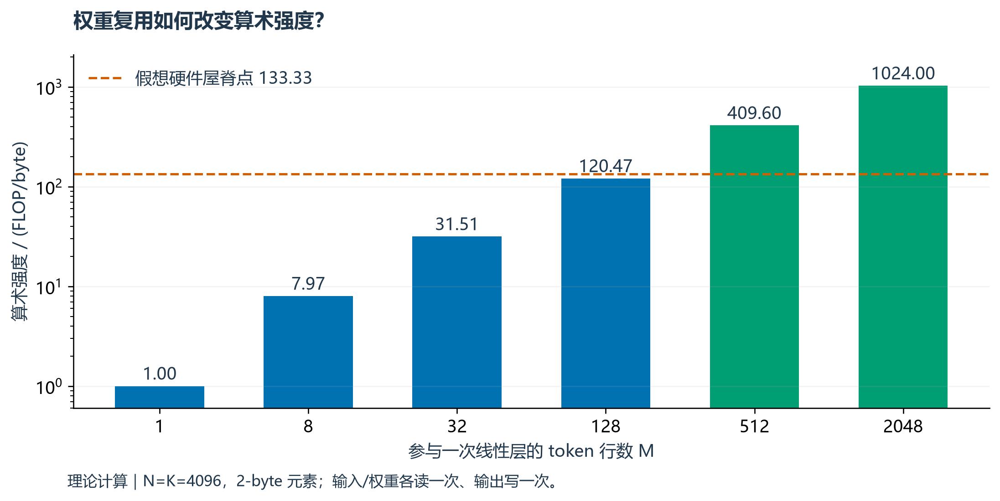
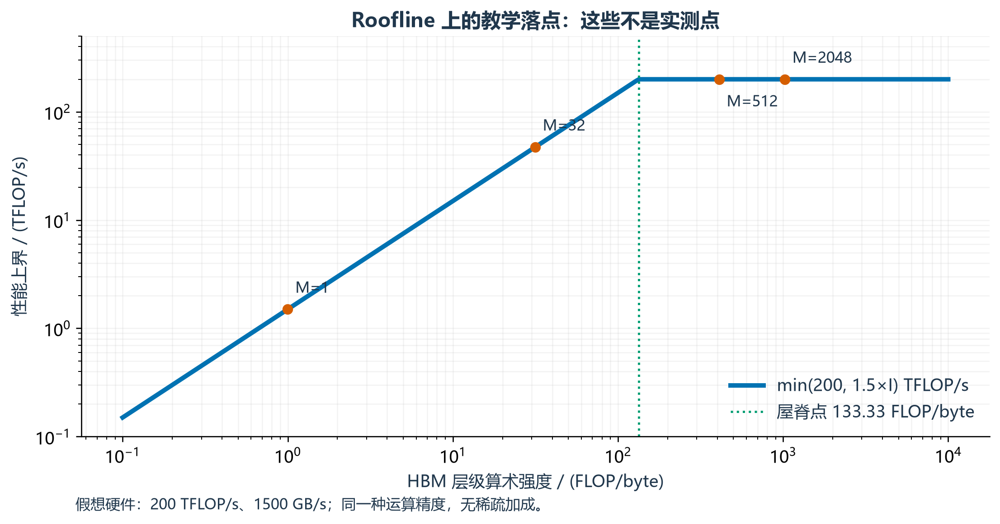
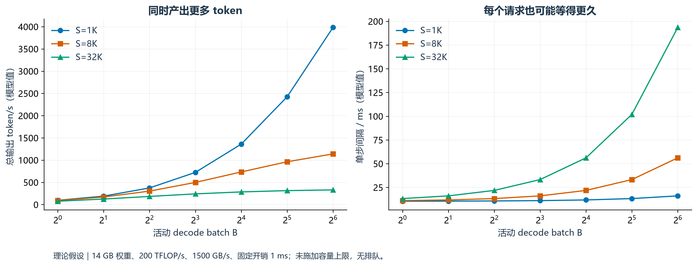
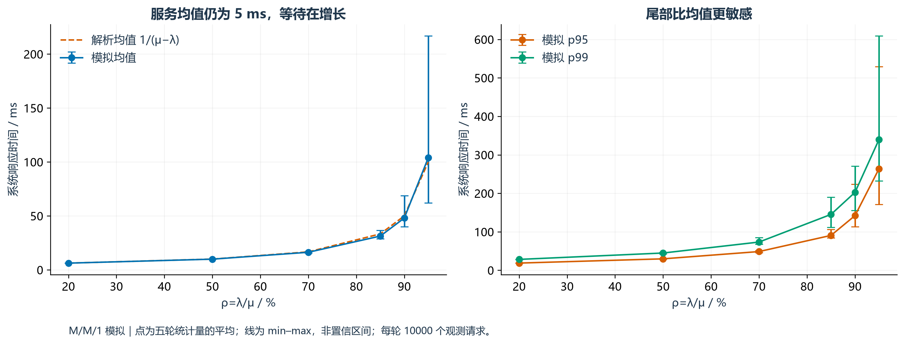
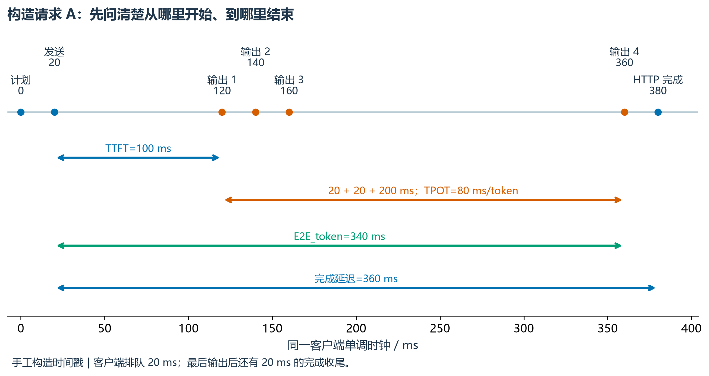
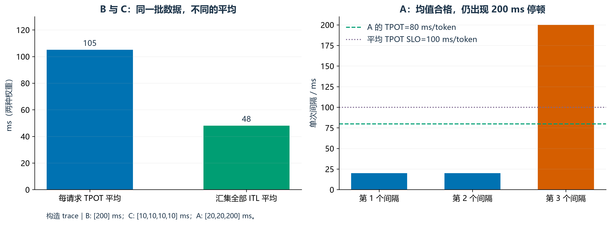
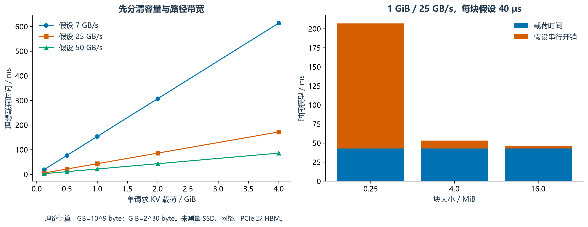

# 第二周：推理性能分析

> 本周要学会的不是背几个缩写，而是面对“吞吐提高了 30%”时，能问清测了什么、谁等得更久、用了多少资源，以及证据是否支持结论。

**阅读入口**：本页是完整讲义；同目录的 [index.html](index.html) 是可单文件离线阅读的交互版。图、数据和代码均为本课程生成。**所有硬件带宽、算力和服务时间都是教学假设；本周没有 GPU 性能实测。** 脚本确实执行过，但执行模拟程序不等于测量真实推理服务。

前置内容：[第一周](../week01/README.md)的张量形状、prefill/decode 和 KV 容量公式。已有 MiniMind / Pyre 笔记可以帮助回忆 Attention；本周新增的是把这些计算放进“算力—带宽—排队—用户体验”的账本。

## 0 · 本周安排：16 小时，只交一份实验协议

| 学习日 | 预算 | 讲解与实践 | 当天证据 |
| --- | ---: | --- | --- |
| 周一 | 2 h | 第 1 节：prefill/decode 与计算、访存 | 一张成本分解表，解释两个反例 |
| 周二 | 2 h | 第 2 节：GEMM、算术强度、Roofline | 手算 M=1 与 M=2048 的上界 |
| 周三 | 2 h | 第 3 节：batch、并发、到达率和排队 | 三请求手算、负载与尾延迟图解读 |
| 周四 | 2 h | 第 4 节：TTFT/TPOT/ITL、吞吐与 goodput | 从时间戳独立重算指标 |
| 周五 | 2 h | 第 5 节：控制变量、计时边界、冷/热缓存 | 写好比较矩阵和缓存状态说明 |
| 周六 | 3 h | 第 6、7 节：运行、修改估算脚本 | 一次参数扫描和边界检查 |
| 周日 | 3 h | 第 8 节：协议、质疑、验收 | 一份可交给他人执行的协议 |

工作日按 **15 分钟回忆 → 35 分钟原理 → 50 分钟实践 → 20 分钟留证**。周六建议 30 分钟手算、60 分钟读/改代码、60 分钟扫描与画图、30 分钟记录；周日 60 分钟分析、60 分钟补漏、60 分钟协议与验收。

本周产物是[实验协议](../../experiments/w02-performance/protocol.md)，附估算脚本和数据。教材已备好不代表学习已完成，第一周验收不过时先补基础，不按日期跳课。

**开课自测**：为什么首个输出 token 来自 prefill？L=32、Hkv=8、d=128、s=2 时，每个 token 的 KV 是多少？单步 decode 是否仍要读取历史 KV？不能独立回答时，先回第一周第 3、5 节。

## 1 · Prefill 与 decode：给每个阶段列成本

### 1.1 先区分三类工作

1. **逐位置稠密计算**：Q/K/V 与输出投影、FFN 等，同一套权重可用于多个输入位置。
2. **上下文汇聚**：QKᵀ 与 AV，开销随允许的 query–key 配对数变化。
3. **系统工作**：排队、调度、分配、采样、通信、数据搬运及网络返回。它们不会因为公式里没写就消失。

对一个线性层 `Y = XW`，设 X 为 [M,K]、W 为 [K,N]，则 Y 为 [M,N]。M 是**此次实际参与该算子的 token 行数**。常规 prefill 中约为各请求本次输入 token 数之和；普通每步各生成一个 token 的 decode 中约为活动请求数。不要把配置中的最大并发数直接代入 M。

一个较长 prompt 让许多 token 一起使用 W，权重读取可以被更多运算摊薄。单请求 decode 每次只有一行，权重复用空间较小。这是常说“prefill 更偏计算、decode 更偏带宽”的原因；它是待验证的倾向，不是每个模型、长度、batch 都成立的定律。[NVIDIA 矩阵乘法背景](https://docs.nvidia.com/deeplearning/performance/dl-performance-matrix-multiplication/index.html)



图为单个 4096×4096 线性层、2-byte 元素的一次读写模型。它没有测量硬件，也不包含整个 Transformer。

### 1.2 缓存以后，Attention 还在做什么

对普通全注意力，按乘法和加法各算一个 FLOP，并暂时按完整矩形计算 QKᵀ 和 AV：

```text
prefill：F_attention ≈ 4 × B × Hq × T² × d
decode ：F_attention ≈ 4 × B × Hq × S  × d   （每请求一个 query）
```

这是逻辑矩阵运算量近似，未含 softmax、RoPE、norm。因果 prefill 中有效配对为 T(T+1)/2，高效实现可以跳过不需要的三角部分；不能把上面的完整矩形数当成 profiler 中必然执行的 FLOP。滑动窗口、稀疏结构、MLA 等要重新推导。

读 KV 的理想逻辑载荷约为 `2×L×B×S×Hkv×d×s`，是“每步读取当前可见 KV 一次”的假设；物理 HBM 流量还受分块、重复读取、缓存层级和 GQA 复用方式影响。**存了多少字节，不自动等于 HBM 搬了多少字节。** FlashAttention 不必把完整分数矩阵写入 HBM，所以不能把所有逻辑中间张量的大小机械相加当作物理流量。[FlashAttention 原论文](https://arxiv.org/abs/2205.14135)

### 1.3 两个必须会解释的反例

| 情况 | 简单口号为什么不够 | 接下来查什么 |
| --- | --- | --- |
| 很短的 prefill、小模型、小矩阵 | 运算量少，启动开销、并行度和矩阵形状可能更重要 | kernel 时间、调度空隙、实际形状 |
| 很大的 decode batch 或很长上下文 | 权重复用增强，同时 Attention 和 KV 读取也增长 | 活动 batch、上下文分布、HBM 流量与算子时间 |

如果 GPU “利用率很高”，仍不能单凭它断定算力已吃满：这个读数可能只说明采样窗口里存在活动。应把算子、内存层级、数据类型和时间线放在一起看。

**练习**：为什么 M 从 1 增大到 32 时，投影权重字节不变，但总耗时不一定不变？S 从 8K 增大到 32K，哪个成本大致乘四、哪个不会？

<details><summary>核对思路</summary>

更多行带来更多 FLOP、输入和输出；复用降低的是每行分摊的权重读取，不是取消计算。固定 B 时普通全注意力的 KV 载荷和单步 Attention 配对数约乘四；稠密模型的权重参数量不因上下文变化。

</details>

## 2 · Roofline：先求上界，再解释离上界有多远

### 2.1 单位是推导的一部分

| 量 | 记号 | 单位 | 常见错误 |
| --- | --- | --- | --- |
| 运算量 | F | FLOP | 和 FLOP/s 混用 |
| 选定内存层级的搬运量 | Q | byte | 把容量当作累计流量 |
| 算术强度 | I=F/Q | FLOP/byte | 不说明 HBM、L2 还是其他层级 |
| 适用计算峰值 | P | FLOP/s | 用另一种精度或稀疏峰值 |
| 该层级带宽 | BW | byte/s | GB/s、GiB/s、Gbit/s 混用 |

```text
性能上界：R ≤ min(P, BW × I)
时间下界：t ≥ max(F/P, Q/BW)
屋脊点：I* = P/BW
```

`max` 假定计算和搬运可理想重叠；完全串行时两者耗时要相加。真实实现还有启动、同步和低利用率等开销。聚合整个模型得到的 `max(总F/P, 总Q/BW)` 只是粗略下界，可能掩盖不同算子分别受限；逐算子分析通常更有解释力。[Nsight Compute Roofline 说明](https://docs.nvidia.com/nsight-compute/ProfilingGuide/#roofline-charts)

本周统一用**假想硬件**：适用精度峰值 P=200 TFLOP/s、HBM 带宽 BW=1500 GB/s。两者都是十进制单位，屋脊点为 **133.33 FLOP/byte**，不对应某一张真实 GPU。



图中点位于理论上界，**不是实测点**。真实点可能远低于这条线；不能看见带宽区域就直接承诺能达到标称带宽。

### 2.2 手算一层 GEMM

假设输入和权重各读一次、输出写一次，β=0，不读旧输出：

```text
F = 2 × M × K × N
Q = s × (M×K + K×N + M×N)
I = F / Q
```

N=K=4096、s=2 时：

| M | F | Q | I | 理论时间下界 |
| ---: | ---: | ---: | ---: | ---: |
| 1 | 33,554,432 FLOP | 33,570,816 byte | 约 0.9995 FLOP/byte | 约 0.02238 ms，带宽项占优 |
| 2048 | 68,719,476,736 FLOP | 67,108,864 byte | 1024 FLOP/byte | 约 0.34360 ms，计算项占优 |

M 更大时这一层总耗时下界更长，但处理了更多行；每行成本下降。`M=2048` 可以代表 prefill 的很多位置，不能把它的“行吞吐”直接说成端到端输出 token/s。

<!-- interactive-roofline -->

**练习**：固定 M=1，把 P 从 200 增至 400 TFLOP/s，预测下界是否显著改善。再把 BW 加倍。M=2048 时重新判断。

<details><summary>核对答案</summary>

M=1 的模型由 Q/BW 主导，仅翻倍 P 几乎无效，翻倍 BW 使该项减半。M=2048 的基准由 F/P 主导，翻倍 P 可降低模型下界，翻倍 BW 不改变基准计算项。实际收益仍需在相同实现与负载下测量。

</details>

## 3 · Batch、并发、到达率：三个不同的旋钮

### 3.1 先把计数对象分开

| 概念 | 数的是什么 | 不能直接等同于 |
| --- | --- | --- |
| 客户端并发上限 C | 最多同时有多少请求未完成 | GPU 本次执行的 batch |
| 活动 decode batch B | 当前调度步中参与 decode 的请求数 | 服务器所有驻留请求数 |
| token budget | 一步可安排的 token 数预算 | 请求数；prefill 一条请求可占许多 token |
| 到达率 λ | 每秒产生的新请求 | 完成吞吐；过载时队列会积累 |

静态 batching 常等一批整体结束；continuous batching 可以在调度步之间让完成的请求退出、新请求进入，但受 KV、token budget 和调度约束。第一周的缓存账本解释了为什么“还在排队”与“占有多少 KV”需要分别记录。本周不把简化模型冒充 vLLM 调度器。

### 3.2 一个可以自己复算的 batch 模型

假定稠密计算相关参数量 Nparam=7×10⁹、每步权重读入 14 GB，L=32、Hq=32、Hkv=8、d=128、KV 元素 2 byte。每个活动请求每步输出一个 token：

```text
F_step ≈ 2 × Nparam × B + 4 × L × B × Hq × S × d
Q_step ≈ 14×10^9 + KV_bytes(B,S) + KV_bytes(B,1)
t_step_model = max(F_step/P, Q_step/BW) + 1 ms
总输出吞吐模型 = B / t_step_model
单请求速率模型 = 1 / t_step_model
```

这是假想稠密模型的简化估算，1 ms 是人为设定开销；忽略激活流量、通信、预填充混入和抢占，理想化每步的权重与 KV 读取。假定内存足够；图中的大 batch 若不满足容量约束，不能作为可运行配置。



同样的服务步同时完成更多请求的一个 token，总吞吐可以升高，而每个请求等到下一个 token 的时间也变长。提高吞吐和改善单请求体验需要分别验证。

### 3.3 排队放大了什么

先手算单服务器 FCFS（先来先服务），请求到达为 0、5、100 ms，服务时间均为 10 ms：

| 请求 | 到达 | 开始服务 | 结束 | 排队 | 响应时间 |
| --- | ---: | ---: | ---: | ---: | ---: |
| A | 0 | 0 | 10 | 0 | 10 |
| B | 5 | 10 | 20 | 5 | 15 |
| C | 100 | 100 | 110 | 0 | 10 |

递推是 `start_i=max(arrival_i,end_(i-1))`。只计服务时间就会漏掉 B 的等待。

进一步采用 M/M/1 教学模型：到达间隔、服务时长分别为独立指数分布；单服务台、无限队列、FCFS；λ<μ 才有有限的稳态均值。若 μ=200 请求/s，平均服务时间为 5 ms：

```text
ρ = λ / μ
平均系统时间 W = 1 / (μ−λ)
平均排队时间 Wq = W − 1/μ
稳定、边界一致时 Little 定律：平均系统内请求数 Lbar = λ × W
```

λ=100 时 W=10 ms；λ=180 时 W=50 ms。服务能力没有变，等待显著变长。λ≥μ 时不能把公式算出的负数当延迟；该模型没有有限稳态均值。[MIT M/M/1 讲义](https://live.ocw.mit.edu/courses/2-854-introduction-to-manufacturing-systems-fall-2016/927056a1af54772a587fd84ad4951e71_MIT2_854F16_Mm1Queue.pdf)



数据来自 6 个利用率 × 5 个种子；每轮 2000 个请求作启动过渡、统计后续 10000 个请求。图上点是五轮各自统计量的算术平均，范围是五轮结果的最小到最大值，**不是置信区间**；右图没有把五轮请求合并后再求分位数。固定过渡长度不保证完全消除初态影响；越接近饱和，越要检查运行长度和多种子稳定性。真实 LLM 服务有动态 batch、可变 token 工作量及调度，不能直接用这条曲线预测其 TTFT。

<!-- interactive-queue -->

### 3.4 开环与闭环负载

**开环**：按预定到达时间生成请求，不因前一条没完成就减少新到达。记录 scheduled、实际 send 及完成时间；否则客户端堵住后“没发出去的需求”会消失在延迟统计中。

**闭环**：维持 C 个未完成请求，完成一个再补一个。它适合看指定并发下的能力，但系统变慢时发起速率也会下降。一个闭环结果不能单独证明生产中面对固定到达率不会排队。

在稳定闭环、边界一致、无思考时间时，可用 `C≈吞吐×平均响应时间` 自查量级；有 think time 时需计入它。Little 定律使用的是平均值，不能把 p99 延迟乘 λ 称为“p99 并发”。

**练习**：吞吐为 100 请求/s、同一测量边界下平均响应 0.2 s，平均系统内请求数约多少？如果客户端限制最多 4 个并发，这组数值是否值得检查？

<details><summary>核对答案</summary>

约 20 个。若真是同一稳定系统、每请求单次完成且 C=4，则边界或单位、负载口径可能不一致；也可能统计包含了客户端之外的队列。先检查证据，不能用 p99 或不同实验的均值拼公式。

</details>

## 4 · 从时间戳定义指标，而不是反过来

### 4.1 把时钟放在正确的位置

构造请求 A：计划到达 0 ms，实际发送 20 ms，收到四次单 token 输出的时间为 120、140、160、360 ms，HTTP 完成于 380 ms。时间戳来自同一客户端单调时钟，**是手工构造数据**。



| 指标 | 本课公式 | 请求 A |
| --- | --- | ---: |
| 客户端排队 | send−scheduled | 20 ms |
| TTFT（Time to First Token） | first_output−send | 100 ms |
| 计划到达起算的首包延迟 | first_output−scheduled | 120 ms |
| ITL（Inter-Token Latency）样本 | 相邻两次输出的时间差 | 20、20、200 ms |
| E2E_token | last_output−send | 340 ms |
| 完成延迟 | HTTP_done−send | 360 ms |
| TPOT（Time per Output Token），G>1 | (E2E_token−TTFT)/(G−1) | 80 ms/token |

本课把到最后输出与到 HTTP 完成的延迟分别命名。本地 vLLM 的 `async_request_openai_completions` 把 `latency` 设置为最后一次带 choices 的输出时间减 st；因此它在这条路径上接近这里的 E2E_token，而不是 DONE 后时间。不同端点可能不同，不要看到 E2E 字样就假定结束边界相同。实际实现甚至可能把空文本 special-token 输出计入流事件，需核对端点与 token 统计。

TTFT 包含发送后到首包之间的网络、服务端等待、计算等影响；不能把它直接当作 prefill kernel 时间。客户端不能直接观测服务端 scheduler 入队时刻，需要服务端 trace 补证，跨机时钟也不能未经校准直接相减。

### 4.2 TPOT 可以掩盖停顿

A 的 TPOT=80 ms/token，看起来满足“平均每 token 不超过 100 ms”，但其中有一次 **200 ms 停顿**。若体验目标要求任何 gap≤80 ms，它不合格。`G=1` 没有 G−1 个 decode 间隔，TPOT 应记为 N/A，不能因为除以零就伪造为一个有意义的 0。

一个流输出也可能携带多个 token。另造三次输出：80、110、170 ms，分别包含 1、2、3 个 token。ITL 只有两个样本 30、60 ms，平均 45 ms；TPOT=(170−80)/(6−1)=18 ms/token。**不要给同一个流块里的 token 人工插入零间隔，冒充观测到了逐 token 时间。** 本地 vLLM 的指标代码也分别使用实际 output token 数与输出间隔列表；具体计数依端点而定。

<!-- interactive-metrics -->

### 4.3 平均 TPOT 与平均 ITL 的权重不同

另取两条请求：B 的两个 token 间隔 200 ms；C 有五个 token，四个间隔均为 10 ms。

```text
逐请求 TPOT 的平均 = (200 + 10) / 2 = 105 ms/token
汇集所有 ITL 后平均 = (200 + 10 + 10 + 10 + 10) / 5 = 48 ms
```

前者每请求一票，后者每个间隔一票。长输出请求对后者权重更大。即便每流块恰好一个 token，两种总体均值仍可能不同。



**百分位也要说明算法与样本对象**。本课用 nearest rank：排序后取第 `ceil(n×p/100)` 个值，1-based。四个数的 p50 取第二个，未必等于插值中位数。本地 vLLM 使用 NumPy `percentile` 默认插值口径；小样本结果不能期待逐位一致。p95/p99 是分位点，不是“最慢 5%/1% 的平均”。只有 20 个请求时 p99 很接近最大值，不能据此声称尾延迟稳定。

### 4.4 吞吐必须有同一个时间窗口

本课用一个有限 cohort：计划开始 0 ms，到包括失败在内的所有请求结束 500 ms；不丢掉启动和排空。五个请求中四成功、一失败，成功输出共 12 token，成功输入共 512 token：

```text
成功请求吞吐 = 4 / 0.5 = 8 request/s
成功输出吞吐 = 12 / 0.5 = 24 output token/s
输入+输出吞吐 = (512+12) / 0.5 = 1048 token/s
```

这三个数都可合法报告，却回答不同问题。不能把 1048 称作生成速度；重复前缀命中时，输入 token 数也不等于实际重新计算了那么多输入 token。

另一种合法协议是固定稳态窗口，统计窗内实际完成或输出事件。窗口开始前在途请求、截止时未完成请求必须有一致规则；不能用完整请求的所有 token 作分子，却用更短的稳态窗作分母。失败、超时、取消、重试要分别记录，不能只保留快的成功请求。

**SLO（Service Level Objective，服务目标）**在本课中是一组预先约定的延迟约束。**Goodput** 是满足这些约束的成功请求/时间。在本课 trace 中，TTFT≤150 ms 且 TPOT≤100 ms 的 goodput 为 6 request/s；再要求 max ITL≤80 ms 后变为 4 request/s。单 token 请求的 TPOT/ITL 不适用，此处按 TTFT 判断并明确该约定。goodput 必须连同 SLO 定义一起报告。

资源成本也要留在同一张表里：GPU 型号、卡数、可用内存、量化、功率或费用口径。可以报告 output token/s/GPU，但不同 GPU 与质量约束仍不能靠一个除法变成公平比较。

**练习**：从 [request_trace.json](../../experiments/w02-performance/data/request_trace.json) 重算 A、B、C；解释为什么“平均 TPOT 下降”不一定意味着最长停顿缩短。

## 5 · 一个有意义的实验，先写清控制条件

### 5.1 要回答哪一种问题

| 比较目的 | 必须固定或记录 | 主要响应指标 |
| --- | --- | --- |
| 调度参数调整 | 模型、硬件、版本、同一请求 trace、缓存策略、采样规则 | 吞吐、goodput、TTFT/ITL 分布、失败率 |
| KV dtype 调整 | 另测输出质量；区分权重与 KV 精度 | 容量、数值/质量变化、性能 |
| 前缀复用收益 | token 级共享前缀、预热过程、复用长度与命中证据 | 命中 token、实际 prefill 工作、TTFT、搬运成本 |
| 硬件对比 | 精度/质量相当的模型、请求长度分布、卡数和功率限制 | 给定 SLO 下吞吐与资源成本 |

先写一条可证伪的假设，再选指标。例如：“在指定请求分布和资源预算下，参数 A 比 B 提高 goodput，且失败率与 p95 TTFT 没有越界。”不能看完所有结果再挑一个刚好变好的指标当主指标。

### 5.2 “冷缓存”必须说是哪一层

| 状态 | 内容 | 如何验证与控制 |
| --- | --- | --- |
| 进程/模型启动 | 权重加载、初始化、编译、CUDA graph 等 | 单列 startup，不混入稳态统计；记录启动事件 |
| 引擎前缀 KV | 已计算的 prompt 前缀块 | 记录命中 token/块与实际 prefill token；关闭或按版本支持的方式重置 |
| 外部 KV 层 | CPU、SSD、远端缓存 | 每层 lookup/retrieve 字节、命中与传输 trace |
| OS page cache | 文件内容在主存缓存 | 单列实验条件；读文件快不证明来自 SSD |
| 硬件 cache/分配器 | L2、内存池等瞬态状态 | 说明预热及工作集；普通前缀重置并不等于这些也被清空 |

“模型已预热，但前缀 KV 未命中”与“进程刚启动”是两个实验条件。热前缀测试需要写出预热用的 token 序列、命中长度与负载；仅用同一个文件名、或者跑第二遍，不能证明指定层命中。

冷前缀对照可选择关闭前缀复用，或使用版本支持的重置方式并核查命中指标；也要检查**同一轮内**请求是否共享前缀。仅更换 seed 不保证公共模板前缀消失。本地 vLLM 文档提醒相同 seed 的可复现随机 prompt 在重复运行时可能复用缓存，这正是需要记录状态的原因。

### 5.3 计时、重复与负载发生器

- CPU 发起 GPU 工作通常是异步的。孤立算子计时要使用正确同步边界或 CUDA events，并等待记录完成；否则可能只计到发起时间。端到端服务测试记录客户端事件，不要为每个服务 kernel 强插同步，改变本来要研究的并发。[PyTorch CUDA 计时说明](https://docs.pytorch.org/docs/main/notes/cuda.html#asynchronous-execution)
- 先检查输出正确性，再计时。记录固定权重、tokenizer、输入/输出长度、采样、EOS、精度、并行方案、引擎 commit 与依赖。请求的最大输出长度不一定是实际生成长度。
- 预热单列；正式轮次保存原始时间戳。A/B 顺序交替或随机化，避免温度、频率、缓存历史和后台任务总偏向一组。正式重复次数预先确定，并报告每轮结果。
- 检查客户端 CPU、网络连接池与并发信号量是否限制发起速度。开环需要记录 send−scheduled 差；只看实际发出去的请求会漏掉迟发成本。
- 并发请求的间隔通常相关，不能把所有 token 当作独立重复实验。需要置信区间时优先考虑独立轮次或适当的 block bootstrap，并写明方法；本课仅显示轮间范围，不假装已经估出置信区间。
- 报告长度分层结果，例如短输入/长输入与短输出/长输出，避免工作负载比例变化把总体均值“优化”了。监测错误、拒绝、超时及未完成请求。

**周五动手**：在协议里写出一个“热引擎 + 冷前缀”和一个“热引擎 + 热前缀”条件，列出各自需要的证据。不要执行全系统清缓存操作来替代设计。

## 6 · KV 容量与搬运时间：两个账本，一套单位

### 6.1 从第一周的容量继续推

```text
KV_bytes = 2 × L × B × S × Hkv × d × s
理想单路径载荷时间 = KV_bytes / BW_path
```

L=32、B=1、S=8192、Hkv=8、d=128、s=2 得到 **1 GiB = 1,073,741,824 byte**。若假设某条搬运路径可持续提供 **25 GB/s = 25×10⁹ byte/s**，理想载荷时间是 **42.95 ms**。

如果规格是 200 Gbit/s，则除以 8 后才是 25 GB/s；协议开销、竞争等还会让有效载荷带宽降低。1500 GB/s 的假想 HBM 带宽和 25 GB/s 的外部路径不能互换。

### 6.2 小块并不免费

设按 chunk 分块，每块有 40 μs 的**人为设定串行开销**，本模型没有重叠：

```text
n = ceil(KV_bytes / chunk_bytes)
t_model = KV_bytes / BW_path + n × setup_time
```

1 GiB 分成 4 MiB 块，共 256 块；串行额外开销 10.24 ms，总估算 **53.19 ms**。最后一块不足整块也计一次开销，但只按实际载荷字节算传输时间。真实系统可批量提交、流水化并发，不一定支付这个简单模型中的全部串行开销。



<!-- interactive-transfer -->

### 6.3 多段路径与盈亏平衡

CPU→GPU、SSD→CPU→GPU、跨机网络→GPU 是不同的数据路径。多个阶段完全串行时相加；可流水化时大批量稳态可能接近最慢阶段，但首块启动、最后排空、依赖及共享链路仍存在。不要把每段单独测得的峰值当作同时可达到的端到端带宽。

```text
复用额外成本 = lookup + 数据就绪等待 + 取回关键路径 + 布局转换/反量化 + 集成开销
只有当这些额外成本 < 可省下的 prefill 成本，才可能降低该请求的延迟。
```

命中并非自动获益：命中了短前缀、数据在远端、队列拥塞、重复拷贝，或检索没能与计算重叠，都可能抵消收益。这里先建立账本，第 6–8 周再用真实分层缓存与传输实现细化。

**练习**：把上述 1 GiB 改为 8 个同长、无共享请求；再把 chunk 从 4 MiB 改为 0.25 MiB，保持 40 μs 串行开销。先预测趋势，再运行脚本。

<details><summary>核对答案</summary>

8 个请求有 8 GiB 逻辑 KV。25 GB/s 理想载荷时间约 343.60 ms。4 MiB 块共 2048 个，额外 81.92 ms，总约 425.52 ms；0.25 MiB 块共 32768 个，额外 1310.72 ms，总约 1654.32 ms。这只是所声明串行模型的结果，不是 SSD 或网络测试。

</details>

## 7 · 运行自己的估算与分析

### 7.1 四条命令先走通

在学习仓库根目录执行。已有第一周的 .venv 可直接复用；估算、指标和排队模拟只用 Python 标准库，画图需第一周安装的 Matplotlib、NumPy 与 Markdown。完整安装说明见[实验 README](../../experiments/w02-performance/README.md)。

```powershell
.venv\Scripts\python.exe experiments/w02-performance/test_models.py
.venv\Scripts\python.exe experiments/w02-performance/run.py
.venv\Scripts\python.exe experiments/w02-performance/estimate.py --requests 8 --context 8192 --bandwidth-gbs 25 --chunk-mib 4
.venv\Scripts\python.exe lessons/week02/build.py
```

`run.py` 重建确定性教学数据；`estimate.py` 允许修改层数、请求数、上下文、KV 头数、头维度、元素字节、路径带宽、块大小与每块开销。脚本不扫描真实硬件，也不下载模型。

### 7.2 每份数据是什么证据

| 数据 | 如何产生 | 可用于说明什么 |
| --- | --- | --- |
| [gemm.csv](../../experiments/w02-performance/data/gemm.csv) | GEMM 公式 | 形状、算术强度与模型下界 |
| [batch.csv](../../experiments/w02-performance/data/batch.csv) | 简化 decode 成本公式 | 吞吐与每步延迟的条件性权衡 |
| [request_trace.json](../../experiments/w02-performance/data/request_trace.json) | 手工构造时间戳 | 指标边界、聚合与错误请求 |
| [metrics.json](../../experiments/w02-performance/data/metrics.json) | 从上述 trace 解析 | 复算吞吐、TPOT、ITL 和 goodput |
| [queue_summary.csv](../../experiments/w02-performance/data/queue_summary.csv) | 30 轮固定种子的 FCFS 模拟 | 负载接近饱和的等待增长 |
| [queue_sample.csv](../../experiments/w02-performance/data/queue_sample.csv) | 一轮的前 200 个观测请求 | 手动核对递推；不是完整分位数样本 |
| [transfer.csv](../../experiments/w02-performance/data/transfer.csv) | 90 组容量/分块公式 | 单路径容量与开销敏感性 |
| [metadata.json](../../experiments/w02-performance/data/metadata.json) | 自动记录 | 种子、单位、假设、代码指纹 |

<!-- results:start -->
以下为脚本生成的教学结果，均非真实引擎性能：

| 活动 batch | 单步时间模型 / ms | 总输出吞吐模型 / token·s⁻¹ | KV 载荷 / GiB |
| ---: | ---: | ---: | ---: |
| 1 | 11.049 | 90.50 | 1.0 |
| 8 | 16.061 | 498.11 | 8.0 |
| 32 | 33.243 | 962.62 | 32.0 |

固定 S=8192。上表同一假想模型中，吞吐增加同时伴随单请求间隔增加；真实结果仍须验证。

排队模拟在 ρ=0.95 时，五轮样本均值范围为 **62.17–216.94 ms**，解析稳态均值为 100 ms。有限运行与相关的忙期会产生显著波动；不能选择最接近解析值的一轮当作全部证据。

**已执行的验证**：18 项 Python 检查通过，覆盖单位、GEMM 手算、batch 权衡、流块合并、单 token、失败请求、聚合权重、FCFS 与不稳定边界。
<!-- results:end -->

### 7.3 本周需要你自己改动的地方

1. 为 estimate.py 输入一个非默认的模型形状，先手算再核对；故意传 0 带宽，观察拒绝无效输入。
2. 在 trace 副本中把一条长输出拆成多个流块或合并流块，解释为何 ITL 样本数与 TPOT 不一定同步变化；保留原始 trace。
3. 为排队模拟更换一个 seed 或增加运行长度，观察 p99 的波动；不要把一次 seed 的差异当成优化。
4. 固定总 KV 字节，改变 chunk 大小，指出哪个模型项变化、哪个不变。
5. 从下面源码入口确认本地指标口径，写出一处与你原先直觉不同的地方。

### 7.4 对照真实源码，固定阅读范围

| 来源与入口 | 本地路径、行号 | 本周只确认的结论 |
| --- | --- | --- |
| vLLM 流式 completion 请求函数 | `vllm/benchmarks/lib/endpoint_request_func.py:202`、`:236`、`:261`，`async_request_openai_completions` | 起始时钟、首输出/间隔、latency 的结束边界 |
| vLLM 指标聚合 | `vllm/benchmarks/serve.py:572`，`calculate_metrics`；关键逻辑 :624–631 | TPOT 用 output_len−1；ITL 列表汇集；单 token 特殊处理 |
| vLLM 吞吐和分位数 | 同文件 :743–775 | 相同 dur_s 分母、逐请求 TPOT 与汇集 ITL、NumPy 分位数 |
| 本地 benchmark 文档 | `docs/benchmarking/cli.md:114`、`:123`、`:667` | 前缀复用、指标术语、客户端限流等待 |
| zero-to-sglang 中文导读 | `course-material/ch/part1/第5章_Benchmark入门.md`，§3 起 | 中文预习与复述；公式最终与选定实现核对 |

源码根目录由仓库 [sources/catalog.json](../../sources/catalog.json) 定位；本周的[选定文件指纹](source-evidence.json)锁定这些阅读入口，不能视为锁定了完整上游版本。外部库未被修改，GPU 引擎未启动。

## 8 · 周日交付：用一份协议约束结论

打开[配套协议](../../experiments/w02-performance/protocol.md)。其中包含已经能运行的模拟方案，以及 GPU 就绪后必须填写的真实实验字段。周日交付时至少做到：

- 一句话写清问题、主指标、预期变化与证伪条件。
- 固定版本、硬件/模拟假设、输入/输出分布、到达模式、缓存层级和 SLO。
- 写清计时点、统计窗口、失败/超时/截止未完成请求的处理、聚合权重和分位算法。
- 至少一个简单基线，一个受控变量，以及吞吐、延迟、资源成本的并列表。
- 保存可复现数据、命令与代码指纹；把观察、解释和待验证推论分开。

### 8.1 闭卷验收题

1. 为什么 prefill 常能比单请求 decode 更充分地复用权重？给一个口号失效的条件。
2. 从 [M,K]×[K,N] 推导 FLOP 与一次读写字节数，解释每一项。
3. 为什么 Roofline 给性能上界、时间下界？为什么它不是端到端延迟预测器？
4. 解释 batch、并发上限、token budget、请求到达率的区别。
5. 用本课请求 A 手算 TTFT、TPOT、ITL 与完成延迟；指出被均值掩盖的停顿。
6. 为什么总体平均 TPOT=105 ms 时，汇集 ITL 的平均可以是 48 ms？
7. 只报告成功请求 p99，没有失败与未完成数量，会有什么误判？
8. 热引擎、冷前缀、热 SSD 文件页分别是什么意思？需要哪些命中证据？
9. 1 GiB/25 GB/s 是多少毫秒？再加入 256 次 40 μs 的开销。
10. 有人说“吞吐翻倍了”：你还需要哪五类信息，才能判断优化是否值得采用？

<details><summary>验收要点，作答后再看</summary>

1–3：说清权重复用、单位、F/Q、max/min 与模型遗漏。4：客户端与调度步、请求与 token 的计数不同。5：100 ms、80 ms/token、[20,20,200] ms、360 ms，另有客户端排队 20 ms。6：每请求等权与每间隔等权。7：幸存者偏差、过载积压和客户端迟发可能被隐藏。8：逐层定义状态，检查实际命中与工作量，不能只看第二遍更快。9：42.95 ms 与 53.19 ms。10：至少包括工作负载/到达方式，TTFT/ITL 分布和 SLO，失败与质量，硬件/资源预算，以及版本/缓存/测量协议。

</details>

**通过标准**：独立完成 2、5、6、9 的计算，能解释 1、3、4、7、8、10，并交付可执行协议。允许实验结果不支持假设；不允许用模拟曲线声称真实 GPU 提速。学习记录继续使用“做了什么、产物、卡在哪里、实际时长”。

### 8.2 延伸资料

本周主要参考已在对应结论附近链接的 NVIDIA GEMM/Roofline、MIT 排队论、PyTorch CUDA 计时文档，以及本地 vLLM 与导读源码。另可查看 [vLLM benchmark 文档上游文件](https://github.com/vllm-project/vllm/blob/main/docs/benchmarking/cli.md)；main 会变化，阅读时与本地指纹核对。网页核对日期：2026-10-07。

下一周将沿 vLLM 的真实请求生命周期追踪这些计时点与资源状态；本周先把可比较的实验语言建立起来。
