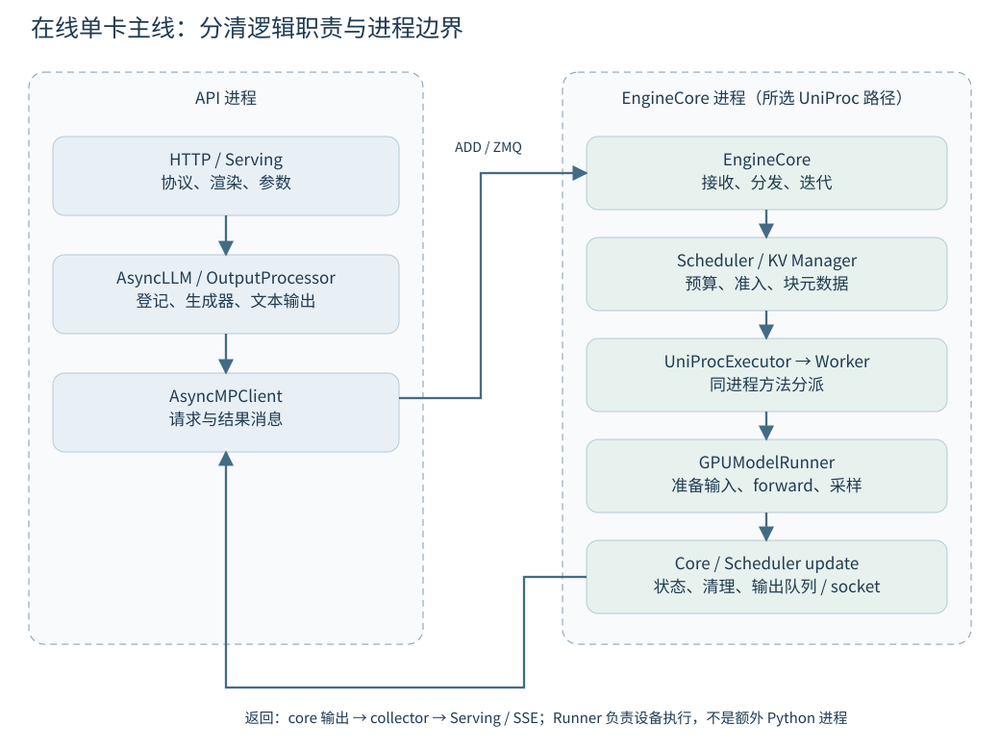
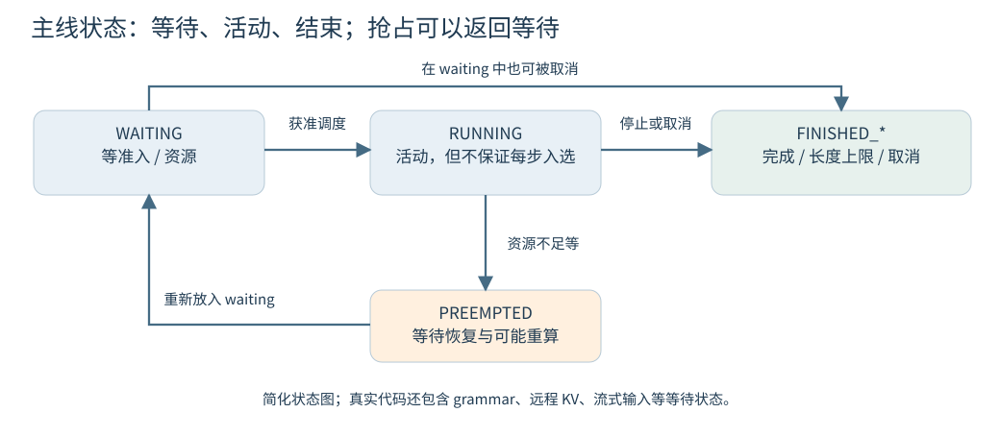
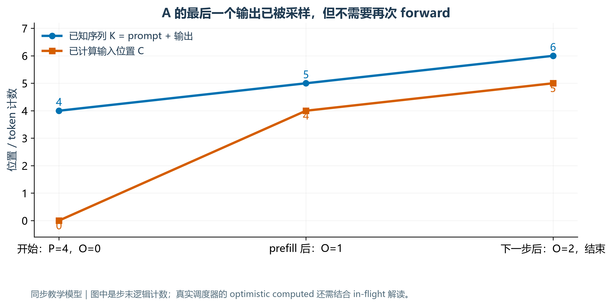
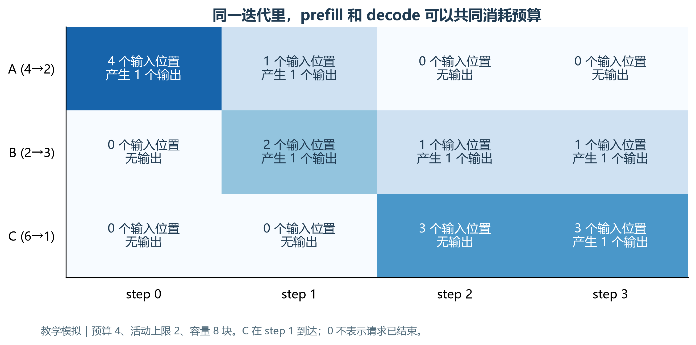
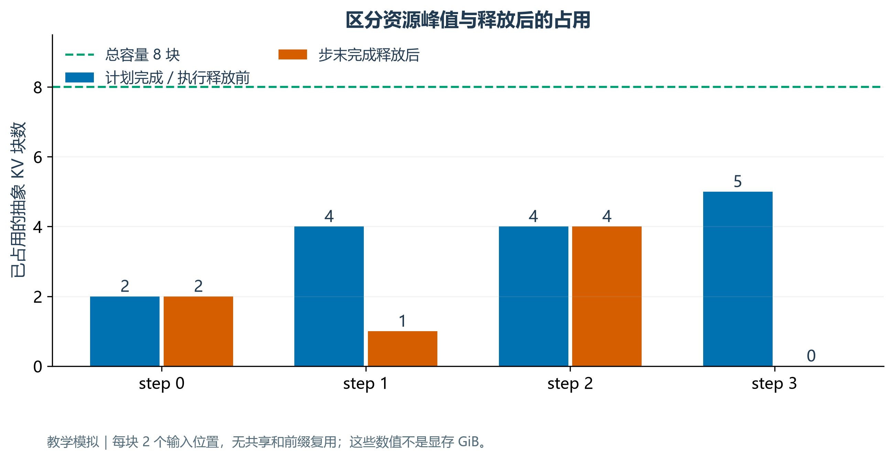
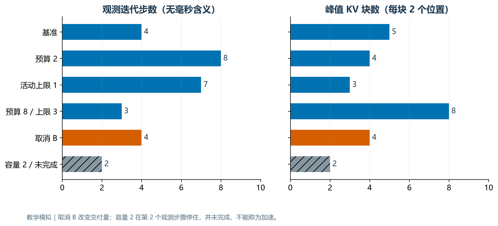

# 第三周：跟着一个请求读通 vLLM

> 从“我知道 Attention 怎么算”，走到“我知道这次请求是谁收下、谁安排执行、谁持有 KV、谁把结果送回来”。

**本页是完整讲义；[离线交互版](index.html)包含可逐步操作的请求旅程、三请求调度器和 KV 引用计数演示。** 图表由课程代码生成；所有调度数据都是明示规则下的教学模拟，没有运行 vLLM 服务或测量 GPU 性能。源码结论来自完整本地快照，引用 `[Sxx]` 可跳到附录中的文件、类、函数和行号。

前置：完成[第一周](../week01/README.md)的 prefill/decode 与 KV 自测，并理解[第二周](../week02/README.md)的 token 预算、TTFT、ITL 和计时边界。已有 MiniMind / Pyre 模型笔记帮助理解一次 forward；本周重点是 forward 外围的请求管理与执行组织。

## 0 · 学习安排与源码版本

| 日程 | 预算 | 读哪一节 | 当天练习与证据 |
| --- | ---: | --- | --- |
| 周一 | 2 h | 第 1 节：职责和进程；本节版本 | 画三个逻辑层，标记跨进程边界，完成版本核验 |
| 周二 | 2 h | 第 2 节：输入、入队、状态 | 追一个 request ID，区分三种“排队” |
| 周三 | 2 h | 第 3 节：调度预算与计数 | 手算三请求的前两步，解释为何不能直接把 P+G 当计算量 |
| 周四 | 2 h | 第 4 节：执行与结果返回 | 补齐 SchedulerOutput 到 SSE 的返回链 |
| 周五 | 2 h | 第 5 节：KV、完成与异常 | 追正常完成、取消和分配不足三条路径 |
| 周六 | 3 h | 第 6 节：源码取证实验 | 跑模拟、修改一个参数、填生命周期证据表 |
| 周日 | 3 h | 第 7、8 节：三请求复盘与验收 | 交付一张带版本、路径、函数和行号的生命周期图 |

工作日仍按 **15 分钟闭卷复述 → 35 分钟阅读 → 50 分钟实践 → 20 分钟留证**。周六按 30/60/60/30 分钟完成手算、追源码、模拟、记录；周日按 60/60/60 分钟完成复盘、补漏与验收。教材完成不计入你的学习时长。

### 0.1 本教材固定的是哪份源码

- 身份：`vllm-local-2026-10-07`，源目录为用户提供的 `C:\Users\jiang\Desktop\study\inference\vllm-main`。
- 完整快照包含 **7,289 个文件**及目录记录；归档位置是学习仓库内 `artifacts/raw/vllm-local-2026-10-07.zip`。该本地归档被 Git 忽略，应与学习仓库一起另行备份。
- 归档 SHA-256：`2206fef40dab95f56279053ce516a9f012c2feac43ee64dd7a403711844c5029`。逐文件哈希、长度与目录清单保存在 [完整锁文件](../../sources/vllm-local-2026-10-07.lock.json)。原目录和归档中的全部文件已逐项比较。
- 此目录没有 `.git`，实际上游 commit 与原始下载时间未知；完整归档使**这份本地内容**可恢复，并不能证明它与任何上游提交完全相同。
- 中文导读声明的 `b23bd73…` 是另一项版本声明。两份导读的用途与已发现差异见[资料阅读导航](../../sources/w03-reading-route.md)。本教材逐条对照当前快照，不照搬导读中的旧队列或类名。

在学习仓库根目录执行：

```powershell
py -3.11 scripts/full_source_snapshot.py verify
py -3.11 lessons/week03/source_evidence.py
```

第一条核对完整归档和当前目录；第二条只核对本章 45 个阅读锚点，并重建行号证据。换电脑需复制归档；只拉 Git 仓库不能凭哈希重建源文件。恢复时解压到一个**新的空目录**，再用 `--source 新目录`核验，避免覆盖原源码。归档与源码位置都可通过脚本参数指定。

### 0.2 先选一条读得完的路径

本周主线选择：**在线 Chat Completions、普通 decoder-only 文本生成、n=1、非流式输入、单卡、TP/PP/DP 均为 1、UniProcExecutor、V1 GPUModelRunner、无 speculative decoding、无前缀命中、无外部 KV connector、同步调度且无并发 batch queue**。输出可以是流式 SSE。

这是源码阅读范围，不是声称当前默认配置就是如此。实际运行必须记录解析后的配置。`core.py:239` 会根据 batch queue 选择 `step` 或 `step_with_batch_queue`；`gpu_worker.py:476–492` 可选择不同 runner；`EngineCoreClient` 也有单进程、多进程和 DP 变体。遇到不同分支时先记下条件，不在第一遍同时展开所有变体。

**开课自测**：4 个 prompt token、希望输出 2 个 token，在不使用 KV 复用且无推测解码时，共有多少输入位置实际经过 forward？先写答案，读第 3 节后检查。

## 1 · 周一：职责、进程和数据对象

### 1.1 用四个问题理解分层

| 层次 | 核心问题 | 持有的典型对象 | 不要混淆 |
| --- | --- | --- | --- |
| HTTP / Serving | 这是什么请求，如何解释消息、模板和采样参数？ | ChatCompletionRequest、渲染后的 engine input | HTTP 请求不是直接交给 CUDA 的张量 |
| AsyncLLM / CoreClient | 如何提交请求、接收增量结果并响应取消？ | EngineCoreRequest、每请求输出 collector | asyncio 队列不等于 scheduler 等待队列 |
| EngineCore / Scheduler | 本步安排谁、多少 token、哪些 KV 块？ | Request、SchedulerOutput、KV 块元数据 | 调度器管理计划；它不执行 Attention 矩阵乘法 |
| Executor / Worker / Runner | 如何把计划变成 GPU 输入并取得输出？ | 输入缓冲区、positions、block table、采样结果 | Worker 是职责边界，不必然是另一个 OS 进程 |



主线中 API 侧与 EngineCore 经 CoreClient 的 ZMQ 消息通信；`ADD` 是消息类型，载荷包含序列化的请求对象。[S07](#s07) [S08](#s08) EngineCore 的输入线程先接收/预处理，再送入内部队列，主循环分发。[S09](#s09) [S11](#s11) **发送成功只说明消息提交成功，不等于请求已执行或已产生 token。**

单卡 `UniProcExecutor.collective_rpc` 最终对 `driver_worker` 调用 `run_method`，不能因为方法名字中有 RPC，就再画一个必需的进程。[S17](#s17) [S18](#s18) 多卡 executor 的通信路径需要另查，本图的 worker 与 core 在同一进程边界内。

更细一层，`driver_worker` 是 `WorkerWrapperBase`：其 `execute_model`（`vllm/v1/worker/worker_base.py:352`）先处理 wrapper 层事项，再调用实际 Worker。把 wrapper 与实际 Worker 区分开，才不会在动态方法分派处丢失调用链。

官方的 [V1 架构介绍](https://vllm.ai/blog/2025-01-27-v1-alpha-release)解释了把核心调度执行循环与前端处理分离的动机。它用于理解设计；本章具体符号和分支仍以本地锁定内容为准。

### 1.2 给三个容易混淆的“输出”命名

1. **SchedulerOutput**：一次迭代的执行计划，包含每请求安排的 token 数、所需请求/块更新等。它不是生成的文本。[S41](#s41)
2. **ModelRunnerOutput / EngineCoreOutputs**：模型执行与 core 更新后的结果，面向引擎内部，含 token IDs、完成状态等。
3. **RequestOutput / SSE chunk**：前端组织的用户可见输出。detokenization、停止字符串检查、协议编码、网络发送发生在不同环节，不能把它们当成一个瞬时事件。[S27](#s27) [S28](#s28)

<!-- interactive-journey -->

**周一练习**：把下列动作放回相应层：套用 chat template、选择本步 token 数、准备 positions、把 token ID 转为文本、释放请求占用的块。再给跨进程箭头标上“发送什么对象”。

<details>
<summary>展开参考答案</summary>

模板位于输入渲染路径；本步 token 数由 Scheduler 决定；positions 等执行输入由 Runner 准备；输出端 detokenizer 参与文本转换；Scheduler 触发 KV 管理层释放。主线 API/Core 边界发送请求消息与 core 输出，不是把完整模型权重随每个请求来回传送。图中必须区分逻辑层与进程边界。

</details>

## 2 · 周二：从消息到等待队列

### 2.1 入口不是一个函数完成的

在线路由 `create_chat_completion` 先取得 Serving handler，再调用 handler。Serving 渲染聊天输入，得到 engine inputs，构造生成参数，并取得 `engine_client.generate(...)` 的异步生成器。[S01](#s01) [S02](#s02) [S03](#s03) **创建异步生成器与消费它是两回事**：观察请求何时真正进入引擎，要继续追生成器的执行。

所选路径的步骤如下；每个箭头都应能在相应函数或消息接收端找到证据：

```text
HTTP router → OpenAIServingChat.create_chat_completion / _create_chat_completion
  → render_chat_request → online_renderer.render_chat → engine inputs
  → 消费 AsyncLLM.generate
  → AsyncLLM.add_request → InputProcessor → EngineCoreRequest
  → AsyncLLM._add_request：先注册本地输出处理，再提交 CoreClient
  → AsyncMPClient.add_request_async → ADD 消息 → ZMQ
  → EngineCoreProc.process_input_sockets → preprocess_add_request
  → Request.from_engine_core_request → 内部输入队列
  → _handle_client_request → EngineCore.add_request
  → Scheduler.add_request → 等待队列与 requests 映射
```

HTTP 层校验、渲染和 InputProcessor 各有自己的职责。已有渲染结果可以走同步的 `process_inputs`；原始 prompt 可能进入异步预处理路径，避免阻塞事件循环。[S05](#s05) [S42](#s42) 不要根据某次看到 token IDs 就断言“所有路径都不需要 tokenization”。

`AsyncLLM._add_request` 先把请求加入 `OutputProcessor`，再 `await` 提交 core，目的是让并发任务能看到本地登记。[S06](#s06) EngineCore 侧创建的是其内部 `Request`，再由 Scheduler 登记。API 请求 ID、内部 ID、n>1 子请求 ID 可能经过处理，本周 n=1 也应追实际对象中的 ID，不只看日志前缀。

### 2.2 三个队列，不是三种同义说法

| 排队位置 | 等待的事情 | 可观测证据 |
| --- | --- | --- |
| Core 输入消息队列 | 等主循环分发消息 | 接收事件与 `_handle_client_request` 的时间点 |
| Scheduler 的 waiting / running 管理 | 等资源和调度机会 | 请求状态、入队事件、本步 `num_scheduled_tokens` |
| API 侧输出 collector | 等引擎结果被处理后交给生成器 | `queue.put` 与 `generate` 取出结果的时间点 |

只看到客户端 TTFT 很长，不能判断哪处排队最久。第二周的指标分解，在本周变成“给哪个边界加时间戳”的具体问题。跨进程时间需确认时钟与测量方式，跨机器更不能直接相减未同步的墙钟。

### 2.3 状态描述可执行性，不直接表示硬件正在忙



`RequestStatus` 定义了 WAITING、RUNNING、PREEMPTED 及多种 FINISHED 状态，也有等 grammar、远程 KV 和流式输入的额外等待状态。[S40](#s40) `RUNNING` 表示进入活动请求管理；某一步仍可能因为预算或其他限制没有安排该请求。**未在本步计划中出现，不自动等于请求完成。**

状态变更示例：新请求经 `Scheduler.add_request` 登记；获准调度时进入 running；达到输出长度上限后标记 `FINISHED_LENGTH_CAPPED`；取消使用 `FINISHED_ABORTED`；抢占后可回 waiting，随后恢复。[S13](#s13) [S14](#s14) [S23](#s23) [S30](#s30) [S38](#s38)

**周二练习**：一个请求提交返回后没有结果。分别提出一个“尚未进入 Scheduler”“已等待资源”“已生成但前端未消费”的可区分证据。画一个状态变化，说明 `RUNNING` 为什么不等于“此刻正执行一个 kernel”。

<details>
<summary>展开参考答案</summary>

分别检查 ADD 接收/分发记录与 requests 映射；Scheduler 等待队列和逐步计划；core 结果、OutputProcessor 处理和 collector 出入队。仅有 `Added request` 之类一条日志不足以区分这些位置。RUNNING 请求可能在一个迭代内安排 0 个 token；必须结合本步计划与执行时间线。

</details>

## 3 · 周三：调度的是 token 工作量

### 3.1 用“已知”与“已算”理解 prefill 和 decode

在本章简化条件下，设 P 为 prompt 长度、O 为已产生的输出 token 数、C 为已计算输入位置数：

```text
已知 token 数 K = P + O
本次待计算位置数 need = K − C
安排 n 个位置后，C ← C + n
若 C 追上本步开始时的 K，则可采样 1 个新 token，O ← O + 1
```

prefill 开始时 O=0、C=0，要处理 P 个已知输入位置。prefill 完成就能从最后位置的 logits 采样第一个输出。此时 O=1、C=P，新的输出 token 只是已知 ID，尚未作为下一步输入算出自身 KV。下一步通常只差一个位置，因此普通 decode 的 need=1。

以 P=4、目标 G=2 为例：先计算位置 0–3，采样 y₁；再把 y₁ 作为位置 4 的输入，采样 y₂；达到上限即可结束。总共计算 **P+G−1=5** 个位置，而不是 6。最后一个采样 token 不一定已被喂入模型；这也是把“输出序列长度”直接当“已填 KV 位置数”会出错的原因。



图是同步教学模型。真实 `Scheduler.schedule` 使用 `num_tokens_with_spec + num_output_placeholders − num_computed_tokens` 等信息，还受输入预算、模型长度、lookahead、多模态与对齐限制。[S14](#s14) **不要把上面的三行公式当作所有配置下的完整调度算法。**

尤其注意：当前源码 `_update_after_schedule` 在安排后便递增 `num_computed_tokens` 和 `num_in_flight_tokens`，此时 GPU 工作可能尚未完成。[S15](#s15) 所以在任意日志点看到 `computed` 数值，必须同时看阶段和 in-flight 计数。教学模型为了手算，在步末统一完成计算，不能用它证明异步计数的时间语义。

### 3.2 预算、活动上限与 KV 容量是三道约束

| 约束 | 它控制什么 | 示例 |
| --- | --- | --- |
| token budget | 这一步处理多少输入位置 | A decode 1 个、B prefill 2 个，共 3 个 |
| 活动请求上限 | 本步准入时能保留多少请求 | 上限为 2 时，A 尚未完成前可能挡住 C |
| KV 容量 | 这些位置的 KV 有没有物理块可存 | 还有 token 预算，但新块分配可能失败 |

本地 `schedule` 先遍历 running，再在剩余预算下处理 waiting；但两处内部还有多种检查，不保证每个等待请求立刻入选。[S14](#s14) `SchedulerOutput.num_scheduled_tokens` 是“请求 ID → 本步位置数”，其总量与全局预算对照。一次 batch 可以包含一个请求的多个 prefill 位置和另一个请求的单个 decode 位置。

**不要提前拿回本步结束才会释放的资源。** 下例 step 1 在做计划时 A 尚未执行完，活动请求上限仍要计入 A；不能先预测 A 将结束，再让 C 占用同一个活动位置。

### 3.3 三请求的前两步，先手算

教学设定：A=(P=4,G=2,到达 step 0)，B=(2,3,0)，C=(6,1,1)。每步预算 4，最多 2 个活动请求，每块 2 个 token 位置，总容量 8 块。running 优先；waiting 按 A/B/C 顺序；计划阶段保留所有本步资源，步末执行并统一处理完成。**没有前缀复用、抢占或真正的模型计算。**

step 0 只有 A 得到 4 个位置，输出 A₁。step 1 A 得到 1 个位置，B 得到 2 个位置；剩余预算 1，但当时 A、B 已占满两个活动位置，C 继续等待。步末 A 输出 A₂ 完成，B 输出 B₁。



**周三练习**：闭卷填写 step 2 和 step 3；说出每步产生哪些输出、为什么 C 的第一段 prefill 没有输出。预算还剩下但 C 不能准入，违反连续批处理吗？

<details>
<summary>展开参考答案</summary>

step 2：B=1，C=3；只产生 B₂。step 3：B=1，C=3；产生 B₃、C₁，全部完成。C 的前 3 个 prompt 位置还不足以得到完整 prompt 最后位置的 logits。连续批处理允许迭代间改变成员，并不承诺每一步都能用满预算；活动上限、容量和到达情况都可能留下余量。

</details>

## 4 · 周四：从执行计划回到用户文本

### 4.1 一个 EngineCore.step 做什么

在选定的无并发 batch queue 路径中，可以把源码读成以下顺序。[S16](#s16)

```text
有需要处理的请求吗？
  → scheduler.schedule(...) 形成 SchedulerOutput
  → model_executor.execute_model(..., non_block=True)
  → 等执行结果；若需要，另调 sample_tokens(...)
  → 处理执行期间收到的 abort
  → scheduler.update_from_output(...)
  → 返回各客户端的 EngineCoreOutputs
```

`non_block=True` 表示接口可返回 Future，不等于“这个请求的所有工作都完成了”。`step` 后面仍有 `future.result()`；UniProcExecutor 对已完成 Future 还可能提前暴露异常。[S16](#s16) [S17](#s17)

Scheduler 管理“本步算多少”，Executor 选择执行组织方式，Worker 调用所选 Runner。[S17](#s17) [S18](#s18) [S19](#s19) 在本章的 GPUModelRunner 中，先更新持久请求/批次状态，再准备输入和 attention metadata，组织 forward。`execute_model` 可以保存中间执行状态并返回 None，随后 `sample_tokens` 消费它。[S20](#s20) [S21](#s21) 因此“调用 execute_model 后一定已经拿到 token”是一个需要纠正的直觉。

### 4.2 为什么 Runner 要重新组织输入

模型教程常写 [B,T,D] 的整齐张量，但 serving 的本步 batch 可能是 A 的 1 个 decode 位置、B 的 2 个 prefill 位置。Runner 要把这 3 行输入放入执行缓冲区，并提供每行的 position、所属请求和 KV 存放位置。真实执行还可能 padding、重排或使用 CUDA Graph，**计划的逻辑 token 数不一定等于 kernel 的物理执行形状**。

第一周的 Q/K/V 推导解释一层如何算；本周的 block table、slot mapping、positions 告诉执行层“从哪段历史 KV 读、把新 KV 写到哪里”。无需在本周读完所有 Attention backend，但必须知道这些元数据在调用链中存在，不能画一条“Scheduler 直接调用 Attention”的捷径。

### 4.3 返回过程也有一条链

```text
模型结果 → Scheduler.update_from_output
  → 追加输出 token、检查结束条件、创建 core 输出
  → EngineCoreProc 输出队列 / socket
  → AsyncMPClient.get_output_async
  → AsyncLLM 后台 output_handler
  → OutputProcessor.process_outputs
  → detokenize / stop string / RequestOutput / collector
  → AsyncLLM.generate yield
  → Serving 的流式生成器 → SSE → 客户端
```

Core 内的停止检查能处理 EOS、stop token 和长度上限等。[S22](#s22) [S23](#s23) [S45](#s45) 输出端 detokenizer 还可能发现停止字符串；如果 core 尚未结束，需要反向发送 abort，避免 core 继续生成。[S26](#s26) [S27](#s27) 正向数据流之外，存在结束与取消的反向控制流。

同一个 token ID 不保证立刻形成一个可显示字符；增量文本也不保证每个 SSE chunk 恰好对应一个 token。角色提示、完成信号、keep-alive 等更不能当输出 token 计数。测 TTFT/ITL 时，沿用第二周的计时与 token 边界定义，而不是数网络包。

**周四练习**：`SchedulerOutput` 与 `RequestOutput` 有什么区别？为什么 `execute_model` 返回 None 不必然是错误？某次 TTFT 的改善能否直接归因于 GPU kernel 加速？

<details>
<summary>展开参考答案</summary>

前者是执行计划，后者是用户侧结果。所选 Runner 可以把执行与采样拆开，Core 按相应协议调用 `sample_tokens`。TTFT 还包括输入处理、消息传递、等待、输出处理和网络，需要按同一请求关联事件，才能定位改善来自哪里。

</details>

## 5 · 周五：KV 的所有权与异常出口

### 5.1 分配的是容量，不是把过去的计算重做一遍

`Scheduler.schedule` 根据本次计划向 `KVCacheManager.allocate_slots` 申请所需槽位。[S14](#s14) [S39](#s39) 在没有共享、lookahead、窗口裁剪的简化模型中，已安排到 C 个位置、块大小 b 时，需要 `ceil(C/b)` 块。真实实现会综合已命中块、现有块、不同 KV 组和额外位置，因此先用公式校验直觉，再核对实际分配器。

示例 A：prefill 4 个位置占 2 块；下一步处理 y₁，需要第 5 个位置，增至 3 块。该步产生 y₂ 后达到上限，A 的这 3 块都可解除请求占用。**“刚申请又释放”并不矛盾**，因为本步计算 y₂ 仍需要输入 y₁ 的 KV 槽位。



图中容量是抽象槽位，每块 2 个位置；没有暗示真实模型只需要这么少的字节。若要换算显存，接回第一周的层数、KV heads、head dim 与精度公式，额外考虑对齐与实现开销。

### 5.2 一次正常完成如何释放

在无 connector 延迟、无 in-flight 写入的主线中，依次追：

```text
Scheduler.update_from_output
  → _update_request_with_output → check_stop
  → _handle_stopped_request → _free_request
  → _free_blocks → _free_request_blocks
  → KVCacheManager.free → KVCacheCoordinator.free
  → 各 SingleTypeKVCacheManager.free → BlockPool.free_blocks
```

这些函数分别处理完成状态、请求映射、KV 组和块引用，不是重复的无用包装。[S22](#s22) [S23](#s23) [S32](#s32) [S33](#s33) [S34](#s34) [S35](#s35) [S36](#s36) [S37](#s37) Worker 侧也需要根据计划里的 finished IDs 清理持久请求状态，API 侧还要清理输出状态；只看到其中一处清理不能证明全链路结束。

### 5.3 释放引用，不等于立即擦掉字节

`BlockPool.free_blocks` 会递减引用计数；引用归零且满足条件的块进入可复用队列。若开启前缀缓存，块的缓存身份与内容可能暂时保留，直到回收/覆盖。[S37](#s37) 官方[前缀缓存设计](https://docs.vllm.ai/en/latest/design/prefix_caching/)也区分请求释放与缓存淘汰；更细的哈希、共享和回收策略放到第四周。

若 A 与 B 共享一块，ref_cnt=2，A 完成后只能减至 1。只有 B 也释放后，才可能归零。**某请求完成 ≠ 它见过的每一块都能立即给别人写。** 除了共享，还有异步执行尚在使用、connector 尚在传输等延迟释放条件。本地 `_free_request_blocks` 对不能立即释放的块记录 deferred frees；`_free_request` 也尊重 connector 的延迟信号。[S32](#s32) [S33](#s33)

<!-- interactive-ownership -->

### 5.4 三种异常，分别追出口

| 情况 | 应沿哪条路径核查 | 常见误判 |
| --- | --- | --- |
| 客户端取消/断开 | route/StreamingResponse 取消传播 → `AsyncLLM.generate` 的取消处理 → `abort` → CoreClient ABORT → core `finish_requests` → 释放 | 客户端停止读了，就以为服务器一定停止计算 |
| KV 分配不足 | `allocate_slots` 返回 None → scheduler 的等待/抢占分支 → `_preempt_request` → 等待恢复 | 把所有 None 都当成 Python 错误；或把抢占一律解释为 GPU→CPU swap |
| 输入校验失败或引擎死亡 | 找发生在入队前还是入队后；检查错误如何通知调用者与已登记状态如何清理 | 假设每种错误都走同一条正常 finish 路径 |

取消的主线证据是 [S04](#s04)、[S29](#s29)、[S30](#s30)、[S31](#s31)；路由装饰器处理 handler 阶段的断开，返回 StreamingResponse 后由流式响应机制继续监听。[S43](#s43) 当前 `EngineCore.step` 在执行结果回来后、更新输出前处理 abort 队列。[S16](#s16) 已经提交的 GPU 工作可能仍要收尾，取消不意味着立刻强行中断每个 kernel。

KV 不足时，真实 scheduler 对 running 请求可能选取受害请求并抢占；本地 `_preempt_request` 释放其请求块、标为 PREEMPTED、清零 computed 计数并放回 waiting。[S14](#s14) [S38](#s38) 它并不能证明发生了 CPU 换出。后续恢复是否能复用缓存、需要重算多少，仍需看配置与命中路径。

**周五练习**：ref_cnt=2 的块在 A 取消后能否覆盖？`allocate_slots` 返回 None 与“engine dead”如何区分？何时 `FINISHED` 请求的块还不能立刻给别人写？

<details>
<summary>展开参考答案</summary>

不能，另一个引用仍存在。分配失败是容量/策略路径上的调度结果，引擎死亡是服务执行异常，两者的处理和可恢复性不同。共享引用、未完成的 GPU 写入或外部传输都可能让物理复用晚于逻辑结束；需要检查引用计数和释放条件。

</details>

## 6 · 周六：完成一个可核查的生命周期证据包

### 6.1 不需要 GPU 的复现入口

在学习仓库根目录执行。模拟和测试只依赖 Python 标准库；绘图与 HTML 构建另需固定依赖。

```powershell
py -3.11 -m unittest discover -s experiments/w03-lifecycle -p test_simulate.py -v
py -3.11 experiments/w03-lifecycle/simulate.py
py -3.11 lessons/week03/source_evidence.py
.venv/Scripts/python.exe lessons/week03/build.py
node lessons/week03/check_interactive.cjs
```

环境安装与文件说明见[实验 README](../../experiments/w03-lifecycle/README.md)。源码取证脚本解析 AST、核对完整锁文件中的哈希，再导出实际符号行号和调用/字段锚点；**它不能代替人工解释分支条件，也不证明代码已在 GPU 上运行**。

### 6.2 三请求调度器：先预测，再点下一步

<!-- interactive-scheduler -->

上面的交互与 [simulate.py](../../experiments/w03-lifecycle/simulate.py) 使用同一套教学规则；Python 生成的 JSON 是逐步证据。比较预算 2/4/8、活动上限 1/2/3，再开启“step 2 开始前取消 B”。每次改变一个变量，记录计划、输出、块占用、请求状态。

容量不足时，教学模拟器**报告 BLOCKED 并停下**，没有实现真实 vLLM 的抢占与缓存复用。选择容量 2 可以观察为什么“只有 token 预算还不够”。这不是 vLLM 死锁结论，而是简化模型缺少恢复策略的可见边界。

### 6.3 代码与真实实现相差在哪里

| 教学模型 | 当前源码还需要考虑 |
| --- | --- |
| 固定 A/B/C、running 优先、FCFS | priority、更多等待状态、encoder/grammar 依赖、准入策略 |
| 无共享的单组 KV、整步申请 | 前缀命中、多组 KV、窗口裁剪、lookahead、watermark |
| 一步全部完成后再进入下一步 | optimistic computed、in-flight、async scheduler、batch queue |
| 不足时显式 BLOCKED | 抢占、重算、connector 等待和延迟释放 |
| 每次追上已知序列只产生 1 token | speculative decoding、并行采样、pooling、多模态、流式输入 |
| 所有步没有毫秒时长 | GPU 算子、IPC、排队、网络与负载决定真实耗时 |

**参数改变导致步数减少，不足以推出 TTFT、吞吐或用户体验改善。** 例如更大的 prefill batch 可能让单步更久；这需要第二周实验协议中的真实时间证据。

### 6.4 主产物的工作方式

使用[生命周期证据模板](../../templates/w03-lifecycle.md)。先沿第 2 节去程、第 4 节回程、第 5 节清理链画图，然后为每个关键边填写：版本、文件、类/函数、行号、输入输出对象、进程边界、分支条件。复核材料在[完整参考调用链](../../reports/week03-reference-chain.md)。

建议按以下顺序使用 3 小时：先闭卷画草图；再打开附录对应函数，沿调用逐个补空；运行模拟并与手算对照；最后记录一条没看懂的边。不要把整段源码粘进笔记当作“已读通”。

GPU 就绪后的补充验证：给一个唯一 request ID，在请求提交、调度计划、执行返回、输出处理、客户端接收处记录事件；保存解析配置、模型/tokenizer 版本及精度。先验证输出与结束语义，再分析耗时。只选与主线一致的配置；测试日志中的 prompt 内容可用人工构造文本，避免混入个人数据。

## 7 · 周日：用数据复盘三个请求

### 7.1 基准案例的完整答案

| 步 | 本步计算输入位置 | 本步产生输出 | 步末 running / waiting | 计划峰值块 / 步末占用块 |
| ---: | --- | --- | --- | ---: |
| 0 | A:4 | A₁ | A / B | 2 / 2 |
| 1 | A:1，B:2 | A₂，B₁ | B / C | 4 / 1 |
| 2 | B:1，C:3 | B₂ | B、C / 空 | 4 / 4 |
| 3 | B:1，C:3 | B₃，C₁ | 空 / 空 | 5 / 0 |

C 在 step 1 才到达；表中 waiting 是步末状态。总计 15 个输入位置、6 个输出 token、4 个迭代。所有完成请求的未复用 KV 占用回到零。A 的 5、B 的 4、C 的 6 个计算位置分别满足 P+G−1。

“计划峰值块”在本次计划全部保留后、执行释放前计数；“步末占用块”在本步完成请求释放后计数。这是同一模拟中两个不同测量时点，不能混作一个指标。

### 7.2 改变参数后，哪些数字能比较



<!-- results:start -->
| 场景 | 结果 | 观测步数 | 输入位置数 | 已产生输出 | 峰值块 |
| --- | --- | ---: | ---: | ---: | ---: |
| baseline | COMPLETE | 4 | 15 | 6 | 5 |
| budget2 | COMPLETE | 8 | 15 | 6 | 4 |
| serial | COMPLETE | 7 | 15 | 6 | 3 |
| wide | COMPLETE | 3 | 15 | 6 | 8 |
| cancel | COMPLETE | 4 | 13 | 4 | 4 |
| blocked | BLOCKED_NO_PREEMPTION | 2 | 4 | 1 | 2 |
<!-- results:end -->

budget2 与 baseline 输出目标相同，可以比较**模拟的调度步数与峰值容量**。cancel 少完成了 B 的后续输出，工作负载已经不同，不能当成优化收益；blocked 是未完成的过程，不能拿它更少的步骤宣称更快。

**复盘练习**：不开答案，重建 baseline 的 JSON 中 step 2 每个请求的 `computed/emitted/blocks/state`。再判断下列结论哪些证据不足：“wide 比 baseline 快 25%”“cancel 少用两次计算，所以更优”“总输出 6，所以模型只处理 6 行输入”。

<details>
<summary>展开参考答案</summary>

step 2 结束：A=(5,2,0,FINISHED_LENGTH)，B=(3,2,2,RUNNING)，C=(3,0,2,RUNNING)。wide 的 3 步与 baseline 的 4 步没有毫秒映射，不能称快 25%；cancel 改变交付工作量；总输出数与实际处理的 prompt/decode 输入位置数不同。三种说法都不能从现有证据推出。

</details>

## 8 · 周验收：能从入口讲到资源回收

本周只交一个主要产物：**带证据的请求生命周期图**，可附三请求表。建议用 10 分钟讲主线，5 分钟讲清理/异常，5 分钟回答追问。

| 验收项 | 通过所需证据 |
| --- | --- |
| 版本与范围 | 能指出完整快照身份、归档 SHA、上游 commit 未知的边界及选定配置 |
| 输入到排队 | 能定位 router、Serving、AsyncLLM、CoreClient、EngineCore、Scheduler，解释中间对象与 IPC |
| 一次调度 | 独立算对 baseline 四步，并区分预算、活动上限与 KV 容量 |
| 执行到返回 | 能定位 Executor/Worker/Runner、采样、状态更新、输出处理与 SSE，说明不同输出对象 |
| 生命周期出口 | 正常完成与取消能追到块释放；能解释抢占、共享引用和延迟释放的条件 |
| 证据质量 | 每个关键结论有文件/函数/行号；静态阅读、教学模拟、未来 GPU 实测分开标记 |

只要关键路径仍无法解释，先补对应一天，不机械进入第四周。以下问题请先闭卷回答，再展开：

1. 为什么 `ADD` 发出后，不能立刻说 Scheduler 已接收？
2. 为什么不能把在线主线直接写成 `HTTP → LLMEngine.step → GPU`？
3. P=4、G=2 为什么是 5 个 forward 输入位置？
4. Scheduler 的 computed 计数在任意时刻都能当“GPU 已经算完”吗？
5. step 1 为什么没有安排 C？
6. execute_model 与 sample_tokens 为什么可能是两次调用？
7. 谁负责停止 token，谁可能发现停止字符串？
8. 客户端断开如何传到 KV 管理层？
9. 引用计数归零与 GPU 显存交还操作系统是一回事吗？
10. 如果你的配置启用了 async scheduler、V2 runner 或 connector，需要重新核查哪里？

<details>
<summary>展开验收参考要点</summary>

1. 消息提交、IPC 接收、内部队列分发和 Scheduler 入队是不同事件。
2. 当前在线链含 AsyncLLM、CoreClient、消息分发与 Core；LLMEngine 的离线门面不能替代这条链。
3. prefill 4 个位置产生首个输出，再计算它产生第二个输出；最后输出不再喂回。
4. 不一定；安排阶段可能乐观推进，还要检查 in-flight 与结果处理。
5. 计划时 A、B 占满两个活动位置，A 尚未结束。
6. Runner 可先保留 forward 结果/状态，再在采样阶段产生 token。
7. Core 的 stop 检查处理 token/长度等；输出 detokenizer 可发现停止字符串，再通知 Core 中止。
8. 取消传播至 generate/abort，经 ABORT 消息到 finish_requests，再走资源清理；已发出的执行仍有收尾条件。
9. 不是。块池通常仍管理已分配的 GPU 内存；可复用、缓存淘汰、清零和向系统释放是不同动作。
10. 重新核查计数时机、step_fn、runner 选择、executor 通信、KV 取回/保存及延迟释放；不能只替换一个类名。

</details>

## 9 · 源码证据与继续阅读

下面的行号由 [source_evidence.py](source_evidence.py)根据锁定源文件生成。[source-evidence.json](source-evidence.json)保存完整符号范围、文件 SHA 和所核验语句。表中的“证据行”是一个定位锚点，不能只读那一行就断言掌握整个函数。源码相对链接面向本地文件阅读；localhost 预览不提供仓库外的源码文件，请在编辑器中按所列路径打开。

<!-- sources:start -->
| 锚点 | 文件与完整符号 | 定义 / 证据行 |
| --- | --- | --- |
| <a id="s01"></a>S01 | [vllm/entrypoints/openai/chat_completion/api_router.py](../../../vllm-main/vllm/entrypoints/openai/chat_completion/api_router.py)<br>`create_chat_completion` | 54 / 62 |
| <a id="s02"></a>S02 | [vllm/entrypoints/openai/chat_completion/serving.py](../../../vllm-main/vllm/entrypoints/openai/chat_completion/serving.py)<br>`OpenAIServingChat._create_chat_completion` | 259 / 369 |
| <a id="s03"></a>S03 | [vllm/entrypoints/openai/chat_completion/serving.py](../../../vllm-main/vllm/entrypoints/openai/chat_completion/serving.py)<br>`OpenAIServingChat.render_chat_request` | 221 / 242 |
| <a id="s04"></a>S04 | [vllm/v1/engine/async_llm.py](../../../vllm-main/vllm/v1/engine/async_llm.py)<br>`AsyncLLM.generate` | 664 / 711 |
| <a id="s05"></a>S05 | [vllm/v1/engine/async_llm.py](../../../vllm-main/vllm/v1/engine/async_llm.py)<br>`AsyncLLM.add_request` | 372 / 447 |
| <a id="s06"></a>S06 | [vllm/v1/engine/async_llm.py](../../../vllm-main/vllm/v1/engine/async_llm.py)<br>`AsyncLLM._add_request` | 531 / 548 |
| <a id="s07"></a>S07 | [vllm/v1/engine/core_client.py](../../../vllm-main/vllm/v1/engine/core_client.py)<br>`AsyncMPClient.add_request_async` | 1253 / 1255 |
| <a id="s08"></a>S08 | [vllm/v1/engine/core_client.py](../../../vllm-main/vllm/v1/engine/core_client.py)<br>`AsyncMPClient._send_input_message` | 1224 / 1231 |
| <a id="s09"></a>S09 | [vllm/v1/engine/core.py](../../../vllm-main/vllm/v1/engine/core.py)<br>`EngineCoreProc.process_input_sockets` | 1754 / 1826 |
| <a id="s10"></a>S10 | [vllm/v1/engine/core.py](../../../vllm-main/vllm/v1/engine/core.py)<br>`EngineCore.preprocess_add_request` | 1049 / 1063 |
| <a id="s11"></a>S11 | [vllm/v1/engine/core.py](../../../vllm-main/vllm/v1/engine/core.py)<br>`EngineCoreProc._handle_client_request` | 1597 / 1607 |
| <a id="s12"></a>S12 | [vllm/v1/engine/core.py](../../../vllm-main/vllm/v1/engine/core.py)<br>`EngineCore.add_request` | 489 / 529 |
| <a id="s13"></a>S13 | [vllm/v1/core/sched/scheduler.py](../../../vllm-main/vllm/v1/core/sched/scheduler.py)<br>`Scheduler.add_request` | 2473 / 2490 |
| <a id="s14"></a>S14 | [vllm/v1/core/sched/scheduler.py](../../../vllm-main/vllm/v1/core/sched/scheduler.py)<br>`Scheduler.schedule` | 553 / 730 |
| <a id="s15"></a>S15 | [vllm/v1/core/sched/scheduler.py](../../../vllm-main/vllm/v1/core/sched/scheduler.py)<br>`Scheduler._update_after_schedule` | 1571 / 1584 |
| <a id="s16"></a>S16 | [vllm/v1/engine/core.py](../../../vllm-main/vllm/v1/engine/core.py)<br>`EngineCore.step` | 633 / 657 |
| <a id="s17"></a>S17 | [vllm/v1/executor/uniproc_executor.py](../../../vllm-main/vllm/v1/executor/uniproc_executor.py)<br>`UniProcExecutor.execute_model` | 119 / 122 |
| <a id="s18"></a>S18 | [vllm/v1/executor/uniproc_executor.py](../../../vllm-main/vllm/v1/executor/uniproc_executor.py)<br>`UniProcExecutor.collective_rpc` | 90 / 103 |
| <a id="s19"></a>S19 | [vllm/v1/worker/gpu_worker.py](../../../vllm-main/vllm/v1/worker/gpu_worker.py)<br>`Worker.execute_model` | 1152 / 1213 |
| <a id="s20"></a>S20 | [vllm/v1/worker/gpu_model_runner.py](../../../vllm-main/vllm/v1/worker/gpu_model_runner.py)<br>`GPUModelRunner.execute_model` | 4149 / 4231 |
| <a id="s21"></a>S21 | [vllm/v1/worker/gpu_model_runner.py](../../../vllm-main/vllm/v1/worker/gpu_model_runner.py)<br>`GPUModelRunner.sample_tokens` | 4530 / 4557 |
| <a id="s22"></a>S22 | [vllm/v1/core/sched/scheduler.py](../../../vllm-main/vllm/v1/core/sched/scheduler.py)<br>`Scheduler.update_from_output` | 1906 / 2098 |
| <a id="s23"></a>S23 | [vllm/v1/core/sched/utils.py](../../../vllm-main/vllm/v1/core/sched/utils.py)<br>`check_stop` | 98 / 118 |
| <a id="s24"></a>S24 | [vllm/v1/engine/core.py](../../../vllm-main/vllm/v1/engine/core.py)<br>`EngineCoreProc.process_output_sockets` | 1856 / 1904 |
| <a id="s25"></a>S25 | [vllm/v1/engine/core_client.py](../../../vllm-main/vllm/v1/engine/core_client.py)<br>`AsyncMPClient.get_output_async` | 1201 / 1207 |
| <a id="s26"></a>S26 | [vllm/v1/engine/async_llm.py](../../../vllm-main/vllm/v1/engine/async_llm.py)<br>`AsyncLLM._run_output_handler` | 791 / 830 |
| <a id="s27"></a>S27 | [vllm/v1/engine/output_processor.py](../../../vllm-main/vllm/v1/engine/output_processor.py)<br>`OutputProcessor.process_outputs` | 641 / 740 |
| <a id="s28"></a>S28 | [vllm/entrypoints/openai/chat_completion/serving.py](../../../vllm-main/vllm/entrypoints/openai/chat_completion/serving.py)<br>`OpenAIServingChat.chat_completion_stream_generator` | 451 / 517 |
| <a id="s29"></a>S29 | [vllm/v1/engine/async_llm.py](../../../vllm-main/vllm/v1/engine/async_llm.py)<br>`AsyncLLM.abort` | 874 / 882 |
| <a id="s30"></a>S30 | [vllm/v1/engine/core.py](../../../vllm-main/vllm/v1/engine/core.py)<br>`EngineCore.abort_requests` | 535 / 540 |
| <a id="s31"></a>S31 | [vllm/v1/core/sched/scheduler.py](../../../vllm-main/vllm/v1/core/sched/scheduler.py)<br>`Scheduler.finish_requests` | 2501 / 2561 |
| <a id="s32"></a>S32 | [vllm/v1/core/sched/scheduler.py](../../../vllm-main/vllm/v1/core/sched/scheduler.py)<br>`Scheduler._free_request` | 2565 / 2592 |
| <a id="s33"></a>S33 | [vllm/v1/core/sched/scheduler.py](../../../vllm-main/vllm/v1/core/sched/scheduler.py)<br>`Scheduler._free_request_blocks` | 2616 / 2621 |
| <a id="s34"></a>S34 | [vllm/v1/core/kv_cache_manager.py](../../../vllm-main/vllm/v1/core/kv_cache_manager.py)<br>`KVCacheManager.free` | 610 / 619 |
| <a id="s35"></a>S35 | [vllm/v1/core/kv_cache_coordinator.py](../../../vllm-main/vllm/v1/core/kv_cache_coordinator.py)<br>`KVCacheCoordinator.free` | 380 / 388 |
| <a id="s36"></a>S36 | [vllm/v1/core/single_type_kv_cache_manager.py](../../../vllm-main/vllm/v1/core/single_type_kv_cache_manager.py)<br>`SingleTypeKVCacheManager.free` | 578 / 586 |
| <a id="s37"></a>S37 | [vllm/v1/core/block_pool.py](../../../vllm-main/vllm/v1/core/block_pool.py)<br>`BlockPool.free_blocks` | 768 / 785 |
| <a id="s38"></a>S38 | [vllm/v1/core/sched/scheduler.py](../../../vllm-main/vllm/v1/core/sched/scheduler.py)<br>`Scheduler._preempt_request` | 1526 / 1568 |
| <a id="s39"></a>S39 | [vllm/v1/core/kv_cache_manager.py](../../../vllm-main/vllm/v1/core/kv_cache_manager.py)<br>`KVCacheManager.allocate_slots` | 371 / 568 |
| <a id="s40"></a>S40 | [vllm/v1/request.py](../../../vllm-main/vllm/v1/request.py)<br>`RequestStatus` | 370 / 383 |
| <a id="s41"></a>S41 | [vllm/v1/core/sched/output.py](../../../vllm-main/vllm/v1/core/sched/output.py)<br>`SchedulerOutput` | 232 / 244 |
| <a id="s42"></a>S42 | [vllm/v1/engine/input_processor.py](../../../vllm-main/vllm/v1/engine/input_processor.py)<br>`InputProcessor.process_inputs` | 308 / 450 |
| <a id="s43"></a>S43 | [vllm/entrypoints/serve/utils/api_utils.py](../../../vllm-main/vllm/entrypoints/serve/utils/api_utils.py)<br>`with_cancellation` | 51 / 80 |
| <a id="s44"></a>S44 | [vllm/v1/engine/core.py](../../../vllm-main/vllm/v1/engine/core.py)<br>`EngineCoreProc._process_engine_step` | 1526 / 1529 |
| <a id="s45"></a>S45 | [vllm/v1/core/sched/scheduler.py](../../../vllm-main/vllm/v1/core/sched/scheduler.py)<br>`Scheduler._update_request_with_output` | 2350 / 2363 |
<!-- sources:end -->

后续阅读顺序：中文导读的 Scheduler / KV Cache Manager 对应第四周；英文教程的 Continuous Batching 图可辅助理解，但其 waiting/running/swapped 示意不能直接代替本地 V1 状态机。W04 再细读 block pool、prefix hash、共享引用和抢占恢复。本周先把它们在完整生命周期中的位置讲清楚。
