# DeepSeek-V4.1-Flash： 突破 KV 缓存压缩的极限

DeepSeek-AI · research@deepseek.com

arXiv:2609.19969v1 [cs.CL] · 2026 年 9 月 17 日

## 摘要

长程智能体的广泛应用使模型工作负载越来越偏重输入处理。尽管已有研究显著降低了长上下文计算的成本，预填充仍需要大量计算，而庞大的 KV 缓存也持续给 HBM 和 SSD 的容量及数据传输带宽带来压力。计算、存储与带宽需求共同构成了进一步降低部署成本的主要瓶颈。为应对这一挑战，我们提出 DeepSeek-V4.1-Flash：一种主干参数量为 552B、支持最长一百万 token 上下文的多模态混合专家（MoE）模型。凭借因果编码器—解码器（CED）架构，该模型在解码阶段每个 token 激活 16B 参数，在预填充阶段则仅激活 8B 参数，显著提高了智能体工作负载的成本效率。为探索 KV 缓存压缩的极限，DeepSeek-V4.1-Flash 将压缩稀疏注意力 2（CSA2）中的跨层 KV 缓存复用与 FP4 KV 缓存相结合，使其全局 KV 缓存占用（始终驻留 HBM）降至每 token 890 字节，约为 DeepSeek-V4-Flash 对应占用的 1/4。此外，借助名为 SWA 有界重放的专用部署优化，DeepSeek-V4.1-Flash 将持久化 KV 缓存占用（始终存储于 SSD 或主机内存）降至 DeepSeek-V4-Flash 的约 1/8。尽管 KV 缓存大幅缩小，模型性能仍显著优于基线。我们还简化了 DeepSeek-V4 架构，并引入若干高效的架构扩展。我们使用包含 45T token 的多模态语料对 DeepSeek-V4.1-Flash 进行预训练，并开展全面的后训练，使其在多种文本及多模态智能体场景中表现出色。模型检查点已发布于 https://huggingface.co/deepseek-ai/DeepSeek-V4.1-Flash。

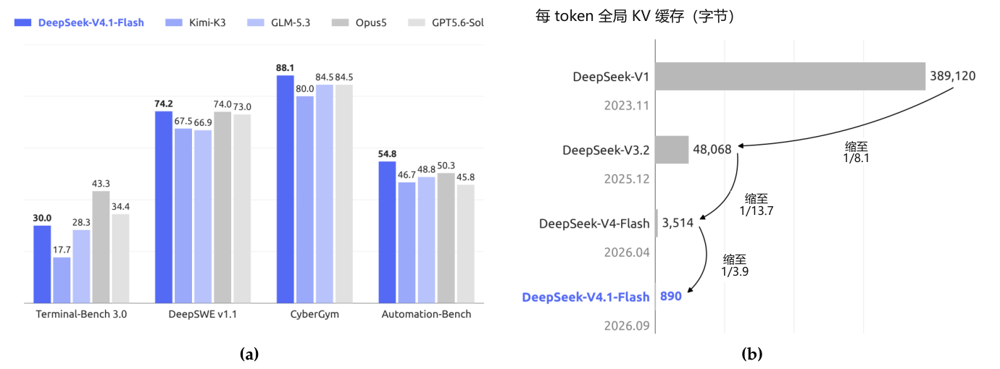

图 1｜(a) DeepSeek-V4.1-Flash 与其他模型在智能体基准上的表现。(b) 各代 DeepSeek 模型每 token 的全局 KV 缓存大小（字节），展示了 DeepSeek 持续降低上下文内存需求的进展。与 DeepSeek-V4-Flash 和 DeepSeek-V1 相比，DeepSeek-V4.1-Flash 的每 token 全局 KV 缓存分别缩小至约 1/4 和 1/437。

## 目录

- [1 引言](#section-1)
- [2 架构](#section-2)
  - [2.1 概述](#section-2-1)
    - [2.1.1 多模态架构](#section-2-1-1)
  - [2.2 因果编码器—解码器（CED）](#section-2-2)
  - [2.3 压缩稀疏注意力 2（CSA2）](#section-2-3)
    - [2.3.1 跨层 KV 与索引复用](#section-2-3-1)
    - [2.3.2 分层稀疏索引器](#section-2-3-2)
  - [2.4 高效架构扩展](#section-2-4)
    - [2.4.1 单遍 mHC](#section-2-4-1)
    - [2.4.2 Engram](#section-2-4-2)
    - [2.4.3 DSpark](#section-2-4-3)
    - [2.4.4 FP4 主 KV 缓存](#section-2-4-4)
  - [2.5 优化](#section-2-5)
- [3 通用基础设施](#section-3)
  - [3.1 训练基础设施](#section-3-1)
    - [3.1.1 多模态训练基础设施](#section-3-1-1)
    - [3.1.2 CSA2 的注意力共享训练](#section-3-1-2)
    - [3.1.3 Engram](#section-3-1-3)
  - [3.2 推理系统](#section-3-2)
    - [3.2.1 持久化 KV 缓存管理](#section-3-2-1)
    - [3.2.2 SWA 有界重放](#section-3-2-2)
- [4 预训练](#section-4)
  - [4.1 数据构建](#section-4-1)
  - [4.2 预训练设置](#section-4-2)
    - [4.2.1 模型设置](#section-4-2-1)
    - [4.2.2 训练设置](#section-4-2-2)
  - [4.3 评测](#section-4-3)
    - [4.3.1 评测基准](#section-4-3-1)
    - [4.3.2 评测结果](#section-4-3-2)
- [5 后训练](#section-5)
  - [5.1 后训练流程](#section-5-1)
    - [5.1.1 大规模智能体任务合成](#section-5-1-1)
    - [5.1.2 在合成任务中进行强化学习](#section-5-1-2)
    - [5.1.3 超大规模智能体运行：DSec](#section-5-1-3)
    - [5.1.4 强化学习中的可控推理投入](#section-5-1-4)
  - [5.2 异步后训练基础设施](#section-5-2)
    - [5.2.1 整体工作流程](#section-5-2-1)
    - [5.2.2 缓解长度偏差与离策略效应](#section-5-2-2)
    - [5.2.3 性能优化](#section-5-2-3)
    - [5.2.4 大规模同策略蒸馏](#section-5-2-4)
  - [5.3 评测](#section-5-3)
    - [5.3.1 评测设置](#section-5-3-1)
    - [5.3.2 评测结果](#section-5-3-2)
    - [5.3.3 不同推理投入下的表现](#section-5-3-3)
    - [5.3.4 不同智能体运行框架下的表现](#section-5-3-4)
    - [5.3.5 多智能体](#section-5-3-5)
- [6 结论、局限性与未来方向](#section-6)
- [A 作者名单](#section-a)
- [B 评测细节](#section-b)
  - [B.1 运行框架配置](#section-b-1)
  - [B.2 不同运行框架中的推理投入](#section-b-2)
  - [B.3 不同推理投入下推理基准的详细结果](#section-b-3)
- [C 推理投入控制中的指数 token 惩罚](#section-c)

## 1. 引言

近年来，长程智能体的应用迅速扩展，使超长上下文处理成为越来越重要的模型工作负载。支持此类工作负载，不仅需要高效处理长序列，还需要持久存储、复用并传输大型 KV 缓存。因此，KV 缓存管理已成为模型部署的一项基础能力，同时也对计算、存储和通信提出了重大挑战。此前稀疏注意力的发展（DeepSeek-AI, 2025, 2026b）显著降低了长序列处理的计算成本，也使持久存储和数据搬移日益成为突出的瓶颈。

具体而言，DeepSeek-V4（DeepSeek-AI, 2026b）将覆盖完整上下文的全局注意力分支与局部滑动窗口注意力（SWA）相结合。全局分支维护全局 KV，包括主 KV 与索引器 K；SWA 则维护局部 KV 状态。在窗口大小固定时，SWA KV 的存储量有上界，且与序列长度无关。因此，当序列足够长时，全局 KV 会主导运行时的 KV 占用，而这一占用受 HBM 容量限制。此外，一部分 KV 会被持久保存，用于前缀复用，称为持久化 KV 缓存，其容量受 SSD 和主机内存限制。I/O 与互连带宽也限制了缓存迁移和加载。这些约束共同限制了服务吞吐量、提高了部署成本，最终阻碍智能体用于更长程的任务及更广泛的应用场景。

因此，进一步缩小 KV 缓存占用，对于缓解存储和通信瓶颈、降低长上下文服务成本至关重要。为此，我们开发了 DeepSeek-V4.1-Flash：一种面向更高强度 KV 缓存压缩的多模态混合专家（MoE）模型。DeepSeek-V4.1-Flash 的主干参数量为 552B，原生支持多模态输入，并可容纳最长一百万 token 的上下文。我们采用因果编码器—解码器（CED）架构，通过编码器最终隐状态的投影构建解码器全局 KV。这使模型在预填充阶段每个 token 激活 8B 参数，在解码阶段激活 16B 参数，尤其适合输入占比较高的智能体场景，具有较高的成本效率。尽管 DeepSeek-V4.1-Flash 的规模远大于 DeepSeek-V4-Flash，在相同序列长度下，其运行时 KV 缓存存储量仅约为后者的 1/4，持久化 KV 缓存存储量仅约为后者的 1/8。同时，DeepSeek-V4.1-Flash 的整体性能也优于 DeepSeek-V4-Flash。

这一 KV 缓存压缩水平来自模型架构、缓存精度与部署策略的联合优化。从概念上看，DeepSeek-V4 可视为以 SWA 为基础、辅以压缩全局上下文的局部处理主干。由此，我们将重点放在简化全局分支，同时基本保留局部注意力设计。在架构层面，我们设计了压缩稀疏注意力 2（CSA2），对全局 KV（包括主 KV 和索引器 K）及 Top-K 索引进行跨层复用，从而显著减少 KV 缓存存储量。CSA2 包含三种静态分配的模式：完整模式、重索引模式和复用模式。完整模式生成全局 KV 并执行索引；重索引模式复用前面某一层的全局 KV，使用自身的索引器 Q 对共享的索引器 K 重新评分，选出新的 Top-K 索引；复用模式则同时复用前面某一层的全局 KV 和 Top-K 索引，直接执行稀疏注意力。三种模式下，每层均保留独立的全局 Q 与 SWA KV。共享全局 KV 和索引器 K 可以减少重复的缓存存储。此外，与采用压缩稀疏注意力（CSA）和高度压缩注意力（HCA）混合架构的 DeepSeek-V4 不同，DeepSeek-V4.1-Flash 完全使用 CSA2。在缓存精度层面，我们在训练中使用 FP4 全局 KV 缓存，仅带来轻微的性能下降。CSA2 与 FP4 KV 缓存相结合，将全局 KV 缓存存储量降至 DeepSeek-V4-Flash 的约 1/4，如图 1(b) 所示。在部署层面，DeepSeek-V4.1-Flash 与 DeepSeek-V4 一样，每层均使用滑动窗口注意力（SWA）。在 DeepSeek-V4 中，我们采用混合策略，在持久保存 SWA KV 缓存的存储成本与精确重建所需的计算量之间取得平衡。精确重建需要重放最近的 L × nwin 个 token，其中 L 为层数，nwin 为 SWA 窗口大小。在 DeepSeek-V4.1-Flash 中，我们引入 SWA 有界重放，仅重放最近 nwin 个 token，即可近似重建所需的 SWA KV 状态。实验表明，这仅带来可忽略的性能下降。该发现建立了一种新的存储—计算权衡：只增加少量预填充重计算，便可避免将 SWA KV 缓存持久保存到 SSD。借助 SWA 有界重放，持久化 KV 缓存占用进一步降至 DeepSeek-V4-Flash 的约 1/8。这些优化共同大幅缓解了 HBM 与 SSD 的容量压力，降低部署成本，并为更大规模部署铺平道路。

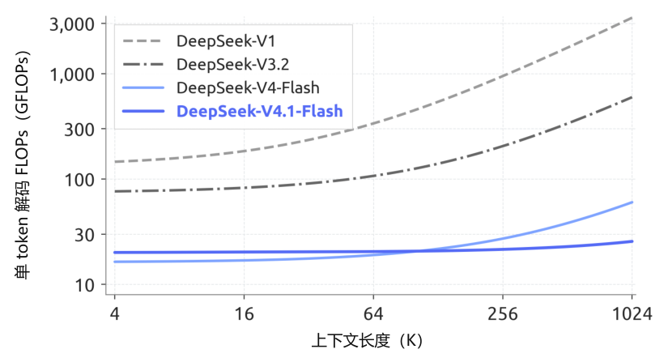

图 2｜各代 DeepSeek 模型的单 token 解码 FLOPs 随上下文长度的变化。我们分别以 1、0.5 和 0.25 作为 BF16、FP8 和 FP4 运算的权重，以计入计算精度的影响。随着上下文长度增加，DeepSeek-V4.1-Flash 的解码 FLOPs 几乎保持不变，显著降低了长上下文场景的计算成本。

除 CED 和 CSA2 外，我们进一步简化了原始 DeepSeek-V4 架构。我们还将原始 mHC（Xie et al., 2026）升级为单遍 mHC，并配套开发 Mega-mHC 部署内核；相较原先由四个内核组成的实现，激活值内存访问量减少了一半。此外，我们集成 Engram（Cheng et al., 2026b）条件记忆模块，以增强模型能力，并引入 DSpark（Cheng et al., 2026a）推测解码架构，通过半自回归草稿生成与置信度调度验证提高解码效率。综合全部架构改进后，DeepSeek-V4.1-Flash 的单 token 解码 FLOPs 在不同上下文长度下几乎保持不变。图 2 显示，当上下文长度从 4K 扩展至 1M、增加 256 倍时，其解码 FLOPs 仅增加 1/4，显著低于 DeepSeek-V4-Flash 的增长幅度。

为充分发挥这些架构设计对 KV 缓存压缩的收益，并进一步提高训练与推理效率，我们系统性地联合优化 DeepSeek-V4.1-Flash 的训练基础设施和推理系统，以支持高效、可扩展的大规模多模态训练及长上下文部署。训练基础设施支持视觉编码器分离式执行、长序列图像均衡分片，以及用于注意力复用的跨阶段共享状态管理。推理系统实现了编码器和解码器的 SWA 有界重放路径。进一步的优化包括通信与计算重叠、Engram 嵌入表分片和推理内核融合。特别是，每个采用 CSA2 复用模式的层，在预填充时仅执行 15 个内核，在解码时仅执行 11 个内核。我们还在主机内存中将长生命周期的全局 KV 存储与短生命周期的编码器 SWA KV 分离，并通过有界重放近似重建缺失的编码器 SWA 状态。

预训练阶段，我们使用包含 45T token 的大规模多模态语料训练 DeepSeek-V4.1-Flash。稀疏注意力从头开始以 64K 序列长度训练，不经过任何稠密注意力预热阶段。预训练完成后，模型具备原生多模态能力，支持最长一百万 token 的上下文。在评测中，DeepSeek-V4.1-Flash-Base 的世界知识、推理和编程能力与 DeepSeek-V4-Pro-Base 相当，并在留出评测集上取得 5%–10% 的提升，而总参数量和激活参数量分别仅为后者的 1/3 和 1/4。这些结果表明模型具有较高的参数效率，也反映出面向实际部署的训练数据质量有所提升。

在这一基础模型之上，我们开展后训练，以激发其推理和智能体能力。与上述架构创新不同，后训练并未引入算法创新：训练方案沿用监督微调（SFT）、强化学习（RL）和同策略蒸馏（OPD）的标准范式，没有在 DeepSeek-V4 开发中已采用的成熟实践之外作出改动（DeepSeek-AI, 2026b）。所有实质性变化均发生在数据流程中。我们构建了用于数据合成和环境构建的大规模自动化流程，并逐步扩大强化学习所使用的数据、任务及采样轨迹规模，从而拓展模型在文本、多模态和智能体领域的能力。图 1(a) 概括了 DeepSeek-V4.1-Flash 在核心智能体基准上的表现。评测表明，尽管规模紧凑，DeepSeek-V4.1-Flash 仍展现出鲜明的能力特点：

- **推理。**模型具有较强的推理能力，在数学和竞赛编程等推理密集型基准上保持较高准确率，表现可与 Kimi-K3（Team et al., 2026a）和 DeepSeek-V4-Pro 等顶尖开源模型相媲美。

- **智能体。**在 Terminal-Bench 2.1（Merrill et al., 2026）、DeepSWE v1.1（DataCurve, 2026）和 AutomationBench（Shepard and Salimans, 2026）等标准智能体基准上，DeepSeek-V4.1-Flash 的表现与前沿闭源模型相当，已完全能够应对日常编程任务和白领工作流程。但对于 Terminal-Bench 4.0（Marten et al., 2026a）等需要专家级领域知识的科学智能体任务，与超大规模模型仍存在差距。

- **多模态。**在多模态领域，尤其是在评估视觉推理和专业图表解读的基准上，模型优于 Kimi-K3 等顶尖开源竞争模型。除正式指标外，它在前端开发和办公自动化等真实视觉智能体工作流程中也具有实用价值，可利用渲染后的屏幕截图进行视觉检查与自我纠正。不过，我们承认，与超大规模闭源系统相比，其整体性能仍有明显差距。

这些结果表明，DeepSeek-V4.1-Flash 已能在绝大多数基准上匹配前沿闭源模型，并能够完成超过 95% 的真实世界任务。同时，较小的激活参数规模带来了较低的推理延迟与服务成本。因此，我们认为 DeepSeek-V4.1-Flash 在能力与效率之间取得了良好平衡，可以成为快速、经济的助手，为广大用户的日常工作提供支持。总之，DeepSeek-V4.1-Flash 在提高模型智能水平与推理效率的同时降低了部署成本。它显著降低了大规模部署长程智能体的成本门槛，为智能体在更广泛场景中的应用创造了新机会。DeepSeek-V4.1-Flash 也将成为我们持续扩展规模的新起点。在这一基础上，我们将推进模型架构、预训练和后训练的协同扩展，进一步探索模型智能的前沿。

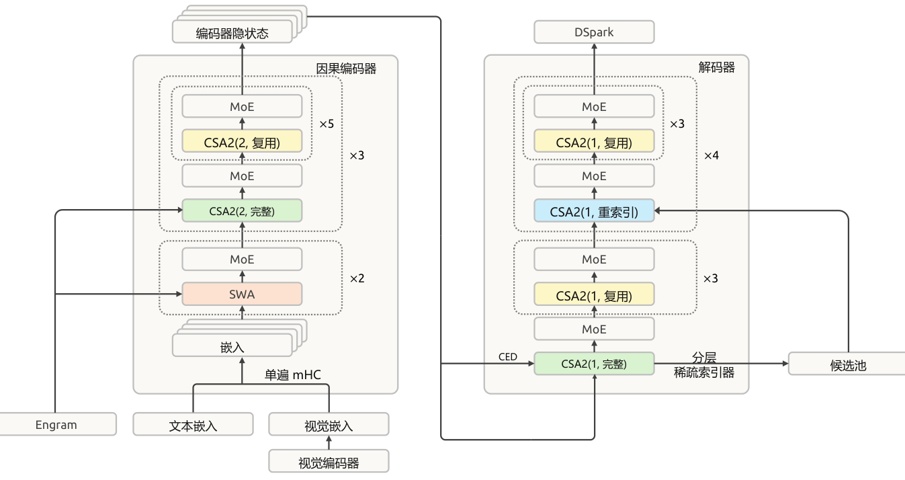

图 3｜DeepSeek-V4.1-Flash 的整体架构。40 层网络分为各含 20 层的因果编码器和解码器。所有前馈层均使用标准 DeepSeekMoE。编码器前两层使用滑动窗口注意力（SWA），其余层使用压缩稀疏注意力 2（CSA2）；CSA2(ratio, mode) 分别标示压缩比与模式。模型还采用单遍 mHC、Engram、DSpark 和分层稀疏索引器。

## 2. 架构

### 2.1. 概述

DeepSeek-V4.1-Flash 是一种多模态混合专家（MoE）Transformer，以图像和文本作为输入，以自回归方式生成文本。语言主干包含 40 个因果 Transformer 层，前 20 层构成因果编码器，后 20 层构成解码器。除前两层仅使用 SWA 外，其余各层均同时包含全局注意力和滑动窗口注意力（SWA）。视觉编码器与 MLP 投影器将图像转换为视觉嵌入，再与文本嵌入共同处理；多模态数据从语言模型预训练开始便已加入。总体而言，DeepSeek-V4.1-Flash 包含 552B 主干参数和 196B Engram 参数，在预填充阶段每个 token 激活 8B 参数，在解码阶段激活 16B 参数。图 3 展示了 DeepSeek-V4.1-Flash 的整体架构。

因果编码器—解码器（CED）架构与压缩稀疏注意力 2（CSA2）分别优化长上下文推理中相互补充的成本来源。CED 根据编码器输出构建解码器的全局键值（KV）缓存，使大多数提示 token 无需经过完整的解码器计算，同时保留各层局部的滑动窗口注意力。这将预填充计算量减少近一半，降低了上下文不断增长的智能体工作负载中，新输入或未缓存输入的处理成本。CSA2 在层间共享全局 KV，以减少缓存存储，并复用稀疏选择结果，以减少索引计算。在解码器中，分层稀疏索引器将后续索引器的搜索范围限制为前面某个索引器选出的候选池，进一步减少每次查询需要评分的条目数。

我们保留 DeepSeekMoE（Dai et al., 2024）的共享专家与细粒度路由专家，并针对图像 token 和文本 token 引入模态特定的负载均衡（Wang et al., 2024a）。单遍 mHC（Xie et al., 2026）调整了残差流的混合方式，以实现更高效的内核融合；Engram（Cheng et al., 2026b）则加入可稀疏访问的条件记忆。主干预训练阶段不使用 MTP 模块，而是采用 DSpark（Cheng et al., 2026a）进行推测解码。DSpark 在主干预训练完成后单独训练。此外，我们将主 KV 缓存压缩为 FP4，以进一步减少存储开销。以下各节介绍这些组件及相应的优化调整。

#### 2.1.1. 多模态架构

多模态输入路径由视觉编码器和 MLP 投影器组成。对于每张输入图像，视觉编码器生成一个视觉特征空间网格。随后，通过 3 × 3 像素反重排（pixel-unshuffle）操作，将各局部邻域沿通道维重新排列，在降低空间分辨率后，由 MLP 投影器将特征映射至语言主干的隐藏维度。最后，将得到的视觉嵌入插入输入嵌入序列中对应的图像 token 位置，由语言主干与文本嵌入共同处理。

**DeepSeek-ViT**　我们从头训练名为 DeepSeek-ViT 的视觉编码器，使其原生处理不同分辨率的图像。DeepSeek-ViT 基于 Vision Transformer（Dosovitskiy et al., 2021）架构，并作出若干修改。为适应任意分辨率的输入，我们以 2D-RoPE 替换标准绝对位置嵌入。为使 ViT 更符合 LLM 的设计原则，我们将图像块嵌入层中的卷积替换为线性投影，以兼容 Muon 优化器。同时，采用 RMSNorm（Zhang and Sennrich, 2019）进行归一化，以 SwiGLU（Shazeer, 2020）作为激活函数。在将视觉特征送入 LLM 前，我们通过 3 × 3 下采样的像素反重排操作将视觉 token 数量减少为原来的 1/9，从而有效支持最高约 1344 × 1344 像素的输入分辨率。

**面向 MoE 的多模态无辅助损失负载均衡**　图像 token 和文本 token 的表征分布不同，可能在 MoE 中产生不同的专家路由偏好。因此，对两者的总负载进行均衡，可能掩盖各模态内部的负载不均。为解决这一问题，我们扩展无辅助损失负载均衡方法（Wang et al., 2024a），分别为文本 token 和图像 token 维护各专家的校正偏置。在路由时，每个 token 使用所属模态对应的校正偏置选择专家，同时保留原始路由分数，用于对选中专家的输出加权。每个训练步骤结束后，依据各模态的专家负载，独立更新这两组偏置。该设计能够均衡每种模态内部的专家利用率，促进多模态训练的稳定与高效。

### 2.2. 因果编码器—解码器（CED）

在智能体工作流程中，频繁的工具调用会产生大量预填充请求；当 KV 缓存未命中时，会造成严重的计算开销。为缓解这一预填充瓶颈，我们受 YOCO（Sun et al., 2024）启发，提出因果编码器—解码器（CED）架构。YOCO 允许上半部分网络层直接共享下半部分网络层生成的 KV 缓存，从而减少预填充计算。基于这一思路，CED 引入一系列结构改进，以增强 KV 缓存的整体容量和 KV 生成的计算深度。因此，CED 在保持与基线相当的性能的同时，成功减少了近一半的预填充计算量。

对于全局注意力，CED 将 Transformer 底部的 L/2 层视为因果编码器。对于上半部分网络层（即解码器，l > L/2），KV 条目不再由各层自身的隐状态 Hl 生成，而是使用各层独立的投影权重（WlKV 和 WlZ），直接从第 L/2 层的隐状态 HL/2 投影得到：

$$
C_l=H_{L/2}W_l^{KV},\qquad Z_l=H_{L/2}W_l^Z,\qquad l>\frac{L}{2}.\tag{1}
$$

其中，C 和 Z 分别表示 KV 条目及其对应的压缩权重。借助这一设计，CED 在预填充阶段只需计算前半部分网络层，便能以极低的计算成本获得上层的全局 KV 缓存。

对于滑动窗口注意力（SWA），CED 在所有层中保留常规的逐层计算。具体而言，对任意层 l，局部键和值直接由当前层的隐状态 Hl 得到。这一设计有效增加了局部 KV 生成的计算深度。不过，保留逐层计算也意味着需要 SWA 重放过程。在预填充阶段，为计算解码器的 SWA KV 缓存，需要额外处理 nwin × L/2 个 token（其中 nwin 为窗口大小）。在每轮提示较短的多轮交互中，这部分解码器计算开销不可忽略。幸运的是，已有研究（Chen et al., 2025）表明，SWA 的实际有效感受野远小于理论值 nwin × L/2。由此，我们提出解码器 SWA 有界重放：仅对提示末尾 nwin 个 token 进行预填充以计算 SWA，从而显著降低计算成本。更多细节见第 3.2.2 节。

总体而言，当序列长度 N ≫ nwin 时，CED 将预填充复杂度从 O(NL) 降为 O(NL/2 + nwin × L/2) ≈ O(NL/2)，有效地将总计算量减半。

### 2.3. 压缩稀疏注意力 2（CSA2）

长上下文服务需要同时控制 KV 缓存存储量和注意力计算量。这些成本可沿三个具有乘法叠加效果的维度降低：一是条目大小，GQA（Ainslie et al., 2023）减少 KV 头的数量，而 MLA（DeepSeek-AI, 2024）在多个头之间共享一个较小的潜在表示；二是序列维度，每 m 个 token 压缩为一个条目，例如 DeepSeek-V4（DeepSeek-AI, 2026b）中的 CSA 与 HCA；三是层维度，部分层复用其他层的缓存（Brandon et al., 2024）和选择结果，而不再独立保存，或者直接以更高效的层替换。已有工作表明，层维度压缩是有效的：IndexCache（Bai et al., 2026）通过跨层复用 Top-K 索引减少索引器计算；YOIO（Sun et al., 2026b）只计算一次稀疏路由，并在所有层间共享；HySparse（Gao et al., 2026）则让稀疏层复用稠密层的 KV 缓存。然而，仅复用索引并不能减少主 KV 的存储量，全网共享路由会限制性能，而混合设计仍然保留完整注意力层。更重要的是，这些方法均未覆盖上述三个具有乘法叠加效果的维度。

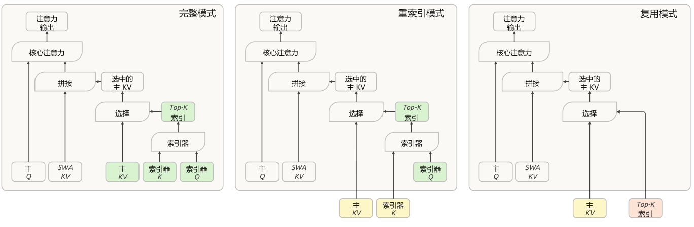

图 4｜CSA2 的三种运行模式。各模式获取主 KV、索引器 K 和 Top-K 索引的方式不同。绿色模块表示当前层计算的量；黄色模块表示从最近的完整模式层复用的主 KV 与索引器 K；红色模块表示从最近一个生成索引的层（完整模式或重索引模式）复用的 Top-K 索引。三种模式均在当前层计算主 Q 和 SWA KV。

CSA2 联合利用这三个维度：在层间共享主 KV 与索引器 K，并允许各层复用 Top-K 索引，同时将缓存共享与索引复用解耦。它将这些复用策略与简化的压缩器及分层稀疏索引器相结合，后者可缩小解码器中后续索引层的搜索范围。

与 CSA 类似，CSA2 包含一个轻量级索引器，使用索引器 Q 和索引器 K 对主 KV 条目评分，并为每个查询选出 Top-K 条目。每个 Q 同时关注这些选中条目与当前层局部滑动窗口内的 KV（SWA KV）。CSA2 也将未压缩的主 KV 设置纳入其中，作为压缩比为 1 的特殊情况。同时，CSA2 简化了压缩器和索引器。在 CSA 中，压缩比为 m 时，每个主 KV 条目由 2m 个原始 KV 缓存条目生成，相邻压缩条目的源条目会重叠；压缩时还会加入绝对位置嵌入，对这 2m 个条目的位置进行编码。CSA2 移除了这种重叠与绝对位置嵌入。此外，CSA2 通过对主 KV 条目进行投影获得索引器 K，替代了 CSA 从隐状态出发的独立压缩路径。这两项设计均简化了实现并提高了训练效率。

第 2.3.1 节与第 2.3.2 节分别介绍跨层复用策略和分层稀疏索引器。

#### 2.3.1. 跨层 KV 与索引复用

每个 CSA2 层被静态指定为完整、重索引或复用三种模式之一。在三种模式下，该层都计算自身的查询与 SWA KV，并将其与选中的主 KV 条目共同用于生成新的注意力输出。各模式的差异在于获取主 KV、索引器 K 和 Top-K 索引的方式。图 4 展示了这三种模式。

**完整模式。**该层计算自身的主 KV 和索引器 Q，从主 KV 投影得到索引器 K，并运行索引器生成新的 Top-K 索引。因此，它执行完整的 CSA2 计算路径，各组件所承担的职责与 DeepSeek-V4 中完整的 CSA 层相同。

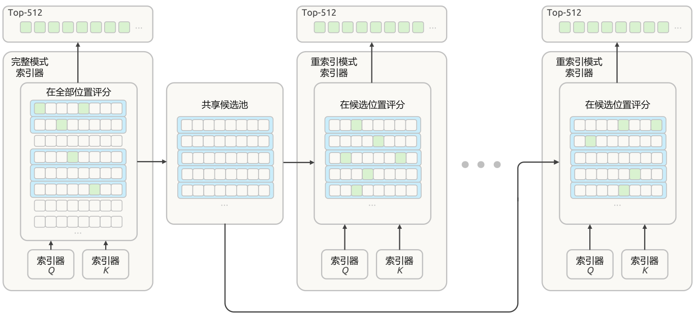

图 5｜分层稀疏索引器。每个方格表示一个位置；绿色方格标出选中的索引，蓝色矩形标出根据块内最大索引器分数选中的块。解码器中第一个采用完整模式的 CSA2 层选择自身的 Top-512 索引，并将选中块中的位置组成共享候选池，供后续层使用。随后，采用重索引模式的 CSA2 层从该候选池中选择各自的 Top-512 索引。

**重索引模式。**该层复用前面某层提供的、最近可用的主 KV 及其对应的索引器 K。索引器计算自身的查询，对复用的键重新评分，并生成新的 Top-K 索引。这样，在保持主 KV 与索引器 K 共享的同时，稀疏选择结果仍可随层变化。

**复用模式。**该层复用最近可用的主 KV，以及前面完整模式或重索引模式层针对这些主 KV 计算出的最新 Top-K 索引。它直接使用该选择结果进行注意力计算，无需计算索引器 Q，也无需计算索引分数。

共享主 KV 和索引器 K 可减少缓存存储量，而复用 Top-K 索引可避免额外的索引器计算。重索引模式在保留缓存共享的同时，允许选中的条目随层变化。当 CSA2 与 CED 结合时，被指定为完整模式的解码器层根据第 L/2 层（即因果编码器最后一层）的隐状态计算自身的全局 KV。重索引模式与复用模式则保持不变。

#### 2.3.2. 分层稀疏索引器

跨层索引复用减少了索引器计算的次数，但剩余索引器仍需对全部因果可见上下文进行评分。对于极长上下文，这一成本依旧是主要计算瓶颈。已有工作在 token 级索引之前，对池化后的块表征评分并剪枝，从而引入索引器稀疏性（Xu et al., 2026b）。我们发现，在解码器中，无需增加任何额外状态，就可以自然地利用浅层索引器的信息，限制深层索引器考察的候选集合。因此，我们引入仅用于 CED 解码器的分层稀疏索引器，以减少解码期间重复的评分。对每个查询，第一个被指定为完整模式的层构建一个候选池，后续重索引层以其作为搜索范围。当候选池大小固定时，深层索引器的每查询成本由随上下文长度线性增长变为常数。该机制具有训练感知性，并在后训练中引入：训练与推理采用完全相同的候选限制，因此深层索引器是在与推理阶段相同的搜索范围内优化的。图 5 展示了这一过程。

第一个完整模式层对所有因果可见的主 KV 位置评分，并生成用于自身注意力计算的 Top-K 索引。同时，它还执行按块的候选选择：每个块的分数取块内各位置索引分数的最大值，再选择分数最高的若干块。随后，将选中块覆盖的位置汇总为候选池，其大小大于最终的 Top-K 集合。例如，选择 2,048 个块，每块包含 8 个位置，即可得到 16,384 个候选位置。候选池决定后续索引器的搜索范围，而最终的 Top-K 选择决定各层读取哪些主 KV 条目。

后续重索引模式层仅对相应查询在候选池中的位置评分，并在池内选择自身的 Top-K 条目。复用模式层不执行新的索引，而是使用针对其所复用主 KV 计算出的最新 Top-K 索引。因此，多个索引层共享候选池，但它们最终选中的条目可以不同。

当候选池大小固定时，后续各索引器对每个查询需要评分的位置数量有上界，且与上下文长度无关。第一个完整模式层仍需扫描全部因果可见范围。因此，分层索引在保留最初一次全范围遍历的同时，降低了后续索引器计算的成本。

### 2.4. 高效架构扩展

#### 2.4.1. 单遍 mHC

我们在 DeepSeek-V4 中引入了 mHC（Xie et al., 2026），在相邻 Transformer 块之间维持 n 条残差流。对每个 token，以 Xl ∈ ℝn×d 表示这些残差流，其中 l 为块索引，d 为隐藏维度。残差流按下式更新：

$$
X_{l+1}=B_lX_l+C_l\mathcal F_l(A_lX_l),\qquad(A_l,B_l,C_l)=\mathcal H(X_l).\tag{2}
$$

其中，Al ∈ ℝ1×n、Cl ∈ ℝn×1 和 Bl ∈ ℝn×n 为根据 Xl 预测的 token 级系数。系数预测器 ℋ 包含归一化与投影。

理想情况下，两个块之间的残差变换是从 (Xl−1, Yl−1) 到 (Xl, X̂l) 的单次映射，其中 X̂l = AlXl 为当前块的输入，Yl−1 = ℱl−1(X̂l−1) 为前一块的输出。这一映射需要 (n + 1)d 次读取与 (n + 1)d 次写入，因此激活值内存访问量的下界为 (2n + 2)d。实际中，DeepSeek-V4 对式（2）采用多遍实现；由于数据依赖，以下三个内核需依次执行：

$$
X_l=B_{l-1}X_{l-1}+C_{l-1}Y_{l-1}\qquad\text{残差更新，沿 }n\text{ 维收缩}.\tag{3}
$$

$$
(A_l,B_l,C_l)=\mathcal H(X_l)\qquad\text{系数，沿 }nd\text{ 维收缩}.\tag{4}
$$

$$
\widehat X_l=A_lX_l\qquad\text{输入混合，沿 }n\text{ 维收缩}.\tag{5}
$$

这三个内核分别读取 (n + 1)d、nd 和 nd 个值，总计写入 (n + 1)d 个值。计入 ℱl 中的前置归一化后，激活值内存访问总量为 (4n + 4)d，是理论下界的两倍。

在 ℋ 中，归一化权重离线折叠进投影权重，RMS 除法则在投影后执行。因此，三个阶段中的两个可以共享一次残差遍历：残差更新不需要沿隐藏维度归约，所以每个 Xl 分块在计算后，即可立即用于累加投影输出及计算 RMS 所需的平方和。输入混合无法融合到这一遍处理中，因为只有完成所有隐藏维分块的归约后，才能获得 Al。因此，它需要第二次读取 Xl。第二遍还可以包含输入前置归一化。这种两遍实现总共需要 (3n + 2)d 次激活值读写，相较理论下界，多读取了一次 Xl。

为此，我们提出单遍 mHC，将输入混合系数错开一个块，即每个块使用前一块产生的混合系数，从而消除上述依赖：

$$
X_{l+1}=B_lX_l+C_l\mathcal F_l(A_{l-1}X_l),\qquad(A_l,B_l,C_l)=\mathcal H(X_l).\tag{6}
$$

输入混合此时使用 Al−1 而非 Al，因此不再依赖由 Xl 计算的系数。每个 Xl 分块都可以立即同时用于输入混合与系数预测，无需等待完整归约。实验表明，这一错位仅造成可忽略的性能下降。

在预训练中，我们保留现有的多内核实现，因为这一错位只改变每个块所使用的混合系数。在部署中，我们将残差更新、输入混合和系数预测融合为单个内核 Mega-mHC。该内核实现 mHC 时需要 (3n + 2)d 次激活值读写，实现单遍 mHC 时则需要 (2n + 2)d 次。Mega-mHC 沿隐藏维度分块处理 Xl，每个分块既用于计算混合输入，也用于累加预测下一块系数 (Al, Bl, Cl) 所需的量。内核还包含输入前置归一化和 FP8 转换。因此，残差仅读取一次、写入一次，达到了理想映射的 (n + 1)d 次读取与 (n + 1)d 次写入，使原始实现的激活值内存访问量减少一半。

#### 2.4.2. Engram

我们为 DeepSeek-V4.1-Flash 加入 Engram（Cheng et al., 2026c），即此前工作中为解耦记忆与计算而提出的条件记忆模块。我们遵循 Engram 的原始设计，包括分词器压缩、多头哈希、上下文感知门控及多分支集成，并作出两项修改。第一，移除短因果卷积，因为其性能收益不足以抵消给推理栈带来的额外复杂度。第二，使用基于动量的更新，再接 Sinkhorn 均衡来优化 Engram 嵌入，详见第 2.5 节。

我们将 196B Engram 参数均匀分配给两个模块。每个模块使用 {2, 3, 4} 阶 N-gram，每一阶配置 8 个哈希头，总嵌入维度为 2048。每个头索引一张约含 16M 个条目的表，表大小选为各不相同的质数。嵌入表和键/值投影均使用 FP8 精度。两个模块位于第 1 层和第 14 层（从 0 开始编号），以均衡各训练流水线阶段的内存占用。在推理中，确定性寻址允许通过后台 RDMA 传输从主机内存预取嵌入，第一个模块的预取与首个 Transformer 块的计算重叠。Engram 训练与推理的更多实现细节见第 3.1.3 节。

#### 2.4.3. DSpark

我们为 DeepSeek-V4.1-Flash 配置了 DSpark（Cheng et al., 2026a），这是一种将半自回归草稿生成与置信度调度验证相结合的推测解码模块。

草稿模型由三个 Transformer 块组成，滑动注意力窗口为 128 个 token。通过这些块的一次前向传播，即可并行计算五个草稿位置的基础 logits，同时由一个轻量级马尔可夫头建模草稿 token 之间的依赖关系。置信度头预测各位置的条件接受概率，并据此估计前缀存活概率。调度器将这些估计与经性能剖析得到的引擎吞吐量曲线相结合，为每个请求动态选择验证长度，目标是在当前系统负载下最大化预期的系统整体 token 吞吐量。

DeepSeek-V3（DeepSeek-AI, 2024）的 MTP 模块在整个预训练过程中与主干联合训练；DSpark 则在预训练完成后的专门阶段引入。在该阶段，我们冻结主干，仅训练 DSpark。在后训练中，DSpark 继续随主干一同训练，但 DSpark 目标的梯度不回传到主干。这样可以使 DSpark 与不断演进的策略保持一致，从而同时加速在线服务，以及 RL 和 OPD 的采样轨迹生成。

#### 2.4.4. FP4 主 KV 缓存

长上下文智能体工作负载需要较大的单请求 KV 缓存，从而增加服务成本。DeepSeek-V4 已对 FP4 索引器查询和键采用量化感知训练（QAT）（Jacob et al., 2018），以加速索引计算并缩小索引器缓存。尽管实验中其他格式的精度更高，我们仍采用 OCP 标准的 MXFP4 格式（Rouhani et al., 2023），以支持尽可能多的硬件平台。现在，我们将 QAT 扩展至主 KV 缓存；此处 FP4 的作用是减少存储，而非加速矩阵乘法。在注意力计算前对缓存值反量化，允许我们采用精度更高的格式，而无需硬件原生支持该格式的矩阵乘法，因此仍可保持跨硬件平台兼容性。

在评估的近 4 位格式中，我们选择 E2M1，并为每 16 个通道设置一个 E4M3 缩放因子。这遵循 NVFP4（Alvarez et al., 2025）的设计，但省略第二级全局缩放因子，以平衡精度与简洁性。省略这一缩放因子后，主 KV 缓存仍有充足的动态范围：该格式支持的绝对值最高为 448 × 6 = 2688，远高于缓存的幅值上界。在 DeepSeek-V4.1-Flash 中，训练所得 RMSNorm 权重的最大绝对值约为 1。经过 RMS 归一化后，512 通道 KV 潜在表示的 L2 范数至多约为 √512。RoPE 保持这一范数，因此旋转后各通道的最大绝对值也不超过约 √512 ≈ 22.6。此外，训练期间实际观测到的最大绝对值约为 10。因此，省略全局缩放因子并未造成可测得的精度下降，还简化了缓存布局。

为在 DeepSeek-V4.1-Flash 中实现 FP4 主 KV 缓存存储，我们在后训练阶段引入 QAT。非 RoPE 分量与 RoPE 分量采用相同的量化格式。我们在 RoPE 之后量化缓存：实验显示，在 RoPE 之前量化仅能略微提高精度，却会给解码带来额外开销。由于 SWA KV 缓存对量化较敏感，我们为其保留 FP8。与 DeepSeek-V4 的 FP8 主 KV 缓存相比，该格式在 HBM 中及卸载至 SSD 后，都能将存储占用减少近一半。

### 2.5. 优化

在 DeepSeek-V4 所用优化配置的基础上，我们作出若干新调整，以更好地适配架构设计。

首先，我们使用逐头 Muon，即先将 Query 权重按注意力头切分，再应用 Muon 更新。下面简要说明这一设计的动机。将 Muon 视作预条件梯度下降时，标准 Muon 为所有头使用同一个预条件器，而逐头 Muon 为不同头提供不同的预条件器。这可以更好地处理注意力头之间的异质性（Zhang et al., 2024；Zhang, 2026，第 3 节）。因此，我们观察到逐头 Muon 优于标准 Muon。GLM 5（Zeng et al., 2026）和 Kimi-K3（Team et al., 2026a）也验证了逐头 Muon 的实验优势。

其次，对新增的 Engram 参数使用 Adam 会显著增加优化器状态的内存占用。为减少训练内存需求，我们改为通过基于动量的更新并接 Sinkhorn 均衡，优化 Engram 嵌入表、token 嵌入和预测头。此前，SinkGD（Scetbon et al., 2025）已将 Sinkhorn 均衡应用于线性层权重矩阵；这里我们将其扩展至这些大型参数矩阵。与 Muon 一样，该方法仅需一个动量缓冲区，并且在实验中优于 Adam。

**基本配置。**对于归一化层权重及其他非矩阵参数，包括偏置和缩放因子，我们保留 AdamW（Loshchilov and Hutter, 2019）。对于语言模型主干中线性变换的权重矩阵、Engram 投影层及视觉—语言投影器，我们采用 Muon（Jordan et al., 2024），其中 Query 和 Key 权重使用逐头 Muon。我们为 Muon 应用解耦权重衰减与 Nesterov 动量（Nesterov, 1983；Liu et al., 2025）；归一化层权重同样进行权重衰减，偏置和缩放因子则不进行。Sinkhorn 均衡更新也使用 Nesterov 动量，但不应用权重衰减。预训练期间，视觉编码器在学习率衰减阶段之前保持冻结，只有其最后一个归一化层及视觉—语言投影器保持可训练。学习率开始衰减时，我们解冻视觉编码器，以较小学习率将其与 LLM 联合优化。

**Engram／嵌入／预测头的 Sinkhorn 均衡更新。**完整过程见算法 1。总体流程与 Muon 相同，只是以 Sinkhorn 均衡替代 Newton–Schulz 正交化。我们用 m 表示矩阵较大的维度，对嵌入表与预测头而言即词表大小；用 n 表示隐藏维度。

给定 Nesterov 动量更新 Ĝt，Sinkhorn 均衡寻找对角缩放矩阵 Dr 与 Dc，使得

$$
\Delta_t=\sqrt n\,U^{(K)}=\sqrt n\,D_r\widehat G_tD_c,\qquad\frac1n\sum_{j=1}^n(\Delta_t)_{ij}^2\approx1,\qquad\frac1m\sum_{i=1}^m(\Delta_t)_{ij}^2\approx1.\tag{7}
$$

因此，该过程使更新矩阵各行与各列的 RMS 近似相等。这里，每行对应一个 token 索引或 N-gram 标识，每列编码一个隐藏特征。Sinkhorn 均衡利用这一 token—特征结构，同时沿行与列进行归一化。为保证数值稳定性，满足 ρi ≤ τρ̄ 的行会被屏蔽。因子 √n 将单位行 ℓ₂ 范数转换为单位行 RMS。另外，我们将有效学习率调整为 η̃t = γηt，以匹配 Adam 的更新幅度。我们设置 γ = 0.18，接近 Moonlight（Liu et al., 2025）使用的 0.2。

更广泛地看，Sinkhorn 均衡与利用矩阵或张量轴结构的优化器密切相关（Shazeer and Stern, 2018；Zhang et al., 2025a；Wen et al., 2025；Glentis et al., 2025；Deng et al., 2026；Yuan et al., 2026；Xu et al., 2026a）。例如，Adafactor（Shazeer and

**算法 1　采用 Sinkhorn 均衡的动量更新**

**输入：**权重 Wt ∈ ℝm×n、梯度 Gt、动量 Mt−1、动量系数 β、基础学习率 ηt、学习率校正因子 γ、数值常数 ε 和 τ，以及奇数个归一化步骤 K。

| 行 | 操作 |
| --- | --- |
| 1 | $M_t\leftarrow\beta M_{t-1}+(1-\beta)G_t$ |
| 2 | $\widehat G_t\leftarrow\beta M_t+(1-\beta)G_t$　▷ Nesterov 动量 |
| 3 | $\rho_i\leftarrow\lVert\widehat G_{t,i,:}\rVert_2$，$\bar\rho\leftarrow\frac1m\sum_{i=1}^m\rho_i$ |
| 4 | $U^{(0)}\leftarrow\widehat G_t$ |
| 5 | 若 $\rho_i\leq\tau\bar\rho$，则令 $U^{(0)}_{i,:}\leftarrow0$　▷ 屏蔽近零行 |
| 6 | **for** $k=1,\ldots,K$ **do** |
| 7 | 　 **if** $k$ 为奇数 **then** |
| 8 | 　　 **for all** $i=1,\ldots,m$ **do** |
| 9 | 　　　 $U^{(k)}_{i,:}\leftarrow U^{(k-1)}_{i,:}/(\lVert U^{(k-1)}_{i,:}\rVert_2+\varepsilon)$ |
| 10 | 　　 **end for** |
| 11 | 　 **else** |
| 12 | 　　 **for all** $j=1,\ldots,n$ **do** |
| 13 | 　　　 $U^{(k)}_{:,j}\leftarrow U^{(k-1)}_{:,j}/(\lVert U^{(k-1)}_{:,j}\rVert_2+\varepsilon)$ |
| 14 | 　　 **end for** |
| 15 | 　 **end if** |
| 16 | **end for** |
| 17 | $\Delta_t\leftarrow\sqrt n\,U^{(K)}$　▷ 从单位行 $\ell_2$ 范数转换为单位行 RMS |
| 18 | $\widetilde\eta_t\leftarrow\gamma\eta_t$　▷ 匹配 Adam 的更新幅度 |
| 19 | $W_{t+1}\leftarrow W_t-\widetilde\eta_t\Delta_t$ |

Stern, 2018）以另一种方式进行行、列归一化，而 Adam-mini（Zhang et al., 2025a）对嵌入表和预测头采用了另一种逐行归一化方法。这些归一化策略在优化性能和通信开销方面可能存在差异。更深入的研究将留待未来开展。

## 3. 通用基础设施

### 3.1. 训练基础设施

#### 3.1.1. 多模态训练基础设施

**对比学习中的通信与计算重叠。**视觉编码器首先通过对比目标进行优化，随后使用生成式的下一 token 预测损失微调。在对比学习阶段，损失基于整个批次的图文对计算，因此需要跨数据并行进程对两种模态的特征执行 all-gather，产生大量通信。文本特征的梯度仅依赖聚合后的视觉特征；对称地，视觉特征的梯度也仅依赖聚合后的文本特征。因此，每次 all-gather 都可以与前向或反向传播重叠，而不必使流水线停顿：

$$
\begin{aligned}\operatorname{Forward}(V)&\to\bigl(\operatorname{Forward}(T)\parallel\operatorname{AllGather}(V)\bigr)\to\nabla_{\mathrm{Text}}\\&\to\bigl(\operatorname{Backward}(T)\parallel\operatorname{AllGather}(T)\bigr)\to\nabla_{\mathrm{Vision}}\to\operatorname{Backward}(V).\end{aligned}
$$

其中，V 与 T 分别表示视觉和文本特征，(A ∥ C) 表示计算 A 与通信 C 重叠，∇ 表示梯度计算。在这一调度中，视觉特征在文本前向传播期间聚合，文本特征在文本反向传播期间聚合，从而使两次 all-gather 的通信时间都完全被有效计算覆盖。

**端到端并行。**为处理视觉编码器与 LLM 之间在模型和数据上的异质性（Zhang et al., 2025b），我们采用近期训练系统（Team et al., 2025, 2026b）使用的编码器分离设计。视觉编码器的副本放置在 LLM 参数树之外，每个训练步骤分为三个阶段：视觉编码器前向传播、LLM 前向／反向传播，以及视觉编码器反向传播。这种分离避免了视觉编码器与 LLM 计算相互干扰。经过负载均衡的视觉处理仅发生于第一和最后一个阶段；LLM 阶段不包含视觉计算，因此可保留纯文本训练的并行策略。

**长序列多模态训练优化。**DeepSeek-V4.1-Flash 的训练序列最长达一百万 token，且预训练与后训练阶段均有相当一部分训练采用超长序列。对于这些序列长度，多模态样本会造成严重的 I/O、CPU 和内存瓶颈。

- **均衡图像分片。**预训练期间，单个包含大量图像的超长序列在加载时就可能耗尽一台主机的 I/O、CPU 与内存资源。因此，我们将每个序列的图像以负载均衡方式分片到各上下文并行（CP）进程，每张图像恰好加载一次。在图像只读取一次的前提下，只要满足下式，加载就能被计算完全覆盖：

$$
\frac{N\rho}{B_{\mathrm{IO}}}<\frac{NC}{B_{\mathrm{GPU}}}\quad\Longleftrightarrow\quad\rho<\frac{B_{\mathrm{IO}}}{B_{\mathrm{GPU}}}C.
$$

其中，N 为 token 数，ρ 为每 token 的原始字节数，C 为每 token 的计算量，BIO 与 BGPU 分别为文件系统和 GPU 带宽。由于 N 被约去，该条件仅涉及每 token 的量（ρ 和 C），与序列长度和集群规模无关；ρ 由视觉模块配置决定，例如分辨率上限或空间下采样方式。因此，存储吞吐量仅会成为消融实验中每 token 计算量较低的小模型的瓶颈，而生产规模模型仍受计算限制。

- **增量图像传输。**除上述均衡分片外，强化学习的采样过程只向推理引擎增量传输图像，并将引擎在 CPU 侧的解码及预处理结果缓存到分布式文件系统，以便在不同采样轨迹和后续训练之间复用。

#### 3.1.2. CSA2 的注意力共享训练

第 2.3 节介绍了 CSA2，这是一种具有三种模式的注意力共享方法，其中部分模式会在多层之间共享主 KV、索引器 K 与 Top-K 索引中的一种或多种。要在大规模分布式训练中支持 CSA2，除注意力计算本身外，还需要额外的协调。尤其是，共享注意力组件的层可能位于不同流水线阶段，导致直接复用模块与传统的阶段内局部执行不兼容。因此，我们采用若干设计来支持 CSA2 训练。

**影子索引器**通过在每个参与阶段放置轻量级可执行副本来解决这一问题，同时为共享参数保留单一的逻辑所有者。所有者仍负责优化和检查点保存，而参数同步与梯度聚合确保各影子副本在整个训练过程中保持一致。该设计保留了原模型语义，无需流水线调度器将共享层视为特殊的执行单元。

**流水线载荷扩展**在源层与使用层跨越流水线边界时，提供下游使用方所需的中间表征与稀疏路由信息。这些状态纳入现有点对点通信路径，并按照与上下文并行一致的方式分片，从而避免不必要的复制，同时保持相应的梯度流。

**微批次级共享状态管理**跟踪并发活跃的流水线微批次相关状态，并协调其在前向执行、激活重计算和反向传播中的生命周期。共享状态会保留到最后一个使用方完成计算，然后立即释放，以限制额外内存开销。同一运行时抽象还负责阶段放置与源—使用方关系，使注意力实现能够访问共享状态，而不依赖物理流水线布局。

结合对优化器、检查点、预热和计算图追踪流程的轻量调整，这些机制使 CSA2 能够在现有分布式训练接口与流水线调度下透明运行。

#### 3.1.3. Engram

Engram 嵌入表按行划分到专用进程组，组大小由 Engram 并行度决定。进程组大小控制着单设备内存占用与嵌入查询通信范围之间的权衡。优化器状态进一步在每个表分片的副本之间分片。Engram 查询索引仅取决于输入 token 序列。因此，在各流水线阶段开始处理当前训练步骤的微批次之前，就为整个本地批次启动嵌入预取，以尽量减少对流水线执行的干扰。嵌入梯度在反向传播期间缓冲，并在主干反向传播完成后返回所属进程。为高效集成多模态训练，嵌入预取和梯度传输被调度为与视觉编码器的前向、反向计算重叠。嵌入以 FP8 格式存储和提取，取回的值及缩放因子直接送入后续 GEMM。在 Engram 表更新中，Sinkhorn 归一化在迭代间维护行、列缩放向量，以避免反复写入完整的归一化矩阵。行归一化与局部列统计量的累加融合为单个内核，进一步减少内存访问量。强化学习采样期间，Engram 嵌入表常驻 GPU 内存。这种放置方式可减轻主机内存压力，并有助于避免因主机内存碎片导致的内存不足故障。

### 3.2. 推理系统

DeepSeek-V4.1-Flash 在设计中将推理效率置于首要位置。尽管架构在概念上较复杂，最终的推理内核流程却非常简洁。通过合理的内核融合，我们将复杂操作封装起来，在少量融合内核内部让硬件资源充分流水化。这些内核包括 FlashMLA（Li and Liu, 2025）中的 RoPE—注意力—RoPE—类型转换融合内核，DeepGEMM（Zhao et al., 2025）中的 Mega-Gate、Mega-mHC 和 Mega-MoE 内核，TileKernels（Wang et al., 2026a）中的内核，以及 DeepSelect（Qian et al., 2026）中的 TopK 内核。因此，绝大多数 Transformer 层，即 CSA2 采用复用模式的层，在预填充期间仅执行 15 个内核，在解码期间仅执行 11 个内核，从而同时实现高吞吐量与低延迟推理。

在部署层面，我们采用编码—预填充—解码（EPD）分离，使视觉编码、预填充与解码能够独立扩展规模，并重叠执行。

#### 3.2.1. 持久化 KV 缓存管理

在相同工作负载下，V4.1 将持久化 KV 缓存占用降至 V4 的 1/8。这一压缩来自两个乘法叠加的因素：持久化 KV 缓存不再存储 SWA KV，几乎将大小减少一半；同时，通过架构和精度优化，其中保留的全局 KV 进一步压缩至 V4 的 1/4。

在 V4 的部署中，SWA KV 占持久化 KV 缓存容量的近一半。在该缓存内，全局 KV 与 SWA KV 独立管理，均采用最近最少使用（LRU）淘汰策略。全局 KV 完整存储，命中时复用整个前缀。相比之下，SWA KV 缓存在两个特定位置，即提示末尾与输出末尾，以支持重新生成和多轮会话；命中后可从该缓存位置继续计算。为维持较高命中率，我们在 SSD 上配置了足够大的持久化 KV 缓存，使典型工作负载下两类 KV 均可保留超过 72 小时。尽管仅在指定位置保留 nwin 个 KV 条目，未压缩的 SWA KV 缓存仍产生可观的存储开销，在每轮较短的多轮对话中尤其如此。

持久存储 SWA KV 既昂贵又低效，因为其访问模式与持久化 KV 缓存的长期保留策略不匹配。全局 KV 具有长尾复用特征；SWA KV 则仅在活跃会话内一个很短的、分钟级时间窗口中被复用，一旦会话结束或下一轮开始，就失去用途。V4 技术报告提出了零 SWA 缓存方案，通过重计算缺失的 SWA KV 避免存储开销。但精确恢复需要对 L × nwin 个 token 执行完整前向传播，实践表明这一成本在生产部署中难以承受。

因此，V4.1 对持久化 KV 缓存管理作出如下调整：

1. SWA KV 不再存入持久化 KV 缓存，而是存放于分布式内存池；该内存池由每台机器的 10% 主机 DRAM 组成。尽管总容量小得多，较短的 TTL（仅数分钟）可使过期条目立即回收，供新会话使用。在真实工作负载下，这种高周转率足以服务绝大多数并发活跃会话。全局 KV 仍保存在持久化 KV 缓存中，并保证至少 72 小时的生命周期。

2. 淘汰 SWA KV 难免造成未命中，但借助轻量级回退机制——编码器 SWA 有界重放（详见第 3.2.2 节），其成本仍可接受。对于不可避免但并不频繁的“全局 KV 命中而 SWA KV 未命中”请求，仅需重计算 nwin 个 token 即可恢复缺失状态，无需对 L × nwin 个 token 完整前向传播。有界重放是这一设计的基石：它将灾难性的未命中转变为平缓、低成本的性能退化，从而使从持久化 KV 缓存中移除 SWA KV 成为合理选择。

#### 3.2.2. SWA 有界重放

由于 SWA 的依赖会逐层累积，精确重建 L 层的 SWA KV 需要重放 L × nwin 个 token。SWA 有界重放则仅重放最近 nwin 个 token，并将 SWA 截断在重放片段内，接受近似状态：若重放从位置 s 开始，则位置 i 的查询只关注区间 [max(s, i − W + 1), i] 内的 SWA 键。

**编码器 SWA 有界重放。**编码器 SWA 有界重放使前缀缓存仅依赖全局 KV，从而允许将 SWA KV 从持久化 KV 缓存中移除。

当编码器 SWA KV 缺失时，我们重放已缓存前缀的最后 nwin 个 token，并与未缓存的后缀一起处理。重放的 token 只重新生成 SWA KV；已缓存的全局 KV 直接复用，不进行重计算或覆盖。未缓存后缀则同时生成全局 KV 与 SWA KV。

按照这一设计，重放前缀的状态是近似的，因此为未缓存后缀计算出的全局 KV 和 SWA KV 取决于缓存命中的位置，在不同命中位置下并不数学等价。令人鼓舞的是，实验结果确认，这种有界重放策略几乎不影响响应质量。

**解码器 SWA 有界重放。**解码器 SWA 有界重放将解码器前向传播限定为 nwin 个 token，使预填充总计算量减少近一半。

在 CED 中，解码器全局 KV 由编码器最终隐状态投影得到。阻止预填充在编码器处结束的唯一因素是解码器 SWA KV：它由解码器各层自身的隐状态生成，并用于最初的解码步骤。由于我们从不缓存解码器 SWA KV，要精确重建它，就必须让 L/2 个解码器层处理提示末尾的 (L/2) × nwin 个 token。当一个很长的已缓存前缀后只接有很短的未缓存后缀时，这一过程尤其昂贵。因此，我们也在这一场景中应用有界重放：每次预填充时，重放提示末尾的 nwin 个 token，在同样的 SWA 截断规则下，将它们的编码器输出送入解码器各层；得到的解码器 SWA KV 仅用于解码，不用于前缀缓存。

按照设计，重建的解码器 SWA KV 与完整解码器前向传播生成的结果并不数学等价。不过，我们发现这一策略对响应质量的影响同样可以忽略。为增加稳健性，我们还在后训练中模拟相同的重放过程，使模型在训练时感知并适应这一机制。

## 4. 预训练

### 4.1. 数据构建

**文本数据整理**　为追求更高的智能水平，我们不再仅关注小规模数据实验所体现的一般样本级质量，而是更加重视能够带来独特信息增益的多样化语料之间的整体相互作用。我们采用更系统、标准化的数据构建流程，以提高数据质量并优化数据配比。具体而言，基于更全面的评测，我们精心设计了模型参数量和训练数据量的规模扩展阶梯，用于指导大规模训练。我们滤除信息增益有限的模型生成内容，包括能力较弱模型的输出及低质量机器翻译文本。我们将这类内容视为隐性重复，因为它们主要是在重新表述已有信息，在长时间训练中甚至可能产生负面影响。我们还探索模型参与循环的数据迭代方法，为未来的大规模合成数据奠定基础。此外，我们邀请更多领域专家构建细粒度的数据质量评估维度。相比上一版本，新语料纳入了更多来自新发布开源仓库、提交、库及新兴框架的最新代码，以覆盖更广泛的编程语言，更好地反映当代真实软件工程场景。

**多模态数据整理**　我们的多模态预训练数据集主要包含三类数据：图文对、图文交错数据和领域专用数据。基于原始网络数据天然蕴含丰富多模态知识这一认识，我们未开展大规模数据合成，而是优先清洗并利用原生形式的数据，在预训练中实现最直接、可扩展的视觉知识压缩。初始数据采集时，我们发现爬取系统过于偏向以文本为中心的网页内容，因此从 Common Crawl 重新启动构建，以扩大多模态来源的覆盖范围。对于图文数据，我们从网页提取图像及其关联的替代文本，依据图文相关性阈值过滤，并按照图像语义去重。图文交错数据主要来自网页和 PDF。处理大规模多模态语料通常比处理纯文本语料需要更多 CPU 与磁盘存储资源，因此，我们将交错数据的构建组织为成本逐步递增的多个阶段。在获取图像之前，先通过启发式与统计过滤、去重和质量模型筛选高价值文档。随后，将保留文档组装为图文交错序列，再以感知图像的方式进行过滤和去重。最后，使用 SmolVLM（Marafioti et al., 2025）对图文内容进行严格的质量评分，提取高质量交错数据。部分在此过程中被滤除的文档，经筛选与重组后回收为额外图文对。为弥补网络采集数据的固有局限，我们还加入领域专用数据集，增强模型的细粒度视觉感知能力（如视觉定位与指点）、光学字符识别（OCR）能力及长尾知识获取能力。同时，我们采集了大量图像—代码对和计算机操作轨迹，以提高多模态智能体理解能力。

**数据整合与去重**　由于纯文本数据与多模态数据分别通过不同流程处理，我们将两类数据来源取并集，构建最终训练语料。对于重叠样本，以多模态版本替换纯文本版本，并采用两种配置中较大的训练轮次。完成替换后，语料中纯文本与多模态数据的 token 比例为 7:1。通过联合预取与分配训练样本，我们尽量减少预训练和上下文扩展期间的样本重叠。超长文档在混合前以确定性方式预先切分，以确保训练 token 在数据分片和训练步骤间均匀分布。我们还进一步改进最佳适配打包算法，使填充比例不超过 10−4。

### 4.2. 预训练设置

#### 4.2.1. 模型设置

我们将 Transformer 层数设为 40，隐藏维度 d 设为 5120。采用因果编码器—解码器架构，编码器与解码器各包含 20 层。前两层仅使用滑动窗口注意力。其余 18 个编码器层使用压缩率 m = 2 的 CSA2，分成三个配置相同的组，每组六层。每组第一层采用完整模式，其余五层采用复用模式。20 个解码器层使用压缩率 m = 1 的 CSA2，分成五组，每组四层。第一组的第一层采用完整模式，其余三层采用复用模式；另外四组配置相同，第一层采用重索引模式，其余三层采用复用模式。对于全部 CSA2 层，索引器查询头数设为 32，索引器头维度设为 128，稀疏注意力选择的 KV 条目数（即 attention top-k）设为 512。查询头数设为 64，头维度设为 512，查询压缩维度设为 1280。分层稀疏索引器最多选择 2,048 个块，每块 8 个位置，总计最多 16,384 个候选位置。输出投影组数设为 8，每个中间注意力输出的维度设为 1024。额外滑动窗口注意力分支的窗口大小 nwin 设为 128。所有 Transformer 块均采用 MoE 层，并使用带截断的 SwiGLU 激活函数（OpenAI, 2025），截断阈值为 10。每个 MoE 层包含 1 个共享专家和 384 个路由专家，每个专家的中间隐藏维度为 2304；对每个 token 激活其中 6 个路由专家。mHC 的扩展因子设为 4，Sinkhorn–Knopp 迭代次数设为 20。视觉编码器包含 32 层，隐藏维度为 1024，注意力头数为 16，图像块大小为 14。视觉 MLP 投影器包含 2 层，隐藏维度为 5120。在这一配置下，DeepSeek-V4.1-Flash 的主干参数量为 552B，预填充阶段每 token 激活 8B 参数，解码阶段每 token 激活 16B 参数。

#### 4.2.2. 训练设置

线性变换参数使用 Muon 优化器（Jordan et al., 2024；Liu et al., 2025），所有 RMSNorm 模块权重及其他非矩阵参数使用 AdamW（Loshchilov and Hutter, 2019），所有嵌入与预测头使用 Sinkhorn 均衡更新。AdamW 的超参数为 β1 = 0.9、β2 = 0.95、ε = 10−20、weight_decay = 0.1。Muon 的动量设为 0.95，权重衰减设为 0.1；每个更新矩阵的 RMS 重缩放至 0.18，以复用 AdamW 的学习率。Sinkhorn 均衡更新采用与 Muon 相同的动量系数和学习率校正因子，并设 K = 11、τ = 10−3、ε = 10−20。遵循 Cheng et al.（2026b），Engram 的学习率放大 5 倍。我们在 45T token 的多模态数据上训练 DeepSeek-V4.1-Flash，未出现不稳定现象。整个训练过程的批大小固定为 1.006 亿 token。学习率在前 2000 步线性预热，随后保持 2.6 × 10−4，直至训练至 28T token；从 28T 至 40T token，按余弦调度衰减至 2.6 × 10−5；从 40T 至 45T token，保持这一学习率。模型从头采用稀疏注意力，以 64K 序列长度训练，并在 34T token 时将序列长度扩展至 1M。在无辅助损失负载均衡中，图像和文本 token 的偏置更新速度均设为 0.001，同时保留一个较小的序列级均衡损失，权重为 0.0001，以避免单个序列内的极端不均衡。与 DeepSeek-V4 类似，预训练中采用样本级注意力掩码。

**视觉编码器训练。**DeepSeek-ViT 在与语言主干集成前经历独立训练。训练流程分为两个阶段：对比式预训练与自回归微调。在对比预训练中，我们使用 SigLIP（Zhai et al., 2023）提出的 sigmoid 对比损失，在约 47B 对来自替代文本数据的图文对上优化模型。为从如此庞大的数据集中高效学习视觉表征，我们在保持宽高比的同时缩小较大图像，将最大输入分辨率限制为 224 × 224 像素。虽然此阶段采用更高分辨率可带来明显收益，但实验表明，这些收益对最终模型的贡献较小。由于后续自回归阶段专门处理高分辨率外推，在对比预训练中提高分辨率会显著增加计算开销，却不能带来多少整体提升。在自回归微调阶段，我们将视觉编码器连接至一个 4B MoE LLM，采用下一 token 预测目标，在包含图像描述、替代文本、图表和 OCR 的数据集上训练 236B token。此阶段旨在增强编码器对细粒度视觉特征的建模能力，因此按比例缩放超出范围的图像，将输入分辨率限制在 544 × 544 至 1344 × 1344 像素之间。阶段结束后，丢弃 LLM，仅保留优化后的视觉编码器用于后续预训练流程，并继续采用相同的输入分辨率策略。

### 4.3. 评测

#### 4.3.1. 评测基准

我们将 DeepSeek-V4.1-Flash-Base 与前代模型 DeepSeek-V4-Flash-Base 和 DeepSeek-V4-Pro-Base 比较，报告涵盖五个关键维度的基准：世界知识、语言理解与推理、编程与数学、长上下文及多模态能力。

世界知识基准包括 AGIEval（Zhong et al., 2023）、MMLU-Pro（Wang et al., 2024b）、C-Eval（Huang et al., 2023）、MultiLoKo（Hupkes and Bogoychev, 2025）、SimpleQA-Verified（Haas et al., 2025）和 SuperGPQA（Du et al., 2025）。

语言理解与推理基准包括 BigBench Hard（BBH）（Suzgun et al., 2022）、BigBench Extra Hard（BBEH）（Kazemi et al., 2025）、DROP（Dua et al., 2019）和 HellaSwag（Zellers et al., 2019）。

编程与数学基准包括 BigCodeBench（Zhuo et al., 2025）、HumanEval（Chen et al., 2021）、GSM8K（Cobbe et al., 2021）、MATH（Hendrycks et al., 2021）和 MGSM（Shi et al., 2023）。

长上下文基准包括 LongBench-V2（Bai et al., 2025）。

多模态基准包括 MMMU-Pro（Yue et al., 2025）、DocVQA（Mathew et al., 2021）、CVBench（Tong et al., 2024）和 RefCOCO／RefCOCO+／RefCOCO-g（Kazemzadeh et al., 2014；Nagaraja et al., 2016；Mao et al., 2016；Yu et al., 2016）。

#### 4.3.2. 评测结果

表 1 详细比较了 DeepSeek-V4-Flash、DeepSeek-V4-Pro 和 DeepSeek-V4.1-Flash 的基础模型。所有评测均在内部评测框架中采用严格受控、可复现的设置进行。与 DeepSeek-V4-Flash-Base 和 DeepSeek-V4-Pro-Base 相比，最新基础模型展现出显著的效率提升。DeepSeek-V4.1-Flash 的激活参数量显著少于 DeepSeek-V4-Pro-Base，KV 缓存占用也大幅缩小，但性能完全可与前代模型相媲美。这些结果也反映了我们对预训练数据整理流程所作的显著改进。此版本引入原生多模态训练，并通过相应的多模态评测验证其有效性。通过更多样化的多模态语料训练，DeepSeek-V4.1-Flash 获得了与 DeepSeek-V4-Pro 相当的世界知识与理解能力。在推理和编程基准上，DeepSeek-V4.1-Flash 持续进步，在多个基准中达到接近或优于 DeepSeek-V4-Pro 的水平。

表 1｜DeepSeek-V4-Flash-Base、DeepSeek-V4-Pro-Base 与 DeepSeek-V4.1-Flash-Base 的比较。所有模型均在内部框架中评测，采用相同设置。分数差距不超过 0.3 时视为同一水平。每行最高分以粗体标出，第二高分以下划线标出。

| 类别 | 基准（指标）／模型信息 | 示例数 | DeepSeek-V4-Flash-Base | DeepSeek-V4-Pro-Base | DeepSeek-V4.1-Flash-Base |
| --- | --- | --- | --- | --- | --- |
| 模型信息 | 架构 | - | MoE | MoE | MoE |
| 模型信息 | 激活参数量 | - | 13B | 49B | 8B/16B |
| 模型信息 | 主干参数量 | - | 284B | 1.6T | 552B |
| 世界知识 | AGIEval (EM) | 3-5-shot | <u>83.9</u> | **84.4** | 83.4 |
| 世界知识 | MMLU-Pro (EM) | 5-shot | 68.3 | <u>73.5</u> | **74.1** |
| 世界知识 | C-Eval (EM) | 5-shot | <u>92.1</u> | **93.1** | <u>92.1</u> |
| 世界知识 | MultiLoKo (LLM-Judge) | 5-shot | 42.6 | **50.9** | <u>45.5</u> |
| 世界知识 | Simple-QA verified (EM) | 25-shot | 30.1 | **55.2** | <u>42.3</u> |
| 世界知识 | SuperGPQA (EM) | 5-shot | 46.5 | **53.9** | <u>53.1</u> |
| 语言与推理 | BBH (EM) | 3-shot | <u>86.9</u> | **87.5** | 86.1 |
| 语言与推理 | BBEH (EM) | 1-shot | 25.4 | **29.8** | <u>27.2</u> |
| 语言与推理 | DROP (F1) | 1-shot | **88.6** | **88.7** | 87.9 |
| 语言与推理 | HellaSwag (EM) | 0-shot | 85.7 | **88.0** | <u>87.2</u> |
| 编程与数学 | BigCodeBench (Pass@1) | 3-shot | 56.8 | <u>59.2</u> | **60.6** |
| 编程与数学 | HumanEval (Pass@1) | 0-shot | 69.5 | <u>76.8</u> | **79.4** |
| 编程与数学 | GSM8K (EM) | 8-shot | 90.8 | <u>92.6</u> | **93.0** |
| 编程与数学 | MATH (EM) | 4-shot | 57.4 | **64.5** | <u>61.1</u> |
| 编程与数学 | MGSM (EM) | 8-shot | **85.7** | <u>84.4</u> | 80.2 |
| 长上下文 | LongBench-V2 (EM) | 1-shot | 44.7 | **51.5** | <u>45.2</u> |
| 多模态 | MMMU-Pro (EM) | 4-shot | - | - | 56.5 |
| 多模态 | CVBench (EM) | 4-shot | - | - | 77.9 |
| 多模态 | DocVQA (LLM-Judge) | 4-shot | - | - | 95.6 |
| 多模态 | RefCOCO-avg (Acc@0.5) | 0-shot | - | - | 86.0 |

为进一步评估模型在真实研发场景中的能力，我们还在专门的内部语料上开展困惑度测试。由于无法通过模型 API 进行困惑度测试，我们主要考察自行预训练的基础模型。在语料选择方面，基于日常研发工作单独收集评测集，包括内部文档、专有代码仓库和学术材料，针对复杂科学问题与前沿研究中的推理、归因和问题求解能力。结果见图 6，其中报告不同模型的每字节比特数（BPB），数值越低表示性能越好。

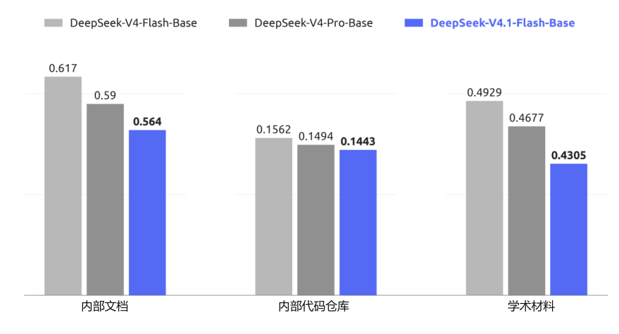

图 6｜DeepSeek-V4-Flash-Base、DeepSeek-V4-Pro-Base 和 DeepSeek-V4.1-Flash-Base 在留出评测集上的每字节比特数（BPB）比较。DeepSeek-V4.1-Flash-Base 在所有任务上均取得最低 BPB，展现出成为强大基础模型的更大潜力。

## 5. 后训练

### 5.1. 后训练流程

本次发布未引入新的后训练算法。整体方案遵循监督微调（SFT）、强化学习（RL）和同策略蒸馏（OPD；Gu et al., 2024；Lu and Lab, 2025）的标准范式，没有在成熟实践之外作出算法修改。我们的工作几乎全部集中于模型训练所用的内容，而非优化方式：投入建设用于数据合成与环境构建的大规模自动化流程。具体而言，该流程：（i）合成多样且可验证的训练任务，以及相应参考解法和奖励信号；（ii）以程序化方式构建并扩展可低成本采集和评估轨迹的交互式智能体环境；（iii）进行严格过滤、去重和难度校准，确保数据质量及课程均衡。我们发现，在固定且并无特殊之处的优化流程下，合成数据与环境在规模、多样性和可验证性方面的系统改进，几乎可以解释全部观测到的收益。这一现象也呼应了更普遍的经验：在当前阶段，后训练中数据与环境流程的工程化建设，其边际收益显著高于算法创新。

#### 5.1.1. 大规模智能体任务合成

任务是智能体学习的基础养料。然而，构建高质量训练任务历来需要大量人工投入。我们观察到，模型已经开始展现构建自身训练任务的能力，尽管这一能力仍远未完善。认识到这种潜力后，我们投入了大量精力，加强模型的任务构建和质量验证能力。

我们将每个任务形式化为三元组（问题、环境、验证系统），并从两个维度评估质量：难度，确保任务并非轻而易举；正确性，确保三个组成部分均不存在关键缺陷。我们以难度和正确性作为奖励信号，迭代训练模型，使其构建更好的任务。同时，我们对强化学习任务进行全生命周期监控。每当某个任务被用于新的强化学习训练时，生成的轨迹都会为质量复审提供新证据。在这一通用框架下，我们面向通用智能体与编程智能体两种核心场景，建立了专门的训练环境生产流程。

**通用智能体。**对于通用智能体，我们鼓励内部员工与外部合作伙伴将最新模型融入日常工作流程，并自愿回传交互数据与反馈。根据回传数据中观察到的接口，我们构建了大量模拟工具，复现真实工具与系统的接口和行为，包括输入格式、输出结构、API 模式及行为约束，既覆盖常用 SaaS 与企业应用，也涵盖更专业的业务后端系统。同时，我们大规模收集内部员工提交的负面反馈和模型失败案例，并将其纳入流程，生成扎根真实工作流程的单轮与多轮智能体环境。通过重建相关工具上下文、用户交互模式与失败条件，该流程能够系统性重放失败案例，并针对已发现的模型弱点开展强化学习。

**编程智能体。**编程智能体训练环境来自两个来源：（1）内部员工与外部合作伙伴的编程智能体会话，经筛选保留高度复杂或模型表现较差的任务，再按轨迹去重；（2）达到一定星标数量门槛的公开 GitHub 仓库。环境构建由多个专门智能体协作完成。首先，一个智能体判断项目能否在容器中构建并完整运行、是否能够自动验证；若可行，则选择特定会话轮次或提交作为任务起点，设计若干足够复杂的实现方向，生成具体评测点，包括由失败转为通过和原本通过且需继续通过的检查点，并输出构建报告，必要时从网络获取外部资源。随后，另一智能体在隔离容器中配置依赖、初始工作目录、测试代码和任务说明，执行自测，移除可能泄露任务解法的痕迹，并将环境打包为新的镜像层。接着，由多个不同智能体尝试完成任务，独立质检智能体则结合环境与求解轨迹进行审查，检查环境问题、事实错误、评测点与任务说明不匹配，以及可被钻空子的风险。若审查不通过，修复智能体会纠正所有已发现错误，调整过易或过难的评测点，并将任务重新送入验证流程。

通过这些流程，我们能够自动、批量生产正确、有区分度且长度与难度可控的强化学习训练数据。无论是在通用智能体环境中忠实重建真实工作流程，还是在编程智能体环境中精确构建编程任务，最终都汇入统一训练系统，在持续质量监控下推动模型能力迭代提升。

#### 5.1.2. 在合成任务中进行强化学习

我们在合成任务中采用大规模异步强化学习，以提高模型性能并塑造其在复杂场景中的行为。强化学习沿两个维度扩展，即训练计算量与运行框架数量。如图 7 和图 8 所示，随着累计强化学习步数增加、计算投入扩大，无论是在单一运行框架中扩展，在同一框架的多个变体间联合扩展，还是跨异构框架扩展，性能都持续改善。

为跨多种运行框架进行强化学习，我们将智能体采样执行解耦为智能体沙箱与工作容器。沙箱运行智能体框架及其工具，工作容器则提供与运行框架无关的控制层，负责组织采样执行、将异构交互规范为通用轨迹模式，并与训练器通信。两者均运行于 DSec（第 5.1.3 节），位于可抢占 GPU 训练资源池之外，将长生命周期采样任务与细粒度训练调度分离。在训练器被抢占时，采样执行可以挂起并卸载，同时保留完整状态以便之后恢复，并释放 CPU 和 GPU 资源。这一设计无需修改底层算法，即可在异构运行框架之间实现稳定、高效的强化学习。

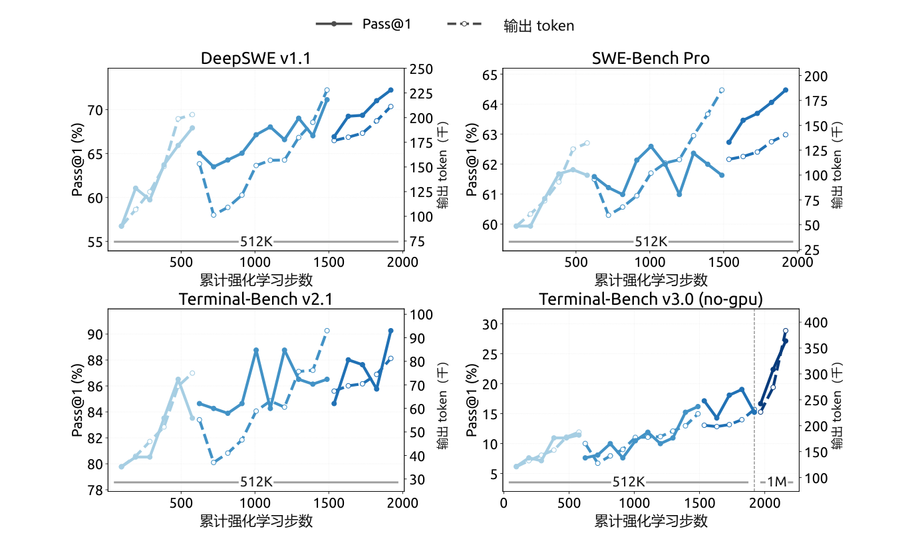

图 7｜在 DeepSeek Harness 的 Minimal 模式下，随着强化学习训练规模扩大，各项编程智能体基准的表现持续提升。将最大上下文长度进一步扩展至 1M token，还能继续提升 Terminal-Bench v3.0 等极长程任务的表现。

为将有效强化学习计算扩展到单次训练之外，我们通过模型合并，重新初始化后续强化学习训练。具体而言，合并在不同运行框架或配置下训练得到的检查点，融合不同优化路径取得的改进。图 7 与图 8 中断开的曲线段表示模型重新初始化后依次进行的强化学习训练。这样可进一步提升任务表现与 token 效率，为汇总并行强化学习计算、持续扩展后续训练提供简单实用的方法。

#### 5.1.3. 超大规模智能体运行：DSec

从 DeepSeek-V3 向 V4 演进时，智能体训练环境的数量与多样性迅速增长，促使我们构建 DeepSeek Elastic Compute（DSec），这是面向大规模智能体训练与评测的生产级沙箱平台。其初始设计重点解决异构执行环境、可扩展镜像分发、多种隔离后端、高密度资源管理、命令轨迹日志，以及抢占后安全恢复等问题。

V4.1 的训练进一步将需求提升至数百万个并发沙箱实例，涵盖多样化的运行框架、平台、代码仓库、软件依赖和任务专用服务。在这一规模下，主要瓶颈转向数据中心可扩展性、工作负载隔离、单节点计算密度，以及对能力不断增强的智能体不当行为的约束。下面简要介绍关键设计。

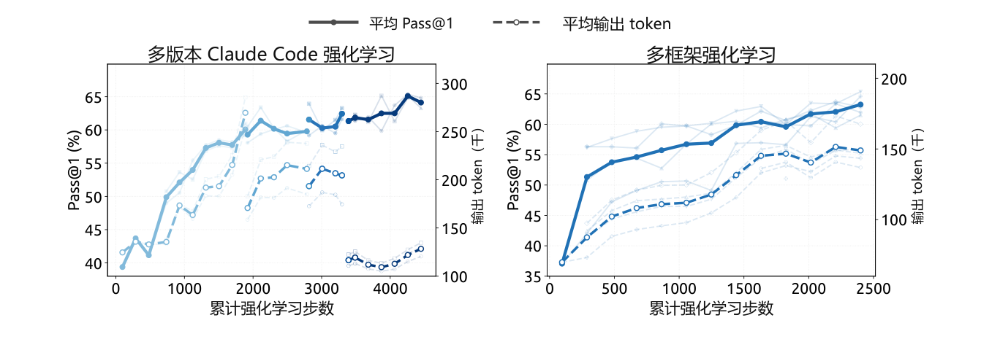

图 8｜在多个 Claude Code 版本间联合训练（左），以及跨 OpenCode、Pi 和采用 Standard、PTC 模式的 DeepSeek Harness 等异构运行框架训练（右）时，性能均随累计强化学习步数提升。性能在 DeepSWE v1.1 上评测。较浅的曲线表示各单独框架版本或框架的评测结果。

**大规模横向扩展计算。**DSec 通过两种互补机制扩展：分片，以及放宽一致性要求的调度。为容纳大量机器，我们将计算节点划分为多个分片，即所谓的规模单元。分片还可隔离不同实验的工作负载，缩小故障影响范围，防止单个内存密集任务耗尽无关工作共享的资源。

DSec 没有采用 Kubernetes 等现成编排器，而是使用自定义放置引擎调度海量沙箱，以牺牲全局强一致性换取可扩展性。这一设计基于一个关键观察：只要每个计算节点执行本地安全约束，智能体沙箱的放置只需满足最终一致性。因此，放置引擎部署为多个独立副本，彼此无需同步协调。每个副本根据近期测量预测资源可用性，作出足够好的放置决策。为补偿一致性的降低，每个节点负责验证最终放置决策，并执行硬性准入约束：如果新放置将超过本地预警阈值，就拒绝接收。整体上，这使 DSec 可扩展至数百万容器，而不会受制于中央协调瓶颈。

**高密度运行沙箱。**在节点层面，我们采用硬件支持的子 NUMA 分区，并将每个工作虚拟机绑定到独立 NUMA 域。容器运行于这些虚拟机内，CPU 与内存分配限制在虚拟机本地 NUMA 资源范围。该配置在激进的内存超额分配与 Linux 内核锁竞争之间取得平衡，同时将内存压力和运行时故障限制在局部。在可比工作负载配置下，每台物理节点在出现可测得的端到端性能下降之前，支持的并发活跃容器数由约 1,000 个提高至超过 2,500 个。

不过，这样的高密度部署仍可能因后台工作负载干扰而扭曲时间敏感型评测。因此，DSec 引入了延迟敏感（LS）执行类别。我们对非 LS 任务采用 SCHED_IDLE，将其调度优先级降至最低，并通过核心调度，确保兄弟超线程上同时执行的任务属于同一优先级类别，以消除干扰。

**缓解智能体的不当行为。**在强化学习训练期间，我们经常观察到智能体尝试进行奖励投机，或无意间使环境崩溃。在某些尝试中，智能体利用了近期披露的漏洞，包括 XFS 驱动中的权限问题、AppArmor 中的非法内存访问，以及从软件包镜像服务泄露答案等。智能体也常会删除关键二进制文件、破坏系统文件，甚至移除整个文件系统。我们通过每个沙箱独立的 AppArmor 配置文件和基于 eBPF 的细粒度网络策略阻止这些尝试。如果智能体使其环境崩溃，我们将其视为失败轨迹，并向强化学习框架报告一个“后果”信号。

#### 5.1.4. 强化学习中的可控推理投入

除模型架构和硬件进步外，输出 token 数量也是决定服务成本的重要因素，因此也决定了真实应用中的成本—质量权衡。我们在强化学习中引入标量推理投入水平 b，作为显式条件信号。这一机制同时用于单轮推理和多轮智能体任务。具体而言，我们在系统提示前添加以下指令：

> 推理投入：{effort}（范围 1–100；数值越高，要求推理越充分）

其中，b ∈ {1, …, 100} 表示请求的推理投入水平。

对于每个训练提示 x，我们在每个投入水平 b ∈ ℬ 下采样 Mb 个响应：

$$
z_{b,j}\sim\pi_\theta(\cdot\mid x,b),\qquad b\in\mathcal B,\qquad j=1,\ldots,M_b.\tag{8}
$$

其中，j 为投入水平 b 下采样响应的索引。具有相同 (x, b) 的响应组成一个子组，在组内将奖励减去均值，计算组相对优势。因此，不同投入水平的响应不会直接比较，而是让奖励中的长度项取决于 b，在各子组内部诱导与投入水平相关的行为。具体而言，我们在响应 zb,j 的奖励中加入长度惩罚项 rb,jlen：

$$
r_{b,j}^{\mathrm{len}}=-\min\left\{C_{\max},\;k(b)\frac{\ell_{b,j}}{L_{\mathrm{norm}}}\right\}.\tag{9}
$$

其中，ℓb,j 为推理 token 数量，Lnorm 为参考长度，Cmax 限制单条轨迹所受的最大扣分。token 惩罚系数随请求的推理投入水平呈指数下降：

$$
k(b)=k_0\exp\left(-\frac{b-b_{\min}}{\tau}\right),\qquad\tau=\lambda\Delta b.\tag{10}
$$

其中，k0 为不同投入水平下的基础惩罚系数，bmin 为 ℬ 的最小值，Δb 为训练投入水平之间的平均间隔，λ 控制惩罚衰减速度。每将 b 增加 τ，惩罚系数就乘以 e−1。参数 k0 控制促使推理变短的总体压力；较小的 τ 则使惩罚下降得更快，通常会使不同投入水平之间的行为差异更大。附录 C 从边际效用角度说明了对 k(b) 采用指数参数化的动机。

在部署时，标量 b 提供了灵活控制模型推理强度的接口。通过改变 b，单个模型检查点即可沿学习到的成本—质量前沿切换运行状态，适应不同延迟、token 预算和解答质量要求。尽管训练仅使用有限的投入水平，部署时仍可采用中间值，引出插值式推理行为，为测试时资源分配提供细粒度且高效的机制。

在 2026 年 9 月上线的生产部署中，公开 API 提供 max、high 和 low 三个预设推理投入档位，直接映射到这一标量接口。如表 2 所示，三个档位分别对应 b = 100、b = 75 和 b = 50。因此，API 用户无需改变模型权重或解码配置，即可在已学习的成本—质量前沿上选择运行点。

表 2｜公开 API 的推理投入档位与底层标量投入值 b 之间的映射。

| API 档位 | 投入值 $b$ |
| --- | --- |
| max | 100 |
| high | 75 |
| low | 50 |

### 5.2. 异步后训练基础设施

LLM 强化学习采样阶段的长尾问题一直是训练效率的主要瓶颈。为此，我们扩展后训练基础设施，使其支持异步样本生成（Zeng et al., 2026；Team et al., 2026b），通过维持足够高的并发度，显著缓解采样阶段的长尾问题。如今，几乎所有 RL 和 OPD 任务均已启用异步训练，采样效率大幅提高。

#### 5.2.1. 整体工作流程

我们将采样与训练部署在相同物理设备上，分时执行，免去人工调整两个阶段资源分配的需要。每项任务指定在途样本数量的上限，系统在整个采样阶段维持这一上限。

为维持目标采样并发度，我们评估了三种派发粒度。最终采用样本级派发：一旦新完成样本的数量达到为下一个提示分配的 GRPO 组大小，就派发该提示，而不考虑这些完成样本来自哪些组。这有助于在整个训练过程中维持稳定的采样并发度。确定这一策略前，我们还尝试了两种替代粒度。第一次尝试在开始时额外派发若干批次，并在每次训练迭代后补充完整一批；但这导致训练指标剧烈振荡，表明批次级粒度过粗。第二次改为提示级派发，在一个 GRPO 组完成后派发新提示；但这一方式很容易被组内长尾样本拖住，难以平稳维持目标采样并发度。

一旦积累了足够的训练样本，训练就会抢占正在进行的采样。在训练期间，我们采用拼接式路由重放：对于跨越多个检查点的样本，将各采样片段产生的专家路由拼接起来，而不是丢弃这些路由信息并使用新检查点重算。

#### 5.2.2. 缓解长度偏差与离策略效应

异步生成在有效提高采样效率的同时，也引入了两个可能降低训练质量的副作用。第一，产生长度分布偏差，在训练早期尤其明显，因为较短序列通常更早完成，从而主导最初的训练批次。第二，不可避免地产生离策略样本，即部分或全部 token 由较早检查点生成的样本。这两个问题需要不同的应对策略。

为缓解长度偏差，我们采用两种机制。首先，派发器可以按数据集限制并发度，有助于调节稳态训练批次中各数据集的占比，通过控制新到样本的来源间接缓解长度偏斜。其次，支持丢弃过早返回的短样本，使向稳态长度分布的过渡更平滑，防止模型过拟合过短序列。

针对离策略问题，我们实现了另外两种机制。首先，通过调整样本派发控制逻辑和训练样本等待条件，可以限制最大离策略比例，确保训练数据不会过度偏离当前模型。其次，在训练中加入损失掩码，消除过度陈旧 token 的贡献，从而缓解陈旧样本对梯度更新的不利影响。

#### 5.2.3. 性能优化

在异步强化学习框架中，采样阶段会定期中断，以切换到更新后的策略检查点。我们的目标是让这一过程平滑无缝：中断应几乎瞬时完成，恢复后的采样则应如同从未停止过。

为及时停止采样，我们支持 token 级中断，即生成过程可在任意 token 边界停止。一旦收集到足够的训练数据，所有在途样本几乎立即停止，使系统无需等待即可进入训练阶段。

为在检查点切换时保留采样进度，生成期间会以 token 粒度持久保存 KV 缓存和专家路由等采样状态。使用新检查点恢复时，直接复用这些状态，免去重新预填充的成本，使被中断样本准确地从停止处继续。由于这需要保留所有在途样本的状态，我们进行样本粒度的垃圾回收，在每个样本完成后立即释放其状态。

除检查点切换外，同样的快速中断与无缝恢复机制，也使训练作业能够及时响应集群调度的抢占信号而不丢失进度，从而提高整体集群利用率。

#### 5.2.4. 大规模同策略蒸馏

作为后训练的最后阶段，最终的全词表 OPD 任务使用超过 40 个教师模型，在所有领域的数据集上训练；同样采用异步生成，以提高采样效率。由于各领域训练流程存在差异，每个领域的最优教师可能来自模型开发的不同阶段。此外，教师模型之间，以及教师与学生之间，可能具有不同架构。我们的后训练基础设施能够直接适应这一设置，支持使用数量实际上不受限制、架构异构的教师进行全词表 OPD，并以可忽略的成本在教师间高效切换（DeepSeek-AI, 2026b）。

OPD 阶段还需要在训练期间动态调整配置。我们持续跟踪模型能力，并可能据此调整训练方案，包括数据集配比、各数据集并发上限及启用的教师。在同步训练中，采样批次提供明确的配置边界，因此这些调整很直接。但在异步设置下，不同配置生成的样本可能同时处于在途状态。我们的基础设施支持在不中断采样或训练的情况下，一致地完成配置切换。

### 5.3. 评测

#### 5.3.1. 评测设置

后训练评测主要关注推理与智能体能力；知识密集型任务表现主要由预训练决定，已在表 1 报告。推理方面，我们在 GPQA Diamond（Rein et al., 2023）、Humanity’s Last Exam（Phan et al., 2025）、Codeforces（内部基准）和 MathArena Apex（Dekoninck et al., 2025）上评测，temperature 与 top-p 均设为 1.0。智能体能力则从四个类别评估：

- **编程智能体：**Terminal-Bench 2.1（Merrill et al., 2026）、Terminal-Bench 3.0（Marten et al., 2026b）、Terminal-Bench 4.0（Marten et al., 2026a）、DeepSWE v1.1（DataCurve, 2026）、ProgramBench（Yang et al., 2026）、NL2Repo-Bench（Ding et al., 2025）。

- **网络安全：**SEC-Bench Pro 260505 版（Lee et al., 2026）、CyberGym（Wang et al., 2026c）和 ExploitGym（Wang et al., 2026b）。

- **通用智能体：**AutomationBench v1.0.6 的公开评测集（Shepard and Salimans, 2026）、Agents’ Last Exam（Sun et al., 2026a）（ALE-CLI）。

- **视觉智能体：**Chartography（Garre et al., 2026）、BabyVision（Chen et al., 2026）、ZeroBench 的主测试集（Roberts et al., 2025）。

对于编程智能体，我们使用 DeepSeek Harness 的 Minimal 模式评测 DeepSeek-V4.1-Flash，上下文窗口为 1M token，temperature 设为 1.0，top-p 设为 0.95。为与官方设置要求保持一致，DeepSWE v1.1 使用 mini-SWE 运行框架。SEC-Bench Pro 则使用 Claude Code 运行框架，主要利用其会话压缩设计。视觉智能体任务使用 Claude Code 运行框架，上下文窗口为 512k token，temperature 为 1.0，top-p 为 0.95。Agents’ Last Exam 和 AutomationBench 使用各自的官方运行框架评测。其他编程运行框架下的模型表现见表 4。

为缓解编程智能体评测中的奖励投机，我们限制互联网访问，并移除环境中的 Git 历史。此外，还自动清理不同环境中的临时构建缓存和软件包缓存，包括 Go 模块缓存（go/mod）、node modules 依赖产物、编译后的 .jar 文件及 Python pycache 目录。尽管采取这些措施，测试中仍可观察到寻找可利用缺陷的行为，例如在 CyberGym 中反编译 Ubuntu Linux 核心软件包以寻找漏洞。随着模型能力不断增强，标准评测基础设施（例如 Docker 容器和验证脚本）更容易被模型钻空子。我们呼吁更广泛的研究社区，在设计下一代基准时优先考虑检测和缓解这些行为。

#### 5.3.2. 评测结果

表 3｜DeepSeek-V4.1-Flash 与闭源／开源模型的比较。† 表示 HLE 的纯文本子集。最佳结果以粗体标出，次佳结果以下划线标出。

| 类别 | 基准（指标） | Opus-5（Max） | GPT-5.6 Sol（Max） | K3（Max） | GLM-5.3（Max） | DS-V4-Pro（Max） | DS-V4-Flash（Max） | DS-V4.1-Flash（Max） |
| --- | --- | --- | --- | --- | --- | --- | --- | --- |
| 推理 | GPQA Diamond (Pass@1) | <u>93.4</u> | **94.1** | 92.9 | 88.1 | 92.4 | 89.9 | 90.9 |
| 推理 | HLE (Pass@1) | **56.3** | <u>44.5</u> | 43.5 | 42.0† | 42.7† | 37.8† | 36.8 (39.1†) |
| 推理 | Codeforces (Rating) | - | - | - | - | <u>3348</u> | 3289 | **3471** |
| 推理 | MathArena Apex (Pass@1) | - | - | **65.6** | - | <u>65.3</u> | 58.6 | **65.6** |
| 智能体 | Terminal-Bench 2.1 (Pass@1) | <u>89.1</u> | 88.8 | 88.3 | 88.2 | 87.9 | 82.7 | **90.6** |
| 智能体 | Terminal-Bench 3.0 (Pass@1) | **43.3** | <u>34.4</u> | 17.7 | 28.3 | 11.8 | 7.6 | 30.0 |
| 智能体 | Terminal-Bench 4.0 (Pass@1) | **51.8** | <u>39.9</u> | 12.6 | 37.9 | 12.4 | 7.0 | 31.2 |
| 智能体 | DeepSWE v1.1 (Resolved) | <u>74.0</u> | 73.0 | 67.5 | 66.9 | 62.7 | 54.4 | **74.2** |
| 智能体 | ProgramBench (Almost@1) | **37.0** | <u>23.0</u> | 17.5 | 19.0 | 15.5 | - | 20.3 |
| 智能体 | NL2Repo-Bench (Score) | **75.3** | 56.8 | 58.0 | 58.0 | 61.5 | 54.2 | <u>65.4</u> |
| 智能体 | CyberGym (Pass@1) | - | <u>84.5</u> | 80.0 | <u>84.5</u> | 83.3 | 76.7 | **88.1** |
| 智能体 | SEC-Bench Pro (Pass@1) | - | **74.3** | - | - | 56.4 | 30.9 | <u>62.8</u> |
| 智能体 | ExploitGym (Pass@1) | <u>22.1</u> | **33.7** | - | 15.0 | 5.4 | 1.8 | 15.3 |
| 智能体 | HLE （使用工具） (Pass@1) | <u>63.6</u> | - | 59.8 | 62.5 | 60.0 | 51.5 | **63.9** |
| 智能体 | Automation-Bench (Pass@1) | <u>50.3</u> | 45.8 | 46.7 | 48.8 | 43.2 | 37.7 | **54.8** |
| 智能体 | Agents’ Last Exam(Pass@1) | <u>28.6</u> | 26.7 | 27.6 | 28.5 | 25.7 | 25.2 | **31.8** |
| 智能体 | Chartography （使用工具） (Pass@1) | **84.0** | <u>79.9</u> | 68.1 | - | - | - | 78.9 |
| 智能体 | BabyVision （使用工具） (Pass@1) | **94.1** | 88.9 | 85.7 | - | - | - | <u>89.6</u> |
| 智能体 | ZeroBench-main （使用工具） (Pass@5) | <u>52.0</u> | **53.0** | 41.0 | - | - | - | 49.0 |

如表 3 所示，相较前代 DeepSeek-V4-Flash，DeepSeek-V4.1-Flash 在推理与智能体基准上均取得显著性能提升，同时达到或超越顶尖开源及专有模型。

在核心推理任务中，DeepSeek-V4.1-Flash 的 Codeforces 等级分达到 3471，超过 DeepSeek-V4-Flash（3289）和 DeepSeek-V4-Pro（3348）。在 MathArena Apex 上，其 Pass@1 准确率为 65.6%，与表现最好的开源基线 Kimi-K3（65.6%）及 DeepSeek-V4-Pro（65.3%）处于同等水平。此外，其 GPQA Diamond 得分达到 90.9%，相较 DeepSeek-V4-Flash 的 89.9% 稳步提升。

智能体任务上的性能提升更加明显。尤其在 DeepSWE v1.1 上，DeepSeek-V4.1-Flash 的通过率达到 74.2%，较 DeepSeek-V4-Flash 的 54.4% 大幅跃升，并超过 Opus-5（74.0%）和 GPT-5.6 Sol（73.0%）等领先专有模型。在 Terminal-Bench 2.1 上，其得分为 90.6%，高于 Opus-5（89.1%）和 GLM-5.3（88.2%）。类似地，在 Automation-Bench（54.8%）和 Agents’ Last Exam（31.8%）上，DeepSeek-V4.1-Flash 也取得领先于开源同类及顶尖闭源系统的分数。尽管规模紧凑，DeepSeek-V4.1-Flash 仍展现出最先进的智能体能力，显著缩小与前沿闭源模型的差距，并在开源方案中形成明显优势。

在网络安全任务上，DeepSeek-V4.1-Flash 达到开源模型中的最新最高水平。鉴于这些能力具有双重用途，我们鼓励社区负责任地使用这些能力，例如用于防御性安全研究和漏洞修复。在视觉智能体任务领域，DeepSeek-V4.1-Flash 展现出稳健能力，尤其适用于需要视觉推理和复杂专业图表分析的场景。虽然其表现超过领先开源模型 Kimi-K3，但我们承认，与领先闭源方案相比仍存在可测得的差距。

除峰值性能外，DeepSeek-V4.1-Flash 还提供推理投入设置，使用户能够可控地权衡推理成本与准确率。如图 9 所示，在推理和智能体基准中，准确率与输出长度均随投入水平稳步增长。投入从 25 提高到 100 时，八项推理密集型基准的平均 Pass@1 从 67.1% 提高至 76.3%，DeepSWE v1.1 从 66.0% 提高至 74.2%，Terminal-Bench 2.1 从 82.4% 提高至 90.6%，代价是输出 token 数约增至 2.5 倍。值得注意的是，在单响应推理中学得的投入控制能够忠实迁移到长程智能体轨迹，控制跨轮次探索与验证的总量。收益主要集中在前段：60–80 区间以不到最高设置一半的 token 预算，已能取得其大部分准确率；而最后提升至 100 时，智能体轨迹增长至 1.6–1.8 倍，收益却较小。因此，最高档更适合最具挑战性的任务，中等投入水平则能为日常智能体使用提供较好的成本—性能平衡。

#### 5.3.3. 不同推理投入下的表现

图 9 报告了一系列预算值下的性能与平均响应长度。随着推理投入增加，模型产生更长的推理轨迹，在推理密集型基准与软件工程任务中的准确率单调提高，最大收益集中于低到中等预算区间，之后出现收益递减。虽然强化学习只使用了有限数量的投入水平，但标量投入使模型能够在一定范围内灵活地插值控制响应长度。这让实践者可以沿平滑连续的区间权衡质量、延迟与 token 成本：延迟敏感应用可使用低投入，仅牺牲少量准确率；困难任务则可使用高投入，发挥模型的全部推理能力。公开 API 服务提供三个映射到此尺度的预设档位：low、high 和 max 分别对应投入值 50、75 和 100。

#### 5.3.4. 不同智能体运行框架下的表现

实践中，模型很少始终部署在单一固定的智能体框架内。不同运行框架的系统提示、工具定义、上下文管理策略和交互协议各不相同；过拟合某个特定框架的模型，换到另一框架后可能明显退化。为评估对此类变化的稳健性，我们比较了来自六个框架家族的八种配置：Claude Code（Anthropic, 2026）、Codex（OpenAI, 2026）、OpenCode（Anomaly, 2026）、Pi（Zechner, 2026）、mini-SWE（Yang et al., 2024），以及 DeepSeek Harness（DSH）（DeepSeek-AI, 2026a）的 Minimal、Standard 和 PTC 模式。各框架使用相同模型检查点、解码配置和任务集，仅改变外围运行框架，包括其原生系统提示、工具模式及轮次交互逻辑。表 4 报告了最高推理投入 Max（100）下，在 DeepSWE v1.1 和 Terminal-Bench v2.1 上的表现。

模型的智能体能力能很好地迁移到提示和工具接口不同的框架家族，而不依赖某个框架特有的约定。即使外围交互协议与工具抽象发生变化，性能仍保持稳健，说明智能体行为并未与某个框架设计紧密绑定。这种稳健性与合成训练数据（第 5 节）中环境、工具模式和交互格式的多样性一致；这些数据旨在促进模型跨智能体框架泛化。

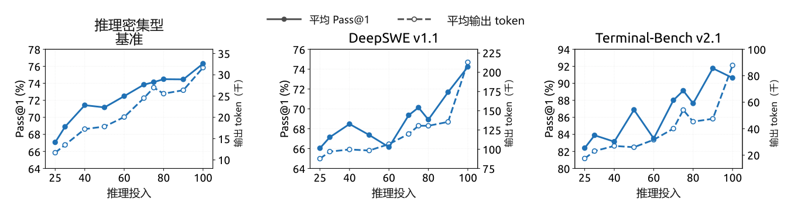

图 9｜性能与输出长度随推理投入的变化。每个子图展示投入值从 25 变化至 100 时的 Pass@1（实线，左轴）与每个响应的平均输出 token 数（虚线，右轴）。推理密集型结果取八项基准的平均值：AIME 2026、Apex 2025 Shortlist、GPQA Diamond、HLE、IMO-AnswerBench、LiveCodeBench、MathArena-Apex 和 SimpleQA-Verified。DeepSWE v1.1 基于 mini-SWE 评测，Terminal-Bench v2.1 基于 DeepSeek Harness（Minimal）评测。

表 4｜最高推理投入 Max 下不同智能体运行框架的表现。

| 基准（指标） | Claude Code | Codex | OpenCode | Pi | mini-SWE | DeepSeek Harness / Minimal | DeepSeek Harness / Standard | DeepSeek Harness / PTC |
| --- | --- | --- | --- | --- | --- | --- | --- | --- |
| DeepSWE v1.1 (Resolved) | 69.8 | 65.6 | 65.5 | 66.2 | 74.2 | 72.6 | 70.5 | 67.6 |
| Terminal-Bench v2.1 (Pass@1) | 88.0 | 84.1 | 85.0 | 86.1 | 90.3 | 90.6 | 85.8 | 85.8 |

注：所有框架在 DeepSWE v1.1 上每任务采样 N = 8 次，在 Terminal-Bench v2.1 上采样 N = 3 次。均使用 Linux 容器、temperature = 1.0、top-p = 0.95、1M token 上下文窗口；两个基准中每个智能体的模型生成轮数均为 max_steps=500。Terminal-Bench v2.1 在无网络访问条件下评测。我们评测了四个 Claude Code 版本，各版本结果及平均值见附录表 5；本表报告 v2.1.251。更多框架专用配置见附录 B.1。

#### 5.3.5. 多智能体

为探索复杂任务中的多智能体协作，我们使用 DeepSeek Harness 的 Agent Team 模式，对 DeepSeek-V4.1-Flash 进行初步实验。

**多智能体运行框架。**我们采用 DeepSeek Harness 的 Agent Team 模式，主智能体默认可通过 spawn_teammate 异步创建具名、持久化的协作智能体。每个协作智能体接收分派任务，并以 fresh 模式启动（不包含主智能体历史），或以 fork 模式启动（包含主智能体已完成轮次的一次性快照）。所有智能体共享同一份仓库工作副本，因此各自编辑会立即对其他智能体可见。

智能体通过持久化的点对点邮箱通信。通过 send_message 发送的消息，会在运行中协作智能体的下一个步骤边界送达；对空闲协作智能体则启动新一轮，对非活跃协作智能体则恢复其运行。在每个协作智能体的任务生命周期中，主智能体使用 list_agents 监控运行状态，并通过 wait_agent 等待状态、邮箱或共享任务的变化。任务归属、依赖关系和建议性写入范围在共享任务板上维护，使用四个 team_task_* 工具，并在更新时检查修订版本。

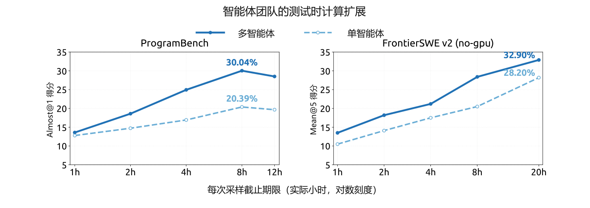

图 10｜ProgramBench（Almost@1）与 FrontierSWE v2（Mean@5）上，单智能体及多智能体配置的测试时计算扩展情况，以每次采样的实际时间截止期限为横轴。

需要干预时，只有主智能体可以通过 interrupt_agent 中断协作智能体当前轮次。所需工作全部完成后，主智能体审查并测试合并后的修改，给出最终响应。

**训练。**Agent Team 模式采用强化学习训练，其奖励结合任务表现、鼓励任务分派及智能体间通信的协作奖励，以及促进高效协调的推导延迟惩罚。推导延迟的计算方法是：将执行事件及其协作依赖表示为有向无环图（DAG），按固定预填充／解码速率下的 token 数量加上实测工具执行时间分配成本，再取关键路径长度。这既鼓励有益的并行，也惩罚不必要的串行工作与同步，并降低对服务端批处理和排队延迟的敏感性。

**性能。**我们从 ProgramBench（Yang et al., 2026）构建高置信度子集，仅保留参考解法在隐藏测试集上通过率至少为 95% 的任务，筛选后得到 172 个“黄金”任务。我们还评测 FrontierSWE v2（Kondra et al., 2026），它是 FrontierSWE 规模更大、更具挑战性的后继版本，采用了显著改进的方法。我们从当前公开任务中排除需要 GPU 访问的任务，构建无 GPU 子集。在两个基准上，均设定明确的每次采样实际时间截止期限，评估单智能体和多智能体配置。这里报告的是初步结果：比较观测到的最强多智能体配置与可用的最强单智能体基线。在 ProgramBench 上，每任务最多运行三次采样，每种配置计划运行 516 次。报告 Almost@1，即单次采样得分至少为 0.95 的比例。FrontierSWE v2 报告 Mean@5。ProgramBench 的截止期限从 1 小时到 12 小时，FrontierSWE v2 从 1 小时到 20 小时。在每个截止期限处，以届时已有的输出计算指标。

如图 10 所示，在两个基准的所有截止期限下，多智能体配置均优于对应单智能体配置。在 ProgramBench 上，多智能体的 Almost@1 从 1 小时的 13.59% 提高至 8 小时的峰值 30.04%，单智能体对应结果为 12.79% 和 20.39%。在 FrontierSWE v2 上，多智能体的 Mean@5 从 1 小时的 13.50% 提高至 20 小时的 32.90%，单智能体则从 10.50% 提高至 28.20%。

## 6. 结论、局限性与未来方向

本文提出 DeepSeek-V4.1-Flash，一种支持最长一百万 token 上下文的多模态混合专家（MoE）模型。通过联合优化模型架构、缓存精度与部署策略，DeepSeek-V4.1-Flash 进一步探索了 KV 缓存压缩的极限。其因果编码器—解码器（CED）架构使预填充阶段每 token 仅激活 8B 参数，解码阶段则激活 16B 参数，提高了输入占比较高的智能体工作负载的成本效率。在相同序列长度下，压缩稀疏注意力 2（CSA2）的跨层 KV 缓存复用与 FP4 KV 缓存，将全局 KV 缓存占用（始终驻留 HBM）降至每 token 890 字节，约为 DeepSeek-V4-Flash 对应占用的 1/4。SWA 有界重放进一步将持久化 KV 缓存占用（始终存储于 SSD 或主机内存）降至 DeepSeek-V4-Flash 的约 1/8。这些压缩缓解了 HBM 与 SSD 容量压力，同时模型整体表现显著优于 DeepSeek-V4-Flash。尽管参数规模显著小于 GLM-5.3 和 Kimi-K3 等同期开源模型，DeepSeek-V4.1 在关键基准中仍取得相当的表现，并在若干任务上更胜一筹。

相较 DeepSeek-V4-Flash，DeepSeek-V4.1-Flash 显著简化了若干架构组件，但新引入的架构变化也带来了尚未完全刻画的稳健性边界。内部评测覆盖多样化测试用例和边界条件，在已评估设置下未发现模型能力的系统性下降。不过，任何有限测试集都无法覆盖全部极端输入与部署条件。CSA2 潜在的选择错误，以及 SWA 有界重放中的近似状态重建，仍可能在未经测试的边界情形中导致能力下降。未来，我们将继续扩展压力测试和评测体系，尤其关注长上下文稀疏检索，以及缓存恢复边界处的 SWA 状态重建。同时，监测真实工作负载，系统刻画潜在失效模式与稳健性边界，进一步提升模型在极端条件下的稳健性。

随着 AI 模型能力取得显著进步，标准评测基准日益趋于饱和。尽管 DeepSeek-V4.1-Flash 的性能已接近 Fable-5 和 GPT-6 Astra 等顶尖模型，在日常应用中提供高度相近的用户体验，但在最具挑战性的任务上仍存在差距。基准分数差距较小，并不意味着模型在复杂、高难度推理及边界情形中，已达到领先闭源系统的前沿能力。

因此，我们将持续更新评测协议，以严格评估最先进推理能力的边界。在继续降低模型成本的同时，我们认为，模型智能的进一步进步取决于数据、模型容量与强化学习的协同扩展。以 DeepSeek-V4.1-Flash 为新起点，我们将继续探索模型能力极限，系统应对大规模数据合成与强化学习规模扩展中的关键挑战。我们也将积极结合模型与运行框架的协同设计，使联合系统一同演进、共同优化。通过同步推进成本降低与能力扩展，我们希望让高能力智能体更易获得、更易部署，进一步降低各行各业及更多场景采用 AI 技术的门槛。

## 参考文献

J. Ainslie, J. Lee-Thorp, M. de Jong, Y. Zemlyanskiy, F. Lebrón, and S. Sanghai. GQA：从多头检查点训练广义多查询 Transformer 模型。 <u>arXiv 预印本</u> <u>arXiv:2305.13245</u>, 2023.

E. Alvarez, O. Almog, E. Chung, S. Layton, D. Stosic, R. Krashinsky, and K. Aubrey. NVFP4：实现高效、准确的低精度推理, 2025. URL https://developer.nvidia.com/blog/introducing-nvfp4-for-efficient-and-accurate-low-precision-inference/.

Anomaly. Opencode. https://github.com/anomalyco/opencode, 2026.

Anthropic. Claude code. https://code.claude.com/docs/en/overview, 2026.

Y. Bai, S. Tu, J. Zhang, H. Peng, X. Wang, X. Lv, S. Cao, J. Xu, L. Hou, Y. Dong, et al. LongBench v2：面向真实长上下文多任务的深度理解与推理。 In <u>Proceedings of the 63rd Annual Meeting of the Association for Computational Linguistics</u> <u>(Volume 1: Long Papers)</u>, pages 3639–3664, 2025.

Y. Bai, Q. Dong, T. Jiang, X. Lv, Z. Du, A. Zeng, J. Tang, and J. Li. IndexCache：通过跨层索引复用加速稀疏注意力。 <u>arXiv 预印本 arXiv:2603.12201</u>, 2026.

W. Brandon, M. Mishra, A. Nrusimha, R. Panda, and J. Ragan-Kelley. 利用跨层注意力缩减 Transformer 的键值缓存。 In A. Globerson, L. Mackey, D. Belgrave, A. Fan, U. Paquet, J. Tomczak, and C. Zhang, editors, <u>Advances in Neural Information Processing</u> <u>Systems</u>, volume 37, pages 86927–86957. Curran Associates, Inc., 2024. doi: 10.52202/079017-2758. URL https://proceedings.neurips.cc/paper_files/paper/2024/file/9e23d020c18e4c40d81c6a0fc7a46f68-Paper-Conference.pdf.

L. Chen, D. Xu, C. An, X. Wang, Y. Zhang, J. Chen, Z. Liang, F. Wei, J. Liang, Y. Xiao, et al. PowerAttention：通过感受野的指数扩展实现有效稀疏注意力。 <u>arXiv</u> 预印本 arXiv:2503.03588, 2025.

L. Chen, W. Xie, Y. Liang, H. He, H. Zhao, Z. Yang, Z. Huang, H. Wu, H. Lu, Y. Bao, et al. BabyVision：超越语言的视觉推理。 <u>arXiv 预印本 arXiv:2601.06521</u>, 2026.

M. Chen, J. Tworek, H. Jun, Q. Yuan, H. P. de Oliveira Pinto, J. Kaplan, H. Edwards, Y. Burda, N. Joseph, G. Brockman, A. Ray, R. Puri, G. Krueger, M. Petrov, H. Khlaaf, G. Sastry, P. Mishkin, B. Chan, S. Gray, N. Ryder, M. Pavlov, A. Power, L. Kaiser, M. Bavarian, C. Winter, P. Tillet, F. P. Such, D. Cummings, M. Plappert, F. Chantzis, E. Barnes, A. Herbert-Voss, W. H. Guss, A. Nichol, A. Paino, N. Tezak, J. Tang, I. Babuschkin, S. Balaji, S. Jain, W. Saunders, C. Hesse, A. N. Carr, J. Leike, J. Achiam, V. Misra, E. Morikawa, A. Radford, M. Knight, M. Brundage, M. Murati, K. Mayer, P. Welinder, B. McGrew, D. Amodei, S. McCandlish, I. Sutskever, and W. Zaremba. 评估基于代码训练的大语言模型。 <u>CoRR</u>, abs/2107.03374, 2021. URL https://arxiv.org/abs/2107.03374.

X. Cheng, X. Yu, C. Shao, J. Li, Y. Xiong, Y. Qian, J. Zhu, S. Ma, X. Zhang, J. Ye, et al. DSpark：基于置信度调度、结合半自回归生成的推测解码。 <u>arXiv</u> 预印本 arXiv:2607.05147, 2026a.

X. Cheng, W. Zeng, D. Dai, Q. Chen, B. Wang, Z. Xie, K. Huang, X. Yu, Z. Hao, Y. Li, H. Zhang, H. Zhang, D. Zhao, and W. Liang. 通过可扩展查找实现条件记忆： 大语言模型稀疏性的新维度。 <u>CoRR</u>, abs/2601.07372, 2026b. doi: 10.48550/ARXIV.2601.07372. URL https://doi.org/10.48550/arXiv.2601.07372.

X. Cheng, W. Zeng, D. Dai, Q. Chen, B. Wang, Z. Xie, K. Huang, X. Yu, Z. Hao, H. Zhang, et al. 通过可扩展查找实现条件记忆：大语言模型稀疏性的新维度。 In <u>Proceedings of the 64th Annual Meeting of the Association for Computational Linguistics</u> <u>(Volume 1: Long Papers)</u>, pages 4968–4990, 2026c.

K. Cobbe, V. Kosaraju, M. Bavarian, M. Chen, H. Jun, L. Kaiser, M. Plappert, J. Tworek, J. Hilton, R. Nakano, et al. 训练验证器以求解数学应用题。 <u>arXiv 预印本</u> <u>arXiv:2110.14168</u>, 2021.

D. Dai, C. Deng, C. Zhao, R. X. Xu, H. Gao, D. Chen, J. Li, W. Zeng, X. Yu, Y. Wu, Z. Xie, Y. K. Li, P. Huang, F. Luo, C. Ruan, Z. Sui, and W. Liang. DeepSeekMoE：迈向混合专家语言模型的极致专家专门化。 <u>CoRR</u>, abs/2401.06066, 2024. URL https://doi.org/10.48550/arXiv.2401.06066.

DataCurve. Deepswe v1.1, 2026. URL https://deepswe.datacurve.ai/.

DeepSeek-AI. DeepSeek-V3 技术报告。 <u>CoRR</u>, abs/2412.19437, 2024. URL https://doi.org/10.48550/arXiv.2412.19437.

DeepSeek-AI. DeepSeek-V2：强大、经济、高效的混合专家语言模型。 <u>CoRR</u>, abs/2405.04434, 2024. URL https://doi.org/10.48550/arXiv.2405.04434.

DeepSeek-AI. DeepSeek-V3.2：拓展开放大语言模型的前沿, 2025. URL https://arxiv.org/abs/2512.02556.

DeepSeek-AI. DeepSeek Harness：一切皆插件。 https://github.com/deepseek-ai/deepseek-harness, 2026a.

DeepSeek-AI. DeepSeek-V4：迈向高效的百万 token 上下文智能。 <u>CoRR</u>, abs/2606.19348, 2026b. URL https://doi.org/10.48550/arXiv.2606.19348.

J. Dekoninck, N. Jovanovi´c, I. Petrov, and M. Vechev. MathArena Apex：尚未攻克的最终答案型问题, 2025. URL https://matharena.ai/apex/.

S. Deng, Z. Ouyang, T. Pang, Z. Liu, R. Jin, S. Yu, and Y. Yang. RMNP：用于可扩展矩阵优化的行级动量归一化预条件处理。 <u>arXiv 预印本 arXiv:2603.20527</u>, 2026.

J. Ding, S. Long, C. Pu, H. Zhou, H. Gao, X. Gao, C. He, Y. Hou, F. Hu, Z. Li, et al. NL2Repo-Bench：面向编程智能体的长程代码仓库生成评估。 <u>arXiv 预印本</u> <u>arXiv:2512.12730</u>, 2025.

A. Dosovitskiy, L. Beyer, A. Kolesnikov, D. Weissenborn, X. Zhai, T. Unterthiner, M. Dehghani, M. Minderer, G. Heigold, S. Gelly, J. Uszkoreit, and N. Houlsby. 一幅图像相当于 16×16 个词：用于大规模图像识别的 Transformer。 In <u>International Conference on Learning</u> <u>Representations</u>, 2021. URL https://openreview.net/forum?id=YicbFdNTTy.

X. Du, Y. Yao, K. Ma, B. Wang, T. Zheng, K. Zhu, M. Liu, Y. Liang, X. Jin, Z. Wei, et al. SuperGPQA：将大语言模型评估扩展至 285 个研究生学科。 <u>arXiv 预印本 arXiv:2502.14739</u>, 2025.

D. Dua, Y. Wang, P. Dasigi, G. Stanovsky, S. Singh, and M. Gardner. DROP：需要对段落进行离散推理的阅读理解基准。 In J. Burstein, C. Doran, and T. Solorio, editors, <u>Proceedings of the 2019 Conference of the North American Chapter of the</u> <u>Association for Computational Linguistics: Human Language Technologies, NAACL-HLT</u> <u>2019, Minneapolis, MN, USA, June 2-7, 2019, Volume 1 (Long and Short Papers)</u>, pages 2368– 2378. Association for Computational Linguistics, 2019. doi: 10.18653/V1/N19-1246. URL https://doi.org/10.18653/v1/n19-1246.

Y. Gao, J. Wei, Q. Zhang, Y. Cheng, S. Chen, Z. Tang, Z. Jiang, Y. Song, H. Zhang, L. Zhao, B. Yang, G. Wang, S. Cao, and F. Luo. HySparse：结合理想 token 选择与 KV 缓存共享的混合稀疏注意力架构。 <u>arXiv 预印本 arXiv:2602.03560</u>, 2026.

S. Garre, C. Mutty, S. Mehta, and E. Chen. Chartography：专业图表理解基准。 <u>arXiv 预印本 arXiv:2608.10677</u>, 2026.

A. Glentis, J. Li, A. Han, and M. Hong. 通过极简优化器设计实现内存高效的大语言模型预训练。 <u>arXiv 预印本 arXiv:2506.16659</u>, 2025.

Y. Gu, L. Dong, F. Wei, and M. Huang. MiniLLM：大语言模型的知识蒸馏。 In <u>The Twelfth International Conference on Learning Representations</u>, 2024.

L. Haas, G. Yona, G. D’Antonio, S. Goldshtein, and D. Das. SimpleQA Verified：用于衡量参数化知识的可靠事实性基准。 <u>arXiv 预印本 arXiv:2509.07968</u>, 2025.

D. Hendrycks, C. Burns, S. Kadavath, A. Arora, S. Basart, E. Tang, D. Song, and J. Steinhardt. 使用 MATH 数据集衡量数学问题求解能力。 <u>arXiv 预印本 arXiv:2103.03874</u>, 2021.

Y. Huang, Y. Bai, Z. Zhu, J. Zhang, J. Zhang, T. Su, J. Liu, C. Lv, Y. Zhang, J. Lei, et al. C-Eval：面向基础模型的多层次、多学科中文评测套件。 <u>arXiv 预印本</u> <u>arXiv:2305.08322</u>, 2023.

D. Hupkes and N. Bogoychev. MultiLoKo：覆盖 31 种语言的大语言模型多语言本地知识基准。 <u>CoRR</u>, abs/2504.10356, 2025. doi: 10.48550/ARXIV.2504.10356. URL https://doi.org/10.48550/arXiv.2504.10356.

B. Jacob, S. Kligys, B. Chen, M. Zhu, M. Tang, A. Howard, H. Adam, and D. Kalenichenko. 面向高效纯整数运算推理的神经网络量化与训练。 In <u>Proceedings of the IEEE Conference on Computer Vision and Pattern Recognition (CVPR)</u>, June 2018.

K. Jordan, Y. Jin, V. Boza, J. You, F. Cesista, L. Newhouse, and J. Bernstein. Muon：用于神经网络隐藏层的优化器。 <u>Cited on</u>, page 10, 2024.

M. Kazemi, B. Fatemi, H. Bansal, J. Palowitch, C. Anastasiou, S. V. Mehta, L. K. Jain, V. Aglietti, D. Jindal, Y. P. Chen, et al. Big-bench extra hard. In <u>Proceedings of the 63rd Annual Meeting of</u> <u>the Association for Computational Linguistics (Volume 1: Long Papers)</u>, pages 26473–26501, 2025.

S. Kazemzadeh, V. Ordonez, M. Matten, and T. Berg. ReferItGame：自然场景照片中的物体指代。 In <u>Proceedings of the 2014 conference on empirical methods</u> <u>in natural language processing (EMNLP)</u>, pages 787–798, 2014.

R. Kondra, S. Mhatre, A. Kumar, E. Chu, B. B. Ahmad, A. Nangia, R. Agarwal, A. Dasgupta, A. Sinha, B. Sridharan, K. Dave, B. Graham, G. Song, A. Rahul, W. H. Lim, A. Thangamuthu, R. Singh, D. Liu, N. Pour, C. Chen, and J. Mattern. Frontierswe v2. <u>Proximal Blog</u>, 2026. https://frontierswe.com/blog/v2.

H. Lee, J. Liu, D. Kim, W. Xia, Z. Zhang, C. S. Xia, and L. Zhang. SEC-bench Pro：语言模型能否解决长程软件安全任务？ <u>arXiv 预印本 arXiv:2605.26548</u>, 2026.

J. Li and S. Liu. FlashMLA：高效的多头潜在注意力内核。 https://github.com/deepseek-ai/FlashMLA, 2025.

J. Liu, J. Su, X. Yao, Z. Jiang, G. Lai, Y. Du, Y. Qin, W. Xu, E. Lu, J. Yan, Y. Chen, H. Zheng, Y. Liu, S. Liu, B. Yin, W. He, H. Zhu, Y. Wang, J. Wang, M. Dong, Z. Zhang, Y. Kang, H. Zhang, X. Xu, Y. Zhang, Y. Wu, X. Zhou, and Z. Yang. Muon 可扩展至大语言模型训练。 <u>CoRR</u>, abs/2502.16982, 2025. URL https://doi.org/10.48550/arXiv.2502.16982.

I. Loshchilov and F. Hutter. 解耦权重衰减正则化。 In <u>International Conference</u> <u>on Learning Representations</u>, 2019. URL https://openreview.net/forum?id=Bkg6RiCqY7.

K. Lu and T. M. Lab. 同策略蒸馏。 <u>Thinking Machines Lab: Connectionism</u>, 2025. doi: 10.64434/tml.20251026. https://thinkingmachines.ai/blog/on-policy-distillation.

J. Mao, J. Huang, A. Toshev, O. Camburu, A. L. Yuille, and K. Murphy. 无歧义物体描述的生成与理解。 In <u>Proceedings of the IEEE conference</u> <u>on computer vision and pattern recognition</u>, pages 11–20, 2016.

A. Marafioti, O. Zohar, M. Farré, M. Noyan, E. Bakouch, P. Cuenca, C. Zakka, L. B. Allal, A. Lozhkov, N. Tazi, V. Srivastav, J. Lochner, H. Larcher, M. Morlon, L. Tunstall, L. von Werra, and T. Wolf. SmolVLM：重新定义小型、高效的多模态模型。 <u>arXiv 预印本</u> <u>arXiv:2504.05299</u>, 2025.

R. Marten, A. Shaw, I. Bercovich, B. Droste, T. Cerruti, S. Dillmann, R. Wang, D. Wahdany, A. Hart, K. Krauth, ScaleAI, Snorkel AI, Turing, gNucleus AI, Boolean AI, N. Carlini, S. Lyu, A. Wei, A. Khatua, B. Plüster, C. Dwivedi, C. Sutcliffe, Yuming, D. Tivris, D. Wang, H. W. Goh, H. Xing, H. Lin, I. Salia, J. Seol, J. Bao, J. Ouyang, J. Park, L. Walsh, L. Kong, M. Ivanov, M. Ubl, M. Liamets, O. Menis, P. Migdal, Q. Bao, R. Movva, R. Ben Chaim, N. Srinath, S. Bogdanik, S. Yadav, S. Benjamin, T. Kung, W. Hughes, X. Lan, H. Gupta, S. Mishra, C. Wang, H. He, J. Tu, K. Montgomery, Z. Tu, A. Naik, D. Mortensen, I. Zhang, Y. Mathur, E. Liu, K. Singh, M. Yu, S. Feng, V. Gangal, Z. Tao, S. Ruan, J. Mueller, J. Cabezas, J. Bauer, K. X. Li, R. Zhang, A. Feller, A. Madayan, L. Chen, B. Feuer, X. Li, B. Li, H. Raj, S. Galler, L. Shi, I. Segal, K. Buchanan, S. P., R. Desai, A. Schneider, C. Settles, X. Lin, M. Nezhurina, A. Wang, M. Kowalczyk, J.-X. Zhao, S. Satia, J. Hu, S. Atef, K. Chen, S. Vance, G. Segato, J. Jitsev, A. Dimakis, M. Merrill, A. Konwinski, and L. Schmidt. Terminal-Bench, Aug. 2026a. URL https://github.com/harbor-framework/terminal-bench.

R. Marten, A. Shaw, A. Konwinski, and Terminal-Bench Contributors. Terminal-Bench 3.0：以更难的任务推动更强的智能体。 https://www.tbench.ai/news/terminal-bench-3-0, 2026b. 面向终端环境中智能体工作的开放基准。

M. Mathew, D. Karatzas, and C. Jawahar. DocVQA：文档图像视觉问答数据集。 In <u>2021 IEEE Winter Conference on Applications of Computer Vision (WACV)</u>, pages 2199–2208. IEEE, 2021. M. A. Merrill, A. G. Shaw, N. Carlini, B. Li, H. Raj, I. Bercovich, L. Shi, J. Y. Shin, T. Walshe, E. K. Buchanan, et al. Terminal-Bench：在命令行界面中的困难真实任务上评测智能体。 <u>arXiv 预印本 arXiv:2601.11868</u>, 2026.

V. K. Nagaraja, V. I. Morariu, and L. S. Davis. 通过建模物体间的上下文理解指代表达。 In <u>European conference on computer vision</u>, pages 792–807. Springer, 2016.

Y. Nesterov. 一种收敛率为 O(1/k²) 的凸规划问题求解方法。 <u>Soviet Mathematics Doklady</u>, 27:372–376, 1983.

OpenAI. gpt-oss-120b 与 gpt-oss-20b 模型卡。 <u>CoRR</u>, abs/2508.10925, 2025. doi: 10.48550/ARXIV.2508.10925. URL https://doi.org/10.48550/arXiv.2508.10925.

OpenAI. Codex. https://github.com/openai/codex, 2026.

L. Phan, A. Gatti, Z. Han, N. Li, J. Hu, H. Zhang, C. B. C. Zhang, M. Shaaban, J. Ling, S. Shi, et al. 人类最后的考试。 <u>arXiv 预印本 arXiv:2501.14249</u>, 2025.

Y. Qian, S. Liu, and Y. Li. DeepSelect：面向 DeepSeek 稀疏注意力与采样的高性能 Top-K 内核。 https://github.com/deepseek-ai/DeepSelect, 2026.

D. Rein, B. L. Hou, A. C. Stickland, J. Petty, R. Y. Pang, J. Dirani, J. Michael, and S. R. Bowman. GPQA：研究生水平、难以通过谷歌搜索解答的问答基准。 <u>arXiv 预印本 arXiv:2311.12022</u>, 2023.

J. Roberts, M. R. Taesiri, A. Sharma, A. Gupta, S. Roberts, I. Croitoru, S.-V. Bogolin, J. Tang, F. Langer, V. Raina, et al. ZeroBench：当代大型多模态模型无法攻克的视觉基准。 <u>arXiv 预印本 arXiv:2502.09696</u>, 2025.

B. D. Rouhani, R. Zhao, A. More, M. Hall, A. Khodamoradi, S. Deng, D. Choudhary, M. Cornea, E. Dellinger, K. Denolf, S. Dusan, V. Elango, M. Golub, A. Heinecke, P. James-Roxby, D. Jani, G. Kolhe, M. Langhammer, A. Li, L. Melnick, M. Mesmakhosroshahi, A. Rodriguez, M. Schulte, R. Shafipour, L. Shao, M. Siu, P. Dubey, P. Micikevicius, M. Naumov, C. Verrilli, R. Wittig, D. Burger, and E. Chung. 面向深度学习的微缩放数据格式, 2023.

M. Scetbon, C. Ma, W. Gong, and E. Meeds. 用于高效大语言模型训练的梯度多重归一化。 In <u>The Thirty-ninth Annual Conference on Neural Information Processing Systems</u>, 2025. URL https://openreview.net/forum?id=oanhUGY6un.

N. Shazeer. GLU 变体改进 Transformer。 <u>arXiv 预印本 arXiv:2002.05202</u>, 2020.

N. Shazeer and M. Stern. Adafactor：以次线性内存开销实现自适应学习率。 In <u>International conference on machine learning</u>, pages 4596–4604. PMLR, 2018.

D. Shepard and R. Salimans. Automationbench. <u>arXiv 预印本 arXiv:2604.18934</u>, 2026.

F. Shi, M. Suzgun, M. Freitag, X. Wang, S. Srivats, S. Vosoughi, H. W. Chung, Y. Tay, S. Ruder, D. Zhou, D. Das, and J. Wei. 语言模型是多语言思维链推理器。 In <u>The Eleventh International Conference on Learning Representations, ICLR 2023, Kigali,</u> <u>Rwanda, May 1-5, 2023</u>. OpenReview.net, 2023. URL https://openreview.net/forum?id=fR3wGCk-IXp.

Y. Sun, L. Dong, Y. Zhu, S. Huang, W. Wang, S. Ma, Q. Zhang, J. Wang, and F. Wei. 只需缓存一次：面向语言模型的解码器—解码器架构。 <u>Advances in Neural Information</u> <u>Processing Systems</u>, 37:7339–7361, 2024.

Y. Sun, X. Han, W. Zhang, Y. Pang, T. Wang, Y. Cao, Y. Huang, C. Duroiu, H. Zhang, J. Lin, et al. 智能体最后的考试。 <u>arXiv 预印本 arXiv:2606.05405</u>, 2026a.

Y. Sun, Y. Zhang, L. Dong, J. Wang, and F. Wei. 只需索引一次：共享路由的跨层稀疏注意力。 <u>arXiv 预印本 arXiv:2606.06467</u>, 2026b.

M. Suzgun, N. Scales, N. Schärli, S. Gehrmann, Y. Tay, H. W. Chung, A. Chowdhery, Q. V. Le, E. H. Chi, D. Zhou, et al. 具有挑战性的 BIG-Bench 任务，以及思维链能否解决这些任务。 <u>arXiv 预印本 arXiv:2210.09261</u>, 2022.

K. Team, T. Bai, Y. Bai, Y. Bao, J. Cai, X. Cai, P. Cao, Y. Cao, Z. Chai, Y. Charles, et al. Kimi K3：开放的前沿智能。 <u>arXiv 预印本 arXiv:2607.24653</u>, 2026a.

K. Team, T. Bai, Y. Bai, Y. Bao, S. Cai, Y. Cao, Z. Chai, Y. Charles, H. Che, C. Chen, et al. Kimi K2.5：视觉智能体智能。 <u>arXiv 预印本 arXiv:2602.02276</u>, 2026b.

M. L. Team, B. Wang, B. Xiao, B. Zhang, B. Rong, B. Chen, C. Wan, C. Zhang, C. Huang, C. Chen, et al. LongCat-Flash-Omni 技术报告。 <u>arXiv 预印本 arXiv:2511.00279</u>, 2025.

S. Tong, E. Brown, P. Wu, S. Woo, M. Middepogu, S. C. Akula, J. Yang, S. Yang, A. Iyer, X. Pan, A. Wang, R. Fergus, Y. LeCun, and S. Xie. Cambrian-1：完全开放、以视觉为中心的多模态大语言模型探索, 2024.

L. Wang, H. Gao, C. Zhao, X. Sun, and D. Dai. 无需辅助损失的混合专家负载均衡策略。 <u>CoRR</u>, abs/2408.15664, 2024a. URL https://doi.org/10.48550/arXiv.2408.15664.

X. Wang, C. Xu, H. Cao, R. Tian, W. Zhao, K. Yu, and C. Zhao. Tilekernels. https://github.com/deepseek-ai/TileKernels, 2026a.

Y. Wang, X. Ma, G. Zhang, Y. Ni, A. Chandra, S. Guo, W. Ren, A. Arulraj, X. He, Z. Jiang, T. Li, M. Ku, K. Wang, A. Zhuang, R. Fan, X. Yue, and W. Chen. MMLU-Pro：更稳健、更具挑战性的多任务语言理解基准。 <u>CoRR</u>, abs/2406.01574, 2024b. URL https://doi.org/10.48550/arXiv.2406.01574.

Z. Wang, N. Schiller, H. Li, S. S. Narayana, M. Nasr, N. Carlini, X. Qi, E. Wallace, E. Bursztein, L. Invernizzi, et al. ExploitGym：AI 智能体能否将安全漏洞转化为真实攻击？ <u>arXiv 预印本 arXiv:2605.11086</u>, 2026b.

Z. Wang, T. Shi, J. He, M. Cai, J. Zhang, and D. Song. CyberGym：大规模评估 AI 智能体在真实世界中的网络安全能力。 In <u>International Conference on Learning Representations</u>, volume 2026, pages 123341–123386, 2026c.

Z. Wen, Y. Shi, J. Wang, P. Luo, L. Qiao, D. Li, and T. Sun. SRON：通过逐行梯度归一化实现无状态大语言模型训练。 2025.

Z. Xie, Y. Wei, H. Cao, C. Zhao, C. Deng, J. Li, D. Dai, H. Gao, J. Chang, K. Yu, L. Zhao, S. Zhou, Z. Xu, Z. Zhang, W. Zeng, S. Hu, Y. Wang, J. Yuan, L. Wang, and W. Liang. mHC：流形约束超连接, 2026. URL https://arxiv.org/abs/2512.24880.

R. Xu, J. Li, and Y. Lu. 矩阵算子范数下神经网络优化器的宽度缩放规律 I：行／列归一化与超参数迁移。 <u>arXiv 预印本 arXiv:2603.09952</u>, 2026a.

Y. Xu, F. Meng, F. Jiang, Y. Wang, R. Zhou, Z. Wang, J. Wu, Z. Pan, X. Tang, W. Pei, et al. HiSA：用于细粒度稀疏注意力的高效分层索引。 <u>arXiv 预印本 arXiv:2603.28458</u>, 2026b.

J. Yang, C. E. Jimenez, A. Wettig, K. Lieret, S. Yao, K. R. Narasimhan, and O. Press. SWE-agent：通过智能体—计算机接口实现自动化软件工程。 In <u>The Thirty-eighth</u> <u>Annual Conference on Neural Information Processing Systems</u>, 2024. URL https://arxiv.org/abs/2405.15793.

J. Yang, K. Lieret, J. Ma, P. Thakkar, D. Pedchenko, S. Sootla, E. McMilin, P. Yin, R. Hou, G. Synnaeve, D. Yang, and O. Press. ProgramBench：语言模型能否从零重建程序？, 2026. URL https://arxiv.org/abs/2605.03546.

L. Yu, P. Poirson, S. Yang, A. C. Berg, and T. L. Berg. 对指代表达中的上下文进行建模。 In <u>European conference on computer vision</u>, pages 69–85. Springer, 2016.

J. Yuan, J. Zou, S. Wang, Y. Liu, and F. Nie. NORA：面向可扩展矩阵优化器的归一化正交行对齐。 <u>arXiv 预印本 arXiv:2605.03769</u>, 2026.

X. Yue, T. Zheng, Y. Ni, Y. Wang, K. Zhang, S. Tong, Y. Sun, B. Yu, G. Zhang, H. Sun, et al. MMMU-Pro：更稳健的多学科多模态理解基准。 In <u>Proceedings of</u> <u>the 63rd Annual Meeting of the Association for Computational Linguistics (Volume 1: Long</u> <u>Papers)</u>, pages 15134–15186, 2025.

M. Zechner. Pi：可按需定制的编程智能体运行框架。 https://github.com/earendil-works/pi, 2026.

R. Zellers, A. Holtzman, Y. Bisk, A. Farhadi, and Y. Choi. HellaSwag：机器真的能补完你的句子吗？ In A. Korhonen, D. R. Traum, and L. Màrquez, editors, <u>Proceedings of the 57th</u> <u>Conference of the Association for Computational Linguistics, ACL 2019, Florence, Italy, July</u> <u>28- August 2, 2019, Volume 1: Long Papers</u>, pages 4791–4800. Association for Computational Linguistics, 2019. doi: 10.18653/v1/p19-1472. URL https://doi.org/10.18653/v1/p19-1472.

A. Zeng, X. Lv, Z. Hou, Z. Du, Q. Zheng, B. Chen, D. Yin, C. Ge, C. Huang, C. Xie, et al. GLM-5：从氛围编程迈向智能体工程。 <u>arXiv 预印本 arXiv:2602.15763</u>, 2026.

X. Zhai, B. Mustafa, A. Kolesnikov, and L. Beyer. 用于语言—图像预训练的 Sigmoid 损失。 In <u>2023 IEEE/CVF International Conference on Computer Vision (ICCV)</u>, pages 11941–11952. IEEE, 2023.

B. Zhang and R. Sennrich. 均方根层归一化。 <u>Advances in neural</u> <u>information processing systems</u>, 32, 2019.

Y. Zhang. 神经网络优化器背后的原理。 <u>arXiv 预印本 arXiv:2608.16760</u>, 2026.

Y. Zhang, C. Chen, T. Ding, Z. Li, R. Sun, and Z.-Q. Luo. Transformer 为什么需要 Adam：Hessian 矩阵视角。 <u>Advances in neural information processing systems</u>, 37:131786–131823, 2024.

Y. Zhang, C. Chen, Z. Li, T. Ding, C. Wu, D. D. Kingma, Y. Ye, Z.-Q. Luo, and R. Sun. Adam-mini：用更少的学习率获得更多收益。 In <u>International Conference on Learning</u> <u>Representations</u>, volume 2025, pages 28033–28063, 2025a.

Z. Zhang, Y. Zhong, Y. Jiang, H. Hu, J. Sun, Z. Ge, Y. Zhu, D. Jiang, and X. Jin. DistTrain：通过解耦训练应对多模态大语言模型中的模型与数据异构性。 In <u>Proceedings of the ACM SIGCOMM 2025 Conference</u>, pages 24–38, 2025b.

C. Zhao, L. Zhao, J. Li, Z. Xu, and C. Xu. DeepGEMM：支持细粒度缩放、简洁高效的 FP8 GEMM 内核。 https://github.com/deepseek-ai/DeepGEMM, 2025.

W. Zhong, R. Cui, Y. Guo, Y. Liang, S. Lu, Y. Wang, A. Saied, W. Chen, and N. Duan. AGIEval：以人为中心的基础模型评测基准。 <u>CoRR</u>, abs/2304.06364, 2023. doi: 10.48550/arXiv.2304.06364. URL https://doi.org/10.48550/arXiv.2304.06364.

T. Y. Zhuo, M. C. Vu, J. Chim, H. Hu, W. Yu, R. Widyasari, I. N. B. Yusuf, H. Zhan, J. He, I. Paul, S. Brunner, C. Gong, J. Hoang, A. R. Zebaze, X. Hong, W. Li, J. Kaddour, M. Xu, Z. Zhang, P. Yadav, and et al. BigCodeBench：利用多样的函数调用和复杂指令评测代码生成。 In <u>The Thirteenth International Conference on Learning</u> <u>Representations, ICLR 2025, Singapore, April 24-28, 2025</u>. OpenReview.net, 2025. URL https://openreview.net/forum?id=YrycTjllL0.

## 附录

## A. 作者名单

作者按名字的字母顺序排列。姓名后的 * 表示已离开本团队的人员。

研究与工程： Anyi Xu, B. Li, Bangcai Lin, Bing Xue, BingCheng Xian, Bingzheng Xu, Bochao Wu, Bowei Zhang, Boyi Deng, C.C. Yu, Chao Jin, Chaofan Lin, Chen Dong, Chenbing Wang, Chenfan Feng, Chengda Lu\*, Chenggang Zhao, Chengqi Deng, Chengyuan Zhang, Chenhao Xu, Chenqi Zhao, Chenze Shao, Chuhao Wang, Chuqi Zhang, Damai Dai, Dejian Yang, Deli Chen, Di Huang, Di Wu, Donghao Li, Erhang Li, Eric Fu, F. Zhou, Fangwei Zhou, Fangyun Lin, Fangzhou Yuan, Feiyu Xia, Fucong Dai, Guangbo Hao, Guanglin Li, Guanting Chen\*, Guoai Cao, Guofan Fan, Guolai Meng, Guowei Li, Haichuan Zhang, Haiyang Ma, Haiyang Shen, Han Li, Han Yu, Han Zhang, Hangyuan Deng, Hanwei Xu, Hanxiang Xu, Hanxun Zhong, Hao Guo, Hao Jiang, Hao Li, Hao Qin, Haodong Wen, Haofen Liang, Haofeng Huang, Haohua Liu, Haoling Zhang, Haoming Luo, Haoran Yang, Haotian Xu\*, Haotian Yuan, Haoting Huang, Haowen Luo, Haoyang Cai, Haoyu Chen, Haozhe Ji, Hengran Zhang, Hengrui Wang, Hengxu Wu, Honghui Ding, Hongxuan Tang, Huadong Wang, Huanqi Cao, Huazuo Gao, Hui Qu, Hui Zeng, J. Yang, J.H. Jin, J.H. Zhang, J.X. Zou, Jia Yu, Jiahui Zhou, Jiajun Chen, Jialiang Huang, Jialin Zhao, Jiamin Tang, Jian Zhou, Jianan Tong, Jianwen Li, Jiaqi Zhu, Jiarui Wang, Jiasheng Ye, Jiashi Li, Jiaxin Xu, Jiaying Ding, Jibai Lu, Jiewen Hu, Jin Yan, Jincheng Zhai, Jingchang Chen, Jingcheng Hu, Jingli Zhou, Jingsheng Xu, Jingting Xiang, Jingyan Yun, Jingyang Yuan, Jingyuan Cheng, Jinhua Zhu, Jinpeng Wang, Jinyi Chen, Jinyi Hu, Jiping Yu, Jueliang Guo, Junbo Pei, Junbo Sun, Junguang Jiang, Junjie Qiu, Junkang Zhou, Junqi Liu, Junren Li, Junxian Li, Junxiao Song, Junyi Guo, Kai Dong, Kaifeng Chen, Kaige Gao, Kang Guan, Kangdong Yuan, Ke Hong, Ke Xu, Kefan Zhao, Kexin Ji, Kexin Zhang, Kexing Zhou, Kuai Yu, Lan Zhang, Lean Wang, Lecong Zhang, Lei Wang, Letian Gao, Liang Zhao, Liansheng Xu, Lihua Guo, Lingxiao Luo, Lingyue Fu, Litao Deng, Litong Wang, Liyue Zhang, Longhao Chen, Lu Chen, Luotian Huang, Luyao Ma, Luyao Wang, M.S. Di, Max Mei, Menghao Ye, Miao Cui, Mingchuan Zhang, Minghua Zhang\*, Minghui Tang, Mingjing Zhang, Mingqi Wei, Mingshu Chen, Mingxing Liu, Mingxu Zhou, Mingyu Xu, Mingyu Yang, Mingze Wang, Muyang Chen, Ni Shentu, Ning Wang, Niufang Ning, Panpan Huang, Peixin Cong, Peiyi Wang, Peiyuan Xin, Pengfei Ren, Pengfei Yan, Pengle Zhang, Qi Kang, Qi Tang, Qiancheng Wang, Qiang Li, Qihao Zhu, Qingyang Li, Qinyu Chen, Qiushi Du, Qizhou Guo, Rongxian Xu, Rui Ding, Rui Hu, Rui Tian, Rui Yu, Ruidong Zhu, Ruifan Xu, Ruihan Yang, Ruihang Xia, Ruijie Lu, Ruilin Geng, Ruipeng Hong, Ruiqi Ge, Ruisong Zhang, Ruize Sun, Ruizhe Pan, Runji Wang, Runqian Chen, Runxin Xu, Ruohong Tian, Ruomeng Shen, Ruoyu Zhang, Ryan X., S.H. Liu, Shanghao Lu, Shangyan Zhou, Shanhuang Chen, Shaofei Cai, Shaoheng Nie, Shaoyuan Chen, Shengding Hu, Shengkai Lin, Shengwen Ran, Shengyu Liu, Shengyuan Jia, Shi Bai, Shi Feng, Shicheng Xu, Shichun Liu, Shiqiang Hu\*, Shirong Ma, Shiyu Wang, Shiyuan Feng, Shufan Gong, Shuhan Lin, Shuiping Yu, Shunfeng Zhou, Shuo Yang, Shuomeng Wang, Shuting Guo, Shuting Pan, Shuying Yu, Sinuo Cao, Siyi Lin, Sizhe Chen, Songyang Chen, Songyang Zhou, Tao Ni, Tao Yun, Tian Jin, Tian Pei, Tian Ye, Tianle Lin, Tianran Ji\*, Tianyi Cui, Tianyuan Yue, Tingting Yu, Tongrui Xiong, Wangding Zeng, Wei Liu, Wei Zhang, Weibin Xu, Weihao Zeng, Weilin Zhao, Wen Liu, Wenfeng Liang, Wenjie Pang, Wenjing Luo, Wenjing Yao\*, Wenjun Gao, Wenkai Shao, Wenkai Yang, Wenli Zhang, Wenlu Wang, Wenlve Huang, Wenqian Yan, Wentao Zhang, Xi Gao, Xiang He, Xiang Li, Xiangli Li, Xiangwen Wang, Xiangying Zhang, Xiankui Wei, Xiao Bi, Xiaodong Liu, Xiaohan Wang, Xiaojian Qu, Xiaokang Chen, Xiaokang Zhang, Xiaotao Nie, Xiaoyao Zou, Xiaoyuan Li, Xicheng Guo, Xieting Chu, Xin Cheng, Xin Liu, Xin Xie, Xinbo Xu, Xingchao Liu, Xingchen Liu, Xingkai Yu, Xingyou Li, Xintong Yao, Xinyang Chen, Xinyong Jiang, Xinyu Yang, Xinyu Yang, Xu Chen, Xuanyu Wang, Xubei Zhong, Xuecheng Su, Xuejie Liu, Xuheng Lin, Xujie Fan, Xuncheng Zhao, Xuwei Fu, Y.C. Yan, Y.H. Jiang, Y.T. Wu\*, Y.W. M., Y.Z. Wang, Yafei Gao, Yang Yang, Yang Zhang, Yanru Ma, Yanwen Huang, Yao Li, Yao Li, Yao Meng, Yao Zhao, Yaofeng Sun, Yaohui Wang, Yaoyang Ye, Yehang Yin, Yexinrui Wu, Yi Qian, Yi Tao, Yi Yu, Yichao Zhang, Yichen Jiang, Yicheng Wang, Yifan Ding, Yifan Shi, Yifeng Peng, Yifeng Zhai, Yijia Wu, Yiliang Xiong, Yilun Wang, Ying He, Ying Zhou\*, Yingjia Luo, Yinmin Zhong, Yiping Wang, Yisong Wang, Yixiang Zhang, Yixiao Chen, Yixuan Tan, Yixuan Wei, Yiyang Ma, Yiyao Yang, Yiyuan Liu, Yizai Cai, Yizhen Wei, Yizhi Wang, Yonglun Yang, Yongqi Zhuo, Yongqiang Guo, Yongtong Wu, Yu Wu, Yu Zhang, Yuan Bian, Yuan Cheng, Yuan Ou, Yuan Sun, Yuanfan Xu, Yuanhang Sun, Yuanhao Li, Yuchen Liu, Yuchen Yao, Yudong Han, Yuduan Wang, Yuhan Wu, Yuhao Meng, Yuheng Zou, YuKun Li, Yunchuan Wang, Yunfan Xiao, Yunfan Xiong, Yupeng Chen, Yuqian Cao, Yuqian Wang, Yuqing Chen, Yushun Zhang, Yutong Lin, Yuwei Xiao, Yuxian Gu, Yuxiang Chen, Yuxiang Huang, Yuxiang Luo, Yuxiang You, Yuxin Chen, Yuxin Xiang, Yuxuan Liu, Yuxuan Zhou, Yuyang Zhou, Yuzhe Guo, Yuzhen Huang, Yuzhuo Bai, Z.Y. Z., Zanlin Ni, Zehao Wang, Zehua Zhao, Zehui Ren, Zejun Zhao, Zhangli Sha, Zhanying Wang, Zhaochen Zhang, Zhaoshuai Du, Zhe Fu, Zhean Xu, Zhenda Xie, Zheng Liu, Zhengyan Zhang, Zhenhua Dong, Zhewen Hao, Zhibang Wang, Zhibin Gou, Zhicheng Ma, Zhihao Li, Zhihong Shao, Zhihuan Huang, Zhijie Li, Zhirui Lu, Zhixian Huang, Zhixuan Chen, Zhixuan Chen, Zhixuan Pan, Zhiyu Wu, Zhizhou Ren, Zhu He, Zhuoshu Li, Zhuping Zhang, Zian Xu, Zihao Wang, Zihui Gu, Zijia Zhu, Zili Zhang, Zilin Li, Zilong Hou, Zilong Lyu, Ziqiao Wang, Ziwei Xie, Ziya Zhang, Ziyi Gao, Zizheng Pan, Zonglin Li, Zongqing Yao, Zui Chen, Zuofan Wu

商务与合规： Chenchen Ling, Chengyu Hou, Chong Chen, D. Li, Di Qi, Dongjie Ji, Fang Wei, Fanyi Xia, Fei Xie, Feiyi Tan, Hailong Guo, Haiyan Zhai, Hui Zhou, Huihui Tan, Huijie Li, Jia Luo, Jia Song, Jialu Cai, Jian Liang, Jiangting Zhou, Jiaqi Gao, Jiayi Shao, Jie Chen, Jieyu Yang, Jin Chen, Jingde Zhang, Jingzi Zhou, Jinqian Wang, Jinyang Liu, JinZhao Sun, Junhua Ling, Junmin Zheng, Kaicheng Yang, Ke Xu, Le Su, Leyi Xia, Liangfeng Ding, Lin Zhuo, Linwang Ma, Linyan Zhu, Liyu Cai, Luqi Yao, M.K. Zhang, Meng Li, Miao Lin, Miaojun Wang, Min Zhang, Mingming Li, Mingming Wang, Mingze Yin, Minmin Han, Nan Cao, Ning Wang, Ningxin Ma, Panpan Wang, Peihan Lin, Peng Sun, Peng Zhang, Qian Ying, Qiang Xiang, Qiao Wang, Qingmiao Mao, Qiwei Jiang, Rongli Jin, Ruyi Chen, Sha Tao, Shangmian Sun, Shaoqing Wu, Shichao Zou, Si Lei, Tianyang Zhang, Tianyu Sun, Tingting Yin, W.L. Xiao, Wei An, Wei Li, Wei Wang, Weiwei Lin, Wenqing Hou, X. Lin, Xiangfei Meng, Xianzhu Huang, Xiao Peng, Xiaoqian Li, Xiaoting Zhang, Xiaowen Sun, Xiaoxiang Wang, Xiaoyu Ye, Xinrou Zhang, Xinyu Zhang, Xue Cao, Xueyin Chen, Yanan Zhou, Yanhong Xu, Yao Xia, Yao Xu, Yi Shao, Yihong Zhang, Yiling Ma, Ying Tang, Yining Lou, Yiru Chen, Yishi Piao, Yixuan Chen, Yong Xiong, Yuchen Xuan, Yuehan Yang, Yuer Xu, Yukun Zha, Yunxian Ma, Yuping Lin, Yuting Yan, Yutong Xie, Yuwen Sheng, Yuxuan Zhu, Zekai Zhang, Zhe Ju, Zhenzhen Lin, Zheren Gao, Zheyang Sun, Zhigang Yan, Zhongyu Wu, Zi Wang, Zihua Qu, Ziling Yan, Ziyi Wan

## B. 评测细节

### B.1. 运行框架配置

所有运行框架均在 Linux 任务容器中执行，采用表 4 中共同的评测设置。每次运行从基准任务说明开始，使用框架运行时或评测集成所提供的提示、任务模板和工具定义。我们未添加实验性系统提示。

表 5｜最高推理投入 Max 下不同 Claude Code 版本的表现。

| 基准（指标） | v2.1.105 | v2.1.238 | v2.1.251 | v2.1.259 | 平均值 |
| --- | --- | --- | --- | --- | --- |
| DeepSWE v1.1 (Resolved) | 68.4 | 68.7 | 69.8 | 68.6 | 68.9 |
| Terminal-Bench v2.1 (Pass@1) | 87.3 | 88.4 | 88.0 | 87.6 | 87.8 |

注：平均值根据四个版本未四舍五入的 Pass@1 分数计算。

- **Claude Code（v2.1.105、v2.1.238、v2.1.251、v2.1.259）。**使用 Claude Agent SDK 及各版本原生工具接口。表 4 报告 v2.1.251，表 5 比较全部四个版本。

- **Codex（v0.147.0）。**使用标准 app-server 模式，并适配工具模式定义。

- **OpenCode（v1.18.15）。**使用具备 shell 和文件工具、原生任务委派能力的 build 智能体。

- **Pi（v0.84.2）。**使用 RPC 模式，配备文件和 shell 工具，并通过搜索扩展提供 search、open_page 和 find_in_page。

- **mini-SWE。**使用 mini_swe_v2 移植版本[^1]，仅配备一个 bash 工具；每轮必须调用工具，并通过提交标记结束任务。

- **DeepSeek Harness（DSH）。**Minimal 仅使用一个 bash 工具；Standard 使用完整 sdk 配置及初始 26 个函数工具，包括网页搜索和获取；PTC 使用 run_code 执行 TypeScript 程序，调用底层 24 个工具。Standard 和 PTC 使用 v0.1.1+custom.202609011522。

### B.2. 不同运行框架中的推理投入

图 11 的六个子图均显示，提高推理投入设置会延长轨迹：在每个框架—基准组合中，每条轨迹的平均输出 token 数都随投入单调增长。但 Pass@1 与这种增长的关系较弱，整体有所改善，却并非单调响应，多数子图在中间设置处出现平台或回落。三个框架的校准也不同：在 DeepSWE v1.1 上，Claude Code 曲线最平缓，额外消耗的 token 相对较少；DeepSeek Harness（Minimal）起点最低、提升最大，但 token 成本也最高；mini-SWE 介于两者之间。在 Terminal-Bench v2.1 上，三个框架的结果集中在较窄范围，最高投入下的排序为 DeepSeek Harness（Minimal）、mini-SWE、Claude Code。任务接近饱和后，框架选择的影响至少与投入档位同样重要。

### B.3. 不同推理投入下推理基准的详细结果

图 12 表明，在涵盖竞赛数学、科学问答、开放域知识和代码的全部八个基准上，推理投入设置均能平滑、稳定地控制输出长度与准确率。在长度方面，投入从 25 提高至 100 时，各基准的平均响应都以可预测的方式增长，增幅均为 2.0–3.1 倍：AIME 2026 每响应从 4.6k 增至 11.4k token，MathArena Apex 2025 从 29.1k 增至 86.1k，未出现失控增长或异常，因此可事先估计各档位的计算成本。准确率沿同样平滑的轨迹变化，在每个基准上均朝正确方向响应，没有基准随投入增加而退化：MathArena Apex 2025 提升 40.3 个百分点（25.3%→65.6%），Apex 2025 Shortlist 提升 11.5 个百分点；即使已接近饱和的基准也保持稳定（GPQA Diamond 提升 1.3 个百分点，LiveCodeBench 提升 2.6 个百分点），AIME 2026 则达到 100%。因此，模型提供了单一、可靠的控制参数，可以可控且可预测地调整成本—准确率运行点，使每种部署都能够选择符合其延迟与计算预算的投入档位，而不牺牲准确率。

[^1]: mini-swe-agent，提交 `04d809ceab9d`。

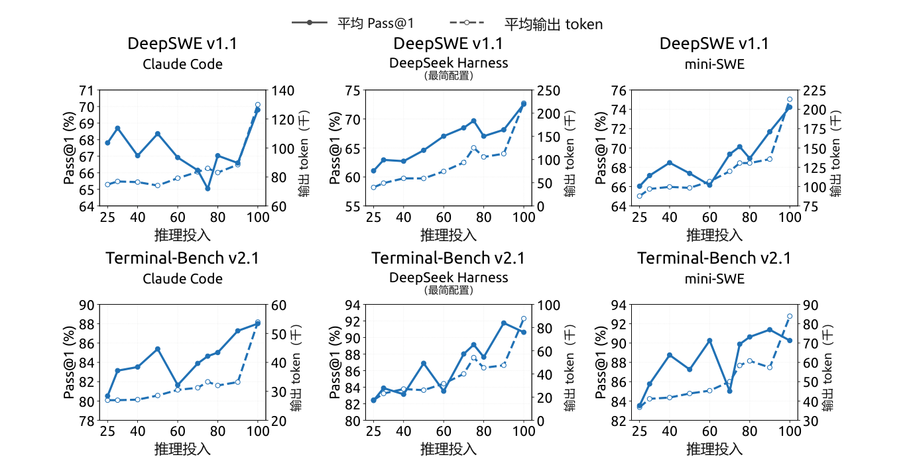

图 11｜推理投入稳定地驱动轨迹长度增长，但在不同编程运行框架中与准确率的相关性较弱。各子图展示在 Claude Code、DeepSeek Harness（Minimal）和 mini-SWE 三种框架下，DeepSWE v1.1（上排）与 Terminal-Bench v2.1（下排）的 Pass@1（%，实线，左轴）及每条轨迹平均输出 token 数（千，虚线，右轴）随推理投入设置的变化。所有子图均使用同一检查点。

## C. 推理投入控制中的指数 token 惩罚

标量投入变量无需设定硬性 token 预算，即可在部署时控制成本—质量权衡。强化学习中，较低投入水平施加更强的 token 惩罚，较高投入则允许更多计算。本节以简化分析说明指数惩罚调度的动机。

对于在投入水平 b 下生成、包含 ℓ 个推理 token 的轨迹，长度扣分为

$$
r^{\mathrm{len}}(\ell,b)=-\min\left\{C_{\max},\;k(b)\frac{\ell}{L_{\mathrm{norm}}}\right\}.\tag{11}
$$

其中，Lnorm 为参考长度，Cmax 为扣分上限。依赖投入水平的 token 惩罚系数为

$$
k(b)=k_0\exp\left(-\frac{b-b_{\min}}{\tau}\right).\tag{12}
$$

其中，k0 是最低投入水平 bmin 下的惩罚系数，τ 控制惩罚衰减速度。

为说明这一选择，考虑固定问题 x。令 px(ℓ) 表示经过 ℓ 个推理 token 后求解成功的概率。在未达到惩罚上限的区域，将偏好的推理长度ℓx*(b) 定义为

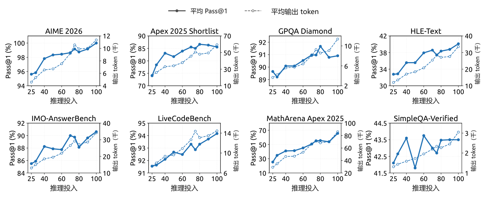

图 12｜八项推理密集型基准上，性能与输出长度随推理投入的变化。各子图展示投入值从 25 变化至 100 时的 Pass@1（实线，左轴）与每个响应的平均输出 token 数（虚线，右轴）。

$$
\ell_x^*(b)\in\underset{\ell\geq0}{\arg\max}\left[p_x(\ell)-k(b)\frac{\ell}{L_{\mathrm{norm}}}\right].\tag{13}
$$

对于内部最优解，一阶条件为

$$
p_x'\!\left(\ell_x^*(b)\right)=\frac{k(b)}{L_{\mathrm{norm}}}.\tag{14}
$$

其中，p′x(ℓ) = dpx(ℓ)/dℓ 表示额外推理对求解成功概率带来的边际提升。

我们假设，在相关运行区间内，这一边际收益近似呈指数衰减：

$$
p_x'(\ell)\approx a_x\exp\left(-\frac{\ell}{s_x}\right).\tag{15}
$$

其中，ax > 0 为依赖具体问题实例的尺度，sx > 0 决定衰减速度。将式（12）和式（15）代入式（14），得到

$$
\ell_x^*(b)\approx C_x-s_x\log k_0+\frac{s_x}{\tau}(b-b_{\min}).\tag{16}
$$

其中，Cx = sx log(axLnorm) 与 b 无关。因此，在这一局部模型下，指数惩罚调度使请求的投入水平与偏好的推理长度之间呈现简单的一阶仿射趋势。

对于两个投入水平 b2 > b1，相应的预测长度差为

$$
\ell_x^*(b_2)-\ell_x^*(b_1)\approx\frac{s_x}{\tau}(b_2-b_1).\tag{17}
$$

因此，k0 主要控制促使推理变短的总体压力，τ 则控制预测长度对投入水平的敏感性。

这一推导是奖励层面的局部近似，并不声称实测平均长度必然线性或逐点单调。实际行为可能偏离，因为投入指令能够直接改变推理策略，生成具有随机性，智能体轨迹包含的轮次数量不同，而子组奖励归一化也会改变优化强度。分析还假设最优解位于内部，且惩罚上限尚未生效。一旦达到上限，边际 token 惩罚变为零，必须另行分析这一封顶区域。
