# FlashAttention：具有 IO 感知能力的快速、 内存高效精确注意力

> 中文译本。原文：arXiv:2205.14135v2（2022-06-23）。正文与表格可编辑；公式、算法和插图以高清图片嵌入，保留原编号。

Tri Dao†, Daniel Y. Fu†, Stefano Ermon†, Atri Rudra‡, and Christopher Ré†

†斯坦福大学计算机科学系
‡纽约州立大学布法罗分校计算机科学与工程系

{trid,danfu}@cs.stanford.edu, ermon@stanford.edu, atri@buffalo.edu, chrismre@cs.stanford.edu

2022 年 6 月 24 日

## 摘要

Transformer 处理长序列时运行缓慢且内存开销很大，因为自注意力的时间和空间复杂度都与序列长度的平方成正比。近似注意力方法尝试以牺牲模型质量为代价降低计算复杂度，但往往无法带来实际运行时间上的加速。我们认为，这些方法缺少一项原则：让注意力算法具备 IO 感知能力，即考虑 GPU 不同存储层级之间的读写。我们提出 FlashAttention，一种具有 IO 感知能力的精确注意力算法，通过分块减少 GPU 高带宽内存（HBM）与片上 SRAM 之间的内存读写次数。我们分析了 FlashAttention 的 IO 复杂度，证明它比标准注意力需要更少的 HBM 访问，并且在一定的 SRAM 容量范围内具有最优性。我们还将 FlashAttention 扩展到块稀疏注意力，得到一种比现有所有近似注意力方法都更快的近似算法。FlashAttention 训练 Transformer 的速度超过现有基线：在 BERT-large（序列长度 512）上，相比 MLPerf 1.1 的训练速度纪录，端到端实际运行速度提高 15%；在 GPT-2（序列长度 1K）上加速 3 倍；在 Long Range Arena（序列长度 1K–4K）上加速 2.4 倍。FlashAttention 及其块稀疏版本支持更长的 Transformer 上下文，从而改善模型质量（GPT-2 的困惑度降低 0.7，长文档分类提高 6.4 个百分点），并赋予模型全新能力：首次使 Transformer 在 Path-X 挑战（序列长度 16K，准确率 61.4%）和 Path-256（序列长度 64K，准确率 63.1%）上取得优于随机猜测的表现。

## 1　引言

Transformer 模型 [82] 已成为自然语言处理、图像分类等应用中使用最广泛的架构。Transformer 的规模不断增大 [5]、深度不断增加 [83]，但要赋予它们更长的上下文仍然十分困难 [80]，因为核心自注意力模块的时间和空间复杂度均与序列长度的平方成正比。一个重要问题是：使注意力更快、更节省内存，能否帮助 Transformer 应对长序列带来的运行时间和内存挑战？

许多近似注意力方法旨在减少注意力的计算与内存需求，包括稀疏近似 [51, 74]、低秩近似 [12, 50, 84] 及两者的结合 [3, 9, 92]。虽然这些方法将计算需求降到了关于序列长度的线性或近线性级别，但很多方法相对于标准注意力并未缩短实际运行时间，也没有获得广泛采用。一个主要原因是，它们专注于减少浮点运算次数（FLOPs，这未必与实际运行速度相关），却往往忽略内存访问（IO）的开销。

本文认为，所缺少的原则是让注意力算法具备 IO 感知能力 [1]，即仔细考虑不同快慢存储层级之间的读写，例如高速 GPU 片上 SRAM 与相对较慢的 GPU 高带宽内存 HBM [45] 之间的读写（图 1 左）。在现代GPU 上，计算速度的提升已超过存储速度的提升 [61, 62, 63]，Transformer 中大多数操作的瓶颈都是内存访问 [43]。对于类似的访存受限操作，数据读写可能占据大部分运行时间，IO 感知算法一直至关重要，例如数据库连接 [71]、图像处理 [70]、数值线性代数 [4] 以及其他应用 [40, 85]。然而，PyTorch、TensorFlow 等常用深度学习 Python 接口并不提供对内存访问的细粒度控制。

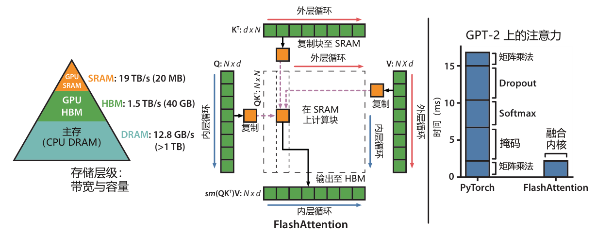

**图 1：左：FlashAttention 通过分块，避免在相对较慢的 GPU HBM 中显式存储巨大的 N × N 注意力矩阵（虚线框）。外层循环（红色箭头）遍历 K 和 V 矩阵的块，并将它们加载到高速片上 SRAM。对于每个块，FlashAttention 再遍历 Q 矩阵的块（蓝色箭头），将其加载到 SRAM，并将注意力计算的输出写回 HBM。右：在 GPT-2 上相对于 PyTorch 注意力实现的加速比。FlashAttention 无需在 HBM 中读写巨大的 N × N 注意力矩阵，因此注意力计算获得了 7.6 倍加速。**

我们提出 FlashAttention，一种以少得多的内存访问计算精确注意力的新算法。我们的主要目标是避免在 HBM 中读写注意力矩阵。这要求：（i）在无法访问完整输入的情况下完成 softmax 归约；（ii）不为反向传播保存巨大的中间注意力矩阵。我们采用两项成熟技术应对这些挑战。（i）重新组织注意力计算，将输入划分为块，并多次遍历输入块，从而增量式地完成 softmax 归约（也称为分块）。（ii）保存前向传播中的 softmax 归一化因子，以便在反向传播中快速在片上重新计算注意力；这比从 HBM 读取中间注意力矩阵的标准做法更快。我们使用 CUDA 实现 FlashAttention，以细粒度控制内存访问，并将全部注意力操作融合为一个 GPU 内核。尽管重计算增加了 FLOPs，但由于 HBM 访问量大幅减少，我们的算法相较标准注意力既运行更快（在 GPT-2 [67] 上最高加速 7.6 倍，见图 1 右），又使用更少的内存，且内存需求与序列长度成线性关系。

我们分析 FlashAttention 的 IO 复杂度 [1]，证明其 HBM 访问量为 O(N²d²M⁻¹)，其中 d 为注意力头维度，M 为 SRAM 容量；标准注意力则为 Ω(Nd + N²)。对于典型的 d、M 取值，FlashAttention 的 HBM 访问量比标准注意力少数倍（最多减少至约 1/9，见图 2）。此外，我们给出一个下界，说明不存在能够在所有 SRAM 容量下都渐近地进一步减少 HBM 访问量的精确注意力算法。

我们还表明，FlashAttention 可以作为一种有用的基础算子，克服近似注意力算法的内存访问开销问题，从而释放其潜力。作为概念验证，我们实现了块稀疏 FlashAttention：这一稀疏注意力算法甚至比 FlashAttention 本身快 2–4 倍，并可扩展到 64K 的序列长度。我们证明，块稀疏 FlashAttention 的 IO 复杂度相对 FlashAttention 的改善倍数与稀疏程度成正比。第 5 节讨论其在其他操作上的进一步扩展，包括多 GPU 注意力、核回归和块稀疏矩阵乘法。我们开源 FlashAttention，以便在这一基础算子之上继续开发。¹

我们通过实验验证，FlashAttention 能够加快模型训练，并通过建模更长的上下文来提高模型质量。我们还对 FlashAttention、块稀疏 FlashAttention 以及已有注意力实现的运行时间和内存占用进行了基准测试。

• 更快的模型训练。FlashAttention 缩短了 Transformer 模型训练的实际运行时间。BERT-large（序列长度 512）的训练比 MLPerf 1.1 [58] 的训练速度纪录快 15%；GPT-2（序列长度 1K）的训练比 HuggingFace [87] 和 Megatron-LM [77] 的基线实现快 3 倍；Long Range Arena（序列长度 1K–4K）的训练比基线快 2.4 倍。

• 更高质量的模型。FlashAttention 将 Transformer 扩展到更长序列，进而提高模型质量并带来新能力。我们观察到，GPT-2 的困惑度降低了 0.7；在长文档分类 [13] 上，建模更长序列带来了 6.4 个百分点的提升。仅通过采用更长的序列（16K），FlashAttention 就首次使 Transformer 在 Path-X [80] 挑战中达到优于随机猜测的表现。块稀疏 FlashAttention 支持 Transformer 扩展到更长的序列（64K），从而首次得到在 Path-256 上优于随机猜测的模型。

• 注意力基准测试。在 128 到 2K 的常见序列长度范围内，FlashAttention 相比标准注意力实现最高加速 3 倍，并且能够扩展到 64K。当序列长度不超过 512 时，FlashAttention 比现有任何注意力方法都更快、更节省内存；当序列长度超过 1K 时，某些近似注意力方法（如 Linformer）开始更快。不过，块稀疏 FlashAttention 比我们所知的所有现有近似注意力方法都更快。

## 2　背景

本节介绍常见深度学习操作在现代硬件（GPU）上的性能特征，并说明注意力的标准实现。

### 2.1　硬件性能

本节重点讨论 GPU；其他硬件加速器具有类似的性能特征 [46, 48]。

GPU 存储层级。GPU 的存储层级（图 1 左）包含容量和速度不同的多种存储器，容量越小，速度越快。例如，A100 GPU 配备 40–80 GB 的高带宽内存（HBM），带宽为 1.5–2.0 TB/s；其 108 个流多处理器中的每一个都具有 192 KB 的片上 SRAM，估计总带宽约为 19 TB/s [44, 45]。片上 SRAM 比 HBM 快一个数量级，但容量小多个数量级。随着计算速度相对存储速度不断提高 [61, 62, 63]，内存（HBM）访问越来越成为操作的瓶颈，因此利用高速 SRAM 变得更为重要。

执行模型。GPU 使用大量线程执行一个操作，即内核（kernel）。每个内核将输入从 HBM 加载到寄存器和 SRAM，完成计算后，再将输出写入 HBM。

性能特征。根据计算和内存访问的相对比例，操作可以分为计算受限和访存受限两类。通常使用算术强度 [85] 来衡量，即每访问一个字节的内存所执行的算术运算次数。

1. 计算受限：操作耗时由算术运算次数决定，访问 HBM 的时间要少得多。典型例子包括内维度较大的矩阵乘法，以及通道数较多的卷积。

2. 访存受限：操作耗时由内存访问量决定，计算本身所花费的时间要少得多。大多数其他操作都属于这一类，例如逐元素操作（激活函数、dropout 等）和归约操作（求和、softmax、批归一化、层归一化等）。

内核融合。加速访存受限操作最常用的方法是内核融合：若多个操作作用于同一输入，就可以只从 HBM 加载一次输入，而无需为每个操作重复加载。编译器能够自动融合许多逐元素操作 [53, 65, 75]。

> ¹FlashAttention 代码：https://github.com/HazyResearch/flash-attention

不过，在模型训练中，仍需将中间值写入 HBM 并保存给反向传播使用，这限制了简单内核融合的效果。

### 2.2　注意力的标准实现

给定输入序列 Q, K, V ∈ ℝN×d，其中 N 为序列长度、d 为注意力头维度，我们希望计算注意力输出 O ∈ ℝN×d：

其中 softmax 按行计算。

标准注意力实现会在 HBM 中显式存储矩阵 S 和 P，占用 O(N²) 内存。通常 N ≫ d，例如 GPT-2 中 N = 1024、d = 64。算法 0 描述了标准注意力实现。由于其中部分或大多数操作受访存限制（如 softmax），大量内存访问会导致较长的实际运行时间。

对注意力矩阵执行的其他逐元素操作，例如对 S 应用掩码、对 P 应用 dropout，还会进一步加剧这一问题。因此，已有许多工作尝试融合多个逐元素操作，例如将掩码与 softmax 融合 [77]。

第 3.2 节将说明，标准注意力实现的 HBM 访问量与序列长度 N 的平方成正比。我们还将比较标准注意力与本文方法（FlashAttention）的 FLOPs 和 HBM 访问量。

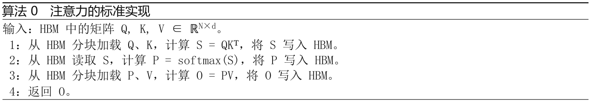

## 3　FlashAttention：算法、分析与扩展

本节说明如何以更少的 HBM 读写完成精确注意力计算，并且无需为反向传播存储大型中间矩阵，由此得到一种既节省内存、实际运行又更快的注意力算法。我们分析其 IO 复杂度，表明该方法相比标准注意力需要少得多的 HBM 访问。进一步将 FlashAttention 扩展到块稀疏注意力，说明它可以作为一种有用的基础算子。

为便于阐述，本节重点介绍前向传播；反向传播的细节见附录 B。

### 3.1　利用分块与重计算的高效注意力算法

给定 HBM 中的输入 Q, K, V ∈ ℝN×d，我们希望计算注意力输出 O ∈ ℝN×d 并将其写入 HBM。目标是减少 HBM 访问量，使其关于 N 呈次二次增长。

我们采用分块和重计算这两项成熟技术，克服以次二次 HBM 访问量计算精确注意力的技术挑战。算法 1 给出了具体过程：将输入 Q、K、V 分块，从较慢的 HBM 加载到较快的 SRAM，再计算相应块的注意力输出。对每个块的输出乘以正确的归一化因子，然后累加，最终即可得到正确结果。

分块。我们按块计算注意力。Softmax 将 K 的各列关联起来，因此通过缩放来分解大规模 softmax [51, 60, 66]。

为保证数值稳定性，向量 x ∈ ℝB 的 softmax 按以下方式计算：

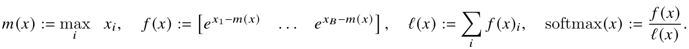

对于向量 x(1), x(2) ∈ ℝB，可以将拼接后 x = [x(1) x(2)] ∈ ℝ2B 的 softmax 分解为：

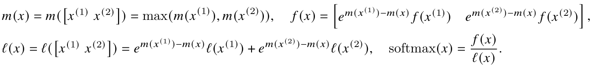

因此，只要额外维护一些统计量 m(x)、ℓ(x)，就可以逐块计算 softmax。²

由此，我们将输入 Q、K、V 分块（算法 1 第 3 行），计算 softmax 值及附加统计量（第 10 行），然后合并结果（第 12 行）。

重计算。我们的目标之一是不为反向传播保存 O(N²) 个中间值。反向传播通常需要矩阵 S, P ∈ ℝN×N，才能计算关于 Q、K、V 的梯度。但只要保存输出 O 以及 softmax 归一化统计量 m、ℓ，反向传播时就能根据 SRAM 中 Q、K、V 的块，轻松重新计算注意力矩阵 S 和 P。这可以视为一种选择性梯度检查点技术 [10, 34]。尽管已有工作提出用梯度检查点降低峰值内存需求 [66]，但据我们所知，所有实现都必须以速度换取内存。相比之下，我们的重计算虽然增加了 FLOPs，却因减少 HBM 访问而加快了反向传播（图 2）。完整反向传播过程见附录 B。

实现细节：内核融合。分块使我们能够用一个 CUDA 内核实现整个算法：从 HBM 加载输入，执行全部计算步骤（矩阵乘法、softmax、可选的掩码和 dropout、矩阵乘法），然后将结果写回 HBM（掩码和 dropout 见附录 B）。这样避免了在 HBM 中反复读写输入和输出。

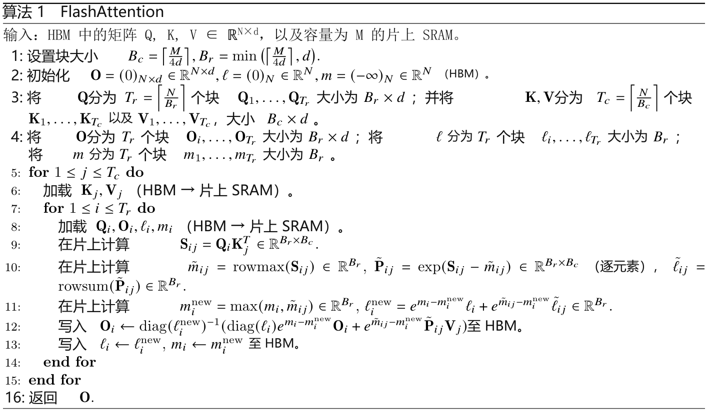

下面给出 FlashAttention 的正确性、运行时间及内存需求（证明见附录 C）。

定理 1。算法 1 返回 O = softmax(QKᵀ)V，执行 O(N²d) 次浮点运算；除输入和输出外，还需 O(N) 的额外内存。

### 3.2　分析：FlashAttention 的 IO 复杂度

我们分析 FlashAttention 的 IO 复杂度，说明其 HBM 访问量比标准注意力显著减少。我们还给出一个下界，证明不存在一种精确注意力算法，能够在所有 SRAM 容量下都渐近地进一步减少 HBM 访问量。证明见附录 C。

> ²这种聚合方式称为代数聚合 [33]。

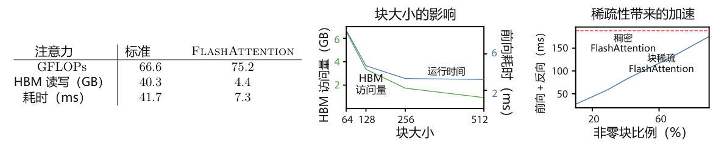

**图 2：左：A100 GPU 上，GPT-2 medium（序列长度 1024，头维度 64，16 个注意力头，批大小 64）的标准注意力与 FlashAttention 的前向＋反向耗时。HBM 访问是影响运行时间的主要因素。中：A100 GPU 上 FlashAttention（序列长度 1024，头维度 64，16 个头，批大小 64）的前向耗时。在一定范围内，HBM 访问越少，运行越快。右：块稀疏 FlashAttention（序列长度 4K）相对于 FlashAttention 的加速倍数与稀疏程度成正比。**

定理 2。设 N 为序列长度、d 为注意力头维度、M 为 SRAM 容量，且 d ≤ M ≤ Nd。标准注意力（算法 0）需要 Θ(Nd + N²) 次 HBM 访问，而 FlashAttention（算法 1）需要 Θ(N²d²M⁻¹) 次 HBM 访问。

对于典型的 d（64–128）与 M（约 100 KB）取值，d² 远小于 M，因此 FlashAttention 的 HBM 访问量比标准实现少数倍。这同时带来更快的执行速度和更低的内存占用，我们将在第 4.3 节中验证。

证明的核心思路是：给定容量为 M 的 SRAM，每次可以加载大小分别为 Θ(M) 的 K、V 块（算法 1 第 6 行）。对于每一对 K、V 块，遍历 Q 的全部块（第 8 行）以计算中间值，共需对 Q 进行 Θ(NdM⁻¹) 次遍历。每次遍历加载 Θ(Nd) 个元素，因此 HBM 总访问量为 Θ(N²d²M⁻¹)。类似地，我们证明标准注意力反向传播需要 Θ(Nd + N²) 次 HBM 访问，而 FlashAttention 反向传播需要 Θ(N²d²M⁻¹) 次（附录 B）。

我们证明一个下界：计算精确注意力时，不可能对 M（SRAM 容量）的所有取值都渐近地进一步减少 HBM 访问量。

命题 3。设 N 为序列长度、d 为注意力头维度、M 为 SRAM 容量，且 d ≤ M ≤ Nd。不存在一种精确注意力算法，能对区间 [d, Nd] 内的所有 M 都只进行 o(N²d²M⁻¹) 次 HBM 访问。

证明依赖以下事实：当 M = Θ(Nd) 时，任意算法都必须进行 Ω(N²d²M⁻¹) = Ω(Nd) 次 HBM 访问。这类针对 M 的某个子区间建立的下界，在流式算法文献中很常见 [88]。关于 M 的参数化复杂度 [27] 下界证明，我们留待未来研究。

我们验证，HBM 访问量是注意力运行时间的主要决定因素。图 2（左）显示，尽管 FlashAttention 的 FLOPs 比标准注意力更多（因为反向传播中的重计算），但其 HBM 访问量少得多，因此运行快得多。图 2（中）改变 FlashAttention 的块大小 Bc，使 HBM 访问量随之变化，并测量前向耗时。随着块增大，对输入的遍历次数减少，HBM 访问量下降，运行时间也随之缩短。当块足够大（超过 256）时，运行时间转而受到其他因素（如算术运算）的限制。此外，更大的块也无法容纳于容量有限的 SRAM。

### 3.3　扩展：块稀疏 FlashAttention

我们将 FlashAttention 扩展到近似注意力，提出块稀疏 FlashAttention。它的 IO 复杂度相对于 FlashAttention 的改善倍数与稀疏程度成正比。

给定输入 Q, K, V ∈ ℝN×d 及掩码矩阵 M̃ ∈ {0, 1}N×N，我们希望计算：

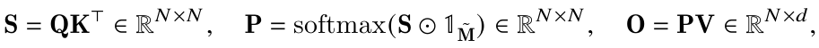

其中，当 M̃kl = 1 时，(S ⊙ 𝟙M̃)kl = Skl；掩码为 0 时，该值为 −∞。我们要求 M̃ 具有块结构：对于某些块大小 Br、Bc，存在 M ∈ {0, 1}N/Bᵣ×N/B𝒸，使所有 k、l 都满足 M̃k,l = Mij，其中 i = ⌊k/Br⌋、j = ⌊l/Bc⌋。

给定预先定义的块稀疏掩码 M ∈ {0, 1}N/Bᵣ×N/B𝒸，可以轻松修改算法 1，使其仅计算注意力矩阵中的非零块。除跳过零块外，算法与算法 1 完全相同。附录 B 的算法 5 再次给出了完整过程。

我们也分析块稀疏 FlashAttention 的 IO 复杂度。

命题 4。设 N 为序列长度、d 为注意力头维度、M 为 SRAM 容量，且 d ≤ M ≤ Nd。块稀疏 FlashAttention（算法 5）需要 Θ(Nd + N²d²M⁻¹s) 次 HBM 访问，其中 s 是块稀疏掩码中非零块的比例。

可见，应用块稀疏性会按照稀疏程度，直接缩小 IO 复杂度中的较大项。对于较大的序列长度 N，s 通常取 N⁻¹ᐟ² [11] 或 N⁻¹ log N [3, 17, 92]，从而得到 Θ(N√N) 或 Θ(N log N) 的 IO 复杂度。下游实验采用固定的蝶形稀疏模式 [17]，已有研究表明这种模式能够近似任意稀疏结构 [16]。

图 2（右）验证了：随着稀疏程度增加，块稀疏 FlashAttention 的运行速度按比例提高。在 LRA 基准上，块稀疏 FlashAttention 获得 2.8 倍加速，同时达到与标准注意力相当的效果（第 4 节）。

## 4　实验

我们评估使用 FlashAttention 训练 Transformer 模型的效果，验证关于训练时间和模型准确率的两项主张，并报告注意力运行时间与内存基准测试。

• 训练速度。FlashAttention 比 BERT 在 MLPerf 1.1 [58] 上的速度纪录快 15%；在 GPT-2 上，相对于 HuggingFace [87] 的标准 Transformer 实现最高加速 3 倍，相对于 Megatron [77] 最高加速 1.8 倍；在 Long Range Arena（LRA）基准上加速 2.4 倍。

• 质量。FlashAttention 将 Transformer 扩展到更长序列，从而提高模型质量。FlashAttention 训练上下文长度为 4K 的 GPT-2，比 Megatron 训练上下文长度为 1K 的 GPT-2 还快，同时困惑度降低 0.7。建模更长序列在两个长文档分类任务上带来了 6.4 个百分点的提升。最后，FlashAttention 首次使 Transformer 在富有挑战性的 Path-X 任务（序列长度 16K）上优于随机猜测；据我们所知，块稀疏 FlashAttention 也首次使序列模型在 Path-256（序列长度 64K）上取得优于随机猜测的表现。

• 注意力基准测试。我们测量 FlashAttention 和块稀疏 FlashAttention 的运行时间与内存占用随序列长度的变化。实验确认，FlashAttention 的内存占用与序列长度成线性关系，并且在常见序列长度（最高 2K）下，比标准注意力最高快 3 倍。实验还确认，块稀疏 FlashAttention 的运行时间与序列长度成线性关系，且比现有所有近似注意力基线都更快。

更多实验细节见附录 E。

### 4.1　借助 FlashAttention 加快模型训练

BERT。据我们所知，FlashAttention 实现了最快的单节点 BERT 训练。我们在 Wikipedia 上使用 FlashAttention 训练 BERT-large [22]。表 1 将训练时间与创造 MLPerf 1.1 [58] 训练速度纪录的 NVIDIA 实现进行比较；我们的实现快 15%。

表 1：BERT-large 从 MLPerf 基准提供的相同初始化出发，在掩码语言建模上达到 72.0% 目标准确率所需的训练时间。在 8 张 A100 GPU 上运行 10 次后取平均。

| BERT 实现 | 训练时间（分钟） |
| --- | --- |
| Nvidia MLPerf 1.1 [58] | 20.0 ± 1.5 |
| FlashAttention（本文） | 17.4 ± 1.4 |

GPT-2。在大型 OpenWebText 数据集 [32] 上，FlashAttention 训练 GPT-2 [67] 的速度快于广泛使用的 HuggingFace [87] 和 Megatron-LM [77] 实现。表 2 显示，相比 HuggingFace，端到端最高加速 3 倍；相比 Megatron-LM，最高加速 1.7 倍。FlashAttention达到与另外两种实现相同的困惑度，因为我们没有改变模型定义。附录 E 提供了训练过程中验证集困惑度的曲线，确认 FlashAttention 与基线同样具有数值稳定性，并产生相同的训练和验证曲线。

表 2：采用 FlashAttention 的 GPT-2 small 和 medium，相对 HuggingFace 实现最高加速 3 倍，相对 Megatron-LM 最高加速 1.7 倍。表中报告在 8 张 A100 GPU 上的训练时间。

| 模型实现 | OpenWebText（困惑度） | 训练时间（加速比） |
| --- | --- | --- |
| GPT-2 small - Huggingface [87] | 18.2 | 9.5 天 (1.0×) |
| GPT-2 small - Megatron-LM [77] | 18.2 | 4.7 天 (2.0×) |
| GPT-2 small - FlashAttention | 18.2 | 2.7 天 (3.5×) |
| GPT-2 medium - Huggingface [87] | 14.2 | 21.0 天 (1.0×) |
| GPT-2 medium - Megatron-LM [77] | 14.3 | 11.5 天 (1.8×) |
| GPT-2 medium - FlashAttention | 14.3 | 6.9 天 (3.0×) |

Long Range Arena。我们在 Long Range Arena（LRA [80]）基准上比较标准 Transformer 分别采用标准注意力实现和 FlashAttention 时的表现，测量所有模型的准确率、吞吐量及训练时间。各任务的序列长度不同，范围为 1024–4096。我们遵循 Tay 等 [80] 和 Xiong 等 [90] 的实现与实验设置。³ 表 3 显示，FlashAttention 相比标准注意力最高加速 2.4 倍。块稀疏 FlashAttention 比我们测试的所有近似注意力方法都快。

表 3：标准注意力、FlashAttention、块稀疏 FlashAttention 及近似注意力基线在 Long Range Arena 基准上的表现。

| 模型 | ListOps | 文本 | 检索 | 图像 | Pathfinder | 平均 | 加速比 |
| --- | --- | --- | --- | --- | --- | --- | --- |
| Transformer | 36.0 | 63.6 | 81.6 | 42.3 | 72.7 | 59.3 | - |
| FlashAttention | 37.6 | 63.9 | 81.4 | 43.5 | 72.7 | 59.8 | 2.4× |
| 块稀疏 FlashAttention | 37.0 | 63.0 | 81.3 | 43.6 | 73.3 | 59.6 | 2.8× |
| Linformer [84] | 35.6 | 55.9 | 77.7 | 37.8 | 67.6 | 54.9 | 2.5× |
| Linear Attention [50] | 38.8 | 63.2 | 80.7 | 42.6 | 72.5 | 59.6 | 2.3× |
| Performer [12] | 36.8 | 63.6 | 82.2 | 42.1 | 69.9 | 58.9 | 1.8× |
| Local Attention [80] | 36.1 | 60.2 | 76.7 | 40.6 | 66.6 | 56.0 | 1.7× |
| Reformer [51] | 36.5 | 63.8 | 78.5 | 39.6 | 69.4 | 57.6 | 1.3× |
| Smyrf [19] | 36.1 | 64.1 | 79.0 | 39.6 | 70.5 | 57.9 | 1.7× |

### 4.2　利用更长序列提高模型质量

长上下文语言建模。FlashAttention 的运行效率和内存效率，使我们能够将 GPT-2 的上下文长度增大到原来的 4 倍，同时仍比 Megatron-LM 的优化实现运行更快。表 4 显示，采用 FlashAttention、上下文长度为 4K 的 GPT-2，比 Megatron 中上下文长度为 1K 的 GPT-2 仍快 30%，同时困惑度降低 0.7。

表 4：采用 FlashAttention 的 GPT-2 small，其上下文长度是 Megatron-LM 的 4 倍，训练仍快 30%，且困惑度降低 0.7。训练时间在 8 张 A100 GPU 上测得。

| 模型实现 | 上下文长度 | OpenWebText（困惑度） | 训练时间（加速比） |
| --- | --- | --- | --- |
| GPT-2 small - Megatron-LM | 1k | 18.2 | 4.7 天 (1.0×) |
| GPT-2 small - FlashAttention | 1k | 18.2 | 2.7 天 (1.7×) |
| GPT-2 small - FlashAttention | 2k | 17.6 | 3.0 天 (1.6×) |
| GPT-2 small - FlashAttention | 4k | **17.5** | 3.6 天 (1.3×) |

长文档分类。借助 FlashAttention 使用更长序列训练 Transformer，能够改善模型在 MIMIC-III [47] 和 ECtHR [6, 7] 数据集上的表现。MIMIC-III 包含重症监护室患者的出院小结，每篇都标注了多个标签。ECtHR 包含欧洲人权法院的法律案件，每个案件都对应被指控违反的《欧洲人权公约》条款。这两个数据集都包含很长的文档：MIMIC 平均为 2,395 个 token，最长为 14,562 个 token；ECtHR 的平均值和最大值分别为 2,197 和 49,392 个 token。我们评估增加预训练 RoBERTa 模型 [56] 的序列长度所带来的提升，采用与 Beltagy 等 [3] 相同的方式重复位置嵌入。表 5 显示，在 MIMIC 上，序列长度 16K 比 512 高 4.3 个百分点；在 ECtHR 上，8K 比 512 高 8.5 个百分点。两者的差异可能来自细微的分布偏移：MIMIC-III 包含专业医学文本，因此可能更容易受到文档长度分布变化的影响，而 ECtHR 使用的是一般语言。

> ³已有研究指出，LRA 的准确率高度依赖调参过程 [90]。我们复现的基线表现优于原始比较 [80] 中报告的结果。

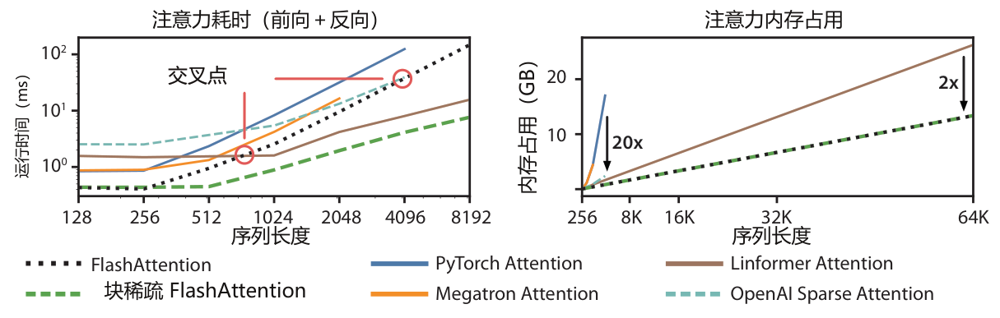

**图 3：左：前向传播＋反向传播的运行时间。右：注意力的内存占用。**

**表 6：我们报告了首个能够在 Path-X 和 Path-256 上取得优于随机猜测表现的 Transformer 模型。**

**表 5：使用 FlashAttention 时，不同序列长度下的长文档分类表现（micro F₁）。**

| 模型 | Path-X | Path-256 |
| --- | --- | --- |
| Transformer | × | × |
| Linformer [84] | × | × |
| Linear Attention [50] | × | × |
| Performer [12] | × | × |
| Local Attention [80] | × | × |
| Reformer [51] | × | × |
| SMYRF [19] | × | × |
| FlashAttention | **61.4** | × |
| 块稀疏 FlashAttention | 56.0 | **63.1** |

| 数据集 | 512 | 1024 | 2048 | 4096 | 8192 | 16384 |
| --- | --- | --- | --- | --- | --- | --- |
| MIMIC-III [47] | 52.8 | 50.7 | 51.7 | 54.6 | 56.4 | **57.1** |
| ECtHR [6] | 72.2 | 74.3 | 77.1 | 78.6 | **80.7** | 79.2 |

Path-X 与 Path-256。Path-X 和 Path-256 是 Long Range Arena 中用于测试长上下文能力的高难度任务。任务要求判断一幅 128 × 128（或 256 × 256）黑白图像中的两点之间是否存在连接路径，图像以一次一个像素的方式输入 Transformer。在先前工作中，所有 Transformer 模型要么内存不足，要么只能达到随机猜测的表现 [80]。因此，研究者开始寻找能够建模如此长上下文的替代架构 [37]。我们在此首次展示 Transformer 能够解决 Path-X 和 Path-256 的结果（表 6）。我们先在 Path-64 上预训练 Transformer，再通过对位置嵌入进行空间插值，将其迁移到 Path-X。FlashAttention 在 Path-X 上达到 61.4% 的准确率。此外，块稀疏 FlashAttention 使 Transformer 能够处理长度为 64K 的序列，在 Path-256 上达到 63.1% 的准确率。⁴

### 4.3　注意力基准测试

我们在一张配备 40 GB HBM 的 A100 GPU 上，改变序列长度，比较 FlashAttention、块稀疏 FlashAttention 与多种注意力基线的运行时间和内存占用，启用 dropout 和填充掩码。比较对象包括精确注意力、近似注意力和稀疏注意力的参考实现。正文仅展示部分基线；更多基线及完整细节见附录 E。

> ⁴Path-256 要求更长的序列，但其中的路径相对 Path-X 更短，因此更容易获得较高准确率。

运行时间。图 3（左）以毫秒为单位报告 FlashAttention、块稀疏 FlashAttention 以及精确、近似和稀疏注意力基线的前向＋反向耗时（具体数值见附录 E）。运行时间随序列长度呈二次增长，但 FlashAttention 明显快于精确注意力基线，相比 PyTorch 实现最高加速 3 倍。许多近似或稀疏注意力机制的运行时间随序列长度线性增长，但对于短序列，由于内存访问更少，FlashAttention 仍然更快。当序列长度位于 512–1024 之间时，近似注意力的耗时开始与 FlashAttention 发生交叉。另一方面，在所有序列长度下，块稀疏 FlashAttention 都比我们所知的所有精确、稀疏和近似注意力实现更快。

内存占用。图 3（右）比较 FlashAttention、块稀疏 FlashAttention 与多种精确、近似和稀疏注意力基线的内存占用。FlashAttention 与其块稀疏版本的内存占用相同，均随序列长度线性增长。相较精确注意力基线，FlashAttention 最高可将内存需求降低至约 1/20，并且比近似注意力基线更节省内存。除 Linformer 外，所有其他算法在序列长度达到 64K 之前就会耗尽 A100 GPU 的内存；即便相较 Linformer，FlashAttention 的内存效率仍高 2 倍。

## 5　局限性与未来方向

本节讨论方法的局限性与未来研究方向。相关工作见附录 A。

编译为 CUDA。目前，构建具有 IO 感知能力的注意力实现，需要为每一种新的注意力实现编写新的 CUDA 内核。这要求使用比 PyTorch 低层得多的语言编写注意力算法，也需要大量工程投入；实现还可能无法跨 GPU 架构迁移。这些局限表明，我们需要一种方法，支持使用高层语言（如 PyTorch）编写注意力算法，再编译为具有 IO 感知能力的 CUDA 实现，类似于图像处理领域的 Halide [70]。

IO 感知深度学习。我们认为，IO 感知方法的应用可以超出注意力本身。注意力是 Transformer 中内存开销最大的计算，但深度网络的每一层都要访问 GPU HBM。我们希望本文能够推动更多模块的 IO 感知实现。附录 D 讨论了这些潜在扩展。

多 GPU IO 感知方法。对于单张 GPU 上的注意力计算，我们的 IO 感知实现达到了常数因子范围内的最优性。不过，注意力计算也可以在多张 GPU 上并行 [72]。使用多 GPU 会在 IO 分析中增加一个层级，需要考虑 GPU 之间的数据传输。我们希望本文能够推动这一方向的后续研究。

## 致谢

我们的实现以 Apex 的 FMHA 代码（https://github.com/NVIDIA/apex/tree/master/apex/contrib/csrc/fmha）为起点。感谢 Young-Jun Ko 深入解释其 FMHA 实现，并细致解答我们的 CUDA 问题。感谢 Sabri Eyuboglu、Megan Leszczynski、Laurel Orr、Yuhuai Wu、Beidi Chen 和 Xun Huang 对论文早期草稿提出的建设性反馈与建议。感谢 Markus Rabe 和 Charles Staats 就其注意力算法进行的有益讨论。

我们衷心感谢以下支持：NIH 项目 U54EB020405（Mobilize）；NSF 项目 CCF1763315（Beyond Sparsity）、CCF1563078（Volume to Velocity）、1937301（RTML）；ARL 项目 W911NF-21-2-0251（Interactive Human-AI Teaming）；ONR 项目 N000141712266（Unifying Weak Supervision）、N00014-20-1-2480（理解并应用机器学习中的非欧几何）、N000142012275（NEPTUNE）；NXP、Xilinx、LETI-CEA、Intel、IBM、Microsoft、NEC、Toshiba、TSMC、ARM、Hitachi、BASF、Accenture、Ericsson、Qualcomm、Analog Devices、Google Cloud、Salesforce、Total；HAI-GCP 与 HAI-Azure 科研云额度计划；斯坦福数据科学计划（SDSI）；美国国防部（DoD）通过国防科学与工程研究生奖学金（NDSEG）计划提供的支持；以及斯坦福 DAWN 项目的成员 Facebook、Google 和 VMWare。美国政府获授权为政府用途复制和分发重印本，不受其上任何版权声明的限制。本文所表达的观点、发现、结论或建议均属于作者，并不一定反映 NIH、ONR 或美国政府明示或暗示的观点、政策或认可。Atri Rudra 的研究受到 NSF 项目 CCF-1763481 的支持。

## 参考文献

[1] Alok Aggarwal and S Vitter, Jeffrey. 排序及相关问题的输入／输出复杂度. Communications of the ACM, 31(9):1116–1127, 1988.

[2] Irwan Bello. LambdaNetworks：无需注意力的长程交互建模. arXiv preprint arXiv:2102.08602, 2021.

[3] Iz Beltagy, Matthew E Peters, and Arman Cohan. Longformer：面向长文档的 Transformer. arXiv preprint arXiv:2004.05150, 2020.

[4] L Susan Blackford, Antoine Petitet, Roldan Pozo, Karin Remington, R Clint Whaley, James Demmel, Jack Dongarra, Iain Duff, Sven Hammarling, Greg Henry, et al. 更新版基础线性代数子程序集（BLAS）. ACM Transactions on Mathematical Software, 28(2):135–151, 2002.

[5] Tom Brown, Benjamin Mann, Nick Ryder, Melanie Subbiah, Jared D Kaplan, Prafulla Dhariwal, Arvind Neelakantan, Pranav Shyam, Girish Sastry, Amanda Askell, et al. 语言模型是少样本学习器. Advances in neural information processing systems, 33:1877–1901, 2020.

[6] Ilias Chalkidis, Ion Androutsopoulos, and Nikolaos Aletras. 英语法律判决的神经网络预测. In Proceedings of the 57th Annual Meeting of the Association for Computational Linguistics, pages 4317–4323, Florence, Italy, 2019. Association for Computational Linguistics. doi: 10.18653/v1/P19-1424. URL https://www.aclweb.org/anthology/P19-1424.

[7] Ilias Chalkidis, Manos Fergadiotis, Dimitrios Tsarapatsanis, Nikolaos Aletras, Ion Androutsopoulos, and Prodromos Malakasiotis. 通过正则化提取段落级判决理由：欧洲人权法院案件研究. In Proceedings of the Annual Conference of the North American Chapter of the Association for Computational Linguistics, Mexico City, Mexico, 2021. Association for Computational Linguistics.

[8] Benjamin Charlier, Jean Feydy, Joan Alexis Glaunès, François-David Collin, and Ghislain Durif. GPU 上支持自动微分且避免内存溢出的核运算. Journal of Machine Learning Research, 22(74):1–6, 2021. URL http://jmlr.org/papers/v22/20-275.html.

[9] Beidi Chen, Tri Dao, Eric Winsor, Zhao Song, Atri Rudra, and Christopher Ré. Scatterbrain：统一稀疏与低秩注意力. In Advances in Neural Information Processing Systems (NeurIPS), 2021.

[10] Tianqi Chen, Bing Xu, Chiyuan Zhang, and Carlos Guestrin. 以次线性内存开销训练深度网络. arXiv preprint arXiv:1604.06174, 2016.

[11] Rewon Child, Scott Gray, Alec Radford, and Ilya Sutskever. 使用稀疏 Transformer 生成长序列. arXiv preprint arXiv:1904.10509, 2019.

[12] Krzysztof Marcin Choromanski, Valerii Likhosherstov, David Dohan, Xingyou Song, Andreea Gane, Tamas Sarlos, Peter Hawkins, Jared Quincy Davis, Afroz Mohiuddin, Lukasz Kaiser, et al. 通过 Performer 重新思考注意力. In International Conference on Learning Representations (ICLR), 2020.

[13] Xiang Dai, Ilias Chalkidis, Sune Darkner, and Desmond Elliott. 重新审视用于长文档分类的 Transformer 模型. arXiv preprint arXiv:2204.06683, 2022.

[14] Zihang Dai, Zhilin Yang, Yiming Yang, Jaime G Carbonell, Quoc Le, and Ruslan Salakhutdinov. Transformer-XL：突破固定长度上下文的注意力语言模型. In Proceedings of the 57th Annual Meeting of the Association for Computational Linguistics, pages 2978–2988, 2019.

[15] Tri Dao, Albert Gu, Matthew Eichhorn, Atri Rudra, and Christopher Ré. 利用蝶形分解学习线性变换的快速算法. In International Conference on Machine Learning (ICML), 2019.

[16] Tri Dao, Nimit Sohoni, Albert Gu, Matthew Eichhorn, Amit Blonder, Megan Leszczynski, Atri Rudra, and Christopher Ré. Kaleidoscope：适用于所有结构化线性映射的高效可学习表示. In International Conference on Learning Representations (ICLR), 2020.

[17] Tri Dao, Beidi Chen, Kaizhao Liang, Jiaming Yang, Zhao Song, Atri Rudra, and Christopher Ré. Pixelated Butterfly：简单高效的神经网络稀疏训练. In International Conference on Learning Representations (ICLR), 2022.

[18] Tri Dao, Beidi Chen, Nimit Sohoni, Arjun Desai, Michael Poli, Jessica Grogan, Alexander Liu, Aniruddh Rao, Atri Rudra, and Christopher Ré. Monarch：以高表达力结构化矩阵实现高效且准确的训练. In International Conference on Machine Learning (ICML), 2022.

[19] Giannis Daras, Nikita Kitaev, Augustus Odena, and Alexandros G Dimakis. SMYRF：利用非对称聚类实现高效注意力. Advances in Neural Information Processing Systems, 33:6476–6489, 2020.

[20] Christopher De Sa, Albert Gu, Rohan Puttagunta, Christopher Ré, and Atri Rudra. 结构化稠密矩阵向量乘法的双线进展. In Proceedings of the Twenty-Ninth Annual ACM-SIAM Symposium on Discrete Algorithms, pages 1060–1079. SIAM, 2018.

[21] Peter J Denning. 描述程序行为的工作集模型. Communications of the ACM, 11(5): 323–333, 1968.

[22] Jacob Devlin, Ming-Wei Chang, Kenton Lee, and Kristina Toutanova. BERT：面向语言理解的深层双向 Transformer 预训练. 2019.

[23] Xin Dong, Shangyu Chen, and Sinno Jialin Pan. 通过逐层最优脑外科算法学习深度神经网络剪枝. arXiv preprint arXiv:1705.07565, 2017.

[24] Alexey Dosovitskiy, Lucas Beyer, Alexander Kolesnikov, Dirk Weissenborn, Xiaohua Zhai, Thomas Unterthiner, Mostafa Dehghani, Matthias Minderer, Georg Heigold, Sylvain Gelly, et al. 一张图像等于 16×16 个词：用于大规模图像识别的 Transformer. In International Conference on Learning Representations, 2020.

[25] Y Eidelman and I Gohberg. 关于一类新的结构化矩阵. Integral Equations and Operator Theory, 34(3):293–324, 1999.

[26] Jean Feydy, Joan Glaunès, Benjamin Charlier, and Michael Bronstein. 利用符号矩阵进行快速几何学习. Advances in Neural Information Processing Systems, 33, 2020.

[27] Jörg Flum and Martin Grohe. 参数化复杂度理论. Springer, 2006.

[28] Jonathan Frankle and Michael Carbin. 彩票假说：寻找稀疏且可训练的神经网络. In International Conference on Learning Representations, 2018.

[29] Jonathan Frankle, Gintare Karolina Dziugaite, Daniel M Roy, and Michael Carbin. 使彩票假说更加稳定. arXiv preprint arXiv:1903.01611, 2019.

[30] Jonathan Frankle, Gintare Karolina Dziugaite, Daniel Roy, and Michael Carbin. 线性模态连通性与彩票假说. In International Conference on Machine Learning, pages 3259–3269. PMLR, 2020.

[31] Karan Goel, Albert Gu, Chris Donahue, and Christopher Ré. It's Raw！利用状态空间模型生成音频. In International Conference on Machine Learning (ICML), 2022.

[32] Aaron Gokaslan, Vanya Cohen, Pavlick Ellie, and Stefanie Tellex. OpenWebText 语料库, 2019.

[33] Jim Gray, Surajit Chaudhuri, Adam Bosworth, Andrew Layman, Don Reichart, Murali Venkatrao, Frank Pellow, and Hamid Pirahesh. 数据立方体：推广分组、交叉表与小计的关系聚合算子. Data mining and knowledge discovery, 1(1):29–53, 1997.

[34] Andreas Griewank and Andrea Walther. 导数计算：算法微分的原理与技术. SIAM, 2008.

[35] Albert Gu, Tri Dao, Stefano Ermon, Atri Rudra, and Christopher Ré. HiPPO：基于最优多项式投影的循环记忆. In Advances in neural information processing systems (NeurIPS), 2020.

[36] Albert Gu, Isys Johnson, Karan Goel, Khaled Saab, Tri Dao, Atri Rudra, and Christopher Ré. 利用线性状态空间层结合循环、卷积与连续时间模型. Advances in Neural Information Processing Systems, 34, 2021.

[37] Albert Gu, Karan Goel, and Christopher Ré. 利用结构化状态空间高效建模长序列. In The International Conference on Learning Representations (ICLR), 2022.

[38] Song Han, JeffPool, John Tran, and William J Dally. 联合学习权重与连接以构建高效神经网络. arXiv preprint arXiv:1506.02626, 2015.

[39] Song Han, Huizi Mao, and William J Dally. 深度压缩：利用剪枝、训练量化和霍夫曼编码压缩深度神经网络. In International Conference on Learning Representations, 2016.

[40] John Hennessy and David Patterson. 存储层级设计. Computer Architecture: A Quantitative Approach, pages 390–525, 2003.

[41] Sara Hooker. 硬件彩票. arXiv preprint arXiv:2009.06489, 2020.

[42] Weizhe Hua, Zihang Dai, Hanxiao Liu, and Quoc V Le. 在线性时间内达到 Transformer 的质量. arXiv preprint arXiv:2202.10447, 2022.

[43] Andrei Ivanov, Nikoli Dryden, Tal Ben-Nun, Shigang Li, and Torsten Hoefler. 数据移动才是关键：优化 Transformer 的案例研究. Proceedings of Machine Learning and Systems, 3: 711–732, 2021.

[44] Zhe Jia and Peter Van Sandt. 通过微基准测试剖析 Ampere GPU 架构. GPU Technology Conference, 2021.

[45] Zhe Jia, Marco Maggioni, Benjamin Staiger, and Daniele P Scarpazza. 通过微基准测试剖析 NVIDIA Volta GPU 架构. arXiv preprint arXiv:1804.06826, 2018.

[46] Zhe Jia, Blake Tillman, Marco Maggioni, and Daniele Paolo Scarpazza. 通过微基准测试剖析 Graphcore IPU 架构. arXiv preprint arXiv:1912.03413, 2019.

[47] Alistair EW Johnson, Tom J Pollard, Lu Shen, Li-wei H Lehman, Mengling Feng, Mohammad Ghassemi, Benjamin Moody, Peter Szolovits, Leo Anthony Celi, and Roger G Mark. MIMIC-III：可免费访问的重症监护数据库. Scientific data, 3(1):1–9, 2016.

[48] Norman P Jouppi, CliffYoung, Nishant Patil, David Patterson, Gaurav Agrawal, Raminder Bajwa, Sarah Bates, Suresh Bhatia, Nan Boden, Al Borchers, et al. 数据中心内张量处理单元的性能分析. In Proceedings of the 44th annual international symposium on computer architecture, pages 1–12, 2017.

[49] Thomas Kailath, Sun-Yuan Kung, and Martin Morf. 矩阵的位移秩与线性方程. Journal of Mathematical Analysis and Applications, 68(2):395–407, 1979.

[50] Angelos Katharopoulos, Apoorv Vyas, Nikolaos Pappas, and François Fleuret. Transformer 即 RNN：采用线性注意力的快速自回归 Transformer. In International Conference on Machine Learning, pages 5156–5165. PMLR, 2020.

[51] Nikita Kitaev, Łukasz Kaiser, and Anselm Levskaya. Reformer：高效的 Transformer. In The International Conference on Machine Learning (ICML), 2020.

[52] Zhenzhong Lan, Mingda Chen, Sebastian Goodman, Kevin Gimpel, Piyush Sharma, and Radu Soricut. ALBERT：用于语言表示自监督学习的轻量级 BEDRT. In The International Conference on Learning Representations (ICLR), 2020.

[53] Mingzhen Li, Yi Liu, Xiaoyan Liu, Qingxiao Sun, Xin You, Hailong Yang, Zhongzhi Luan, Lin Gan, Guangwen Yang, and Depei Qian. 深度学习编译器：全面综述. IEEE Transactions on Parallel and Distributed Systems, 32(3):708–727, 2020.

[54] Valerii Likhosherstov, Krzysztof Choromanski, Jared Davis, Xingyou Song, and Adrian Weller. 次线性内存：如何让 Performer 更轻量. arXiv preprint arXiv:2012.11346, 2020.

[55] Ji Lin, Yongming Rao, Jiwen Lu, and Jie Zhou. 运行时神经网络剪枝. In I. Guyon, U. V. Luxburg, S. Bengio, H. Wallach, R. Fergus, S. Vishwanathan, and R. Garnett, editors, Advances in Neural Information Processing Systems, volume 30. Curran Associates, Inc., 2017.

[56] Yinhan Liu, Myle Ott, Naman Goyal, Jingfei Du, Mandar Joshi, Danqi Chen, Omer Levy, Mike Lewis, Luke Zettlemoyer, and Veselin Stoyanov. RoBERTa：一种稳健优化的 BERT 预训练方法. arXiv preprint arXiv:1907.11692, 2019.

[57] Xuezhe Ma, Xiang Kong, Sinong Wang, Chunting Zhou, Jonathan May, Hao Ma, and Luke Zettlemoyer. Luna：线性统一嵌套注意力. Advances in Neural Information Processing Systems, 34, 2021.

[58] Peter Mattson, Christine Cheng, Gregory Diamos, Cody Coleman, Paulius Micikevicius, David Patterson, Hanlin Tang, Gu-Yeon Wei, Peter Bailis, Victor Bittorf, et al. MLPerf 训练基准. Proceedings of Machine Learning and Systems, 2:336–349, 2020.

[59] Frank McSherry, Michael Isard, and Derek G Murray. 可扩展性！但代价（COST）是什么？ In 15th Workshop on Hot Topics in Operating Systems (HotOS XV), 2015.

[60] Maxim Milakov and Natalia Gimelshein. Softmax 归一化因子的在线计算. arXiv preprint arXiv:1805.02867, 2018.

[61] NVIDIA. NVIDIA Tesla V100 GPU 架构, 2017.

[62] NVIDIA. NVIDIA A100 Tensor Core GPU 架构, 2020.

[63] NVIDIA. NVIDIA H100 Tensor Core GPU 架构, 2022.

[64] D Stott Parker. 随机蝶形变换及其在计算线性代数中的应用. 1995.

[65] Adam Paszke, Sam Gross, Francisco Massa, Adam Lerer, James Bradbury, Gregory Chanan, Trevor Killeen, Zeming Lin, Natalia Gimelshein, Luca Antiga, et al. PyTorch：命令式风格的高性能深度学习库. Advances in neural information processing systems, 32, 2019.

[66] Markus N Rabe and Charles Staats. 自注意力不需要 O(n²) 内存. arXiv preprint arXiv:2112.05682, 2021.

[67] Alec Radford, Jeffrey Wu, Rewon Child, David Luan, Dario Amodei, Ilya Sutskever, et al. 语言模型是无监督多任务学习器. OpenAI blog, 1(8):9, 2019.

[68] Jack Rae and Ali Razavi. Transformer 需要深层长程记忆吗？ In Proceedings of the 58th Annual Meeting of the Association for Computational Linguistics, Online, July 2020. Association for Computational Linguistics. URL https://www.aclweb.org/anthology/2020.acl-main.672.

[69] Jack W Rae, Anna Potapenko, Siddhant M Jayakumar, and Timothy P Lillicrap. 用于长程序列建模的压缩 Transformer. In The International Conference on Learning Representations (ICLR), 2020.

[70] Jonathan Ragan-Kelley, Connelly Barnes, Andrew Adams, Sylvain Paris, Frédo Durand, and Saman Amarasinghe. Halide：优化图像处理流水线中的并行性、局部性与重计算的语言和编译器. Acm Sigplan Notices, 48(6):519–530, 2013.

[71] Raghu Ramakrishnan, Johannes Gehrke, and Johannes Gehrke. 数据库管理系统, volume 3. McGraw-Hill New York, 2003.

[72] Benjamin Recht and Christopher Ré. 用于大规模矩阵补全的并行随机梯度算法. Mathematical Programming Computation, 5(2):201–226, 2013.

[73] Hongyu Ren, Hanjun Dai, Zihang Dai, Mengjiao Yang, Jure Leskovec, Dale Schuurmans, and Bo Dai. Combiner：具有稀疏计算开销的全注意力 Transformer. Advances in Neural Information Processing Systems, 34, 2021.

[74] Aurko Roy, Mohammad Saffar, Ashish Vaswani, and David Grangier. 利用路由 Transformer 实现基于内容的高效稀疏注意力. Transactions of the Association for Computational Linguistics, 9: 53–68, 2021.

[75] Amit Sabne. XLA：通过编译使机器学习达到峰值性能. 2020.

[76] Victor Sanh, Thomas Wolf, and Alexander M Rush. Movement Pruning：通过微调实现自适应稀疏性. arXiv preprint arXiv:2005.07683, 2020.

[77] Mohammad Shoeybi, Mostofa Patwary, Raul Puri, Patrick LeGresley, Jared Casper, and Bryan Catanzaro. Megatron-LM：利用模型并行训练数十亿参数语言模型. arXiv preprint arXiv:1909.08053, 2019.

[78] Vikas Sindhwani, Tara Sainath, and Sanjiv Kumar. 用于低内存占用深度学习的结构化变换. In Advances in Neural Information Processing Systems, pages 3088–3096, 2015.

[79] Sainbayar Sukhbaatar, Edouard Grave, Piotr Bojanowski, and Armand Joulin. Transformer 中的自适应注意力跨度. In Proceedings of the Annual Meeting of the Association for Computational Linguistics, 2019.

[80] Yi Tay, Mostafa Dehghani, Samira Abnar, Yikang Shen, Dara Bahri, Philip Pham, Jinfeng Rao, Liu Yang, Sebastian Ruder, and Donald Metzler. Long Range Arena：高效 Transformer 的基准. In International Conference on Learning Representations, 2020.

[81] Yi Tay, Mostafa Dehghani, Dara Bahri, and Donald Metzler. 高效 Transformer：综述. arXiv preprint arXiv:2009.06732, 2020.

[82] Ashish Vaswani, Noam Shazeer, Niki Parmar, Jakob Uszkoreit, Llion Jones, Aidan N Gomez, Łukasz Kaiser, and Illia Polosukhin. 注意力就是你所需要的一切. Advances in neural information processing systems, 30, 2017.

[83] Hongyu Wang, Shuming Ma, Li Dong, Shaohan Huang, Dongdong Zhang, and Furu Wei. DeepNet：将 Transformer 扩展至 1,000 层. arXiv preprint arXiv:2203.00555, 2022.

[84] Sinong Wang, Belinda Z Li, Madian Khabsa, Han Fang, and Hao Ma. Linformer：具有线性复杂度的自注意力. arXiv preprint arXiv:2006.04768, 2020.

[85] Samuel Williams, Andrew Waterman, and David Patterson. Roofline：多核架构的直观可视化性能模型. Communications of the ACM, 52(4):65–76, 2009.

[86] Michael E Wolf and Monica S Lam. 一种优化数据局部性的算法. In Proceedings of the ACM SIGPLAN 1991 conference on Programming language design and implementation, pages 30–44, 1991.

[87] Thomas Wolf, Lysandre Debut, Victor Sanh, Julien Chaumond, Clement Delangue, Anthony Moi, Pierric Cistac, Tim Rault, Rémi Louf, Morgan Funtowicz, Joe Davison, Sam Shleifer, Patrick von Platen, Clara Ma, Yacine Jernite, Julien Plu, Canwen Xu, Teven Le Scao, Sylvain Gugger, Mariama Drame, Quentin Lhoest, and Alexander M. Rush. Transformers：先进的自然语言处理. In Proceedings of the 2020 Conference on Empirical Methods in Natural Language Processing: System Demonstrations, pages 38–45, Online, October 2020. Association for Computational Linguistics. URL https://www.aclweb.org/anthology/2020.emnlp-demos.6.

[88] David P Woodruff. 所有频率矩的最优空间下界. In SODA, volume 4, pages 167–175. Citeseer, 2004.

[89] Felix Wu, Angela Fan, Alexei Baevski, Yann N Dauphin, and Michael Auli. 利用轻量级与动态卷积减少对注意力的依赖. In The International Conference on Learning Representations (ICLR), 2019.

[90] Yunyang Xiong, Zhanpeng Zeng, Rudrasis Chakraborty, Mingxing Tan, Glenn Fung, Yin Li, and Vikas Singh. Nyströmformer：基于 Nyström 方法的自注意力近似算法. In Proceedings of the AAAI Conference on Artificial Intelligence. AAAI Conference on Artificial Intelligence, volume 35, page 14138, 2021.

[91] Li Yuan, Yunpeng Chen, Tao Wang, Weihao Yu, Yujun Shi, Zi-Hang Jiang, Francis EH Tay, Jiashi Feng, and Shuicheng Yan. Tokens-to-Token ViT：在 ImageNet 上从头训练视觉 Transformer. In Proceedings of the IEEE/CVF International Conference on Computer Vision, pages 558–567, 2021.

[92] Manzil Zaheer, Guru Guruganesh, Kumar Avinava Dubey, Joshua Ainslie, Chris Alberti, Santiago Ontanon, Philip Pham, Anirudh Ravula, Qifan Wang, Li Yang, et al. Big Bird：用于更长序列的 Transformer. Advances in Neural Information Processing Systems, 33, 2020.

[93] Shuangfei Zhai, Walter Talbott, Nitish Srivastava, Chen Huang, Hanlin Goh, Ruixiang Zhang, and Josh Susskind. 一种无需注意力的 Transformer. arXiv preprint arXiv:2105.14103, 2021.

[94] Chen Zhu, Wei Ping, Chaowei Xiao, Mohammad Shoeybi, Tom Goldstein, Anima Anandkumar, and Bryan Catanzaro. Long-short Transformer：用于语言与视觉的高效 Transformer. Advances in Neural Information Processing Systems, 34, 2021.

## A　相关工作

IO 感知运行时优化。围绕快慢存储器读写进行优化这一广义思想，在计算机科学中有着悠久历史，也曾以多种名称出现。本文与 I/O 复杂度分析文献 [1] 的联系最为直接，但存储层级本身是基础概念，已以多种形式出现：从工作集模型 [21]、数据局部性 [86]、刻画算术强度的 Roofline 模型 [85]，到可扩展性分析 [59]，再到计算机体系结构的标准教材 [40]。我们希望本文推动研究社区在深度学习技术栈的更多部分采用这些思想。

利用结构化矩阵构建高效机器学习模型。矩阵乘法是大多数机器学习模型的核心计算瓶颈。为降低计算复杂度，已有大量方法尝试在更高效的矩阵集合上学习。这些矩阵称为结构化矩阵，其参数量和运行时间均为次二次级别，即对于 n × n 矩阵为 o(n²)。最常见的例子是稀疏矩阵、低秩矩阵，以及信号处理中常见的快速变换，如傅里叶变换、切比雪夫变换、正弦／余弦变换和正交多项式变换。机器学习领域还提出了一些更一般的结构化矩阵类别，如类 Toeplitz 矩阵 [78]、低位移秩矩阵 [49] 和拟可分矩阵 [25]。我们在块稀疏注意力中采用蝶形模式，原因在于蝶形矩阵 [15, 64] 及其乘积已被证明能够以近乎最优的运行时间和参数量表示任意结构化矩阵 [16, 20]。然而，结构化矩阵虽然在理论上高效，却未被广泛采用，因为不受约束的稠密矩阵乘法已有高度优化的实现，理论效率很难转化为实际加速；这一现象被称为“硬件彩票” [41]。蝶形矩阵的扩展工作 [17, 18] 旨在提高其硬件友好性。

稀疏训练。块稀疏 FlashAttention 可以视为迈向更高效稀疏模型训练的一步。通过稀疏化权重矩阵，稀疏模型已经在面向推理的模型压缩，即剪枝中取得成功 [23, 38, 39, 55, 76]。对于训练，彩票假说 [28, 29, 30] 认为，可以从大型稠密网络中找到一组较小的子网络，达到与原始稠密网络相当的表现。块稀疏 FlashAttention 也可以视为注意力中的一张固定“中奖彩票”：训练过程中始终将稀疏模式固定为蝶形模式，观察到其在 Long Range Arena 任务上的表现几乎与稠密 FlashAttention 一样好。

高效 Transformer。基于 Transformer 的模型已经成为自然语言处理 [22] 和计算机视觉 [24, 91] 中最广泛使用的架构。然而，其计算瓶颈之一是时间和内存需求随序列长度呈二次增长。克服这一瓶颈的方法很多，包括 Reformer [51]、Smyrf [19] 等基于哈希的近似（即稀疏近似），以及 Performer [12, 54] 等低秩近似。还可以结合稀疏与低秩近似以提高准确率，例如 Longformer [3]、BigBird [92]、Scatterbrain [9]、Long-short Transformer [94] 和 Combiner [73]。其他方法包括沿序列维度压缩，从而一次关注多个 token [52, 57, 79, 89]；也可以关注之前序列的状态，以扩展上下文，如 Transformer-XL [14] 和 Compressive Transformer [69]。更多细节可参见综述 [81]。

另一些研究使用其他模块替代注意力来建模更长上下文。HiPPO [35] 及其扩展，尤其是 S4 [31, 36, 37]，将历史信息投影到多项式基上，通过状态空间模型准确重建历史。它们结合了 CNN 的高效训练、RNN 的高效推理，以及连续模型对采样率变化的鲁棒性。LambdaNetworks [2]、AFT [93] 和 FLASH [42] 也是在图像分类和语言建模中替代注意力的尝试。

## B　算法细节

我们首先推导注意力的前向和反向传播，说明二者均可采用节省内存的方式计算：额外内存需求随序列长度线性增长，而非二次增长。不过，直接采用这些方法虽然减少了额外内存需求，仍会产生二次级别的 HBM 访问，导致执行较慢。随后，我们介绍 FlashAttention 算法，说明如何在 GPU 上实现前向与反向传播，减少 HBM 访问，从而同时缩短运行时间并降低内存占用。

### B.1　内存高效的前向传播

提高注意力内存效率的主要难点，是 softmax 将 K 的各列（以及 V 的各列）关联起来。我们通过单独计算 softmax 归一化常数，使各列解耦。这一技术 [60] 已在文献 [51, 66] 中用于说明：注意力计算不需要二次规模的额外内存，尽管 HBM 访问量仍为二次级别，因而运行较慢。

为简化说明，这里省略 softmax 中减去最大值的步骤。附录 B.3 的完整算法包含所有步骤。

回顾一下，给定输入序列 Q, K, V ∈ ℝN×d，我们希望计算注意力输出 O ∈ ℝN×d：

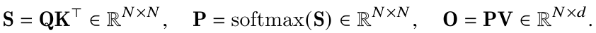

有 Sij = qiᵀkj，其中 qi、kj 分别是 Q、K 的第 i 列和第 j 列。定义 softmax 的归一化常数：

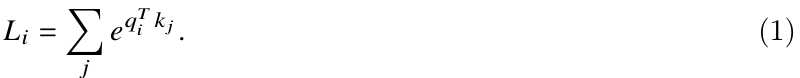

设 vj 为 V 的第 j 列，则输出的第 i 列为：

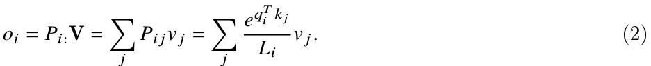

可见，一旦计算出 Li，就可以通过反复累加 exp(qiᵀkj)vj/Li，在不使用额外内存的情况下计算 oi。因此，前向传播仅需 O(n) 的额外内存：

1. 根据式（1）计算所有 i 对应的 Li，需要 O(n) 额外内存。

2. 根据式（2）计算所有 i 对应的 oi，需要 O(d) 额外内存。

### B.2　内存高效的反向传播

我们推导注意力的反向传播，并说明它也只需线性规模的内存。Rabe 和 Staats [66] 提出，对内存高效的前向传播使用梯度检查点，就可以避免反向传播所需的二次规模额外内存。我们则显式推导反向传播，展示如何以节省内存的方式完成计算。

设有标量损失函数 φ，输出梯度为 dO ∈ ℝn×d，其中 dO 表示 ∂φ/∂O。我们希望计算输入梯度 dQ, dK, dV ∈ ℝn×d，分别表示 ∂φ/∂Q、∂φ/∂K、∂φ/∂V。

梯度 dV 容易求得。手工应用反向模式自动微分，即链式法则，可得矩阵形式 dV = PᵀdO。因此：

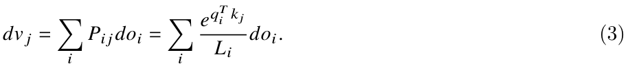

由于已经计算了 Li，只需反复累加，就可以在不使用额外内存的情况下计算 dvj。

梯度 dQ 和 dK 稍微复杂一些。我们先计算梯度 dP 和 dS。由式（2），dP = dOVᵀ，因此：

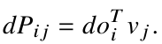

回顾 Pi: = softmax(Si:)。由于 y = softmax(x) 的雅可比矩阵为 diag(y) − yyᵀ，得到：

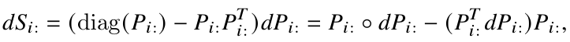

其中 ◦ 表示逐元素乘法。
定义：

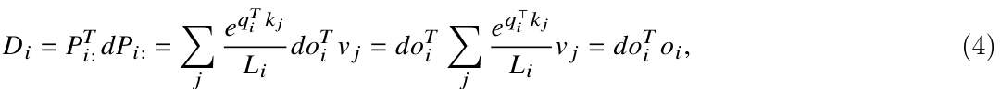

则有：

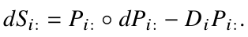

因此：

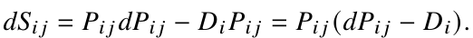

现在可以求得梯度 dQ 和 dK。由于 Sij = qiᵀkj，所以：

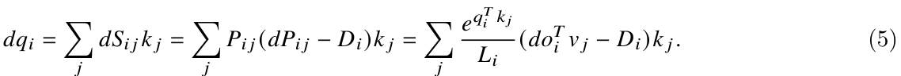

类似地，

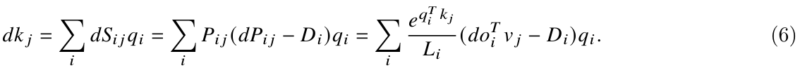

因此，反向传播也可以仅使用 O(n) 的额外内存完成：

1. 根据式（3）计算所有 j 对应的 dvj，需要 O(d) 额外内存。

2. 根据式（4）计算所有 i 对应的 Di，需要 O(n) 额外内存。

3. 根据式（5）计算所有 i 对应的 dqi，需要 O(d) 额外内存。

4. 根据式（6）计算所有 j 对应的 dkj，需要 O(d) 额外内存。

### B.3　FlashAttention：前向传播

本节给出 FlashAttention 前向传播的完整细节。给定输入序列 Q, K, V ∈ ℝN×d，我们希望计算注意力输出 O ∈ ℝN×d：

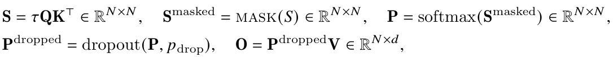

其中，τ ∈ ℝ 是 softmax 的缩放系数，通常为 1/√d；mask 是一种掩码函数，将输入的某些元素设为 −∞，其余元素保持不变，例如当批内序列长度不同时，用于填充位置的键填充掩码。dropout(x, p) 对 x 逐元素应用 dropout，即对每个元素 x，以概率 1 − p 输出 x/(1 − p)，以概率 p 输出 0。

完整过程见算法 2。我们保存输出 O、softmax 统计量 ℓ 和 m，以及伪随机数生成器状态 R，供反向传播使用。

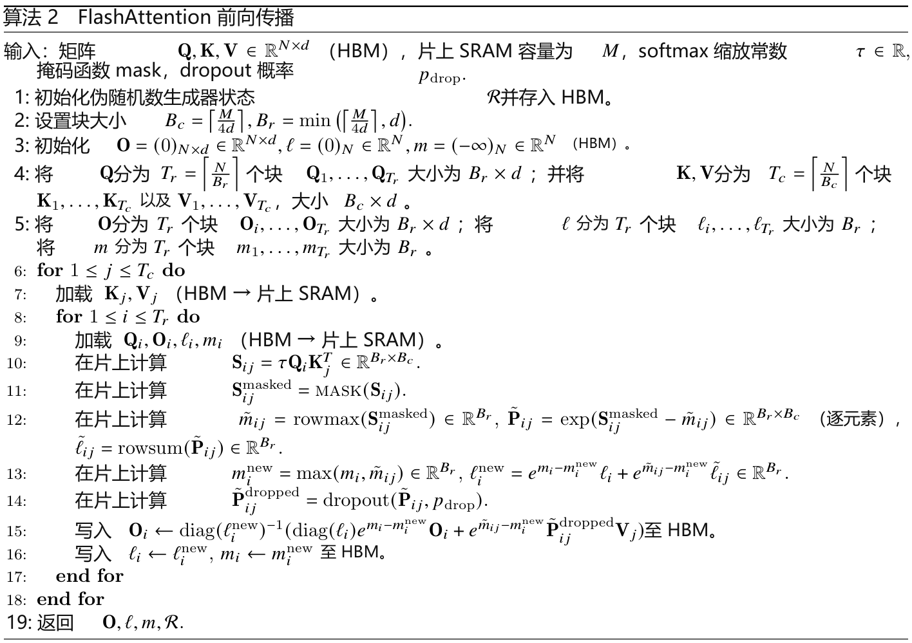

### B.4　FlashAttention：反向传播

本节给出 FlashAttention 反向传播的完整细节。给定输入序列 Q, K, V ∈ ℝN×d、输出 O ∈ ℝN×d 及输出梯度 dO，我们希望计算输入梯度 dQ, dK, dV ∈ ℝN×d。为完整起见，先在算法 3 中给出标准注意力的反向传播。

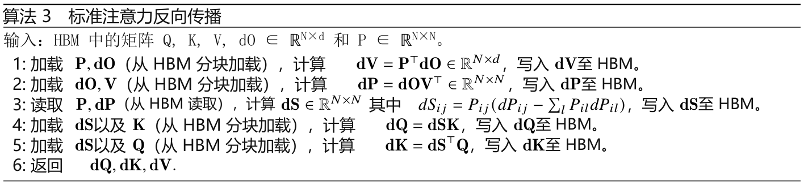

关于 FlashAttention 的反向传播，我们有以下两点观察：

1. 无需保存前向传播中大小为 O(N²) 的 dropout 掩码。可以保存前向传播中的伪随机数生成器状态，并在反向传播中重新生成 dropout 掩码。这样仅需 O(N) 的额外内存。

2. 计算 softmax 梯度时，利用式（4）计算 Di = Pi:ᵀdPi:，无需对长度为 N 的 Pi:、dPi: 进行归约，因为它们可能无法放入 SRAM。可以将其改写为 Di = doiᵀoi，只计算两个长度为 d 的向量的点积。

完整的 FlashAttention 反向传播过程见算法 4。从概念上看，它只是附录 B.2 推导的分块版本。

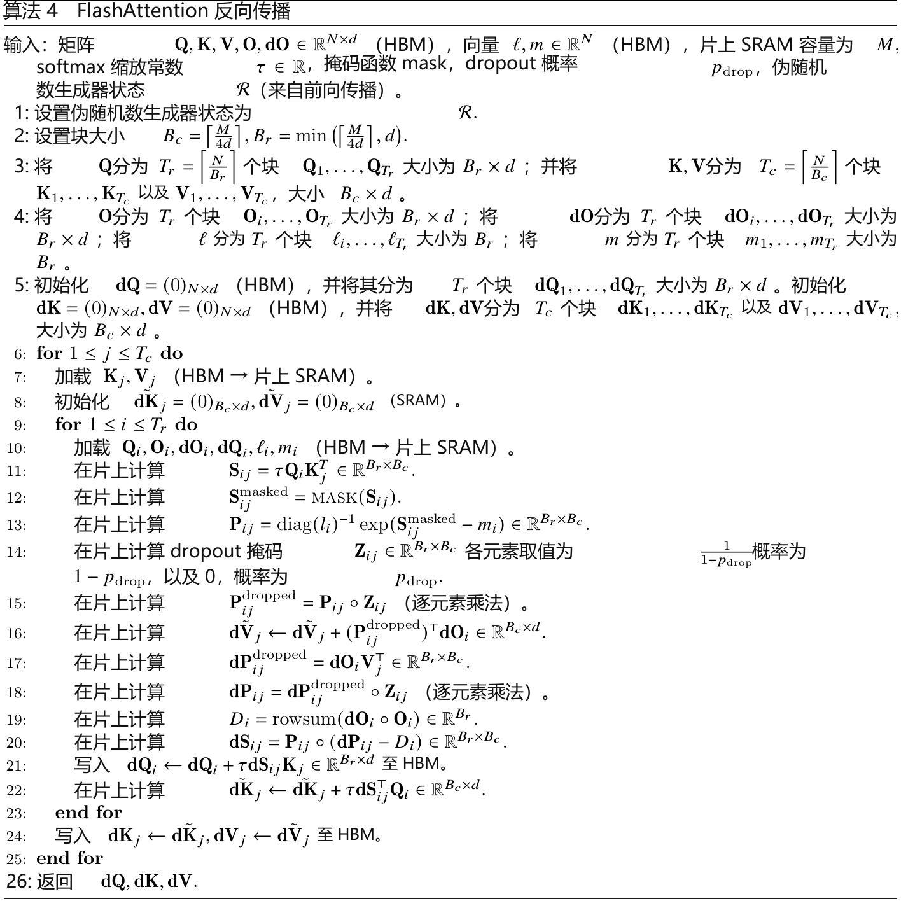

可见，与前向传播类似，反向传播执行 O(N²) 次浮点运算；除输入、输出、输出梯度和输入梯度外，仅需 O(N) 的额外内存。

与前向传播的分析（定理 2）类似，我们分析反向传播的 IO 复杂度。

定理 5。设 N 为序列长度、d 为注意力头维度、M 为 SRAM 容量，且 d ≤ M ≤ Nd。标准注意力（算法 0）的反向传播需要 Θ(Nd + N²) 次 HBM 访问，而 FlashAttention 反向传播（算法 4）需要 Θ(N²d²M⁻¹) 次 HBM 访问。

证明见附录 C。

### B.5　与 Rabe 和 Staats [66] 的比较

本节说明 FlashAttention 与 Rabe 和 Staats [66] 算法的若干异同。

从概念上看，两者都采用成熟的分块技术，或称 softmax 缩放 [51, 60]，对注意力矩阵的块进行操作。为降低内存占用，两种方法都避免在前向传播中存储大型注意力矩阵，而在反向传播中重新计算。

第一项主要区别是，Rabe 和 Staats [66] 侧重于降低总内存占用，即所需 GPU 内存的峰值；FlashAttention 则侧重于减少内存访问，即读写次数。如第 2 节所述，内存访问量是运行时间的主要决定因素。减少内存访问也必然降低内存需求的上界，例如某个操作产生 A 次内存访问，则其总内存需求至多为 A。因此，FlashAttention 比标准注意力快 2–4 倍，而 Rabe 和 Staats [66] 的速度与标准注意力相近或略慢。在总内存需求方面，两种方法都能显著节省内存。

第二项区别是，如何汇总每个块的信息并传递给下一个块。Rabe 和 Staats [66] 用每个块的临时输出及 softmax 归一化统计量概括该块，在前向传播结束时，再依据这些统计量合并所有块的临时输出，得到最终结果。FlashAttention 则在处理完每个块后增量更新输出（算法 1 第 12 行），因此只需一份输出，而不是为 K 个块保存 K 份输出。这意味着 FlashAttention 的总内存需求低于 Rabe 和 Staats [66]。

最后一项主要区别是反向传播的计算方式。Rabe 和 Staats [66] 使用梯度检查点，重新计算注意力矩阵以及每个块的临时输出。FlashAttention 则通过解析推导简化反向传播（附录 B.2 和 B.4），只重新计算注意力矩阵，不重新计算各块的临时输出，从而减少反向传播内存需求并带来加速。

## C　证明

定理 1 的证明。首先统计 FLOPs 与额外内存需求。

主要的浮点运算来自矩阵乘法。在内层循环中（算法 1 第 9 行），对于 Qi ∈ ℝBᵣ×d 和 Kj ∈ ℝB𝒸×d，计算 QiKjᵀ ∈ ℝBᵣ×B𝒸 需要 O(BrBcd) 次浮点运算。第 12 行还要对 P̃ij ∈ ℝBᵣ×B𝒸 和 Vj ∈ ℝB𝒸×d 计算 P̃ijVj ∈ ℝBᵣ×d，同样需要 O(BrBcd) 次。内层循环共执行 TcTr = ⌈N/Bc⌉⌈N/Br⌉ 次，因此 FLOPs 总量为：

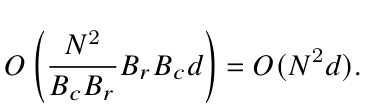

额外内存方面，需要 O(N) 内存保存统计量 ℓ、m。

下面对 0 ≤ j ≤ Tc 的 j 进行归纳，证明算法正确性。设 K:j ∈ ℝjB𝒸×d 为 K 的前 jBc 行，同理 V:j ∈ ℝjB𝒸×d 为 V 的前 jBc 行。设 S:,:j = QK:jᵀ ∈ ℝN×jB𝒸，P:,:j = softmax(S:,:j) ∈ ℝN×jB𝒸，softmax 按行计算。设 m(j)、ℓ(j)、O(j) 为外层循环（算法 1 第 5 行）第 j 次迭代后 HBM 中 m、ℓ、O 的值；这些值在每次外层迭代后都会更新。我们要证明，第 j 次外层迭代后，HBM 中计算得到：

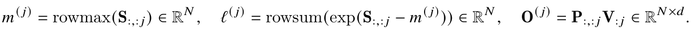

根据初始化（算法 1 第 2 行），j = 0 时，即执行任何外层迭代之前，命题成立。假设对某个 j = 0, …, Tc − 1 命题成立，需要证明 j + 1 时也成立。事实上，当内层循环（算法 1 第 10 行）更新统计量时，在第 j + 1 次外层迭代中，我们更新 m(j+1) = max(m(j), m̃)，其中 m̃ ∈ ℝN 是 S:,j:j+1 的逐行最大值，而 S:,j:j+1 是 S 从第 jBc 列到第 (j + 1)Bc − 1 列的切片。这意味着：

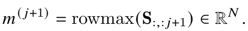

类似地，更新：

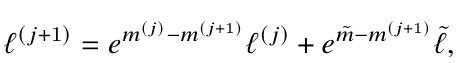

其中 ℓ̃ = rowsum(exp(S:,j:j+1 − m̃)) ∈ ℝN。采用第 3.1 节中相同的代数变换，得到：

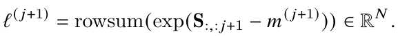

设 Vj:j+1 为 V 从第 jBc 列到第 (j + 1)Bc − 1 列的切片，还需要更新：

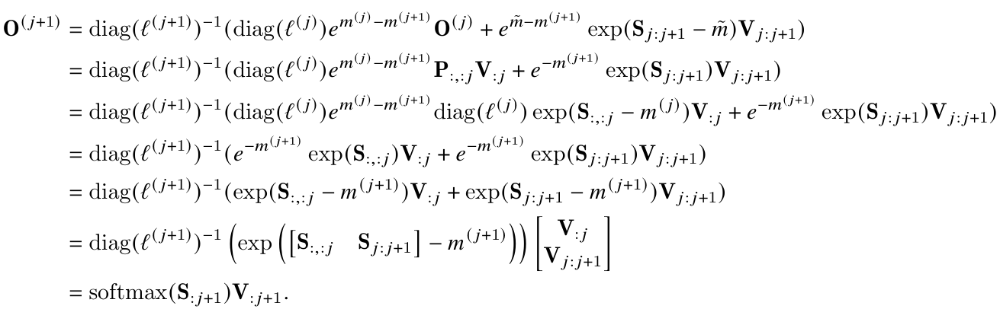

由此可见，命题对 j + 1 同样成立。根据归纳法，命题对所有 j = 0, …, Tc 均成立。
当 j = Tc 时，HBM 中 O 的最终值为 softmax(S)V = softmax(QKᵀ)V。□

定理 2 的证明。首先分析标准注意力实现的 IO 复杂度。输入 Q, K, V ∈ ℝN×d 位于 HBM，算法结束时输出 O ∈ ℝN×d 被写入 HBM。

第一步计算矩阵乘法 S = QKᵀ，需要从 HBM 读取 Q、K，并将输出 S ∈ ℝN×N 写入 HBM（算法 0 第 1 行），产生 Θ(Nd + N²) 次 HBM 访问。

第二步计算 P = softmax(S)，从 HBM 读取 S，再将 P 写入 HBM（第 2 行），产生 Θ(N²) 次 HBM 访问。

最后计算 O = PV，从全局内存读取 P、V，并将 O 写入 HBM（第 3 行），产生 Θ(Nd + N²) 次 HBM 访问。因此，标准注意力实现共需 Θ(Nd + N²) 次全局内存访问。

下面分析流式注意力的 IO 复杂度。根据算法 1，K 和 V 的每个元素仅从 HBM 加载一次（第 6 行）。我们对 Q 和 O 进行 Tc 次遍历，每次都从 HBM 加载完整的 Q 和 O（第 8 行）。因此，HBM 访问量为 Θ(Nd + NdTc) = Θ(NdTc)。

接下来推导块大小 Bc、Br 的约束。大小为 Bc × d 的 Kj、Vj 块必须能够放入片上内存，即：

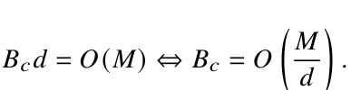

同样，大小为 Br × d 的 Qi、Oi 块必须能够放入片上内存，即：

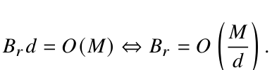

最后，大小为 Br × Bc 的 Sij 块也必须能够放入片上内存，即：

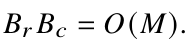

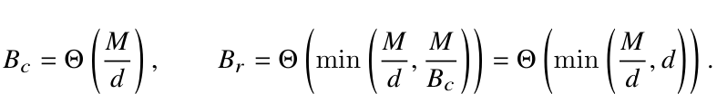

因此设定：

于是有：

由此，HBM 访问量为：

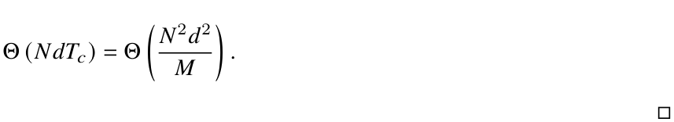

命题 3 的证明。采用反证法。假设存在一种计算精确注意力的算法，对于所有 M ∈ [d, Nd]，其 HBM 访问量均为：

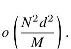

当 M = Θ(Nd) 时，HBM 访问量变为：

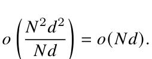

然而，注意力的输入矩阵 Q、K、V 与输出 O 的大小均为 Nd，且输入初始位于 HBM。因此，任何计算精确注意力的算法都至少需要 Ω(Nd) 次 HBM 访问，产生矛盾。□

定理 5 的证明。注意力反向传播的 IO 复杂度与前向传播（定理 2）非常相似，这里给出证明概要。

首先分析标准注意力反向传播的 IO 复杂度。输入 Q, K, V, dO ∈ ℝN×d 位于 HBM，算法结束时将输出 dQ, dK, dV ∈ ℝN×d 写入 HBM。每个步骤都需要从 HBM 加载大小为 Nd 或 N² 的输入，并将大小为 N² 或 Nd 的输出写入 HBM，产生 Θ(Nd + N²) 次 HBM 访问。

下面分析 FlashAttention 反向传播的 IO 复杂度。与定理 2 类似，K、V 的每个元素只从 HBM 加载一次；dK、dV 的每个元素只写入 HBM 一次。我们对 Q、O、dO 进行 Tc 次遍历，每次从 HBM 加载全部 Q、O、dO；同时对 dQ 进行 Tc 次遍历，每次从 HBM 读取完整 dQ，再写回 HBM。因此，HBM 访问量为 Θ(Nd + NdTc) = Θ(NdTc)。

与定理 2 的证明相同，块大小约束为：

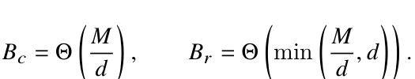

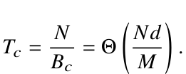

于是有：

由此，HBM 访问量为：

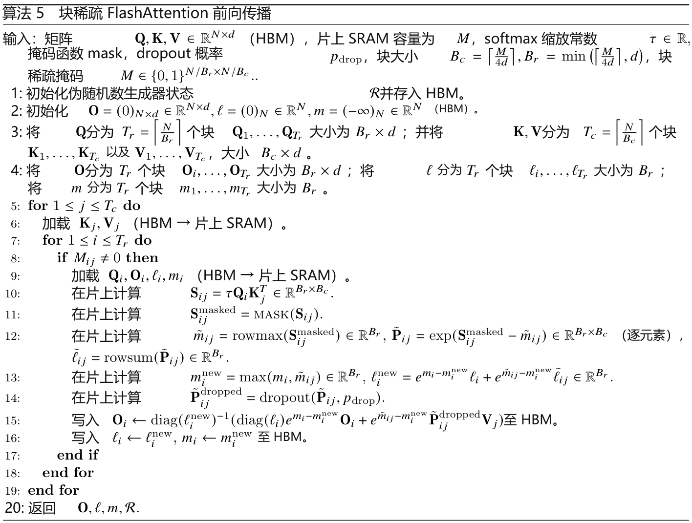

## D　扩展细节

### D.1　块稀疏 FlashAttention

算法 5 给出了完整的块稀疏 FlashAttention 算法。除跳过零块外，它与算法 2 完全相同。

下面证明块稀疏 FlashAttention 的 IO 复杂度。

命题 4 的证明。证明与定理 2 非常相似。对于块稀疏情形，只需加载与非零块对应的块。因此，HBM 访问量乘以 s，即块稀疏掩码中非零块的比例。不过，当 s 很小时，仍然必须写出结果 O ∈ ℝN×d。因此，HBM 访问量为：

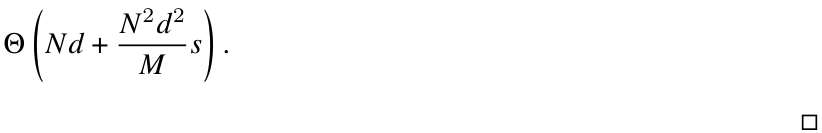

### D.2　潜在扩展

本节讨论 IO 感知方法在加速深度学习训练方面的若干潜在扩展。

多 GPU 注意力。大型语言模型在数百或数千张 GPU 上训练，通常将注意力计算划分到同一节点内的 4–8 张 GPU 上 [77]。这引入了一个新的存储层级：除了本地 GPU 的 SRAM 和 HBM，还需要考虑其他GPU 的 HBM。对于很长的序列，同一节点内的不同 GPU 可以考虑各存储层级之间的不对称性，协同完成注意力计算。

稀疏 MLP 层。典型的稠密 MLP 层受计算限制，而非访存限制。为提高效率，可以采用具有稀疏权重矩阵的 MLP 层 [17]。不过，许多稀疏 MLP 层反而受访存限制，加速比往往无法与稀疏程度成正比。我们认为，IO 感知实现能够缓解这一问题并发挥稀疏性的优势。我们期待这一方向的后续研究，以降低大型模型的计算需求并缩短实际运行时间。

核机器学习。FlashAttention 利用了这样一个事实：N × N 注意力矩阵是低秩矩阵 QKᵀ 的函数，而该矩阵的秩为 d ≪ N。因此，我们可以反复加载输入 Q、K，重新计算所需注意力矩阵块，显著减少 HBM 访问。核机器学习中也存在类似情形：N × N 核矩阵 K 的每个元素 Kij 都是两个长度为 d ≪ N 的向量的函数，因为它度量数据点 xi 与 xj 的相似性。KeOps 库 [8, 26] 是通过减少内存读写加速核运算的成功案例。我们希望这能推动核方法更重视减少 IO，而不仅仅是减少 FLOPs。

## E　完整实验结果

### E.1　BERT

我们遵循 MLPerf 1.1 参考实现的训练流程和超参数训练 BERT-large。具体而言，使用 LAMB 优化器，学习率 3.75 × 10⁻³，批大小 448，最多训练 7100 步。掩码语言建模的验证准确率达到目标 72.0% 后即停止训练，并测量实际运行时间。训练采用 FP16 精度，使用 Apex AMP，优化级别为 O2。

我们将结果与 NVIDIA 提交给 MLPerf 1.1 的训练速度进行比较（表 1）。使用 MLPerf 1.1 参考实现提供的相同训练集／验证集划分，尤其是在与 NVIDIA 基线完全相同的 10,000 个验证样本上评估。

模型在 8 张 A100-80GB GPU 上训练。每次训练耗时 16–19 分钟，结果取 10 次运行的平均值。

### E.2　GPT-2

我们使用 HuggingFace Transformers 库及 NVIDIA Megatron-LM 仓库中 GPT-2 [67] 的标准实现，并遵循 Megatron-LM 的训练方案。

有效批大小为 512，通过梯度累积适配可用 GPU 内存。使用 AdamW 优化器，GPT-2 small 的学习率为 6 × 10⁻⁴，GPT-2 medium 为 1.5 × 10⁻⁴，权重衰减均为 0.1。所有模型采用相同超参数训练 400K 步，全部实现均使用混合精度训练（PyTorch AMP）。

数据集为 OpenWebText，分词器为 GPT-2 BPE。随机选取数据集的 0.5% 作为验证集，其余作为训练集。验证集只随机划分一次，所有模型均在同一验证集上评估。

模型在 8 张 A100-40GB GPU 上训练，并测量实际训练时间。GPT-2 small 的训练耗时为 2.7–9.5 天，GPT-2 medium 为 6.9–21.0 天（表 2）。

图 4 展示 GPT-2 small／medium 分别采用 HuggingFace 和 FlashAttention 实现时，验证集困惑度随训练过程的变化。FlashAttention 与基线实现的行为一致，两种实现的验证困惑度曲线几乎完全重合。

长文档分类。对于 MIMIC-III 和 ECtHR，我们采用 Dai 等 [13] 的超参数。

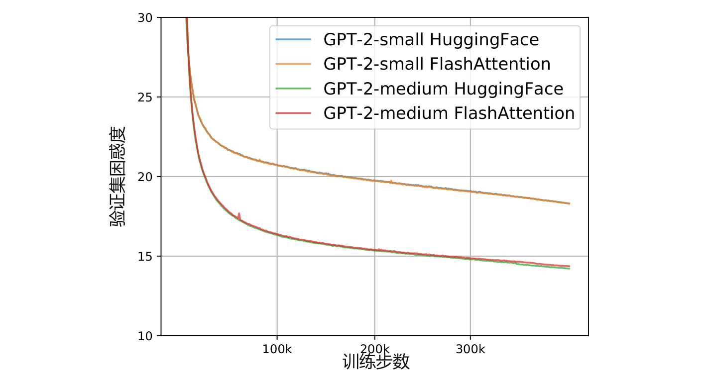

**图 4：GPT-2 small／medium 两种实现的验证集困惑度。结果确认，FlashAttention 与 HuggingFace 基线实现具有相同的验证曲线。**

### E.3　LRA 细节

我们遵循 Long Range Arena 论文 [80]、代码仓库（https://github.com/google-research/long-range-arena）及 Nyströmformer 复现实验 [90] 的超参数。为避免低估基线，如果在五个任务中的任一任务上无法复现某个基线的表现，就报告 Tay 等 [80] 或 Xiong 等 [90] 对该基线在该任务上给出的较好结果。

经过超参数调优后，几乎所有注意力方法在五个 LRA 任务上都达到相近的准确率。

除 Performer（混合精度不稳定）和 Local Attention（实现不支持 FP16）外，所有方法都采用混合精度训练。

总体实际运行时间加速比，取五个任务各自加速比的几何平均值。

Path-X。对于 Path-X 和 Path-256，我们采用 Long Range Arena 论文 [80] 中 PathFinder-32 实验的超参数。两者都先在 Path-64 上预训练模型，取训练 200 个 epoch 后的检查点，对位置嵌入进行上采样，即在空间上按网格复制位置嵌入，然后在下游任务上微调 200 个 epoch，采用 1 个 epoch 的线性预热和余弦学习率衰减。对于 Path-X，选择验证准确率最高的检查点，采用相同预热和学习率再微调 200 个 epoch。这会使 FlashAttention 在 Path-X 上的准确率再提高约 4 个百分点，但之后模型开始过拟合。

### E.4　与 Apex FMHA 的比较

我们将本文方法／实现与 Apex FMHA 进行比较（https://github.com/NVIDIA/apex/tree/master/apex/contrib/csrc/fmha）。

在项目启动时，据我们所知，Apex FMHA 是最快的注意力实现，专门针对长度不超过 512 的短序列。实际上，截至 MLPerf 1.1 [58]，在 NVIDIA GPU 上运行的 BERT 训练基准提交中，几乎全部模型代码都使用 FMHA。由于FMHA 面向 BERT 模型，因此只支持头维度 64，且只能在 A100 GPU 上运行。FMHA 将注意力计算 dropout(softmax(mask(QKᵀ)))V 融合成一个 CUDA 内核。在前向传播中，它把注意力矩阵 softmax(mask(QKᵀ)) 存入 HBM，供梯度计算使用。因此，它并不能显著节省内存，尽管短序列场景通常不以内存占用为首要问题。

**表 7：不同序列长度下 FlashAttention 与 FMHA 的运行时间（ms）。启用掩码与 dropout，在 A100-SXM4-40GB GPU 上测量；批大小 64，16 个注意力头，头维度 64，即 BERT-large 的配置。**

| 注意力方法 | 128 | 256 | 512 |
| --- | --- | --- | --- |
| Apex FMHA 前向 | 0.10 | 0.29 | 1.14 |
| FlashAttention 前向 | **0.08** | **0.22** | **0.81** |
| Apex FMHA 反向 | **0.17** | **0.52** | **1.81** |
| FlashAttention 反向 | 0.20 | 0.53 | 2.00 |
| Apex FMHA 前向＋反向 | **0.27** | 0.81 | 2.95 |
| FlashAttention 前向＋反向 | 0.28 | **0.75** | **2.81** |

我们以 FMHA 代码为起点，采用第 3 节所述的分块与重计算两项成熟技术，处理长序列并节省内存。因此可以支持长得多的序列，例如最高 64K；还支持更多头维度（16、32、64、128）及更广泛的 GPU 类型，即写作时所有 Turing 和 Ampere GPU。

表 7 比较 FlashAttention 与 Apex FMHA 在短序列下的性能，因为 FMHA 只支持不超过 512 的序列长度。总体而言，FlashAttention 前向传播略快，反向传播略慢。这是因为我们在前向传播时不保存注意力矩阵，而在反向传播中重新计算。相较 FMHA，FlashAttention 的总耗时在序列长度 128 时约慢 4%，256 时快 8%，512 时快 5%。

### E.5　不同硬件与配置下的加速效果

不同类型和代际的 GPU，其加速比会随着 HBM 带宽、SRAM 容量而变化。本节测量 FlashAttention 在不同 GPU 和配置下的加速效果。

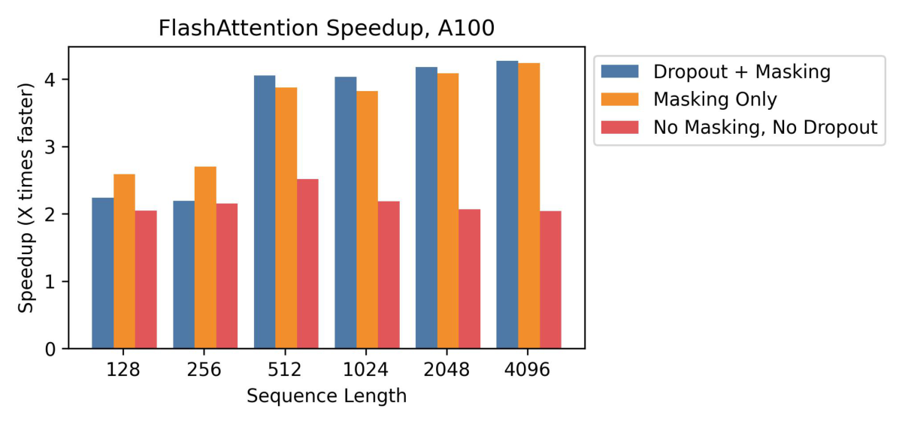

**图 5：A100 上不同序列长度下，相对于标准 PyTorch 注意力的加速比。**

A100。图 5 展示 A100 GPU 上不同序列长度下的加速比，批大小 8，头维度 64，12 个注意力头。通常可获得 2–4 倍加速；使用 dropout 和掩码时，内核融合带来的加速更加明显。

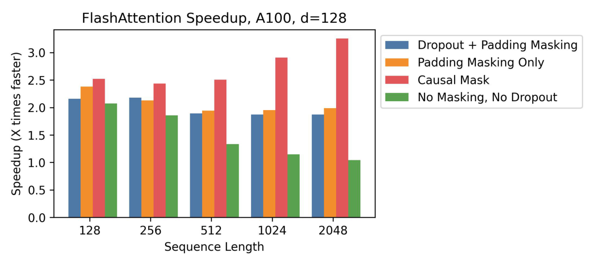

**图 6：A100 上、头维度为 128 时，不同序列长度下相对于标准 PyTorch 注意力的加速比。**

A100，头维度 128。增加头维度也会改变加速比。每个块需要更多内存，因此必须缩小块，才能放入 SRAM。图 6 展示 A100 上头维度为 128 时的加速比，批大小 16，12 个注意力头。总体加速有所下降，但采用因果掩码、屏蔽一半块时，仍能获得明显加速，最高达 3 倍。

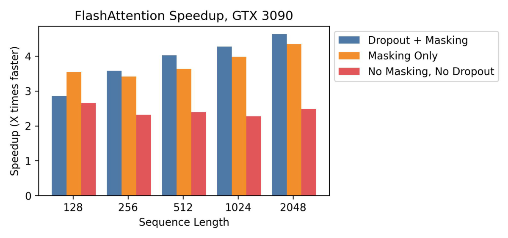

**图 7：RTX 3090 上不同序列长度下，相对于标准 PyTorch 注意力的加速比。**

RTX 3090。图 7 展示 RTX 3090 GPU 上的加速比，批大小 12，12 个注意力头。RTX 3090 上的加速比略高，为 2.5–4.5 倍，因为其内存带宽低于 A100，约为 900 GB/s，而 A100 为 1.5 TB/s。

T4。图 8 展示 T4 GPU 上的加速比。T4 的 SRAM 比 A100 小，因此 FlashAttention 必须采用更小的块。由此，T4 上观察到的加速比更低，与第 3.2 节的 IO 复杂度分析一致。T4 GPU 常用于推理，因此我们也单独报告前向传播的加速比。

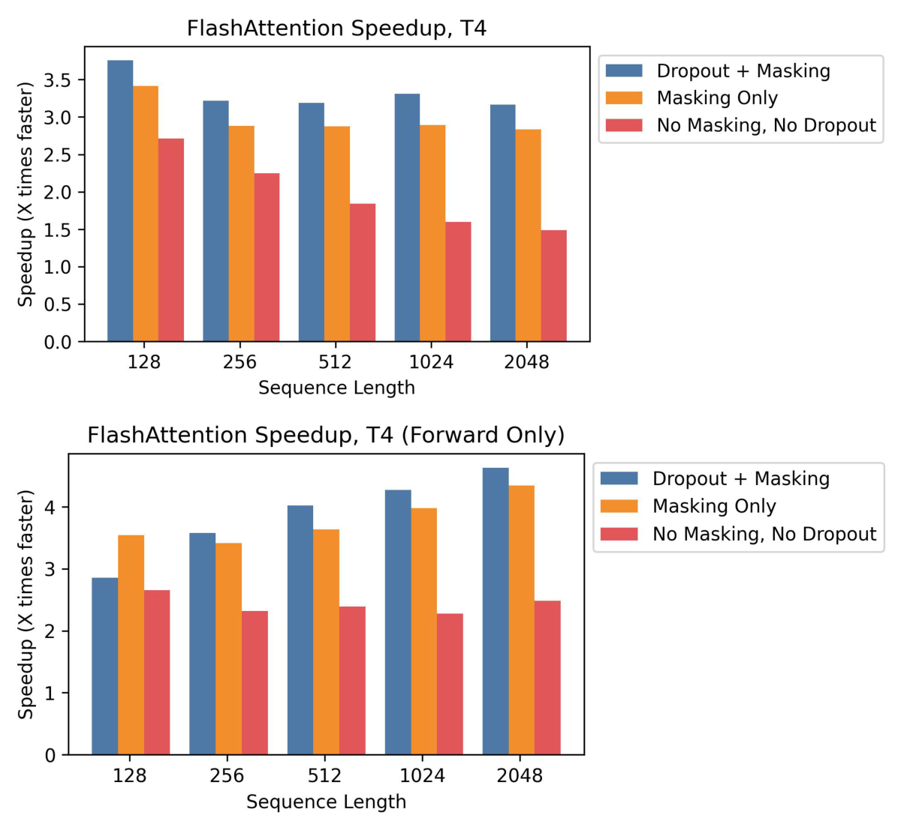

**图 8：T4 上不同序列长度下，相对于标准 PyTorch 注意力的加速比。上：前向＋反向传播合计。下：仅前向传播。**

### E.6　完整基准测试结果

本节报告 A100 上的完整基准测试结果与实验细节。

基线。我们与 PyTorch／HuggingFace 和 Megatron 的精确注意力参考实现，以及近似注意力、稀疏注意力参考实现进行比较。近似注意力包括 Reformer [51]、Local Attention [68]、Linformer Attention [84]、Smyrf [19] 和 LongShortFormer（LSFormer）[94]。稀疏注意力包括 OpenAI 的 Block-Sparse Attention [11]、Longformer [3] 和 BigBird Attention [92]。对于近似和稀疏注意力，将压缩后序列长度设为原长度的 1/8 与 256 中的较小值。

设置。我们在一台配有一张 A100 GPU、40 GB GPU HBM 的机器上，测量注意力计算的运行时间和内存占用：8 个注意力头，每个头维度 64，批大小 16。实验中改变序列长度。Q、K、V 使用随机向量，不计入从隐藏层进行投影的时间。Dropout 概率为 0.1；掩码采用填充掩码，其长度在总序列长度减 20 到总序列长度之间均匀随机采样。运行时间取 100 次注意力调用测量的平均值。由于内存占用不随运行次数变化，因此只测量一次。

**表 8：实验结果表索引。**

| Dropout | 掩码 | 阶段 | 表 |
| --- | --- | --- | --- |
| 是 | 是 | 前向 | 表 9 |
| 是 | 是 | 反向 | 表 10 |
| 是 | 是 | 前向＋反向 | 表 11 |
| 否 | 是 | 前向 | 表 12 |
| 否 | 是 | 反向 | 表 13 |
| 否 | 是 | 前向＋反向 | 表 14 |
| 是 | 否 | 前向 | 表 15 |
| 是 | 否 | 反向 | 表 16 |
| 是 | 否 | 前向＋反向 | 表 17 |
| 否 | 否 | 前向 | 表 18 |
| 否 | 否 | 反向 | 表 19 |
| 否 | 否 | 前向＋反向 | 表 20 |
| 否 | 否 | 内存占用（前向＋反向） | 表 21 |

**表 9：不同序列长度下，各种精确／近似／稀疏注意力机制的前向传播耗时（ms），启用 dropout 和掩码。最优值加粗，次优值加下划线。**

| 注意力方法 | 128 | 256 | 512 | 1024 | 2048 | 4096 | 8192 | 16384 | 32768 | 65536 |
| --- | --- | --- | --- | --- | --- | --- | --- | --- | --- | --- |
| PyTorch Attention | 0.36 | 0.34 | 0.78 | 2.54 | 9.33 | 36.33 | - | - | - | - |
| Megatron | 0.40 | 0.40 | 1.10 | 3.65 | 16.19 | - | - | - | - | - |
| Reformer | 2.03 | 3.15 | 5.67 | 11.02 | 22.59 | 46.14 | 97.38 | 212.13 | - | - |
| Local Attention | 0.83 | 0.86 | 1.01 | 2.20 | 7.13 | 14.32 | 28.60 | 57.79 | 117.67 | - |
| Linformer | 0.67 | 0.52 | 0.69 | <u>0.71</u> | <u>1.65</u> | <u>3.18</u> | <u>6.15</u> | <u>12.16</u> | <u>24.17</u> | <u>52.39</u> |
| Smyrf | 2.27 | 2.34 | 3.91 | 7.44 | 14.71 | 29.22 | 58.27 | 116.41 | - | - |
| LSformer | 1.18 | 1.27 | 1.34 | 3.38 | 11.40 | 22.55 | 44.95 | 89.76 | 179.66 | - |
| Block Sparse | 1.12 | 1.11 | 2.13 | 2.77 | 6.95 | 20.91 | - | - | - | - |
| Longformer | 1.22 | 1.14 | 1.08 | 1.95 | 5.72 | 12.98 | - | - | - | - |
| BigBird | 1.13 | 1.12 | 1.12 | 1.77 | 6.03 | 13.68 | - | - | - | - |
| FlashAttention | **0.04** | <u>0.06</u> | <u>0.21</u> | 0.82 | 2.85 | 10.41 | 41.74 | 167.19 | 670.76 | 2682.35 |
| Block-Sparse FlashAttention | <u>0.06</u> | **0.06** | **0.06** | **0.12** | **0.44** | **0.86** | **1.70** | **3.29** | **6.55** | **13.34** |

我们报告前向传播、反向传播及前向＋反向合计的计时结果。每种方法都分别测试启用或关闭 dropout、掩码及二者组合的情况，但 Block Sparse、Longformer 和 BigBird 除外。由于外部库中的错误，这些方法在启用掩码时无法成功运行反向传播；为避免低估其性能，我们在不使用掩码的情况下测量。所有测量均采用 FP16，唯独 Local Attention 的实现仅支持 FP32。

对于每个基线，我们逐步增加序列长度，直到 GPU 内存不足，但以下实现有额外限制：Megatron 不支持超过 2048 的序列；Block-Sparse（OpenAI）不支持超过 4096；Longformer 和 BigBird 不支持超过 8092。

内存占用在前向＋反向合计的情况下测量，不启用 dropout 或掩码。

结果。表 8 汇总全部实验配置，并给出对应结果表的索引。

**表 10：不同序列长度下，各种精确／近似／稀疏注意力机制的反向传播耗时（ms），启用 dropout 和掩码。最优值加粗，次优值加下划线。**

| 注意力方法 | 128 | 256 | 512 | 1024 | 2048 | 4096 | 8192 | 16384 | 32768 | 65536 |
| --- | --- | --- | --- | --- | --- | --- | --- | --- | --- | --- |
| PyTorch Attention | 0.37 | 0.49 | 1.66 | 5.81 | 22.32 | 87.67 | - | - | - | - |
| Megatron | 0.35 | 0.32 | 0.77 | 2.42 | 8.43 | - | - | - | - | - |
| Reformer | 2.37 | 4.59 | 8.91 | 17.68 | 35.13 | 70.05 | 140.01 | - | - | - |
| Local Attention | 0.55 | 0.62 | 1.49 | 4.03 | 13.78 | 27.61 | 55.20 | 110.27 | 221.40 | - |
| Linformer | 0.89 | 0.80 | 0.81 | <u>0.93</u> | <u>2.48</u> | <u>4.75</u> | <u>9.29</u> | <u>18.27</u> | <u>36.53</u> | - |
| Smyrf | 1.41 | 2.83 | 5.43 | 10.72 | 21.25 | 42.31 | 84.48 | 168.95 | - | - |
| LSformer | 1.75 | 1.76 | 3.01 | 7.50 | 20.07 | 39.08 | 76.39 | 150.82 | - | - |
| Block Sparse | 1.29 | 1.28 | 2.18 | 3.04 | 7.27 | 21.16 | - | - | - | - |
| Longformer | 1.27 | 1.31 | 1.29 | 2.04 | 5.24 | 10.74 | 25.95 | - | - | - |
| BigBird | 1.33 | 1.28 | 1.32 | 1.81 | 5.55 | 11.44 | 27.45 | - | - | - |
| FlashAttention | **0.30** | **0.26** | <u>0.68</u> | 2.02 | 6.84 | 26.89 | 105.70 | 418.96 | 1666.89 | <u>6660.44</u> |
| Block-Sparse FlashAttention | **0.30** | <u>0.27</u> | **0.29** | **0.59** | **1.50** | **2.94** | **5.82** | **11.85** | **23.98** | **47.61** |

**表 11：不同序列长度下，各种精确／近似／稀疏注意力机制的前向＋反向传播耗时（ms），启用 dropout 和掩码。最优值加粗，次优值加下划线。**

| 注意力方法 | 128 | 256 | 512 | 1024 | 2048 | 4096 | 8192 | 16384 | 32768 | 65536 |
| --- | --- | --- | --- | --- | --- | --- | --- | --- | --- | --- |
| PyTorch Attention | 0.84 | 0.86 | 2.35 | 8.29 | 31.75 | 124.19 | - | - | - | - |
| Megatron | 0.87 | 0.89 | 1.33 | 4.21 | 16.50 | - | - | - | - | - |
| Reformer | 4.30 | 7.76 | 14.60 | 28.74 | 57.79 | 116.34 | 237.57 | - | - | - |
| Local Attention | 1.40 | 1.60 | 2.06 | 6.06 | 20.94 | 42.01 | 84.08 | 168.48 | 339.45 | - |
| Linformer | 1.57 | 1.49 | 1.55 | <u>1.60</u> | <u>4.19</u> | <u>8.04</u> | <u>15.71</u> | <u>30.92</u> | <u>61.47</u> | - |
| Smyrf | 3.41 | 5.08 | 9.35 | 18.18 | 36.03 | 71.68 | 143.04 | 285.87 | - | - |
| LSformer | 3.08 | 3.10 | 4.26 | 10.90 | 31.59 | 61.72 | 121.51 | 241.18 | - | - |
| Block Sparse | 2.54 | 2.52 | 3.71 | 5.44 | 13.29 | 39.19 | - | - | - | - |
| Longformer | 2.47 | 2.49 | 2.51 | 3.10 | 10.39 | 22.49 | 60.44 | - | - | - |
| BigBird | 2.51 | 2.49 | 2.52 | 3.40 | 10.97 | 23.89 | 63.28 | - | - | - |
| FlashAttention | **0.43** | **0.41** | <u>0.95</u> | 2.55 | 9.56 | 37.49 | 147.75 | 586.61 | 2339.11 | <u>9341.30</u> |
| Block-Sparse FlashAttention | <u>0.44</u> | <u>0.44</u> | **0.45** | **0.89** | **1.95** | **4.12** | **7.64** | **16.60** | **32.73** | **64.11** |

**表 12：不同序列长度下，各种精确／近似／稀疏注意力机制的前向传播耗时（ms），启用掩码。最优值加粗，次优值加下划线。**

| 注意力方法 | 128 | 256 | 512 | 1024 | 2048 | 4096 | 8192 | 16384 | 32768 | 65536 |
| --- | --- | --- | --- | --- | --- | --- | --- | --- | --- | --- |
| PyTorch Attention | 0.30 | 0.30 | 0.63 | 1.93 | 7.08 | 27.45 | 112.90 | - | - | - |
| Megatron | 0.45 | 0.41 | 0.43 | 1.52 | 5.80 | - | - | - | - | - |
| Reformer | 1.87 | 3.00 | 5.37 | 10.43 | 21.40 | 43.83 | 92.80 | 203.24 | - | - |
| Local Attention | 0.70 | 0.81 | 1.02 | 2.09 | 6.64 | 13.34 | 26.77 | 54.02 | 110.11 | - |
| Linformer | 0.63 | 0.50 | 0.67 | <u>0.65</u> | <u>1.36</u> | <u>2.60</u> | <u>5.04</u> | <u>9.92</u> | <u>19.69</u> | <u>43.47</u> |
| Smyrf | 2.38 | 2.32 | 3.76 | 7.16 | 14.14 | 28.09 | 55.98 | 111.73 | - | - |
| LSformer | 1.22 | 1.29 | 1.44 | 3.28 | 10.99 | 21.72 | 43.29 | 86.32 | 172.76 | - |
| Block Sparse | 0.96 | 1.04 | 1.66 | 2.16 | 5.41 | 16.15 | - | - | - | - |
| Longformer | 0.99 | 0.98 | 0.99 | 1.56 | 4.79 | 11.07 | 32.98 | - | - | - |
| BigBird | 0.96 | 1.02 | 1.02 | 1.48 | 5.05 | 11.59 | 34.16 | - | - | - |
| FlashAttention | **0.03** | **0.04** | <u>0.17</u> | 0.68 | 2.28 | 8.40 | 33.55 | 134.14 | 537.50 | 2150.88 |
| Block-Sparse FlashAttention | <u>0.05</u> | **0.04** | **0.05** | **0.11** | **0.35** | **0.68** | **1.33** | **2.54** | **5.34** | **10.73** |

**表 13：不同序列长度下，各种精确／近似／稀疏注意力机制的反向传播耗时（ms），启用掩码。最优值加粗，次优值加下划线。**

| 注意力方法 | 128 | 256 | 512 | 1024 | 2048 | 4096 | 8192 | 16384 | 32768 | 65536 |
| --- | --- | --- | --- | --- | --- | --- | --- | --- | --- | --- |
| PyTorch Attention | 0.44 | 0.46 | 1.53 | 5.33 | 20.34 | 79.87 | - | - | - | - |
| Megatron | 0.29 | 0.31 | 0.65 | 1.95 | 6.49 | - | - | - | - | - |
| Reformer | 2.31 | 4.47 | 8.68 | 17.20 | 34.14 | 68.09 | 136.02 | - | - | - |
| Local Attention | 0.51 | 0.62 | 1.30 | 3.81 | 13.33 | 26.72 | 53.41 | 106.82 | 214.15 | - |
| Linformer | 0.76 | 0.81 | 0.94 | <u>0.87</u> | <u>2.24</u> | <u>4.25</u> | <u>8.35</u> | <u>16.38</u> | <u>32.67</u> | <u>72.11</u> |
| Smyrf | 1.34 | 2.77 | 5.30 | 10.46 | 20.73 | 41.27 | 82.41 | 164.86 | - | - |
| LSformer | 1.66 | 1.61 | 3.09 | 7.42 | 19.68 | 38.35 | 74.92 | 147.86 | - | - |
| Block Sparse | 1.24 | 1.25 | 2.04 | 2.91 | 6.78 | 19.67 | - | - | - | - |
| Longformer | 1.27 | 1.23 | 1.24 | 1.85 | 4.99 | 10.21 | 24.89 | - | - | - |
| BigBird | 1.43 | 1.50 | 1.44 | 1.69 | 5.25 | 10.86 | 26.26 | - | - | - |
| FlashAttention | **0.21** | **0.22** | <u>0.62</u> | 1.84 | 5.77 | 22.25 | 86.21 | 338.91 | 1343.91 | 5361.09 |
| Block-Sparse FlashAttention | <u>0.22</u> | <u>0.22</u> | **0.26** | **0.57** | **1.55** | **3.13** | **5.98** | **12.21** | **23.49** | **47.85** |

**表 14：不同序列长度下，各种精确／近似／稀疏注意力机制的前向＋反向传播耗时（ms），启用掩码。最优值加粗，次优值加下划线。**

| 注意力方法 | 128 | 256 | 512 | 1024 | 2048 | 4096 | 8192 | 16384 | 32768 | 65536 |
| --- | --- | --- | --- | --- | --- | --- | --- | --- | --- | --- |
| PyTorch Attention | 0.80 | 0.81 | 2.08 | 7.23 | 27.51 | 107.58 | - | - | - | - |
| Megatron | 0.81 | 0.83 | 1.09 | 3.36 | 12.39 | - | - | - | - | - |
| Reformer | 4.16 | 7.46 | 14.06 | 27.68 | 55.66 | 112.15 | 229.37 | - | - | - |
| Local Attention | 1.39 | 1.68 | 2.08 | 5.83 | 20.04 | 40.16 | 80.44 | 161.35 | 325.11 | - |
| Linformer | 1.51 | 1.42 | 1.56 | <u>1.67</u> | <u>3.67</u> | <u>6.99</u> | <u>13.63</u> | <u>26.77</u> | <u>53.36</u> | <u>117.56</u> |
| Smyrf | 3.38 | 4.93 | 9.07 | 17.66 | 34.94 | 69.55 | 138.72 | 277.41 | - | - |
| LSformer | 3.08 | 3.10 | 4.26 | 10.90 | 31.59 | 61.72 | 121.51 | 241.18 | - | - |
| Block Sparse | 2.39 | 2.40 | 3.31 | 5.02 | 12.25 | 35.94 | - | - | - | - |
| Longformer | 2.36 | 2.34 | 2.38 | 2.94 | 9.83 | 21.35 | 58.12 | - | - | - |
| BigBird | 2.35 | 2.35 | 2.37 | 3.25 | 10.36 | 22.57 | 60.63 | - | - | - |
| FlashAttention | **0.32** | **0.30** | <u>0.83</u> | 2.37 | 7.95 | 30.77 | 119.98 | 473.65 | 1883.43 | 7513.01 |
| Block-Sparse FlashAttention | <u>0.34</u> | <u>0.34</u> | **0.36** | **0.69** | **1.85** | **3.89** | **7.16** | **14.85** | **30.46** | **60.03** |

**表 15：不同序列长度下，各种精确／近似／稀疏注意力机制的前向传播耗时（ms），启用 dropout。最优值加粗，次优值加下划线。**

| 注意力方法 | 128 | 256 | 512 | 1024 | 2048 | 4096 | 8192 | 16384 | 32768 | 65536 |
| --- | --- | --- | --- | --- | --- | --- | --- | --- | --- | --- |
| PyTorch Attention | <u>0.26</u> | <u>0.24</u> | 0.57 | 1.80 | 6.56 | 25.34 | - | - | - | - |
| Megatron | 0.27 | 0.27 | 0.56 | 1.88 | 6.56 | - | - | - | - | - |
| Reformer | 1.83 | 2.96 | 5.31 | 10.33 | 21.19 | 43.42 | 91.96 | 201.34 | - | - |
| Local Attention | 0.51 | 0.60 | 0.78 | 2.01 | 6.23 | 12.52 | 25.07 | 50.50 | 102.18 | - |
| Linformer | 0.47 | 0.37 | <u>0.49</u> | **0.52** | <u>1.37</u> | <u>2.65</u> | <u>5.12</u> | <u>10.13</u> | <u>20.25</u> | <u>44.16</u> |
| Smyrf | 2.12 | 2.01 | 3.15 | 5.97 | 11.83 | 23.36 | 46.48 | 92.72 | - | - |
| LSformer | 1.28 | 1.33 | 1.51 | 3.39 | 11.40 | 22.54 | 44.96 | 89.85 | 179.73 | - |
| Block Sparse | 1.03 | 1.00 | 1.72 | 2.39 | 5.96 | 17.88 | - | - | - | - |
| Longformer | 1.02 | 1.03 | 1.03 | 1.73 | 5.10 | 11.63 | 34.22 | - | - | - |
| BigBird | 0.99 | 1.03 | 1.01 | 1.58 | 5.36 | 12.27 | 35.56 | - | - | - |
| FlashAttention | **0.10** | **0.10** | **0.22** | 0.83 | 2.81 | 10.38 | 41.63 | 167.01 | 668.74 | 2678.11 |
| Block-Sparse FlashAttention | 0.54 | 0.51 | 0.68 | <u>0.61</u> | **0.67** | **1.10** | **1.89** | **3.71** | **7.18** | **14.41** |

**表 16：不同序列长度下，各种精确／近似／稀疏注意力机制的反向传播耗时（ms），启用 dropout。最优值加粗，次优值加下划线。**

| 注意力方法 | 128 | 256 | 512 | 1024 | 2048 | 4096 | 8192 | 16384 | 32768 | 65536 |
| --- | --- | --- | --- | --- | --- | --- | --- | --- | --- | --- |
| PyTorch Attention | 0.44 | 0.35 | 0.90 | 2.94 | 10.77 | 41.67 | - | - | - | - |
| Megatron | 0.28 | 0.33 | 0.92 | 2.94 | 10.80 | - | - | - | - | - |
| Reformer | 2.24 | 4.34 | 8.39 | 16.62 | 33.02 | 65.77 | 131.52 | - | - | - |
| Local Attention | 0.51 | 0.58 | 1.41 | 3.71 | 12.96 | 25.98 | 51.94 | 103.72 | 207.78 | - |
| Linformer | 0.84 | 0.74 | 0.79 | <u>0.85</u> | <u>2.28</u> | <u>4.37</u> | <u>8.66</u> | <u>17.02</u> | <u>33.78</u> | - |
| Smyrf | 1.27 | 2.56 | 4.90 | 9.66 | 19.16 | 38.13 | 76.17 | 152.39 | - | - |
| LSformer | 1.67 | 1.77 | 3.03 | 7.52 | 20.10 | 39.13 | 76.35 | 150.83 | - | - |
| Block Sparse | 1.27 | 1.36 | 2.15 | 3.04 | 7.27 | 21.18 | - | - | - | - |
| Longformer | 1.28 | 1.34 | 1.38 | 1.98 | 5.24 | 10.74 | 25.95 | - | - | - |
| BigBird | 1.48 | 1.47 | 1.50 | 1.81 | 5.57 | 11.38 | 27.43 | - | - | - |
| FlashAttention | **0.15** | <u>0.18</u> | <u>0.58</u> | 1.86 | 6.50 | 26.21 | 104.27 | 416.10 | 1661.92 | <u>6643.01</u> |
| Block-Sparse FlashAttention | <u>0.17</u> | **0.17** | **0.17** | **0.40** | **1.10** | **2.04** | **4.43** | **9.33** | **18.28** | **37.31** |

**表 17：不同序列长度下，各种精确／近似／稀疏注意力机制的前向＋反向传播耗时（ms），启用 dropout。最优值加粗，次优值加下划线。**

| 注意力方法 | 128 | 256 | 512 | 1024 | 2048 | 4096 | 8192 | 16384 | 32768 | 65536 |
| --- | --- | --- | --- | --- | --- | --- | --- | --- | --- | --- |
| PyTorch Attention | <u>0.66</u> | <u>0.67</u> | 1.43 | 4.82 | 17.47 | 67.29 | - | - | - | - |
| Megatron | 0.88 | 0.90 | 1.49 | 4.73 | 17.41 | - | - | - | - | - |
| Reformer | 4.06 | 7.28 | 13.68 | 26.98 | 54.27 | 109.39 | 223.80 | - | - | - |
| Local Attention | 1.09 | 1.40 | 1.99 | 5.61 | 19.23 | 38.62 | 77.30 | 154.63 | 311.12 | - |
| Linformer | 1.31 | 1.21 | 1.30 | <u>1.39</u> | <u>3.73</u> | <u>7.15</u> | <u>14.05</u> | <u>27.69</u> | <u>55.00</u> | - |
| Smyrf | 3.00 | 4.37 | 8.05 | 15.66 | 31.04 | 61.64 | 123.04 | 245.65 | - | - |
| LSformer | 3.07 | 3.17 | 4.31 | 10.89 | 31.54 | 61.78 | 121.56 | 240.94 | - | - |
| Block Sparse | 2.54 | 2.52 | 3.71 | 5.44 | 13.29 | 39.19 | - | - | - | - |
| Longformer | 2.47 | 2.49 | 2.51 | 3.10 | 10.39 | 22.49 | 60.44 | - | - | - |
| BigBird | 2.51 | 2.49 | 2.52 | 3.40 | 10.97 | 23.89 | 63.28 | - | - | - |
| FlashAttention | **0.35** | **0.36** | **0.80** | 2.52 | 9.16 | 36.70 | 146.13 | 583.45 | 2332.01 | <u>9323.63</u> |
| Block-Sparse FlashAttention | 0.91 | 0.83 | <u>0.94</u> | **0.92** | **1.83** | **3.50** | **7.02** | **13.56** | **26.71** | **53.92** |

**表 18：不同序列长度下，各种精确／近似／稀疏注意力机制的前向传播耗时（ms）。最优值加粗，次优值加下划线。**

| 注意力方法 | 128 | 256 | 512 | 1024 | 2048 | 4096 | 8192 | 16384 | 32768 | 65536 |
| --- | --- | --- | --- | --- | --- | --- | --- | --- | --- | --- |
| PyTorch Attention | <u>0.21</u> | <u>0.22</u> | 0.43 | 1.27 | 4.32 | 16.47 | 67.77 | - | - | - |
| Megatron | 0.24 | 0.26 | <u>0.42</u> | 1.33 | 4.28 | - | - | - | - | - |
| Reformer | 1.77 | 2.82 | 5.01 | 9.74 | 20.03 | 41.11 | 87.39 | 192.40 | - | - |
| Local Attention | 0.48 | 0.57 | 0.80 | 1.90 | 5.76 | 11.56 | 23.13 | 46.65 | 94.74 | - |
| Linformer | 0.46 | 0.36 | 0.45 | **0.50** | <u>1.09</u> | <u>2.09</u> | <u>4.01</u> | <u>7.90</u> | <u>15.70</u> | <u>35.40</u> |
| Smyrf | 1.94 | 1.96 | 3.01 | 5.69 | 11.26 | 22.23 | 44.21 | 88.22 | - | - |
| LSformer | 1.21 | 1.34 | 1.34 | 3.31 | 11.01 | 21.71 | 43.27 | 86.32 | 172.85 | - |
| Block Sparse | 0.96 | 1.04 | 1.66 | 2.16 | 5.41 | 16.15 | - | - | - | - |
| Longformer | 0.99 | 0.98 | 0.99 | 1.56 | 4.79 | 11.07 | 32.98 | - | - | - |
| BigBird | 0.96 | 1.02 | 1.02 | 1.48 | 5.05 | 11.59 | 34.16 | - | - | - |
| FlashAttention | **0.08** | **0.09** | **0.18** | 0.68 | 2.40 | 8.42 | 33.54 | 134.03 | 535.95 | 2147.05 |
| Block-Sparse FlashAttention | 0.56 | 0.52 | 0.63 | <u>0.65</u> | **0.61** | **0.96** | **1.69** | **3.02** | **5.69** | **11.77** |

**表 19：不同序列长度下，各种精确／近似／稀疏注意力机制的反向传播耗时（ms）。最优值加粗，次优值加下划线。**

| 注意力方法 | 128 | 256 | 512 | 1024 | 2048 | 4096 | 8192 | 16384 | 32768 | 65536 |
| --- | --- | --- | --- | --- | --- | --- | --- | --- | --- | --- |
| PyTorch Attention | 0.26 | 0.29 | 0.78 | 2.44 | 8.82 | 33.87 | - | - | - | - |
| Megatron | 0.29 | 0.30 | 0.80 | 2.59 | 8.86 | - | - | - | - | - |
| Reformer | 2.18 | 4.21 | 8.14 | 16.12 | 32.02 | 63.84 | 127.60 | - | - | - |
| Local Attention | 0.51 | 0.64 | 1.28 | 3.60 | 12.52 | 25.08 | 50.22 | 100.23 | 200.66 | - |
| Linformer | 0.69 | 0.76 | 0.69 | <u>0.80</u> | <u>2.04</u> | <u>3.88</u> | <u>7.67</u> | <u>15.04</u> | <u>30.11</u> | <u>63.15</u> |
| Smyrf | 1.24 | 2.49 | 4.77 | 9.42 | 18.65 | 37.12 | 74.15 | 148.35 | - | - |
| LSformer | 1.68 | 1.61 | 3.02 | 7.40 | 19.72 | 38.27 | 74.89 | 147.99 | - | - |
| Block Sparse | 1.24 | 1.25 | 2.04 | 2.91 | 6.78 | 19.67 | - | - | - | - |
| Longformer | 1.27 | 1.23 | 1.24 | 1.85 | 4.99 | 10.21 | 24.89 | - | - | - |
| BigBird | 1.43 | 1.50 | 1.44 | 1.69 | 5.25 | 10.86 | 26.26 | - | - | - |
| FlashAttention | **0.11** | <u>0.16</u> | <u>0.52</u> | 1.62 | 5.45 | 21.57 | 84.75 | 336.00 | 1338.56 | 5343.19 |
| Block-Sparse FlashAttention | <u>0.11</u> | **0.12** | **0.16** | **0.38** | **1.20** | **2.34** | **4.69** | **9.10** | **18.74** | **37.04** |

**表 20：不同序列长度下，各种精确／近似／稀疏注意力机制的前向＋反向传播耗时（ms）。最优值加粗，次优值加下划线。**

| 注意力方法 | 128 | 256 | 512 | 1024 | 2048 | 4096 | 8192 | 16384 | 32768 | 65536 |
| --- | --- | --- | --- | --- | --- | --- | --- | --- | --- | --- |
| PyTorch Attention | <u>0.67</u> | 0.70 | 1.18 | 3.67 | 13.22 | 50.44 | - | - | - | - |
| Megatron | 0.74 | <u>0.65</u> | 1.23 | 3.80 | 13.21 | - | - | - | - | - |
| Reformer | 3.93 | 7.01 | 13.15 | 25.89 | 52.09 | 105.00 | 215.13 | - | - | - |
| Local Attention | 1.09 | 1.27 | 1.99 | 5.38 | 18.32 | 36.77 | 73.67 | 147.29 | 296.35 | - |
| Linformer | 1.31 | 1.25 | 1.30 | <u>1.29</u> | <u>3.20</u> | <u>6.10</u> | <u>11.93</u> | <u>23.39</u> | <u>46.72</u> | <u>100.52</u> |
| Smyrf | 2.98 | 4.23 | 7.78 | 15.12 | 29.96 | 59.45 | 118.60 | 237.02 | - | - |
| LSformer | 3.03 | 3.05 | 4.26 | 10.70 | 30.77 | 60.15 | 118.33 | 234.94 | - | - |
| Block Sparse | 2.39 | 2.40 | 3.31 | 5.02 | 12.25 | 35.94 | - | - | - | - |
| Longformer | 2.36 | 2.34 | 2.38 | 2.94 | 9.83 | 21.35 | 58.12 | - | - | - |
| BigBird | 2.35 | 2.35 | 2.37 | 3.25 | 10.36 | 22.57 | 60.63 | - | - | - |
| FlashAttention | **0.31** | **0.31** | **0.73** | 2.29 | 7.64 | 30.09 | 118.50 | 470.51 | 1876.08 | 7492.85 |
| Block-Sparse FlashAttention | 0.74 | 0.77 | <u>0.82</u> | **0.88** | **1.71** | **3.21** | **6.56** | **12.60** | **24.93** | **50.39** |

**表 21：不同序列长度下，各种精确／近似／稀疏注意力机制的内存占用（MB）。最优值加粗，次优值加下划线。**

| 注意力方法 | 128 | 256 | 512 | 1024 | 2048 | 4096 | 8192 | 16384 | 32768 | 65536 |
| --- | --- | --- | --- | --- | --- | --- | --- | --- | --- | --- |
| PyTorch Attention | 36 | 104 | 336 | 1184 | 4416 | 17024 | - | - | - | - |
| Megatron | 36 | 104 | 336 | 1184 | 4416 | - | - | - | - | - |
| Reformer | 377 | 754 | 1508 | 3016 | 6033 | 12067 | 24134 | - | - | - |
| Local Attention | 53 | 110 | 232 | 592 | 1696 | 3392 | 6784 | 13568 | 27136 | - |
| Linformer | 25 | 52 | 114 | 287 | 832 | 1652 | 3292 | 6572 | 13132 | 26252 |
| Smyrf | 217 | 434 | 868 | 1737 | 3474 | 6947 | 13894 | 27788 | - | - |
| LSformer | 72 | 152 | 333 | 796 | 2540 | 5068 | 10125 | 20240 | - | - |
| Block Sparse | 33 | 82 | 228 | 408 | 910 | 2401 | - | - | - | - |
| Longformer | 30 | 61 | 124 | 277 | 681 | 1370 | 2748 | - | - | - |
| BigBird | 33 | 66 | 131 | 294 | 708 | 1431 | 2872 | - | - | - |
| FlashAttention | **22** | **44** | **104** | **209** | **418** | **836** | **1672** | **3344** | **6688** | **13376** |
| Block-Sparse FlashAttention | <u>22</u> | <u>44</u> | <u>104</u> | <u>209</u> | <u>418</u> | <u>836</u> | <u>1672</u> | <u>3344</u> | <u>6690</u> | <u>13384</u> |
