# FlashAttention-2： 通过更好的并行性与工作划分加速注意力

> 中文译本。原文：arXiv:2307.08691v1（2023-07-17）。正文与表格可编辑；公式、算法和插图以高清图片嵌入，保留原编号。

Tri Dao1,2

¹普林斯顿大学计算机科学系
²斯坦福大学计算机科学系
trid@cs.stanford.edu

2023 年 7 月 18 日

## 摘要

过去几年，将 Transformer 扩展到更长序列一直是一个重大问题。这有望提高语言建模和高分辨率图像理解的表现，并开拓代码、音频和视频生成等新应用。注意力层是扩展长序列的主要瓶颈，因为其运行时间和内存需求均随序列长度呈二次增长。FlashAttention [5] 利用 GPU 存储层级的不对称性，在不进行近似的前提下，显著节省内存，使其由二次增长降为线性增长，并相对优化基线获得 2–4 倍加速。然而，FlashAttention 距离优化后的矩阵乘法（GEMM）操作仍有明显差距，仅能达到理论峰值 FLOPs/s 的 25%–40%。我们发现，这种低效源于 GPU 不同线程块与线程束之间的工作划分不够理想，导致占用率偏低或不必要的共享内存读写。为此，我们提出工作划分更合理的 FlashAttention-2。具体而言：（1）调整算法以减少非矩阵乘法的 FLOPs；（2）将注意力计算——即使只有一个注意力头——并行分配到不同线程块，以提高占用率；（3）在线程块内部，将工作合理分配给各线程束，减少通过共享内存进行的通信。这些改进相较 FlashAttention 带来约 2 倍加速，在 A100 上达到理论峰值 FLOPs/s 的 50%–73%，接近 GEMM 的效率。实验验证，在 GPT 风格模型的端到端训练中，FlashAttention-2 在每张 A100 GPU 上最高达到 225 TFLOPs/s 的训练速度，模型 FLOPs 利用率为 72%。¹

## 1　引言

扩展 Transformer [18] 的上下文长度颇具挑战，因为其核心注意力层的运行时间和内存需求与输入序列长度的平方成正比。理想情况下，我们希望突破常见的 2K 序列长度限制，训练能够理解书籍、高分辨率图像和长视频的模型。仅在过去一年中，就出现了多个上下文明显更长的语言模型：GPT-4 [12] 的上下文长度为 32K，MosaicML 的 MPT 为 65K，Anthropic 的 Claude 为 100K。长文档查询、故事写作等新兴应用已经展示了对这类长上下文模型的需求。

为降低如此长上下文中的注意力计算需求，研究者提出了大量近似注意力方法 [2, 3, 4, 8, 9, 14, 19, 20]。尽管这些方法已有一些应用，但据我们所知，大多数大规模训练仍采用标准注意力。受此启发，Dao 等 [5] 重新安排注意力计算顺序，利用分块和重计算等经典技术显著加速计算，并将内存需求从关于序列长度的二次增长降为线性增长。这相对优化基线带来 2–4 倍的实际运行速度提升，最高节省 10–20 倍内存，且完全不进行近似。因此，FlashAttention 已广泛应用于 Transformer 的大规模训练和推理。

> ¹FlashAttention-2 代码：https://github.com/Dao-AILab/flash-attention

然而，随着上下文进一步增长，FlashAttention 的效率仍远不及矩阵乘法（GEMM）等基础操作。具体来说，虽然 FlashAttention 已比标准注意力实现快 2–4 倍，但其前向传播仅达到设备理论峰值 FLOPs/s 的 30%–50%（图 5）；反向传播更具挑战，在 A100 GPU 上仅达到峰值吞吐量的 25%–35%（图 6）。相比之下，优化 GEMM 可以达到设备理论峰值吞吐量的 80%–90%。通过细致的性能分析，我们发现，FlashAttention 在 GPU 不同线程块和线程束之间的工作划分仍不理想，导致占用率较低，或产生不必要的共享内存读写。

基于 FlashAttention，我们提出 FlashAttention-2，通过改进并行性和工作划分来应对这些挑战。

1. 第 3.1 节在不改变输出的前提下调整算法，减少非矩阵乘法 FLOPs。虽然这类运算在总 FLOPs 中只占很小一部分，但执行时间较长，因为 GPU 有专用矩阵乘法单元，矩阵乘法吞吐量最高可达其他运算的 16 倍。因此，减少非矩阵乘法 FLOPs，并尽可能将时间用于矩阵乘法十分重要。

2. 除批次和注意力头维度外，我们还沿序列长度维度并行化前向与反向传播。在长序列、通常批大小较小的情况下，这能够提高占用率，即 GPU 资源利用程度。

3. 即使在同一个注意力计算块内部，我们也在线程块的不同线程束之间划分工作，以减少通信及共享内存读写。

第 4 节通过实验验证，即使相对于 FlashAttention，FlashAttention-2 仍能显著加速。在不同设置下，包括启用或关闭因果掩码、不同头维度，FlashAttention-2 相对 FlashAttention 获得约 2 倍加速，前向传播最高达到理论峰值吞吐量的 73%，反向传播最高达到 63%。用于 GPT 风格模型的端到端训练时，每张 A100 GPU 的训练速度最高达到 225 TFLOPs/s。

## 2　背景

本节介绍 GPU 的性能特征与执行模型，并说明注意力的标准实现及 FlashAttention。

### 2.1　硬件特征

GPU 性能特征。GPU 包含计算单元，如浮点算术单元，以及存储层级。大多数现代 GPU 都配备专用单元，加速低精度矩阵乘法，例如 NVIDIA GPU 的 Tensor Core 支持 FP16／BF16 矩阵乘法。存储层级包括高带宽内存（HBM）及片上 SRAM，后者也称共享内存。例如，A100 GPU 配有 40–80 GB HBM，带宽为 1.5–2.0 TB/s；108 个流多处理器中的每个都拥有 192 KB 片上 SRAM，估计总带宽约为 19 TB/s [6, 7]。由于程序员无法直接控制 L2 缓存，本节仅讨论 HBM 和 SRAM。

执行模型。GPU 通过大量线程执行一个操作，即内核（kernel）。线程组织成线程块，由调度器安排在流多处理器（SM）上运行。在线程块内，线程进一步组成线程束，每个线程束包含 32 个线程。线程束内的线程可以通过快速 shuffle 指令通信，也可协作执行矩阵乘法。同一线程块中的线程束通过读写共享内存通信。每个内核从 HBM 将输入加载到寄存器和 SRAM，执行计算，再将输出写回 HBM。

### 2.2　注意力的标准实现

给定输入序列 Q, K, V ∈ ℝN×d，其中 N 为序列长度，d 为注意力头维度，我们希望计算注意力输出 O ∈ ℝN×d：

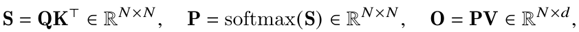

其中 softmax 按行计算。² 对于多头注意力（MHA），在多个注意力头上并行执行相同计算，同时沿批次维度，即一批输入序列的数量，并行执行。

注意力的反向传播如下。设 dO ∈ ℝN×d 为某个损失函数对 O 的梯度，由链式法则，即反向传播，得到：

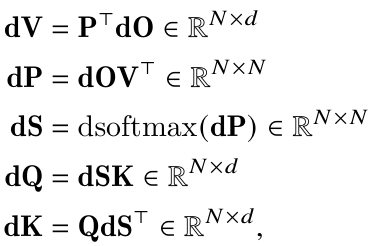

其中 dsoftmax 为逐行 softmax 的梯度，即反向传播。若向量 s、p 满足 p = softmax(s)，则对于输出梯度 dp，输入梯度为 ds = (diag(p) − ppᵀ)dp。

标准注意力实现会将矩阵 S、P 显式存储到 HBM，占用 O(N²) 内存。通常 N ≫ d，典型情况下 N 为 1K–8K，d 约为 64–128。标准实现首先调用矩阵乘法（GEMM）子程序计算 S = QKᵀ，并将结果写入 HBM；接着从 HBM 加载 S，计算 softmax，再将 P 写入 HBM；最后调用 GEMM 计算 O = PV。由于大多数操作受内存带宽限制，大量内存访问导致实际运行缓慢。此外，显式存储 S、P 带来 O(N²) 内存需求，还必须保存 P ∈ ℝN×N，供反向传播计算梯度。

### 2.3　FlashAttention

为加快 GPU 等硬件加速器上的注意力计算，文献 [5] 提出一种算法，在保持输出相同、不做近似的前提下减少内存读写。

#### 2.3.1　前向传播

FlashAttention 利用经典分块技术减少内存 IO：（1）从 HBM 将输入块加载到 SRAM；（2）计算该块对应的注意力；（3）更新输出，而不把大型中间矩阵 S、P 写入 HBM。Softmax 会将整行或整组行关联起来，因此采用在线 softmax [11, 13]，把注意力计算分成若干块，并重新缩放每个块的输出，最终得到正确结果，无需近似。通过大幅减少内存读写，FlashAttention 相对优化后的注意力基线获得了 2–4 倍的实际加速。

下面介绍在线 softmax 技术 [11] 及其在注意力中的应用 [13]。为简化说明，只考虑注意力矩阵 S 的一个行块 [S(1) S(2)]，其中 S(1), S(2) ∈ ℝBᵣ×B𝒸，Br、Bc 分别为行块和列块大小。我们要对该行块计算 softmax，再与值矩阵 [V(1); V(2)] 相乘，其中 V(1), V(2) ∈ ℝB𝒸×d。标准 softmax 会计算：

> ²为便于阐述，省略了 QKᵀ 的缩放（原文为通常乘以 1/d），以及可选的对 S 逐元素加掩码和／或对 P 应用 dropout。

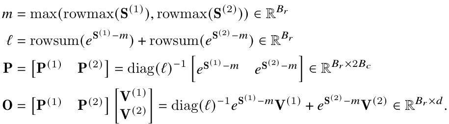

在线 softmax 则分别针对各块计算“局部”softmax，再重新缩放，以在最后得到正确输出：

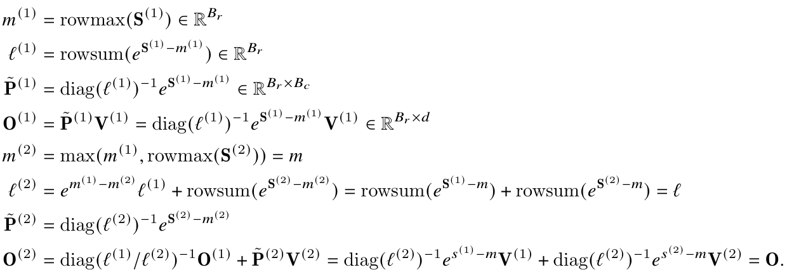

下面展示 FlashAttention 如何利用在线 softmax 实现分块（图 1），从而减少内存读写。

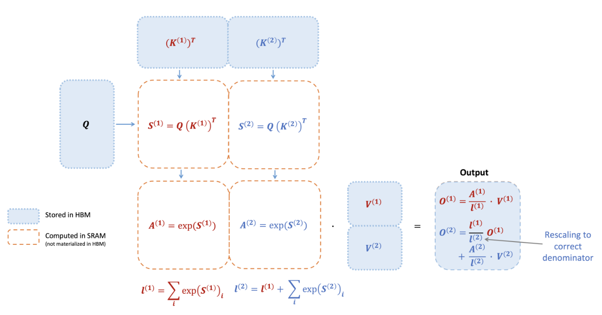

**图 1：FlashAttention 前向传播示意图，键 K 和值 V 各自划分为两个块。针对各块计算注意力并重新缩放输出，最终得到正确结果，同时避免中间矩阵 S、P 的昂贵内存读写。为简化示意图，这里省略 softmax 中每个元素减去所在行最大值的步骤。**

#### 2.3.2　反向传播

在反向传播中，输入 Q、K、V 的块一旦加载到 SRAM，FlashAttention 就重新计算注意力矩阵 S、P 的值，从而避免存储大量中间值。由于无需保存大小为 N × N 的 S、P，FlashAttention 能节省 10–20 倍内存，具体幅度取决于序列长度；其内存需求随 N 线性增长，而非二次增长。反向传播也因减少内存读写而获得 2–4 倍的实际加速。

反向传播对第 2.2 节中的公式进行分块。虽然从概念上看，反向传播比前向传播更简单，不涉及 softmax 重新缩放，但实现明显更加复杂。这是因为反向传播要执行 5 次矩阵乘法，需要在 SRAM 中保存更多值，而前向传播仅有 2 次矩阵乘法。

## 3　FlashAttention-2：算法、并行性与工作划分

本节介绍 FlashAttention-2 算法。它对 FlashAttention 进行了若干调整，以减少非矩阵乘法 FLOPs。随后说明如何将计算并行分配给不同线程块，充分利用 GPU 资源。最后介绍如何在线程块内部，将工作划分到不同线程束，以减少共享内存访问。第 4 节将验证，这些改进带来了 2–3 倍加速。

### 3.1　算法

我们调整 FlashAttention 算法，以减少非矩阵乘法 FLOPs。原因是现代 GPU 拥有专用计算单元，例如 NVIDIA GPU 的 Tensor Core，使矩阵乘法快得多。以 A100 GPU 为例，FP16／BF16 矩阵乘法的理论峰值吞吐量为 312 TFLOPs/s，而非矩阵乘法的 FP32 运算仅为 19.5 TFLOPs/s。换言之，每次非矩阵乘法浮点运算的代价是矩阵乘法中一次浮点运算的 16 倍。为保持较高吞吐量，例如达到理论峰值 TFLOPs/s 的 50% 以上，我们希望尽可能将时间用于矩阵乘法运算。

#### 3.1.1　前向传播

重新考察第 2.3 节的在线 softmax 技巧，我们做了两项小调整，以减少非矩阵乘法 FLOPs：

1. 无需对输出更新中的两项都乘以 diag(ℓ(2))⁻¹ 进行缩放：

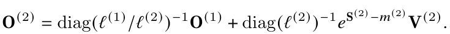

可以维护 O(2) 的一个“未缩放”版本，同时保存统计量 ℓ(2)：

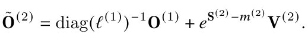

仅在整个循环结束时，才对最终的 Õ(last) 乘以 diag(ℓ(last))⁻¹，得到正确输出。

2. 无需同时为反向传播保存最大值 m(j) 与指数和 ℓ(j)，只需存储 logsumexp：L(j) = m(j) + log(ℓ(j))。

对于第 2.3 节中只有两个块的简单情形，在线 softmax 现在变为：

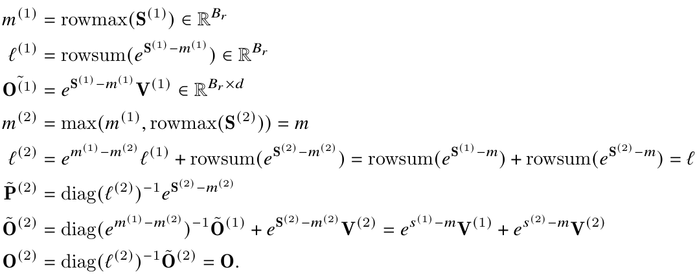

算法 1 给出了完整的 FlashAttention-2 前向传播。

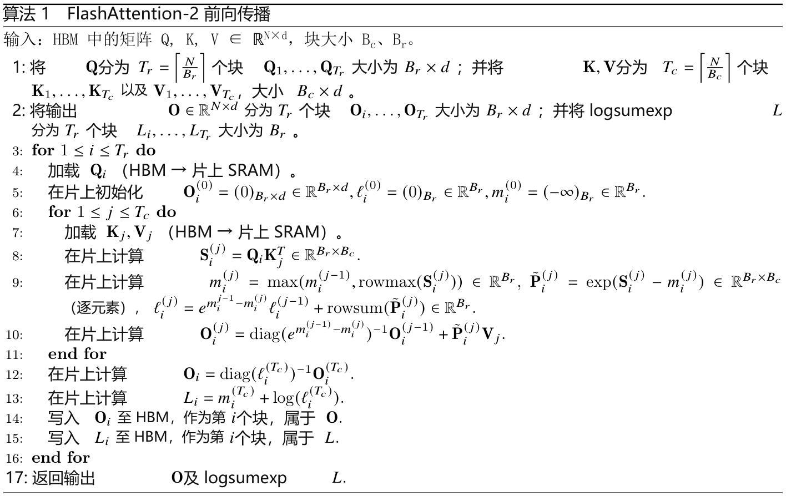

因果掩码。注意力的一个常见应用是自回归语言建模，此时需要对注意力矩阵 S 应用因果掩码，即将所有满足 j > i 的元素 Sij 设为 −∞。

1. FlashAttention 和 FlashAttention-2 已按块执行计算，因此对于列索引全部大于行索引的块，可以跳过计算。序列较长时，这约占全部块的一半。相比不采用因果掩码的注意力，这带来约 1.7–1.8 倍加速。

2. 对于行索引保证严格小于列索引的块，无需应用因果掩码。这意味着，对于每一行，只需对 1 个块应用因果掩码，假设使用方形块。

正确性、运行时间与内存需求。与 FlashAttention 一样，算法 1 在不进行近似的前提下返回正确输出 O = softmax(QKᵀ)V，使用 O(N²d) 次浮点运算；除输入和输出外，需要 O(N) 额外内存来保存 logsumexp L。证明与 Dao 等 [5，定理 1] 几乎相同，这里省略。

#### 3.1.2　反向传播

FlashAttention-2 的反向传播与 FlashAttention 几乎相同。我们做了一项小调整：仅使用逐行 logsumexp L，替代 softmax 中逐行最大值和逐行指数和这两组统计量。为完整起见，算法 2 给出了反向传播过程。

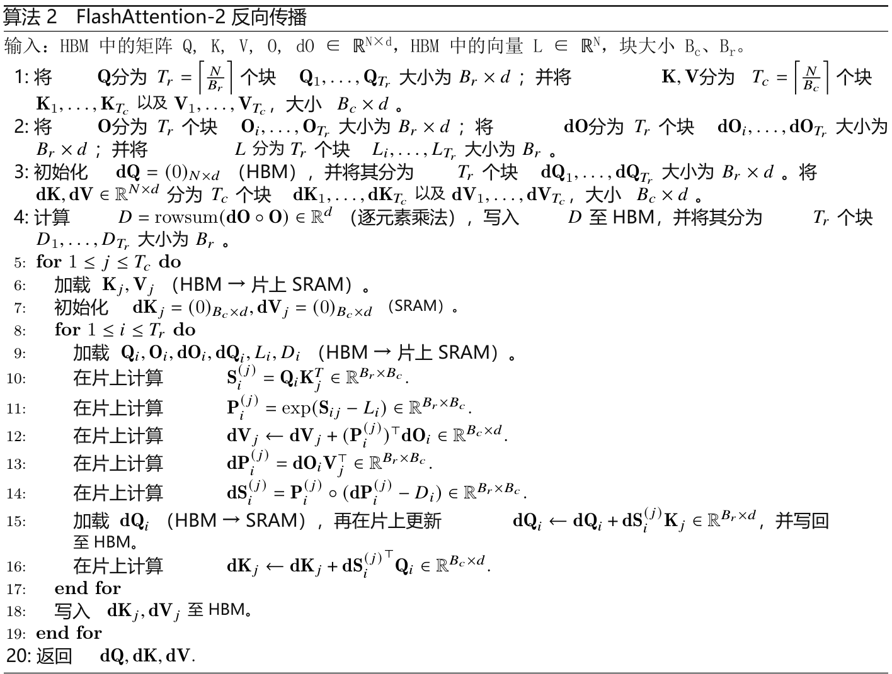

多查询注意力与分组查询注意力。多查询注意力（MQA）[15] 和分组查询注意力（GQA）[1] 是注意力的变体：多个查询头关注同一个键头和值头，以减少推理时的 KV 缓存大小。我们无需为计算显式复制键头和值头，而是通过隐式调整头索引来执行相同计算。在反向传播中，需要将这些被隐式复制的不同头对应的 dK、dV 梯度求和。

### 3.2　并行性

第一版 FlashAttention 沿批次大小和注意力头数量两个维度并行。使用 1 个线程块处理 1 个注意力头，因此线程块总数为“批大小 × 注意力头数”。每个线程块被调度到一个流多处理器（SM）上运行，而例如 A100 GPU 有 108 个 SM。当线程块数量足够大，比如不小于 80 时，这种调度很高效，因为能够有效利用 GPU 几乎全部计算资源。

对于长序列，批大小或注意力头数通常较小。为更充分利用 GPU 的多处理器，我们现在还沿序列长度维度并行，由此在这一场景中获得显著加速。

前向传播。可以看到，沿序列长度的外层循环天然可以并行。我们将其调度到不同线程块，这些线程块之间无需通信。同时，与 FlashAttention 一样，也沿批次维度和注意力头维度并行。当批大小和头数较小时，增加序列长度维度上的并行性，有助于提高占用率，即 GPU 资源的使用比例，从而获得加速。

交换循环顺序——外层遍历行块、内层遍历列块，与原始 FlashAttention 论文相反——以及沿序列长度并行这两项想法，最早由 Phil Tillet 在 Triton [17] 实现中提出并实现。³

反向传播。不同列块之间唯一共享的计算，是算法 2 中对 dQ 的更新：需要从 HBM 将 dQi 加载到 SRAM，在片上执行 dQi ← dQi + dSi(j)Kj，再写回 HBM。因此，反向传播也沿序列长度维度并行，为每个列块调度 1 个线程块。不同线程块通过原子加法通信，以更新 dQ。

图 2 展示这一并行化方案。

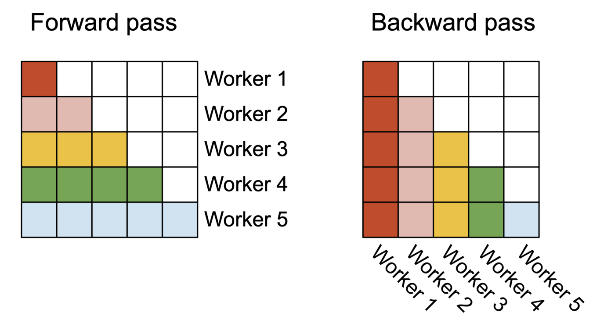

**图 2：前向传播（左）中，工作单元，即线程块，并行执行，每个工作单元负责注意力矩阵的一个行块。反向传播（右）中，每个工作单元负责注意力矩阵的一个列块。**

> ³https://github.com/openai/triton/blob/main/python/tutorials/06-fused-attention.py

### 3.3　线程束之间的工作划分

第 3.2 节说明了线程块的调度方式。在线程块内部，我们还需要决定如何在不同线程束之间划分工作。每个线程块通常使用 4 个或 8 个线程束，划分方式见图 3。

前向传播。对于每个计算块，FlashAttention 将 K、V 划分给 4 个线程束，而所有线程束均可访问 Q。每个线程束先执行矩阵乘法，得到 QKᵀ 的一个切片，再与 V 的一个切片相乘，并通过通信将结果相加。这称为“split-K”方案。不过，这种方式效率不高，因为所有线程束都需要先将中间结果写入共享内存，进行同步，再累加这些中间结果。共享内存读写拖慢了 FlashAttention 的前向传播。

FlashAttention-2 改为将 Q 划分给 4 个线程束，而所有线程束均可访问 K、V。每个线程束通过矩阵乘法得到 QKᵀ 的一个切片后，只需与共享的 V 切片相乘，即可得到其对应的输出切片。线程束之间无需通信。共享内存读写减少，由此带来加速（第 4 节）。

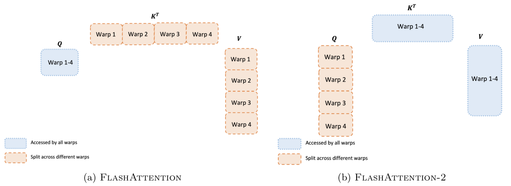

**图 3：前向传播中不同线程束之间的工作划分。**

反向传播。同样，我们在反向传播中选择避免“split-K”的线程束划分方式。不过，由于输入和梯度 Q、K、V、O、dO、dQ、dK、dV 之间存在更复杂的依赖，仍然需要一些同步。即便如此，避免“split-K”仍能减少共享内存读写，并再次带来加速（第 4 节）。

块大小调优。增大块通常可以减少共享内存加载／存储，但也会增加寄存器需求及共享内存总用量。当块超过一定大小后，寄存器溢出会导致明显减速，或者共享内存需求超过 GPU 可用容量，使内核根本无法运行。通常，我们根据头维度 d 和设备共享内存容量，选择 {64, 128} × {64, 128} 的块大小。

由于块大小基本上只有 4 种选择，我们对每个头维度手动调优；不过，自动调优可以免除这部分人工工作，留待未来研究。

## 4　实验验证

我们评估使用 FlashAttention-2 训练 Transformer 模型的效果。

• 注意力基准测试。我们在不同序列长度下测量 FlashAttention-2 的运行时间，并与 PyTorch 中的标准实现、FlashAttention，以及 Triton 中的 FlashAttention 进行比较。结果确认，FlashAttention-2 比 FlashAttention 快 1.7–3.0 倍，比 Triton 中的 FlashAttention 快 1.3–2.5 倍，比标准注意力实现快 3–10 倍。FlashAttention-2 最高达到 230 TFLOPs/s，为 A100 GPU 理论峰值 TFLOPs/s 的 73%。

• 端到端训练速度。使用长度为 2K 或 8K 的序列，对 1.3B 和 2.7B 参数的 GPT 风格模型进行端到端训练时，FlashAttention-2 相比 FlashAttention 最高加速 1.3 倍，相比不使用 FlashAttention 的基线最高加速 2.8 倍。每张 A100 GPU 最高达到 225 TFLOPs/s，模型 FLOPs 利用率为 72%。

### 4.1　注意力基准测试

我们在 A100 80GB SXM4 GPU 上，针对不同设置测量各注意力方法的运行时间，包括启用或关闭因果掩码、头维度 64 或 128。图 4、图 5 和图 6 显示，FlashAttention-2 比 FlashAttention 以及 xformers 中的 FlashAttention（“cutlass”实现）快约 2 倍。相对于 Triton 中的 FlashAttention，前向传播快约 1.3–1.5 倍，反向传播快约 2 倍。相较 PyTorch 中的标准注意力实现，FlashAttention-2 最高可加速 10 倍。

基准设置：序列长度依次取 512、1K、…、16K，并调整批大小，使 token 总数为 16K。隐藏维度为 2048，头维度为 64 或 128，即分别对应 32 个或 16 个注意力头。前向传播的 FLOPs 按下式计算：

4 · 序列长度² · 头维度 · 注意力头数。

采用因果掩码时，将上述数值除以 2，因为实际只计算约一半元素。反向传播的 FLOPs 则为前向传播的 2.5 倍：前向有 2 次矩阵乘法，而反向因重计算包含 5 次矩阵乘法。

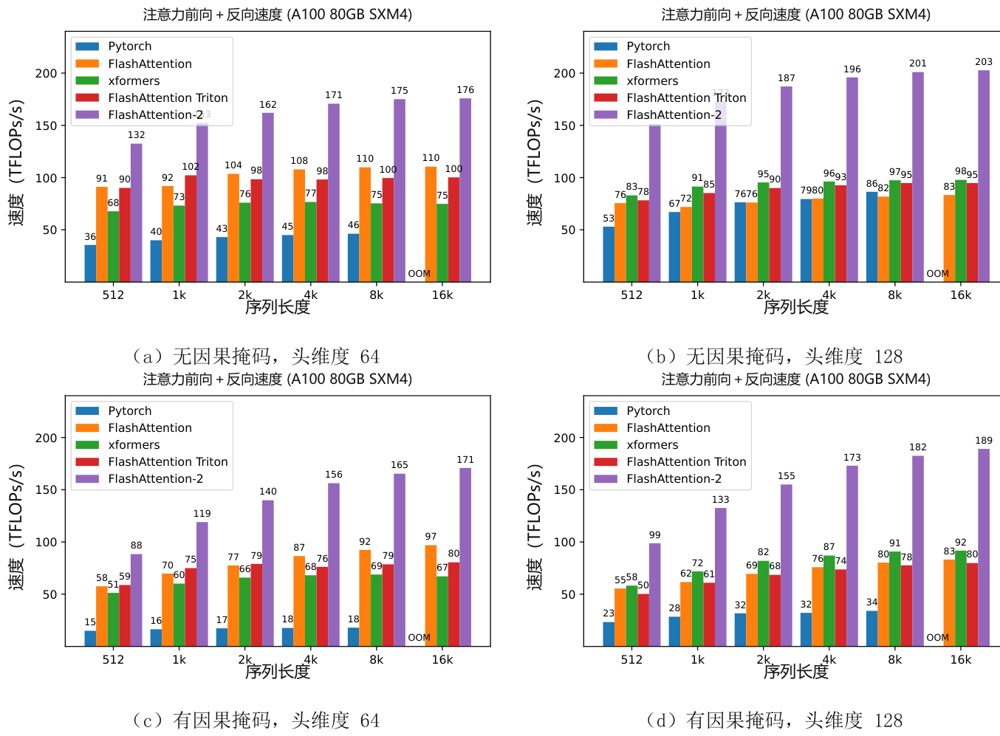

**图 4：A100 GPU 上注意力前向＋反向传播的速度。**

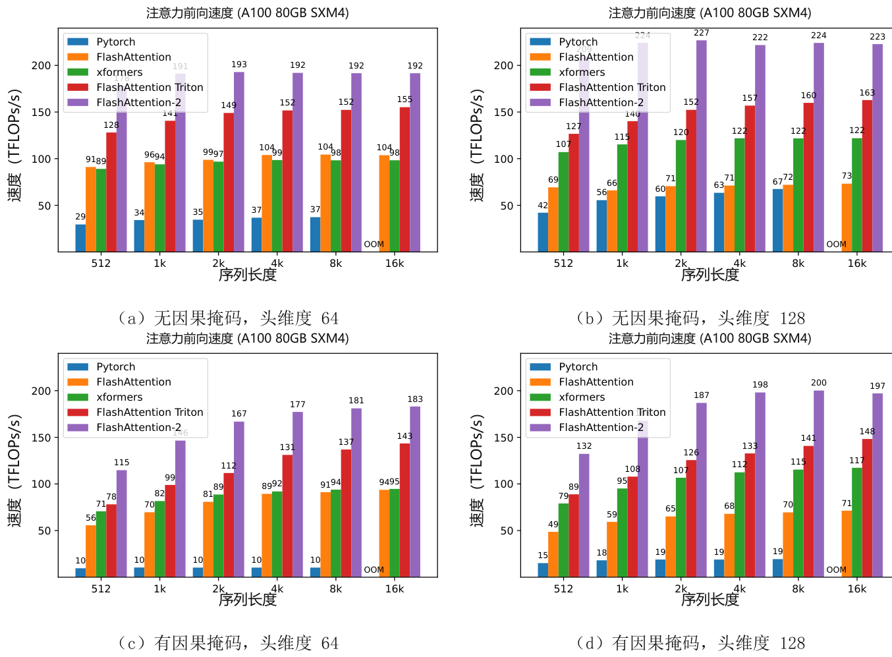

**图 5：A100 GPU 上注意力前向传播的速度。**

只将相同实现运行在 H100 GPU 上，不使用针对 TMA、第 4 代 Tensor Core 等新特性的专用指令，就能最高达到 335 TFLOPs/s（图 7）。我们预计，使用新指令后，还能在 H100 上进一步获得 1.5–2 倍加速，留待后续工作。

### 4.2　端到端性能

我们在 8 张 A100 80GB SXM GPU 上，测量 1.3B 或 2.7B 参数 GPT 风格模型的训练吞吐量。表 1 显示，FlashAttention-2 相比不采用 FlashAttention 的基线加速 2.8 倍，相比 FlashAttention-2 加速 1.3 倍，每张 A100 GPU 最高达到 225 TFLOPs/s。

注意，FLOPs 的计算遵循 Megatron-LM [16] 以及许多其他论文和库使用的公式：

6 · 序列长度 · 参数量 + 12 · 层数 · 隐藏维度 · 序列长度²。

第一项表示权重与输入相乘产生的 FLOPs，第二项表示注意力产生的 FLOPs。不过，也可以认为第二项应减半，因为使用因果掩码时，只需计算约一半注意力元素。为保持一致性，我们仍采用文献中的公式，不将注意力 FLOPs 除以 2。

## 5　讨论与未来方向

FlashAttention-2 比 FlashAttention 快 2 倍，意味着可以用过去训练 8K 上下文模型的成本，训练上下文长达 16K 的模型。我们期待利用这一能力，帮助模型理解长篇书籍和报告、高分辨率图像、音频及视频。FlashAttention-2 也会加快现有模型的训练、微调和推理。

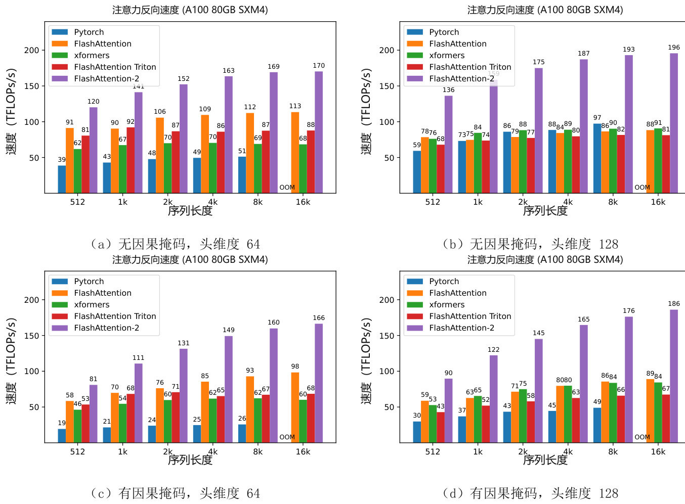

**图 6：A100 GPU 上注意力反向传播的速度。**

**表 1：GPT 风格模型在 8 张 A100 GPU 上的训练速度（TFLOPs/s/GPU）。FlashAttention-2 最高达到 225 TFLOPs/s，模型 FLOPs 利用率为 72%。比较基线不采用 FlashAttention。**

| 模型 | 不使用 FlashAttention | FlashAttention | FlashAttention-2 |
| --- | --- | --- | --- |
| GPT3-1.3B 2k 上下文 | 142 TFLOPs/s | 189 TFLOPs/s | 196 TFLOPs/s |
| GPT3-1.3B 8k 上下文 | 72 TFLOPS/s | 170 TFLOPs/s | 220 TFLOPs/s |
| GPT3-2.7B 2k 上下文 | 149 TFLOPs/s | 189 TFLOPs/s | 205 TFLOPs/s |
| GPT3-2.7B 8k 上下文 | 80 TFLOPs/s | 175 TFLOPs/s | 225 TFLOPs/s |

近期，我们计划与研究者和工程师合作，让 FlashAttention 广泛适用于不同设备，例如 H100 GPU、AMD GPU，以及 FP8 等新数据类型。下一步将针对 H100 优化 FlashAttention-2，利用 TMA、第 4 代 Tensor Core 和 FP8 等新硬件特性。将 FlashAttention-2 的底层优化与高层算法改进结合，例如局部、膨胀及块稀疏注意力，可能使我们能够训练拥有更长上下文的 AI 模型。我们也期待与编译器研究者合作，让这些优化技术更容易编程实现。

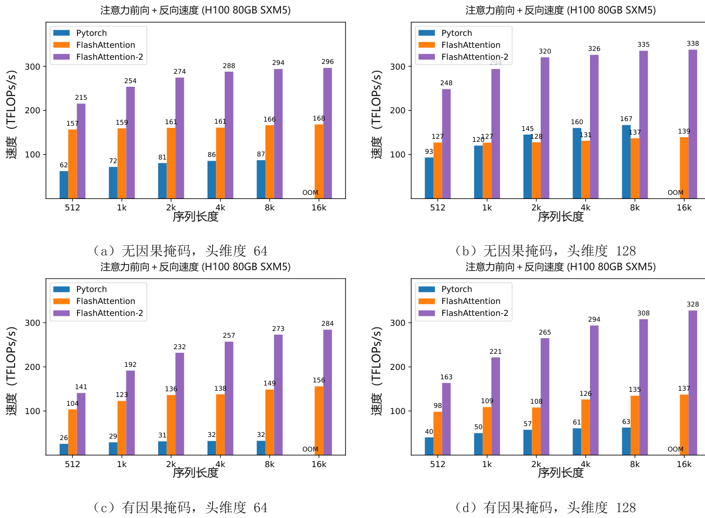

**图 7：H100 GPU 上注意力前向＋反向传播的速度。**

## 致谢

感谢 Phil Tillet 和 Daniel Haziza，他们分别在 Triton [17] 和 xformers 库 [10] 中实现了 FlashAttention 的不同版本。关于不同注意力实现方式的思想交流，促成了 FlashAttention-2。感谢 NVIDIA CUTLASS 团队，尤其是 Vijay Thakkar、Cris Cecka、Haicheng Wu 和 Andrew Kerr，开发了 CUTLASS 库；特别是 CUTLASS 3.x 版本，为 FlashAttention-2 提供了清晰的抽象和强大的基础组件。感谢 Driss Guessous 将 FlashAttention 集成到 PyTorch。与 Phil Wang、Markus Rabe、James Bradbury、Young-Jun Ko、Julien Launay、Daniel Hesslow、Michaël Benesty、Horace He、Ashish Vaswani 和 Erich Elsen 的有益讨论，也使 FlashAttention-2 获益。感谢斯坦福 CRFM 和 Stanford NLP 提供计算支持。感谢 Dan Fu 和 Christopher Ré 在硬件高效算法设计这一研究方向上的合作、建设性反馈及持续鼓励。感谢 Albert Gu 和 Beidi Chen 对本技术报告早期草稿提出的有益建议。

## 参考文献

[1] Joshua Ainslie, James Lee-Thorp, Michiel de Jong, Yury Zemlyanskiy, Federico Lebrón, and Sumit Sanghai. GQA：从多头检查点训练广义多查询 Transformer 模型. arXiv preprint arXiv:2305.13245, 2023.

[2] Iz Beltagy, Matthew E Peters, and Arman Cohan. Longformer：面向长文档的 Transformer. arXiv preprint arXiv:2004.05150, 2020.

[3] Beidi Chen, Tri Dao, Eric Winsor, Zhao Song, Atri Rudra, and Christopher Ré. Scatterbrain：统一稀疏与低秩注意力. In Advances in Neural Information Processing Systems (NeurIPS), 2021.

[4] Krzysztof Marcin Choromanski, Valerii Likhosherstov, David Dohan, Xingyou Song, Andreea Gane, Tamas Sarlos, Peter Hawkins, Jared Quincy Davis, Afroz Mohiuddin, Lukasz Kaiser, et al. 通过 Performer 重新思考注意力. In International Conference on Learning Representations (ICLR), 2020.

[5] Tri Dao, Daniel Y. Fu, Stefano Ermon, Atri Rudra, and Christopher Ré. FlashAttention：具有 IO 感知能力的快速、内存高效精确注意力. In Advances in Neural Information Processing Systems, 2022.

[6] Zhe Jia and Peter Van Sandt. 通过微基准测试剖析 Ampere GPU 架构. GPU Technology Conference, 2021.

[7] Zhe Jia, Marco Maggioni, Benjamin Staiger, and Daniele P Scarpazza. 通过微基准测试剖析 NVIDIA Volta GPU 架构. arXiv preprint arXiv:1804.06826, 2018.

[8] Angelos Katharopoulos, Apoorv Vyas, Nikolaos Pappas, and François Fleuret. Transformer 即 RNN：采用线性注意力的快速自回归 Transformer. In International Conference on Machine Learning, pages 5156–5165. PMLR, 2020.

[9] Nikita Kitaev, Łukasz Kaiser, and Anselm Levskaya. Reformer：高效的 Transformer. In The International Conference on Machine Learning (ICML), 2020.

[10] Benjamin Lefaudeux, Francisco Massa, Diana Liskovich, Wenhan Xiong, Vittorio Caggiano, Sean Naren, Min Xu, Jieru Hu, Marta Tintore, Susan Zhang, Patrick Labatut, and Daniel Haziza. xformers：模块化、易于修改的 Transformer 建模库. https://github.com/facebookresearch/xformers, 2022.

[11] Maxim Milakov and Natalia Gimelshein. Softmax 归一化因子的在线计算. arXiv preprint arXiv:1805.02867, 2018.

[12] OpenAI. GPT-4 技术报告. ArXiv, abs/2303.08774, 2023.

[13] Markus N Rabe and Charles Staats. 自注意力不需要 O(n²) 内存. arXiv preprint arXiv:2112.05682, 2021.

[14] Aurko Roy, Mohammad Saffar, Ashish Vaswani, and David Grangier. 利用路由 Transformer 实现基于内容的高效稀疏注意力. Transactions of the Association for Computational Linguistics, 9: 53–68, 2021.

[15] Noam Shazeer. 快速 Transformer 解码：只需一个写入头. arXiv preprint arXiv:1911.02150, 2019.

[16] Mohammad Shoeybi, Mostofa Patwary, Raul Puri, Patrick LeGresley, Jared Casper, and Bryan Catanzaro. Megatron-LM：利用模型并行训练数十亿参数语言模型. arXiv preprint arXiv:1909.08053, 2019.

[17] Philippe Tillet, Hsiang-Tsung Kung, and David Cox. Triton：面向分块神经网络计算的中间语言与编译器. In Proceedings of the 3rd ACM SIGPLAN International Workshop on Machine Learning and Programming Languages, pages 10–19, 2019.

[18] Ashish Vaswani, Noam Shazeer, Niki Parmar, Jakob Uszkoreit, Llion Jones, Aidan N Gomez, Łukasz Kaiser, and Illia Polosukhin. 注意力就是你所需要的一切. Advances in neural information processing systems, 30, 2017.

[19] Sinong Wang, Belinda Z Li, Madian Khabsa, Han Fang, and Hao Ma. Linformer：具有线性复杂度的自注意力. arXiv preprint arXiv:2006.04768, 2020.

[20] Manzil Zaheer, Guru Guruganesh, Kumar Avinava Dubey, Joshua Ainslie, Chris Alberti, Santiago Ontanon, Philip Pham, Anirudh Ravula, Qifan Wang, Li Yang, et al. Big Bird：用于更长序列的 Transformer. Advances in Neural Information Processing Systems, 33, 2020.
