# FlashAttention-3： 利用异步执行与低精度实现快速、准确的注意力

> 中文译本。原文：arXiv:2407.08608v2（2024-07-12），文内日期 2024-07-16。正文与表格可编辑；公式、算法和插图以高清图片嵌入，保留原编号。

Jay Shah∗1, Ganesh Bikshandi∗1, Ying Zhang 2, Vijay Thakkar 3,4, Pradeep Ramani 3, and Tri Dao 5,6

¹Colfax Research　²Meta　³NVIDIA　⁴佐治亚理工学院　⁵普林斯顿大学　⁶Together AI

{jayhshah,ganesh}@colfax-intl.com, yingz@meta.com, {vithakkar,prraman}@nvidia.com, tri@tridao.me

2024 年 7 月 16 日

## 摘要

注意力是广泛应用的 Transformer 架构中的核心层，也是大型语言模型和长上下文应用的瓶颈。FlashAttention 通过尽量减少内存读写，提出了加速 GPU 注意力计算的方法。然而，它尚未充分利用新硬件的能力：FlashAttention-2 在 H100 GPU 上的利用率仅为 35%。我们提出三项主要技术，加速 Hopper GPU 上的注意力计算：利用 Tensor Core 和 TMA 的异步性，（1）通过线程束专门化使整体计算与数据搬运重叠；（2）交错执行分块矩阵乘法与 softmax；（3）采用分块量化与非相干处理，利用硬件对 FP8 低精度的支持。实验表明，本文方法 FlashAttention-3 在 H100 上获得 1.5–2.0 倍加速，FP16 最高达到 740 TFLOPs/s，即 75% 利用率；FP8 接近 1.2 PFLOPs/s。我们还验证，FP8 FlashAttention-3 的数值误差比 FP8 注意力基线低 2.6 倍。

## 1　引言

在 Transformer 架构 [59] 中，注意力机制是主要计算瓶颈，因为查询与键之间自注意力分数的计算量随序列长度呈二次增长。将注意力扩展到更长上下文，将带来新能力，例如对多个长文档 [24, 43, 50] 和大型代码库中的文件 [30, 48] 进行建模与推理；支持新模态，如高分辨率图像 [11]、音频 [23] 和视频 [25]；并催生新应用，如具有长历史记录的用户交互 [53] 和跨度较长的智能体工作流程 [62]。这引发了对加速长上下文注意力的广泛兴趣，方法包括近似 [14, 27, 56]、软件优化 [17, 29, 45]，乃至替代架构 [22, 42, 55]。

本文基于 Dao 等 [17] 的工作，开发在高层设计中融入 GPU 执行模型与硬件特征的精确注意力算法。Dao 等 [17] 提出 FlashAttention，通过一种新的分块策略并行计算注意力，将所有注意力操作融合到单个 GPU 内核，从而消除对慢速全局内存的中间结果读写。Dao [15] 将其重构为 FlashAttention-2，进一步沿序列长度维度并行，并在前向传播的内层循环中遍历键和值矩阵块，改善 GPU 占用率与工作分配。然而，我们发现，在较新的 GPU 上，FlashAttention-2 相对优化矩阵乘法（GEMM）内核的利用率仍偏低，例如在 Hopper H100 上分别约为 35% 和 80%–90%。这部分可以归因于实现层面的差异，例如面向 Tensor Core 时仍使用 Ampere 指令，而未使用 Hopper 专用指令。ThunkerKitten [52]、cuDNN 9 [39] 等工作表明，使用 Hopper 专用指令和基于分块的抽象，能够加速注意力计算并简化实现。

> ∗同等贡献

更根本的问题是，FlashAttention-2 遵循一种简化的同步模型，在算法设计中没有显式利用异步性和低精度。异步性来自为机器学习负载中的关键操作而进行的硬件专门化：执行矩阵乘法的 Tensor Core、执行内存加载的张量内存加速器（Tensor Memory Accelerator，TMA），与负责逻辑、整数和浮点计算的其余 CUDA 核心相互独立。低精度也是一种经过验证的技术，能够在相同功耗和芯片面积下获得两倍或四倍吞吐量：从 FP16（2017 年的 Pascal）、BF16（2020 年的 Ampere），延续到 Hopper 的 FP8 和 Blackwell 的 FP4。第 2.2 节回顾 Hopper 在这些方面提供的能力。技术挑战在于重新设计 FlashAttention-2，以利用这些硬件特性：异步性要求矩阵乘法与 softmax 的计算相互重叠，尽管其中一项依赖另一项的输出；低精度则要求谨慎控制量化误差，尤其需要处理大型语言模型中的离群特征 [20, 54]。

为此，我们提出 FlashAttention-3，贡献并整合三项新思想，以进一步改善新一代 GPU 架构上的性能：¹

1. 生产者—消费者异步执行。我们定义一种采用线程束专门化的软件流水线，将数据生产者与消费者划分到不同线程束，利用数据搬运和 Tensor Core 的异步执行，从而增强算法隐藏访存延迟及指令发射延迟的能力。

2. 将 softmax 隐藏在异步分块 GEMM 之后。我们使 softmax 中吞吐量相对较低的非 GEMM 操作，如浮点乘加与指数运算，与用于 GEMM 的异步 WGMMA 指令重叠。为此，重新组织 FlashAttention-2 算法，绕过 softmax 与 GEMM 之间的某些串行依赖。例如，在两阶段算法中，对分数矩阵的一个块执行 softmax 时，WGMMA 同时在异步代理中计算下一个块。

3. 硬件加速的低精度 GEMM。我们调整前向传播算法，使 GEMM 能够使用 FP8 Tensor Core，测得的 TFLOPs/s 几乎翻倍。这要求协调 WGMMA 对 FP32 累加器矩阵块和 FP8 操作数矩阵块在内存布局上的不同要求。我们采用分块量化与非相干处理，减轻改用 FP8 精度造成的准确性损失。

为验证方法，我们在 H100 SXM5 GPU 上使用多组参数测试 FlashAttention-3，结果显示：（1）FP16 前向传播比 FlashAttention-2 快 1.5–2.0 倍，最高达到 740 TFLOPs/s，反向传播快 1.5–1.75 倍；（2）FP8 接近 1.2 PFLOPs/s；（3）在较长序列下，FP16 超过 NVIDIA cuDNN 库中的先进注意力实现，FP8 也具有竞争力。² 我们还验证，FP16 FlashAttention-3 与 FlashAttention-2 的数值误差相同，并且优于标准注意力实现，因为 softmax 重新缩放等中间结果保留为 FP32。此外，在存在离群特征时，采用分块量化与非相干处理的 FP8 FlashAttention-3，比采用逐张量量化的标准注意力准确 2.6 倍。

我们以宽松许可证开源 FlashAttention-3，³ 并计划将其集成到 PyTorch 和 Hugging Face 库中，让尽可能多的研究者和开发者受益。

## 2　背景：多头注意力与 GPU 特征

### 2.1　多头注意力

设 Q, K, V ∈ ℝ<sup>N×d</sup> 分别为单个注意力头对应的查询、键和值输入序列，其中 N 为序列长度，d 为头维度。注意力输出 O 的计算如下：

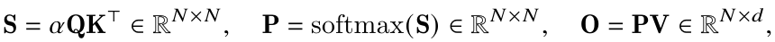

> ¹本文在 NVIDIA Hopper 架构下报告结果，但算法适用于任何具备充分异步执行和低精度能力的 GPU 架构。
²更准确地说，头维度为 64 时，FlashAttention-3 FP8 更快；头维度为 128 或 256 时，不采用因果掩码的情形与其相当，采用因果掩码时则较慢。
³FlashAttention-3 代码：https://github.com/Dao-AILab/flash-attention

其中 softmax 按行计算，缩放因子通常取 α = 1/√d。实际实现中，从 S 减去 rowmax(S)，以避免指数函数导致的数值不稳定。对于多头注意力（MHA），每个头都具有各自的查询、键和值投影，计算在多个头和批次之间并行，产生完整输出张量。

设 φ 为标量损失函数，记 d(−) = ∂φ/∂(−) 为梯度。给定输出梯度 dO ∈ ℝ<sup>N×d</sup>，按链式法则计算 dQ、dK、dV：

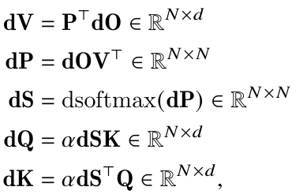

对于向量 s，设 p = softmax(s)，则 ds = (diag(p) − ppᵀ)dp。dsoftmax(dP) 表示将这一公式逐行应用于 dP。最后，多头注意力的反向传播同样沿注意力头和批次维度并行。

### 2.2　GPU 硬件特征与执行模型

本节介绍与 FlashAttention-3 相关的 GPU 执行模型，重点以 NVIDIA Hopper 架构作为具体实例。

存储层级。GPU 的存储器按照数据存放位置组织成层级，其容量与带宽呈反向关系（表 1）。⁴ 全局内存（GMEM），也称 HBM，是所有流多处理器（SM）都能访问的片外 DRAM。GMEM 中的数据会透明地缓存在片上 L2 缓存中。每个 SM 还包含一小块由程序员管理、具有大量存储体的片上缓存，称为共享内存（SMEM）。最后是每个 SM 内部的寄存器文件。

线程层级。GPU 编程模型围绕执行单元“线程”的逻辑分组组织。由细到粗，线程层级包括线程、线程束（32 个线程）、线程束组（4 个连续线程束）、线程块，即协作线程数组 CTA、Hopper 中的线程块簇，以及网格。

这两类层级紧密关联。同一 CTA 内的线程被共同调度到同一 SM，同一线程块簇内的 CTA 被共同调度到同一 GPC。CTA 内所有线程均能直接寻址 SMEM，而每个线程最多拥有 256 个私有寄存器（RMEM）。

**表 1：NVIDIA Hopper H100 SXM5 GPU 的线程—存储层级。**

| 硬件层级 | 并行执行单元 | 数据位置 | 容量 @ 带宽 |
| --- | --- | --- | --- |
| 芯片 | 网格 | GMEM | 80 GiB @ 3.35 TB/s |
| GPC | 线程块簇 | L2 | 50 MiB @ 12 TB/s |
| SM | 线程块（CTA） | SMEM | 每 SM 228 KiB，每 GPU 31 TB/s |
| 线程 | 线程 | RMEM | 256 KiB per SM |

异步性与线程束专门化。GPU 是吞吐量处理器，依赖并发和异步执行来隐藏访存及执行延迟。Hopper 提供专用硬件单元 TMA，在 GMEM 与 SMEM 之间进行异步内存复制 [38，第 7.29 节]。此外，与 Ampere 等先前架构不同，Hopper 的 Tensor Core 通过作用于整个线程束组的 WGMMA 指令 [40，第 9.7.14 节] 暴露出来，同样支持异步执行，并能直接从共享内存获取输入。硬件对异步执行的支持，使线程束专门化内核成为可能：将一个 CTA 内的线程束划分为生产者或消费者，各自只发射数据搬运或计算指令。通常，这会改善编译器生成最优指令调度的能力 [4]。此外，Hopper 通过 setmaxnreg [40，第 9.7.17.1 节] 支持在线程束组之间动态重新分配寄存器，使执行 MMA 的线程束能够获得比只发射 TMA 的线程束更多的寄存器资源；后者实际上只需一个线程。

> ⁴Luo 等 [34] 报告，每个 SM 每时钟周期的共享内存带宽为 128 字节；我们将其乘以 132 个 SM 和 1830 MHz 的加速时钟频率。

低精度数值格式。现代 GPU 具有加速低精度计算的专用硬件。例如，WGMMA 指令能够使用 Hopper 上的 FP8 Tensor Core，使每个 SM 的吞吐量达到 FP16 或 BF16 的 2 倍。

不过，正确调用 FP8 WGMMA 需要理解其操作数的布局约束。对于 GEMM 计算 A × Bᵀ，设 A 为 M × K 矩阵，B 为 N × K 矩阵。如果操作数 A 或 B 沿外侧 M 或 N 维连续存储，就称其为 mn-major；若沿内侧 K 维连续存储，则称为 k-major。FP16 WGMMA 对 SMEM 中的操作数既接受 mn-major，也接受 k-major；FP8 WGMMA 则只支持 k-major。此外，在注意力这类需要将前后相接的 GEMM 融合到单个内核的场景中，FP32 累加器与 FP8 操作数的布局冲突，会阻碍具有依赖关系的 FP8 WGMMA 调用。

对于注意力，这些布局限制要求对 FP8 算法设计进行相应修改，详见第 3.3 节。

### 2.3　标准注意力与 FlashAttention

沿用 Dao 等 [17] 的定义，标准注意力指在 GPU 上将中间矩阵 S、P 显式存储到 HBM 的实现。FlashAttention 的主要思想是采用局部 softmax 归约，避免昂贵的中间结果读写，并将注意力融合到单个内核。局部 softmax 对应算法 1 消费者主循环的第 18–19 行，以及对 O 的各块进行重新缩放的步骤。证明这一过程确实计算得到 O 的简洁推导见文献 [15，第 2.3.1 节]。

## 3　FlashAttention-3：算法

本节介绍 FlashAttention-3 算法。为简化说明，重点讨论前向传播，反向传播算法见附录 B.1。首先说明如何把线程束专门化与环形 SMEM 缓冲区集成到 FlashAttention-2 的基础算法中；随后说明如何利用 WGMMA 的异步性，构建 GEMM 与 softmax 重叠的两阶段流水线；最后介绍支持 FP8 所需的修改，包括满足布局约束，以及利用分块量化和非相干处理保持准确性。

### 3.1　通过线程束专门化与乒乓调度实现生产者—消费者异步执行

线程束专门化。与 FlashAttention-2 一样，FlashAttention-3 的前向传播在批大小、注意力头数和查询序列长度三个维度上天然可并行。因此，只需给出 CTA 级别的算法：处理查询矩阵的一个分块 Q<sub>i</sub>，计算对应输出块 O<sub>i</sub>。为简化说明，先介绍采用环形 SMEM 缓冲区、尚不包含 GEMM 与 softmax 重叠的线程束专门化方案。设 d 为头维度，N 为序列长度，固定查询块大小 B<sub>r</sub>，将 Q 划分为 T<sub>r</sub> = ⌈N/B<sub>r</sub>⌉ 个块 Q₁, …, Q<sub>Tᵣ</sub>。

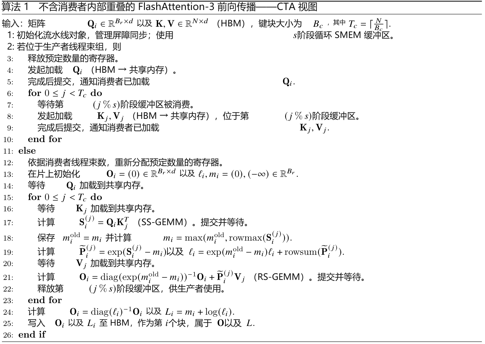

在 Hopper 上实现算法 1 时，我们使用 setmaxnreg 分配或释放寄存器，使用 TMA 加载 Q<sub>i</sub> 及 {K<sub>j</sub>, V<sub>j</sub>}<sub>0≤j&lt;T𝒸</sub>，并使用 WGMMA 执行消费者主循环中的 GEMM。其中 SS 或 RS 前缀表明第一个操作数来自共享内存还是寄存器文件。理解算法 1 的执行流程时需注意：由于异步性，发射 TMA 加载不会等待其他加载完成。此外，生产者主循环的前 s 次迭代在填充缓冲区，因此不会发出等待操作。

乒乓调度。WGMMA 与 TMA 的异步性质，加上线程束专门化，使一个线程束组的 softmax 能与另一个线程束组的 GEMM 重叠执行。其动机在于，现代硬件加速器上的非矩阵乘法操作吞吐量远低于矩阵乘法。以 H100 SXM5 为例，FP16 矩阵乘法吞吐量为 989 TFLOPS，而指数等特殊函数仅为 3.9 TFLOPS；⁵ 指数运算是 softmax 必需的。在头维度为 128 的 FP16 注意力前向传播中，矩阵乘法运算次数是指数运算的 512 倍，但指数吞吐量低 256 倍，因此指数运算耗时可能达到矩阵乘法的 50%。FP8 下情况更严重，因为矩阵乘法吞吐量翻倍，而指数运算吞吐量不变。

指数运算由独立的多功能单元执行，因此理想情况下，应在 Tensor Core 执行矩阵乘法时调度指数计算。为此，我们使用同步屏障，即 bar.sync 指令，强制线程束组 1 的 GEMM 在组 2 的 GEMM 之前调度；这里的 GEMM 包括一次迭代中的 GEMM1，即 PV，以及下一次迭代的 GEMM0，即 QKᵀ。这样，组 1 的 softmax 会在组 2 执行 GEMM 时调度。随后交换角色：组 2 执行 softmax，组 1 执行 GEMM，因此称为“乒乓”调度。相关示意见如图 1 所示。实际的乒乓调度并不像示意图中这样整齐，但通常仍能提高性能。例如，对于头维度为 128、序列长度为 8192 的 FP16 前向传播，它可以将性能从 570 TFLOPs/s 提升到 620–640 TFLOPs/s。

> ⁵CUDA 编程指南规定，每个流多处理器（SM）每时钟周期可执行 16 次特殊函数运算。将 16 乘以 132 个 SM 及 1830 MHz 时钟频率，得到 3.9 TFLOPS 的特殊函数吞吐量。

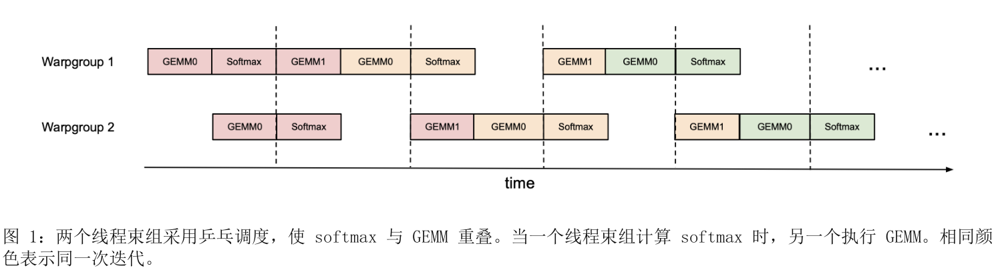

注意力变体。对于多查询注意力（MQA）[51] 和分组查询注意力（GQA）[3]，我们沿用 FlashAttention-2 的张量索引方式，避免在 HBM 中复制 K 和 V。

### 3.2　在线程束组内部重叠 GEMM 与 softmax

即使在同一个线程束组内部，也可以让 softmax 指令与 GEMM 重叠。不过，内层循环包含顺序依赖：局部 softmax（第 18–19 行）依赖第一个 GEMM 的输出 Sᵢ⁽ʲ⁾，第二个 GEMM 则以 P̃ 为输入。算法 1 第 17、21 行的等待会使这些操作串行执行。通过在寄存器中设置额外缓冲区，并跨迭代建立流水线，就可以打破这些依赖。我们提出一种两阶段⁶ GEMM–softmax 流水线方案。

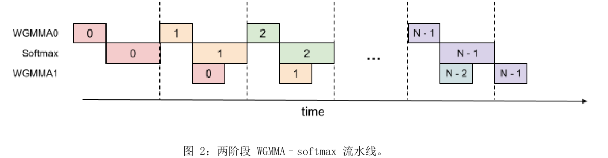

> ⁶这里的阶段数指重叠方案的阶段数。它不超过共享内存循环缓冲区的 s 个阶段，但二者不一定相等。

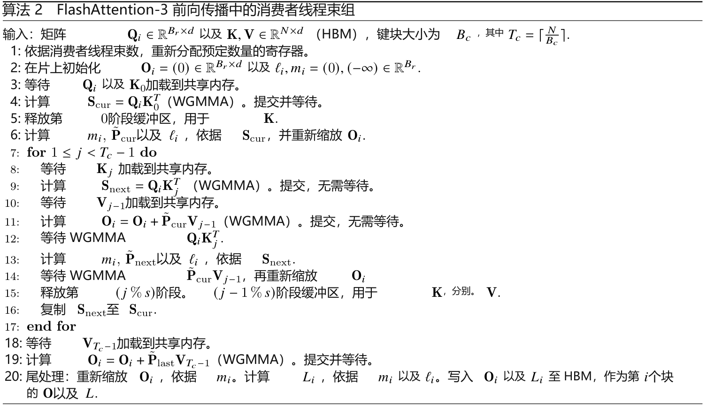

用算法 2 替换算法 1 中的消费者路径，即得到完整的 FP16 FlashAttention-3 算法。这里用 WGMMA 指代异步 GEMM 操作。主循环（第 8–16 行）使第 j 次迭代的第二个 WGMMA（第 11 行）与第 j+1 次迭代的 softmax（第 13 行）重叠。虽然理论上这样能够提高性能，但实际实现还需要考虑以下因素：

编译器重排序。上述伪代码展示了理想的指令顺序，但 NVCC 可能重新排列指令，破坏预期流水线并导致意料之外的性能表现。我们在附录 B.2 中分析生成的 SASS，确认实现具有预期的操作重叠。

寄存器压力。为避免寄存器溢出，必须尽量控制寄存器用量。两阶段流水线需要额外寄存器保存 Snext，每个线程块需增加 Bᵣ × B꜀ × sizeof(float) 的存储。这与使用更大分块的目标存在冲突，因此需要通过性能分析权衡。

三阶段流水线。还可以使用三阶段流水线，进一步让第二个 WGMMA 与 softmax 重叠，从而提高 Tensor Core 利用率。不过，它需要更多寄存器，因而涉及分块大小与流水线深度之间的权衡。附录 B.3 给出详细算法和评估。

### 3.3　低精度 FP8

效率：布局变换。与 FP16 版本相比，FP8 前向传播还面临额外挑战，需要满足指令对数据布局的要求。

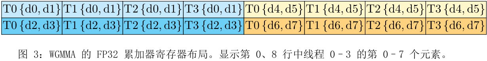

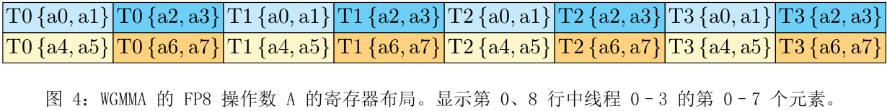

Q、K、V 沿头维度连续存储，但 FP8 的第二个 GEMM 要求采用 k-major 布局，即 V 分块沿序列维度连续。TMA 无法改变连续存储的维度，因此有两种办法：（1）在预处理阶段转置全局内存中的 V；（2）将 V 加载到共享内存后，在内核中转置。方案（1）又可以分为（1a）将转置融合进前置操作（如旋转位置嵌入）的尾处理，或（1b）使用独立的预处理转置内核，⁷ 交换序列维度与头维度的步长。方案（1a）难以集成进标准库；方案（1b）受内存带宽限制，在推理中会造成额外开销。

我们采用方案（2），利用线程束集体指令 LDSM（ldmatrix）与 STSM（stmatrix），以 128 字节为粒度在共享内存和寄存器间加载、存储数据。⁸ 这使生产者线程束组能够高效利用寄存器，在搬运数据时完成转置。首轮迭代之后，下一个 V 分块的转置可以与使用上一个 V 分块和当前 K 分块的两次 WGMMA 重叠。

此外，与 FP16 不同，第二个 FP8 WGMMA 的 FP32 累加器布局与寄存器操作数 A 的布局不同。图 3、4 按顺序展示了每个线程的寄存器片段。我们通过字节置换，将第一个 GEMM 的累加器转换为第二个 GEMM 所需的布局，并与 V 分块的内核内转置配合。具体而言，将图 3 的元素重排为

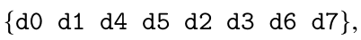

每 8 字节重复一次上述置换。从逻辑上看，这会置换 P 的列，例如原来的第 0、1、8、9 列成为前四列；因此需要在内核内转置 V 时，对它的行实施对应置换。⁹

准确性：分块量化与非相干处理。FP8 e4m3 格式只有 3 位尾数和 4 位指数，因此量化误差高于 FP16/BF16。大型语言模型中的离群值 [20, 54] 具有较大幅度，使量化更加困难。常见方法是逐张量使用一个缩放标量 [37]，分别量化 Q、K、V。我们采用两项技术减小误差：

• 分块量化。将 Q、K、V 划分为 Bᵣ × d 或 B꜀ × d 的块，为每块使用独立缩放标量进行量化。量化可融合到前置的旋转位置嵌入操作中；由于该操作受内存带宽限制，这不会造成额外减速。FlashAttention-3 自然按块工作，只需对每个 S 分块缩放以补偿量化，几乎无需额外计算成本。

> ⁷优化后的转置内核可以达到接近内存带宽上限的性能 [46]。
⁸PTX 将 LDSM/STSM 描述为对 16 位元素组成的 8×8 矩阵进行搬运 [40，第 9.7.13.4.15–16 节]。对于 FP8，需要将两个 8 位元素打包。转置操作不能拆开打包的 8 位元素，因此还需在 LDSM 与 STSM 之间移动寄存器数据，才能完成实际分块转置；此处省略细节。
⁹内核内转置提供了灵活性，使我们无需通过线程间 shuffle 改变数据归属；此前的方法 [7] 需要这种处理。

• 非相干处理。量化到 FP8 之前，先将 Q、K 乘以一个随机正交矩阵 M。由于 MMᵀ = I，(QM)(KM)ᵀ = QKᵀ，因此注意力输出不变。这使离群值被分散：变换后的每个元素都是原始元素的随机组合，从而减小量化误差。沿用 Chee 等 [9] 和 Tseng 等 [58] 的方法，M 由对角元素随机取 ±1 的对角矩阵与 Hadamard 矩阵相乘构成，计算复杂度为 O(d log d)，而非 O(d²)。该变换可融合到旋转位置嵌入中，无需额外计算开销。

如第 4.3 节所示，这些技术能够将数值误差最多降低 2.6 倍。

## 4　实验验证

我们使用 CUTLASS [57] 中的 WGMMA 与 TMA 原语实现 FlashAttention-3，并从效率和准确性两方面进行评估：

• 性能基准。我们与 PyTorch 标准实现、FlashAttention-2、使用 H100 指令的 FlashAttention-2 Triton 实现，以及厂商提供的 cuDNN 注意力实现（针对 H100 优化的 FlashAttention-2）比较。FlashAttention-3 最高比 FlashAttention-2 快 2 倍，比 Triton 实现快 1.5 倍，达到 740 TFLOPs/s，即 75% 利用率。

• 消融实验。线程束专门化与 GEMM–softmax 流水线都对性能提升作出贡献。

• FP8 准确性。分块量化与非相干处理将数值误差降低 2.6 倍。

### 4.1　注意力性能基准

我们在 H100 80GB SXM5 GPU 上，测试有、无因果掩码以及头维度为 64、128 的 FP16 注意力。如图 5、6 所示，相比 FlashAttention-2，前向传播加速 1.5–2 倍，反向传播加速 1.5–1.75 倍；相比标准实现，加速 3–16 倍。当序列长度不小于 1k 时，我们超过了闭源 cuDNN 实现。

我们测试序列长度 512、1k、2k、4k、8k、16k，并调整批大小，使总 token 数为 16k。隐藏维度固定为 2048；头维度为 64、128、256 时，注意力头数分别为 32、16、8。浮点运算量计算如下：

4 · 序列长度² · 头维度 · 注意力头数。

使用因果掩码时，浮点运算量减半。反向传播的运算量是前向传播的 2.5 倍：前向传播执行两次 GEMM，反向传播则执行五次（包括重计算）。FP8 前向传播采用类似设置，图 7 展示头维度为 256 的结果；完整结果见附录 C.2。

### 4.2　两阶段流水线消融实验

我们在无因果掩码的 FP16 设置下，对两阶段流水线和线程束专门化进行消融，固定 {批大小，序列长度，注意力头数，头维度} = {4, 8448, 16, 128}。表 2 表明，这些技术将性能从 570 TFLOPs/s 提升到 661 TFLOPs/s。

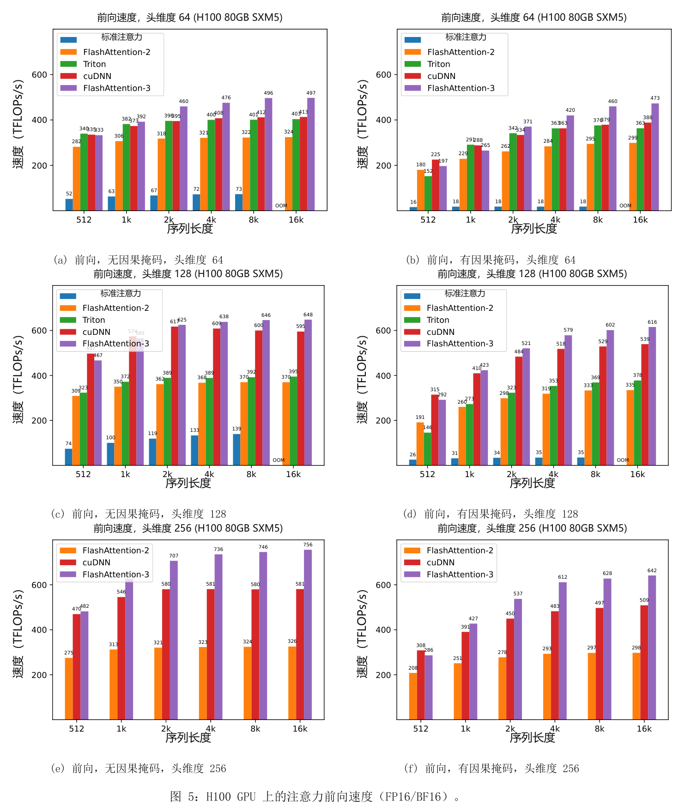

### 4.3　数值误差验证

鉴于已有研究关注 FlashAttention 的数值误差 [21]，我们以 FP64 结果为参考，比较 FlashAttention-2、FlashAttention-3 与标准注意力的误差。为模拟大型语言模型激活中的离群特征 [20, 54]，按照以下分布生成 Q、K、V 的元素：分布为：

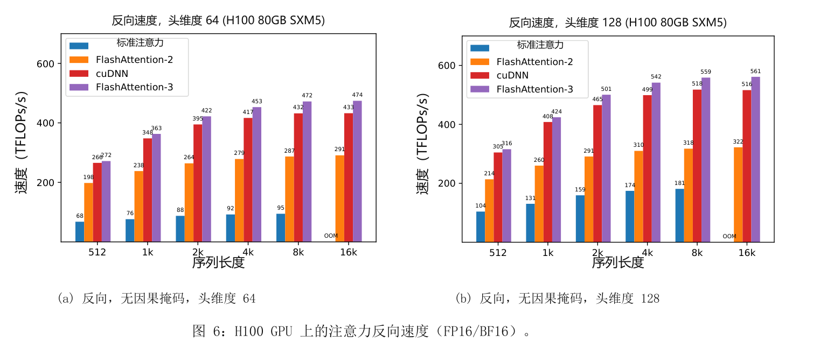

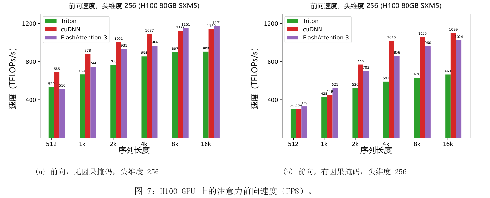

**表 2：流水线消融实验结果。**

| 配置 | 耗时 | TFLOPs/s |
| --- | --- | --- |
| FlashAttention-3 | 3.538 ms | 661 |
| 无 GEMM–softmax 流水线，有线程束专门化 | 4.021 ms | 582 |
| 有 GEMM–softmax 流水线，无线程束专门化 | 4.105 ms | 570 |

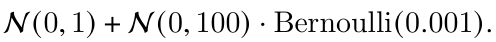

也就是说，每个元素服从均值为 0、标准差为 1 的正态分布；但对于其中 0.1% 的元素，我们再加上一个独立、标准差为 10 的正态随机项。表 3 给出均方根误差（RMSE）。在 FP16 下，FlashAttention-2 和 FlashAttention-3 的 RMSE 均比标准实现低 1.7 倍，因为中间结果（softmax）保留为 FP32。FP8 注意力基线使用逐张量缩放，矩阵乘法累加器为 FP32，softmax 中间结果保留为 FP16。借助分块量化和非相干处理，FP8 FlashAttention-3 的准确性比该基线高 2.6 倍。

**表 3：FP16 与 FP8（e4m3）的数值误差比较。**

| 方法 | FP16 基线 | FlashAttention-2 FP16 | FlashAttention-3 FP16 |
| --- | --- | --- | --- |
| RMSE | 3.2e-4 | 1.9e-4 | 1.9e-4 |

| 方法 | FP8 基线 | FlashAttention-3 FP8 | 无分块量化 | 无非相干处理 |
| --- | --- | --- | --- | --- |
| RMSE | 2.4e-2 | 9.1e-3 | 9.3e-3 | 2.4e-2 |

## 5　讨论、局限与结论

FlashAttention-3 表明，异步执行、低精度等新的编程技术和硬件特征能够显著影响注意力的效率与准确性。相比 FlashAttention-2，我们将注意力加速 1.5–2.0 倍；相比标准的逐张量量化，将 FP8 数值误差降低 2.6 倍。我们希望未来解决的局限包括：针对大型语言模型推理进行优化，将持久化内核设计集成到 FP8 内核中，¹⁰ 以及理解低精度注意力对大规模训练的影响。虽然本文聚焦 Hopper GPU，但我们预计这些技术也适用于其他硬件加速器。我们希望，更快、更准确的注意力等基础算子能够带来长上下文任务的新应用。

## 致谢

感谢 NVIDIA CUTLASS 团队，尤其是 Haicheng Wu、Aniket Shivam 和 Cris Cecka，帮助我们理解 Hopper 编程模型，并提供清晰而强大的库组件，使 FlashAttention-3 得以实现。感谢 cuDNN 团队提出 FP8 内核内转置的思路。与 Christopher Ré、Benjamin Spector、Aniket Shivam 和 Markus Hoehnerbach 的深入交流，启发了将 GEMM 与 softmax 重叠的想法。乒乓调度改编自 CUTLASS 中采用线程束专门化的乒乓 GEMM 实现。感谢 Driss Guessous 将 FlashAttention 集成到 PyTorch。与 Horace He 关于注意力变体、与 Hao Liu 和 Phil Wang 关于分布式注意力、与 Daniel Haziza 和 Chris De Sa 关于量化的讨论，都使 FlashAttention-3 受益。感谢 Meta、Together AI 和 Princeton Language and Intelligence（PLI）提供计算资源。

## 参考文献

[1] Ahmad Abdelfattah, Azzam Haidar, Stanimire Tomov, and Jack Dongarra. GPU 批量 GEMM 的性能、设计与自动调优. pages 21–38, 06 2016. ISBN 978-3-319-41320-4. doi: 10.1007/978-3-319-41321-1_2.

[2] AI21. Jamba 简介：AI21 的突破性 SSM–Transformer 模型. AI21 blog, 2024.

[3] Joshua Ainslie, James Lee-Thorp, Michiel de Jong, Yury Zemlyanskiy, Federico Lebrón, and Sumit Sanghai. GQA：从多头检查点训练广义多查询 Transformer 模型. arXiv preprint arXiv:2305.13245, 2023.

[4] Michael Bauer, Henry Cook, and Brucek Khailany. CudaDMA：通过线程束专门化优化 GPU 内存带宽. In Proceedings of 2011 International Conference for High Performance Computing, Networking, Storage and Analysis, SC ’11, New York, NY, USA, 2011. Association for Computing Machinery. ISBN 9781450307710. doi: 10.1145/2063384.2063400. URL https://doi.org/10.1145/2063384.2063400.

[5] Maximilian Beck, Korbinian Pöppel, Markus Spanring, Andreas Auer, Oleksandra Prudnikova, Michael Kopp, Günter Klambauer, Johannes Brandstetter, and Sepp Hochreiter. xLSTM：扩展长短期记忆. arXiv preprint arXiv:2405.04517, 2024.

> ¹⁰在本文基准测试中，FP16 FlashAttention-3 采用持久化内核与负载均衡策略，而 FP8 FlashAttention-3 没有采用。这部分解释了为何在短序列和因果掩码情况下，FP8 FlashAttention-3 的表现不及 FP8 cuDNN 内核。

[6] Iz Beltagy, Matthew E Peters, and Arman Cohan. Longformer：面向长文档的 Transformer. arXiv preprint arXiv:2004.05150, 2020.

[7] Ganesh Bikshandi and Jay Shah. 利用 FP8 FlashAttention-2 实现 1 PFLOP/s 性能, 2024. URL https://research.colfax-intl.com/adding-fp8-to-flashattention/.

[8] William Brandon, Aniruddha Nrusimha, Kevin Qian, Zachary Ankner, Tian Jin, Zhiye Song, and Jonathan Ragan-Kelley. 条带式注意力：面向因果 Transformer 的更快环形注意力. arXiv preprint arXiv:2311.09431, 2023.

[9] Jerry Chee, Yaohui Cai, Volodymyr Kuleshov, and Christopher M De Sa. QuIP：具有理论保证的大型语言模型 2 位量化. Advances in Neural Information Processing Systems, 36, 2024.

[10] Beidi Chen, Tri Dao, Eric Winsor, Zhao Song, Atri Rudra, and Christopher Ré. Scatterbrain：统一稀疏与低秩注意力. In Advances in Neural Information Processing Systems (NeurIPS), 2021.

[11] Richard J Chen, Chengkuan Chen, Yicong Li, Tiffany Y Chen, Andrew D Trister, Rahul G Krishnan, and Faisal Mahmood. 通过分层自监督学习将视觉 Transformer 扩展到十亿像素图像. In Proceedings of the IEEE/CVF Conference on Computer Vision and Pattern Recognition, pages 16144–16155, 2022.

[12] Rewon Child, Scott Gray, Alec Radford, and Ilya Sutskever. 利用稀疏 Transformer 生成长序列. arXiv preprint arXiv:1904.10509, 2019.

[13] Krzysztof Choromanski, Valerii Likhosherstov, David Dohan, Xingyou Song, Andreea Gane, Tamas Sarlos, Peter Hawkins, Jared Davis, Afroz Mohiuddin, Lukasz Kaiser, et al. 通过 Performer 重新思考注意力. In The International Conference on Learning Representations (ICLR), 2021.

[14] Krzysztof Marcin Choromanski, Valerii Likhosherstov, David Dohan, Xingyou Song, Andreea Gane, Tamas Sarlos, Peter Hawkins, Jared Quincy Davis, Afroz Mohiuddin, Lukasz Kaiser, et al. 通过 Performer 重新思考注意力. In International Conference on Learning Representations (ICLR), 2020.

[15] Tri Dao. FlashAttention-2：通过更好的并行性和工作划分实现更快的注意力, 2023. URL https://arxiv.org/abs/2307.08691.

[16] Tri Dao and Albert Gu. Transformer 即 SSM：基于结构化状态空间对偶的广义模型与高效算法. In International Conference on Machine Learning (ICML), 2024.

[17] Tri Dao, Daniel Y. Fu, Stefano Ermon, Atri Rudra, and Christopher Ré. FlashAttention：具备 IO 感知能力的快速、内存高效精确注意力. In Advances in Neural Information Processing Systems, 2022.

[18] Tri Dao, Daniel Y Fu, Khaled K Saab, Armin W Thomas, Atri Rudra, and Christopher Ré. Hungry Hungry Hippos：迈向基于状态空间模型的语言建模. In The International Conference on Learning Representations (ICLR), 2023.

[19] DeepSeek-AI. DeepSeek-V2：强大、经济、高效的混合专家语言模型. arXiv preprint arXiv:2405.04434, 2024.

[20] Tim Dettmers, Mike Lewis, Younes Belkada, and Luke Zettlemoyer. LLM.int8()：面向大规模 Transformer 的 8 位矩阵乘法. CoRR abs/2208.07339, 2022.

[21] Alicia Golden, Samuel Hsia, Fei Sun, Bilge Acun, Basil Hosmer, Yejin Lee, Zachary DeVito, Jeff Johnson, Gu-Yeon Wei, David Brooks, et al. FlashAttention 稳定吗？ arXiv preprint arXiv:2405.02803, 2024.

[22] Albert Gu and Tri Dao. Mamba：利用选择性状态空间进行线性时间序列建模. 2023.

[23] Anmol Gulati, James Qin, Chung-Cheng Chiu, Niki Parmar, Yu Zhang, Jiahui Yu, Wei Han, Shibo Wang, Zhengdong Zhang, Yonghui Wu, et al. Conformer：用于语音识别的卷积增强 Transformer. arXiv preprint arXiv:2005.08100, 2020.

[24] Mandy Guo, Joshua Ainslie, David Uthus, Santiago Ontanon, Jianmo Ni, Yun-Hsuan Sung, and Yinfei Yang. LongT5：面向长序列的高效文本到文本 Transformer. arXiv preprint arXiv:2112.07916, 2021.

[25] Jonathan Ho, Tim Salimans, Alexey Gritsenko, William Chan, Mohammad Norouzi, and David J Fleet. 视频扩散模型. Advances in Neural Information Processing Systems, 35:8633–8646, 2022.

[26] Coleman Hooper, Sehoon Kim, Hiva Mohammadzadeh, Michael W Mahoney, Yakun Sophia Shao, Kurt Keutzer, and Amir Gholami. KVQuant：通过 KV 缓存量化迈向千万上下文长度的大型语言模型推理. arXiv preprint arXiv:2401.18079, 2024.

[27] Angelos Katharopoulos, Apoorv Vyas, Nikolaos Pappas, and François Fleuret. Transformer 即 RNN：使用线性注意力的快速自回归 Transformer. In International Conference on Machine Learning, pages 5156–5165. PMLR, 2020.

[28] Nikita Kitaev, Łukasz Kaiser, and Anselm Levskaya. Reformer：高效 Transformer. In The International Conference on Machine Learning (ICML), 2020.

[29] Woosuk Kwon, Zhuohan Li, Siyuan Zhuang, Ying Sheng, Lianmin Zheng, Cody Hao Yu, Joseph Gonzalez, Hao Zhang, and Ion Stoica. 通过 PagedAttention 高效管理大型语言模型服务的内存. In Proceedings of the 29th Symposium on Operating Systems Principles, pages 611–626, 2023.

[30] Raymond Li, Loubna Ben Allal, Yangtian Zi, Niklas Muennighoff, Denis Kocetkov, Chenghao Mou, Marc Marone, Christopher Akiki, Jia Li, Jenny Chim, et al. StarCoder：愿源码与你同在！ arXiv preprint arXiv:2305.06161, 2023.

[31] Hao Liu, Matei Zaharia, and Pieter Abbeel. 结合分块 Transformer 的环形注意力：支持近乎无限的上下文. arXiv preprint arXiv:2310.01889, 2023.

[32] Hao Liu, Wilson Yan, Matei Zaharia, and Pieter Abbeel. 利用 RingAttention 对百万长度视频与语言构建世界模型. arXiv preprint arXiv:2402.08268, 2024.

[33] Zirui Liu, Jiayi Yuan, Hongye Jin, Shaochen Zhong, Zhaozhuo Xu, Vladimir Braverman, Beidi Chen, and Xia Hu. KIVI：面向 KV 缓存的免调优非对称 2 位量化. arXiv preprint arXiv:2402.02750, 2024.

[34] Weile Luo, Ruibo Fan, Zeyu Li, Dayou Du, Qiang Wang, and Xiaowen Chu. NVIDIA Hopper GPU 架构的基准测试与剖析, 2024. URL https://arxiv.org/abs/2402.13499.

[35] Xuezhe Ma, Chunting Zhou, Xiang Kong, Junxian He, Liangke Gui, Graham Neubig, Jonathan May, and Luke Zettlemoyer. MEGA：配备移动平均的门控注意力. In The International Conference on Learning Representations (ICLR), 2023.

[36] Xuezhe Ma, Xiaomeng Yang, Wenhan Xiong, Beidi Chen, Lili Yu, Hao Zhang, Jonathan May, Luke Zettlemoyer, Omer Levy, and Chunting Zhou. Megalodon：支持无限上下文长度的高效大型语言模型预训练与推理. arXiv preprint arXiv:2404.08801, 2024.

[37] Paulius Micikevicius, Dusan Stosic, Neil Burgess, Marius Cornea, Pradeep Dubey, Richard Grisenthwaite, Sangwon Ha, Alexander Heinecke, Patrick Judd, John Kamalu, et al. 面向深度学习的 FP8 格式. arXiv preprint arXiv:2209.05433, 2022.

[38] NVIDIA. CUDA 编程指南 12.4 版, 2024. URL https://docs.nvidia.com/cuda/ cuda-c-programming-guide/index.html.

[39] Nvidia. 使用 NVIDIA cuDNN 9 加速 Transformer. Nvidia blog, 2024. URL https://developer.nvidia. com/blog/accelerating-transformers-with-nvidia-cudnn-9/.

[40] NVIDIA. 并行线程执行指令集架构 8.4 版, 2024. URL https://docs.nvidia.com/cuda/pdf/ptx_ isa_8.4.pdf.

[41] Muhammad Osama, Duane Merrill, Cris Cecka, Michael Garland, and John D. Owens. Stream-K：面向 GPU 稠密矩阵乘法的以工作为中心的并行分解. In Proceedings of the 28th ACM SIGPLAN Annual Symposium on Principles and Practice of Parallel Programming, PPoPP ’23, pages 429–431, New York, NY, USA, 2023. Association for Computing Machinery. ISBN 9798400700156. doi: 10.1145/3572848.3577479. URL https://doi.org/10.1145/3572848.3577479.

[42] Bo Peng, Eric Alcaide, Quentin Anthony, Alon Albalak, Samuel Arcadinho, Huanqi Cao, Xin Cheng, Michael Chung, Matteo Grella, Kranthi Kiran GV, et al. RWKV：为 Transformer 时代重新设计 RNN. arXiv preprint arXiv:2305.13048, 2023.

[43] Bowen Peng, Jeffrey Quesnelle, Honglu Fan, and Enrico Shippole. YaRN：高效扩展大型语言模型的上下文窗口. arXiv preprint arXiv:2309.00071, 2023.

[44] Hao Peng, Nikolaos Pappas, Dani Yogatama, Roy Schwartz, Noah A Smith, and Lingpeng Kong. 随机特征注意力. In The International Conference on Learning Representations (ICLR), 2021.

[45] Markus N Rabe and Charles Staats. 自注意力不需要 O(n²) 内存. arXiv preprint arXiv:2112.05682, 2021.

[46] Colfax Research. 教程：CUTLASS 中的矩阵转置, 2024. URL https://research.colfax-intl. com/tutorial-matrix-transpose-in-cutlass/.

[47] Aurko Roy, Mohammad Saffar, Ashish Vaswani, and David Grangier. 利用路由 Transformer 实现高效的基于内容的稀疏注意力. arXiv preprint arXiv:2003.05997, 2020.

[48] Baptiste Roziere, Jonas Gehring, Fabian Gloeckle, Sten Sootla, Itai Gat, Xiaoqing Ellen Tan, Yossi Adi, Jingyu Liu, Tal Remez, Jérémy Rapin, et al. Code Llama：面向代码的开放基础模型. arXiv preprint arXiv:2308.12950, 2023.

[49] Rya Sanovar, Srikant Bharadwaj, Renee St. Amant, Victor Rühle, and Saravan Rajmohan. Lean Attention：面向 Transformer 解码阶段的硬件感知可扩展注意力机制. 2024.

[50] Uri Shaham, Elad Segal, Maor Ivgi, Avia Efrat, Ori Yoran, Adi Haviv, Ankit Gupta, Wenhan Xiong, Mor Geva, Jonathan Berant, et al. SCROLLS：长语言序列的标准化比较. arXiv preprint arXiv:2201.03533, 2022.

[51] Noam Shazeer. 快速 Transformer 解码：一个写入头就够了. arXiv preprint arXiv:1911.02150, 2019.

[52] Benjamin Spector, Aaryan Singhal, Simran Arora, and Christopher Ré, 2024. URL https://github.com/ HazyResearch/ThunderKittens.

[53] Fei Sun, Jun Liu, Jian Wu, Changhua Pei, Xiao Lin, Wenwu Ou, and Peng Jiang. BERT4Rec：利用 Transformer 双向编码表示进行序列推荐. In Proceedings of the 28th ACM international conference on information and knowledge management, pages 1441–1450, 2019.

[54] Mingjie Sun, Xinlei Chen, J Zico Kolter, and Zhuang Liu. 大型语言模型中的巨幅激活. arXiv preprint arXiv:2402.17762, 2024.

[55] Yutao Sun, Li Dong, Shaohan Huang, Shuming Ma, Yuqing Xia, Jilong Xue, Jianyong Wang, and Furu Wei. Retentive Network：大型语言模型中 Transformer 的继任架构. arXiv preprint arXiv:2307.08621, 2023.

[56] Yi Tay, Mostafa Dehghani, Dara Bahri, and Donald Metzler. 高效 Transformer：综述. arXiv preprint arXiv:2009.06732, 2020.

[57] Vijay Thakkar, Pradeep Ramani, Cris Cecka, Aniket Shivam, Honghao Lu, Ethan Yan, Jack Kosaian, Mark Hoemmen, Haicheng Wu, Andrew Kerr, Matt Nicely, Duane Merrill, Dustyn Blasig, Fengqi Qiao, Piotr Majcher, Paul Springer, Markus Hohnerbach, Jin Wang, and Manish Gupta. CUTLASS, January 2023. URL https://github.com/NVIDIA/cutlass.

[58] Albert Tseng, Jerry Chee, Qingyao Sun, Volodymyr Kuleshov, and Christopher De Sa. QuIP#：利用 Hadamard 非相干性与格码本改进大型语言模型量化. arXiv preprint arXiv:2402.04396, 2024.

[59] Ashish Vaswani, Noam Shazeer, Niki Parmar, Jakob Uszkoreit, Llion Jones, Aidan N Gomez, Łukasz Kaiser, and Illia Polosukhin. 注意力就是你所需要的一切. Advances in neural information processing systems, 30, 2017.

[60] Roger Waleffe, Wonmin Byeon, Duncan Riach, Brandon Norick, Vijay Korthikanti, Tri Dao, Albert Gu, Ali Hatamizadeh, Sudhakar Singh, Deepak Narayanan, et al. 基于 Mamba 的语言模型实证研究. arXiv preprint arXiv:2406.07887, 2024.

[61] Yunyang Xiong, Zhanpeng Zeng, Rudrasis Chakraborty, Mingxing Tan, Glenn Fung, Yin Li, and Vikas Singh. Nyströmformer：基于 Nyström 方法的自注意力近似算法. In Proceedings of the AAAI Conference on Artificial Intelligence. AAAI Conference on Artificial Intelligence, volume 35, page 14138, 2021.

[62] Shunyu Yao, Jeffrey Zhao, Dian Yu, Nan Du, Izhak Shafran, Karthik Narasimhan, and Yuan Cao. ReAct：在语言模型中协同推理与行动. arXiv preprint arXiv:2210.03629, 2022.

[63] Manzil Zaheer, Guru Guruganesh, Kumar Avinava Dubey, Joshua Ainslie, Chris Alberti, Santiago Ontanon, Philip Pham, Anirudh Ravula, Qifan Wang, Li Yang, et al. Big Bird：面向更长序列的 Transformer. Advances in Neural Information Processing Systems, 33, 2020.

[64] Zyphra. Zyphra 发布 Zamba：紧凑的 7B SSM 混合模型. Zyphra blog, 2024.

## A　相关工作

注意力变体与分布式注意力。自注意力随 Transformer 架构 [59] 广泛应用以来，已有大量工作通过近似注意力来支持更长序列。这些近似方法大体分为稀疏和低秩两类。稀疏注意力只计算注意力矩阵 softmax(QKᵀ) 的部分元素，并假定其他元素为零。不同方法通过不同方式选择置零元素，例如固定模式 [12]、滑动窗口 [6]，或通过哈希 [28]、路由 [47] 得到的动态模式。低秩方法则假定注意力矩阵具有低秩结构，对查询与键施加逐点非线性变换 [27]，并结合随机投影 [13, 44, 61]。还可以组合稀疏和低秩近似来改善质量 [10, 63]。不过，这些近似方法通常达不到标准注意力的模型质量 [56]，因此大多数大规模模型不采用它们。

另一些注意力变体旨在缩小 KV 缓存，提高推理效率。多查询注意力 [51] 与分组查询注意力 [3] 让 K、V 的不同头共享参数，使多个查询头与同一个键头、值头交互。多头潜在注意力 [19] 将 K、V 参数化为共享矩阵的低秩投影，进一步缩小 KV 缓存。但这些方法均未改变训练时的核心计算 softmax(QKᵀ)V，只改变 Q、K、V 的获取方式。因此，标准注意力计算的效率或准确性提升都能惠及这些方法。

为支持更长上下文，可以将注意力计算分布到多个 GPU。Ring attention [31, 32] 及其变体 [8] 等方法可实现长达 100 万的上下文。它们以 FlashAttention 或 FlashAttention-2 为基础算子，因此也能受益于 FlashAttention-3 的改进。

替代架构。针对注意力的局限，研究者提出了多种替代架构，建立在线性注意力 [27] 与循环神经网络（RNN）的联系之上。RWKV [42]、H3 [18]、MEGA [35]、Retnet [55] 使用更复杂的递推，增强线性注意力中简单累加的表达能力。Mamba [22] 和 xLSTM [5] 在递推中采用可学习权重，在中小规模语言建模中可以达到 Transformer 的质量。通过 token 混合矩阵的结构，可以将这些方法与线性注意力的推广联系起来 [16]。这些模型已开始在 Jamba [2]、Zamba [64]、Megalodon [36] 和 Mamba2-hybrid [60] 等中大型模型中应用。为获得最高质量，这些基于 SSM 和 RNN 的模型仍使用许多注意力层。我们预计，本文的注意力加速技术也能加速这些替代架构。

低精度注意力。量化是加速注意力的有前景方法，但以往工作主要通过压缩 KV 缓存提高推理效率。QuIP [9] 和 QuIP# [58] 使用非相干处理减小量化误差，我们将该技术用于 FP8 FlashAttention-3。近期研究表明，推理时的 KV 缓存高度可压缩，可降至 4 位、3 位，甚至 2 位 [26, 33]。然而，训练时量化仍具挑战，因为稳定训练通常要求更高精度。

硬件感知算法。本文聚焦针对微架构的调优，利用新的指令集并采用原生异步编程模型。还有其他彼此正交的硬件感知算法协同设计方向。例如，LeanAttention [49] 将顺序 token 生成阶段较低的 GPU 占用率和较高的内存带宽需求识别为推理主要瓶颈，采用类似 Stream-K [41] 的更合理负载均衡策略，使占用率接近峰值。针对特定硬件优化 GEMM 的研究非常丰富，使用了许多相同技术。例如，Abdelfattah 等 [1] 面向 K40c GPU，提出支持固定与可变尺寸的高性能批量 GEMM 内核，借助专用 GEMM 设计与全面的自动调优流程，获得当时领先的性能。

## B　算法补充细节

### B.1　通过线程束专门化实现反向传播异步执行

与第 3.1 节的前向传播类似，我们通过线程束专门化处理异步执行。在前向传播简单的生产者—消费者模式之外，我们增加一个 dQ 写入者角色，因为需要将每个线程块产生的 dQ 累加到全局 dQ。该累加会导致内存争用，即多个线程块写入同一位置。使用独立线程束异步处理这一操作，可以避免阻塞线程块中的其他线程束，使其继续执行下一次矩阵乘法。算法 3 给出采用线程束专门化的反向传播。

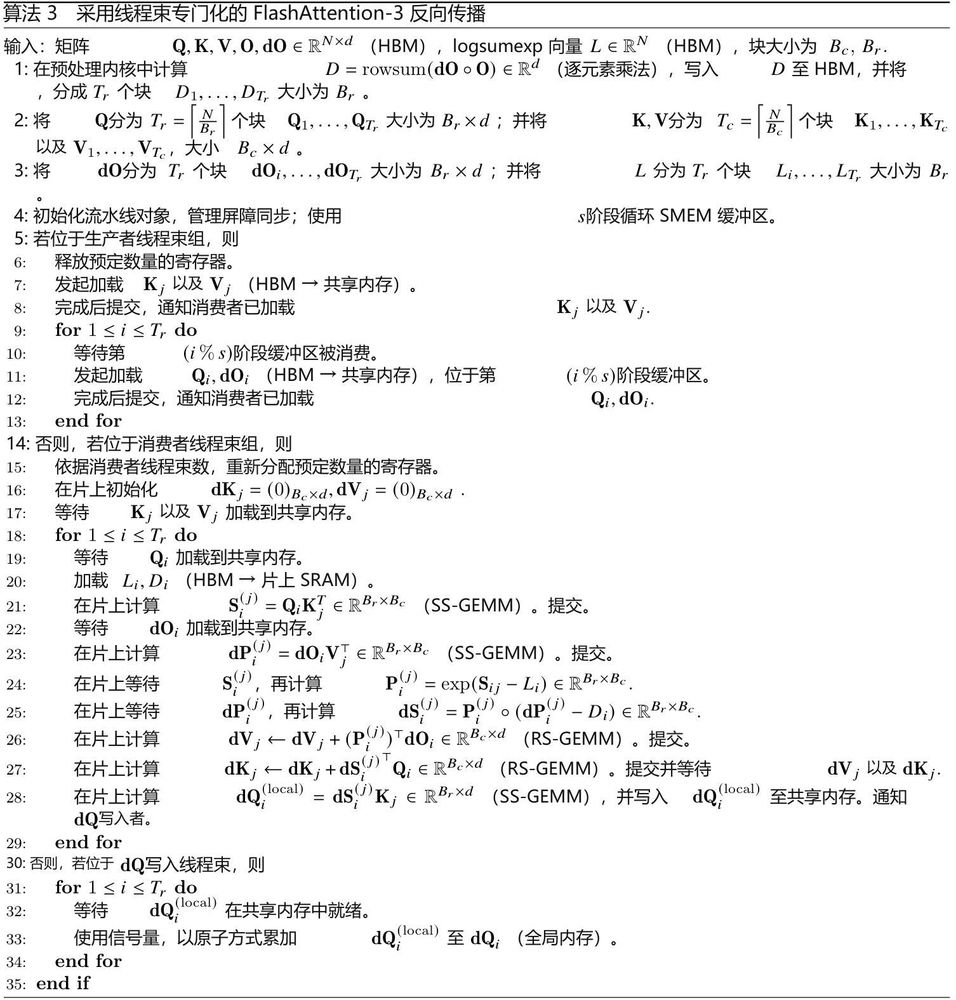

### B.2　两阶段流水线的 SASS 分析

下面给出消费者线程束组主循环内部的简化 SASS 代码。

```asm
// 计算 row_max
FMNMX.FTZ R0, R24, R6, !PT ;
SHFL.BFLY PT, R185, R2, 0x2, 0x1f ;
... FMNMX and SHFL.BFLY ...
```

```asm
// 执行 exp2、row_sum；重新缩放 O。
FMUL.FTZ R2, R4, UR9 ;
MUFU.EX2 R185, R184 ;
FFMA.FTZ R24, R24, UR9, -R6.reuse ;
FADD.FTZ R24, R211, R24 ;
... FMUL, FFMA, FMUL, MUFU.EX2, FADD ...
```

```asm
// FP32 → FP16 转换与 exp2、row_sum、O 重缩放交错执行。
F2FP.F16.F32.PACK_AB R231, R25, R231 ;
... F2FP, FMUL, MUFU, FFMA, FADD ...
```

```asm
// 启动第一个 WGMMA，分解为 8 个 HGMMA。
// 前 7 个 HGMMA 连续排列。
WARPGROUP.ARRIVE ;
HGMMA.64x192x16.F32 R24, gdesc[UR44], RZ, !UPT ;
... HGMMA x 6 ...
```

```asm
// FP32 → FP16、exp2、row_sum、O 重缩放与 HGMMA 交错执行。
F2FP.F16.F32.PACK_AB R214, R214, R187 ;
MUFU.EX2 R234, R5 ;
FADD.FTZ R237, R187, R2 ;
... F2FP, MUFU, FADD ...
```

```asm
// 在此发射最后一个 HGMMA，无需等待。
HGMMA.64x192x16.F32 R24, gdesc[UR44], R24, gsb0 ;
```

```asm
// 启动第二个 WGMMA，分解为 12 个 HGMMA。
// 全部 12 个 HGMMA 连续排列，不与其他指令交错。
WARPGROUP.ARRIVE ;
HGMMA.64x128x16.F32 R120, R228, gdesc[UR8].tnspB, R120 ;
... HGMMA x 10 ...
HGMMA.64x128x16.F32 R120, R184, gdesc[UR8].tnspB, R120, gsb0 ;
```

```asm
// 最后执行 wgmma.wait_group。
WARPGROUP.DEPBAR.LE gsb0, 0x0 ;
```

我们观察到：

1. softmax 被重排到最前面，甚至位于第一个 WGMMA 之前。

2. 第一个 WGMMA 与 softmax 及 S 的 FP32 → FP16 数据类型转换交错执行，说明 WGMMA 与非 WGMMA 操作在并行执行。

3. exp2、row_sum、O 的重新缩放，以及 FP32 → FP16 转换交错执行。

4. 第二个 WGMMA 没有与其他指令重叠，符合预期。

总体而言，SASS 表明两阶段流水线按预期工作。

### B.3　三阶段流水线算法

我们尝试了一种三阶段流水线算法，使第 j+2 次迭代的第一个 WGMMA、第 j+1 次迭代的 softmax，以及第 j 次迭代的第二个 WGMMA 并行执行。算法 4 描述了这一方案。其性能不及两阶段流水线，原因如下：

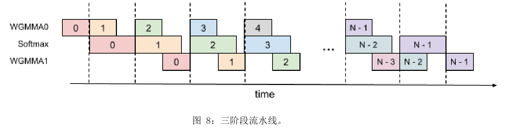

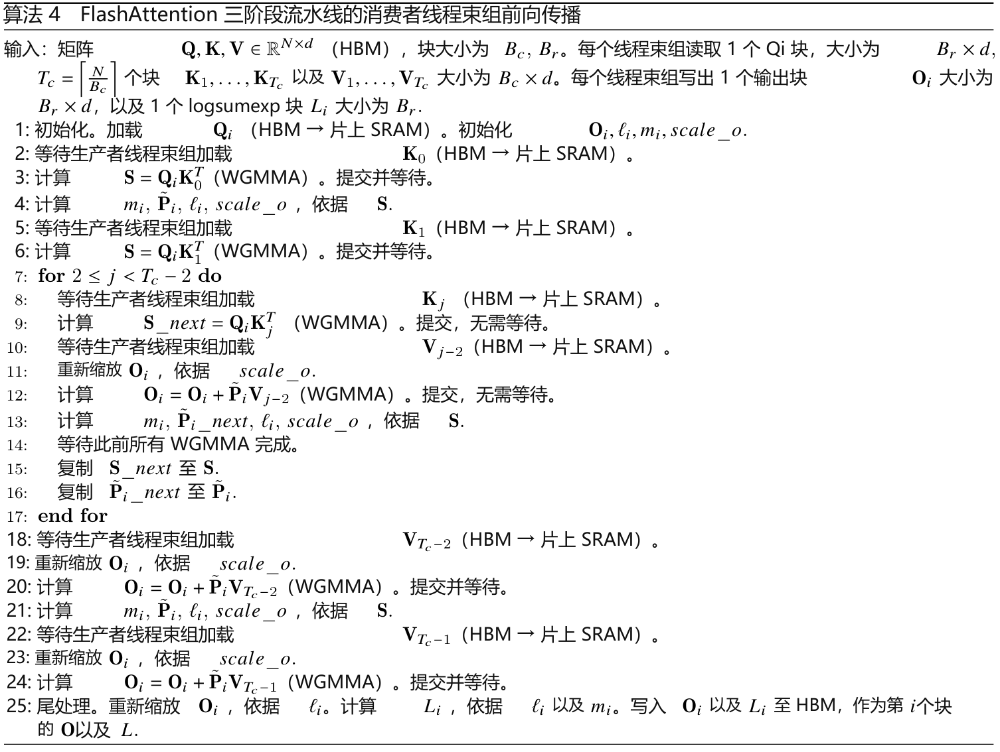

操作重叠。我们原本期望 softmax 能与第一个 WGMMA 和第二个 WGMMA 同时重叠，但编译器没有按这种方式工作。SASS 代码显示，只有第一个 WGMMA 与 softmax 重叠，第二个没有。目前还不清楚编译器为何选择这种指令重排方式。

寄存器压力。与两阶段算法相比，该算法需要更多寄存器。理论上，需要额外保存 P̃ᵢ 和 scale_o，占用 Bᵣ × B꜀ × sizeof(input_data_type) + Bᵣ × sizeof(float) 的空间。因此，必须选择更小的分块。

## C　实验与基准测试补充细节

### C.1　系统与软件库

我们在 H100 80GB SXM5（700W）上测试速度。通常采用撰写论文时（2024 年 5 月）的最新库版本，具体如下：

• CUDA 12.3

• cuDNN 9.1.1.17

• CUTLASS 3.5

• FlashAttention 2.5.8

• Triton nightly 3.0.0.post20240424212437

• PyTorch 2.3.0

为减少波动，我们将 GPU 时钟固定在 1830MHz，即计算 FP16 理论最大吞吐量 989 TFLOPs/s 时所用的频率。每项基准重复 100 次，取平均耗时。

### C.2　FP8 注意力完整结果

我们采用以下序列长度：512、1024、2048、4224、8448、16896。当序列长度 ≥ 4k 时，还使其能被 132（H100 SXM5 的 SM 数量）整除，以避免执行波次量化（wave quantization）。

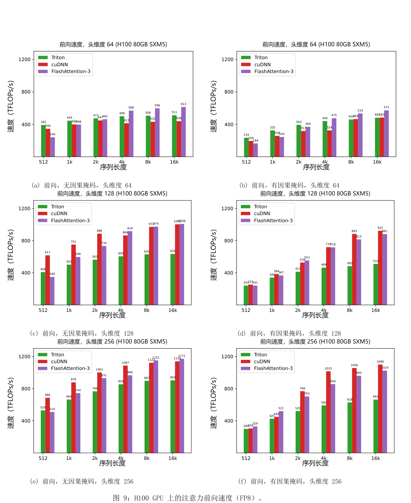
