# FlashAttention-4：面向硬件非对称扩展的 算法与内核流水线协同设计

> 中文译本。原文：arXiv:2603.05451v1（2026-03-05）。正文与表格可编辑；复杂公式及插图以高清图片嵌入，保留原编号。

Ted Zadouri*1,6 Markus Hoehnerbach*2 Jay Shah*3

Timmy Liu4 Vijay Thakkar2,5 Tri Dao1,6

1普林斯顿大学　2Meta　3Colfax Research　4NVIDIA　5佐治亚理工学院　6Together AI

## 摘要

注意力是广泛应用的 Transformer 架构中的核心层，也是大型语言模型和长上下文应用的瓶颈。FlashAttention-3 通过异步执行与线程束专门化优化了 Hopper GPU 上的注意力，但主要针对 H100 架构。AI 行业已迅速转向部署 B200、GB200 等基于 Blackwell 的系统。由于硬件非对称扩展，这些系统的性能特征发生了根本变化：Tensor Core 吞吐量翻倍，而共享内存带宽、指数运算单元等其他资源增长较慢或保持不变。我们提出多项技术应对 Blackwell GPU 上转移的瓶颈：（1）重新设计流水线，利用完全异步的 MMA 操作与更大的分块；（2）通过软件模拟指数函数与条件式 softmax 重新缩放，减少非矩阵乘法操作；（3）利用张量内存和双 CTA MMA 模式，减少反向传播中的共享内存流量与原子加法。实验表明，FlashAttention-4 在 B200 GPU 上采用 BF16 时，相比 cuDNN 9.13 最高加速 1.3 倍，相比 Triton 最高加速 2.7 倍，达到 1613 TFLOPs/s（71% 利用率）。除算法创新外，我们完全使用嵌入 Python 的 CuTe-DSL 实现 FlashAttention-4，在保持完整表达能力的同时，相比传统 C++ 模板方案将编译速度提升 20–30 倍。

## 1　引言

Transformer 架构 [27] 仍是几乎所有 AI 应用的主要骨干，从大型语言模型 [2] 到视觉 [8] 和多模态系统。对于 Transformer，注意力机制是主要计算瓶颈：查询与键之间自注意力分数的计算量随序列长度呈二次增长。将注意力扩展到更长上下文，可支持跨文档推理 [10, 24]、对整个代码库建模 [22]，以及处理高分辨率视频 [3, 11] 等新能力。同时，加速器硬件持续快速演进 [19]，每代产品的峰值计算吞吐量都显著提高。但这种演进并不对称：矩阵乘法单元快速扩展，内存带宽、专用计算单元等其他资源增长更慢，使硬件流水线日益失衡，要求精细的算法协同设计。

这推动了人们持续探索将 GPU 硬件特征深度融入算法的注意力加速方法。Dao 等 [6] 提出的 FlashAttention 通过新的分块方式与内核融合，消除了对慢速全局内存的中间结果读写。Dao [5] 将其重构为 FlashAttention-2，沿序列长度维度并行，提高 GPU 占用率。Shah 等 [23] 又将算法适配到 Hopper GPU，提出 FlashAttention-3，通过线程束专门化利用异步执行，并加入 FP8 支持。近期工作也探索低精度注意力：SageAttention [13] 通过 INT8 量化加速，SageAttention2 [12] 扩展到 INT4/FP8 量化，SageAttention3 [14] 则在 Blackwell 消费级 GPU 上实现 FP4 量化。不过，这些方法主要面向消费级 GPU，而大部分 AI 计算部署在数据中心 GPU 上。另一方面，FlashAttention-3 主要针对 NVIDIA Hopper H100 架构，而 AI 行业已迅速转向 B200、GB200 等 Blackwell 数据中心系统 [19]；新一代 GPU 具有根本不同的性能特征。

> ∗同等贡献

加速器演进的一个关键趋势，是不同硬件单元的非对称扩展。Blackwell B200 的 Tensor Core 吞吐量是 Hopper H100 的两倍（FP16/BF16 下为 2.25 PFLOPS 对 1 PFLOPS），但共享内存带宽、指数运算单元，以及整数/浮点 ALU 等其他资源增长更慢或不变。因此，非 MMA 资源成为瓶颈。第 3.1、3.2 节的 Roofline 分析表明，令人意外的是，对于 Blackwell 上的典型注意力负载，共享内存访问与指数运算如今主导执行时间，比 MMA 计算耗时高 25%–60%。此外，Blackwell 引入了新架构特征：每个 SM 配备 256 KB 张量内存（TMEM），用于保存 Tensor Core 中间结果；128×128 的 MMA 分块，面积是 Hopper 64×128 分块的两倍；以及将结果直接写入 TMEM 的完全异步 Tensor Core 操作。简单移植现有注意力算法会损失大量性能，甚至因 Hopper MMA 指令不具备向前兼容性而无法实现。

为此，我们提出 FlashAttention-4，协同设计算法和内核实现，应对现代 GPU 架构中转移的瓶颈。我们显式识别非矩阵乘法单元的瓶颈，并通过算法创新缓解这些瓶颈：

1. 重新设计流水线，最大化重叠。我们为前向和反向传播开发新的软件流水线，利用 Blackwell 完全异步的 MMA 操作和更大分块，最大程度重叠 Tensor Core、softmax 计算和内存操作。

2. 缓解指数运算单元瓶颈。对于前向传播，我们在 FMA 单元上通过多项式近似，以软件模拟指数函数，提高指数运算吞吐量。我们还引入条件式 softmax 重新缩放，跳过不必要的缩放操作。

3. 减少共享内存流量。对于反向传播，我们利用张量内存保存更多中间结果，减少共享内存流量。同时利用 Blackwell 的双 CTA MMA 模式，使每个 CTA 只暂存和加载一半操作数 B，进一步降低共享内存流量；并据此重构 dQ 步骤，将原子归约次数减半。我们还实现了性能开销很小的确定性执行模式，使强化学习应用能够进行可复现训练。

4. 改善调度与资源分配。我们针对 Blackwell 的资源约束和更大分块，开发新的 CTA 调度策略及寄存器分配方案。

除算法创新外，我们完全使用嵌入 Python 的 CuTe-DSL 实现 FlashAttention-4，在保持完整表达能力的同时，相比传统 C++ 模板方案将编译速度提高 20–30 倍。这一框架显著提高开发者生产效率并降低入门门槛，让研究者无需深入掌握 C++ 模板元编程，就能快速构建和部署新的注意力变体。

为验证方法，我们在 B200 GPU 上测试 FlashAttention-4，结果表明：（1）使用 BF16 时，相比 cuDNN 最高加速 1.3 倍，相比 Triton 实现最高加速 2.7 倍；（2）在已转移的瓶颈资源上达到接近峰值的利用率，最高约 1600 TFLOPS（理论峰值的 71%）；（3）对于较长序列，FlashAttention-4 优于其他注意力实现。

我们以宽松许可证开源 FlashAttention-4，并正将其集成到常用库中，惠及尽可能多的研究者和开发者。代码地址：https://github.com/Dao-AILab/flash-attention/tree/main/flash_attn/cute

## 2　背景

### 2.1　多头注意力

设 Q、K、V ∈ ℝN×d 分别为单个注意力头的查询、键、值输入序列，其中 N 为序列长度，d 为头维度。注意力输出 O ∈ ℝN×d 的计算为：

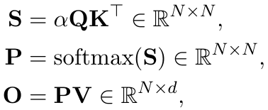

其中，softmax 按行计算，缩放系数 α = 1/√d。实际计算中，为保证数值稳定性，从 S 中减去 rowmax(S)。对于多头注意力（MHA），每个头都有自己的投影，计算可在多个头和批次之间并行。

给定输出梯度 dO ∈ ℝN×d，反向传播计算如下：

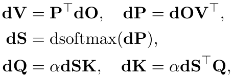

其中，dsoftmax(dP) 表示逐行 softmax 梯度：对于 p = softmax(s)，有 ds = (diag(p) − ppT)dp。

### 2.2　GPU 硬件特征与执行模型

下面介绍与 FlashAttention-4 相关的 GPU 执行模型，重点关注 NVIDIA Blackwell 架构（B200 和 GB200）。我们着重说明它与上一代 Hopper 架构的关键差异，以及这些差异如何促成 FlashAttention-4 的优化。

内存层次。GPU 内存由多个数据存储层级组成，其容量与带宽呈反向关系。全局内存（GMEM），也称 HBM，是所有流式多处理器（SM）均可访问的片外 DRAM。GMEM 数据会透明地缓存在片上 L2 中。其次，每个 SM 内有一个较小的片上共享内存（SMEM），由程序员管理，并划分为大量存储体。最后是每个 SM 内部的寄存器文件。

Blackwell 引入了新的张量内存（TMEM）层级，每个 SM 配备 256 KB 片上内存，专门存放 Tensor Core 操作的中间结果。与共享内存不同，TMEM 以线程束为单位同步，并与 Tensor Core 紧密耦合，使矩阵乘加（MMA）单元能够直接将输出写入 TMEM，无需占用寄存器。这缓解了困扰 Hopper 内核的严重寄存器压力，并支持更大的分块。TMEM 以 32 列（16 KB）为粒度分配，分配、释放和数据搬运均需由程序员显式管理。

线程层次。GPU 编程模型围绕称为线程的执行单元及其逻辑分组组织。从细到粗依次为：线程、线程束（32 个线程）、线程束组（4 个连续线程束）、线程块（即协作线程阵列，CTA）、线程块簇，以及网格。同一 CTA 的线程共同调度到同一 SM，同一簇中的 CTA 共同调度到同一 GPC。CTA 中的所有线程都可直接访问 SMEM；每个线程则最多拥有 256 个私有寄存器（RMEM）。

Tensor Core 与更强的异步性。Blackwell 配备第五代 Tensor Core，处理的分块显著大于前代架构。每条 MMA Tensor Core 指令处理 128×N 分块（N 通常为 128 或 256），而 Hopper 为 64×N。关键区别是，Blackwell MMA 异步将输出直接写入 TMEM，而 Hopper MMA 写入寄存器。这种完全异步性改善了计算与其他操作之间的重叠，因为 MMA 单元不再因寄存器写回而阻塞。

硬件异步支持使线程束专门化内核成为可能：将 CTA 内的线程束分为生产者与消费者，分别只负责发起数据搬运或计算 [1]。

双 CTA Tensor Core。Blackwell 支持双 CTA Tensor Core MMA 模式：同一线程块簇内的一对 CTA 协同执行一次 MMA，可读写两个 CTA 的张量内存。由其中一个线程发起 MMA，但配对 CTA 必须已启动，并在操作执行期间保持活跃。单 CTA MMA 的 M 维度上限为 128；双 CTA 模式则支持 M = 128 或 256，将 A 分块及累加器沿 M 维度分到两个 CTA，并沿 N 维度划分 B 分块，使每个 CTA 仅在自己的共享内存中暂存一半 B，而硬件在乘法中使用合并后的 B 分块。这减少了冗余共享内存容量和带宽需求。不过，由于操作会跨 CTA 对访问张量内存，内核必须以固定配对方式启动 CTA，且整个内核的张量内存与 Tensor Core 操作都必须一致使用双 CTA 模式。

转移的瓶颈。Blackwell 体现的一个关键趋势是，Tensor Core 吞吐量比其他硬件单元增长更快。相比 Hopper，Blackwell 的 FP16/BF16 Tensor Core 吞吐量翻倍（每 GPU 2.25 PFLOPS [19] 对 1 PFLOPS [17]），但共享内存带宽和指数运算吞吐量不变或增长更慢。这种不平衡使性能瓶颈从矩阵乘法转移到共享内存访问与 softmax 等非矩阵乘法操作。第 3.1、3.2 节的 Roofline 分析表明，必须精细设计算法内核，最大程度重叠 MMA 与这些瓶颈资源。

B200（以及 GB200）的部分硬件吞吐量如下。
1. Tensor Core：BF16 MMA 吞吐量为每时钟周期、每 SM 8192 次操作，是 Hopper 的 4096 次的两倍。可由理论最大 FLOPS 推得：2.25 PFLOPS / 1850 MHz 时钟 / 148 个 SM = 每时钟周期、每 SM 8192 次操作。

2. 指数运算单元。B200、GB200 的多功能单元（MUFU）每时钟周期、每 SM 执行 16 次操作，与 Hopper 相同 [18]。B300、GB300 的指数运算吞吐量已翻倍至 32 次，但撰写本文时这些 GPU 尚未广泛普及。

3. SMEM：微基准测试 [15] 测得，每时钟周期、每 SM 的读取吞吐量为 128 字节，与 Hopper 相同。

可以看到，相比 Hopper，Blackwell 的 MMA 吞吐量翻倍，但其他硬件单元不一定以相同速度提升。这反映了加速器设计的更广泛趋势：提高最重要组件（通常是矩阵乘法单元）的吞吐量，以在相近功耗和芯片面积约束下获得更高性能。

## 3　算法

### 3.1　注意力前向传播

我们首先通过 Roofline 分析揭示注意力前向传播的瓶颈，并据此设计新的流水线、调整 FlashAttention 算法，以提高指数运算吞吐量，并避开大多数 softmax 重新缩放步骤。

#### 3.1.1　数据供给与运算速度

为解释内核设计和优化的依据，我们先根据矩阵乘法单元（Tensor Core）、共享内存（SMEM）及指数运算单元的吞吐量进行 Roofline 分析。这是简化分析，未涵盖 GPU 的全部资源，例如浮点计算、寄存器带宽与 L2 带宽，但仍能识别瓶颈。

设沿 Q、K 序列长度维度的分块形状为 M×N，头维度为 d。下面分析计算与内存访问需求，以确定性能瓶颈。

MMA 计算。前向传播每轮执行两次矩阵乘加：QKT 从 M×d 和 d×N 输入得到 M×N 输出；PV 从 M×N 和 N×d 输入得到 M×d 输出。每次 MMA 需要 2MNd 次浮点运算。Tensor Core 吞吐量为每周期 8192 FLOPs，因此总计算时间为

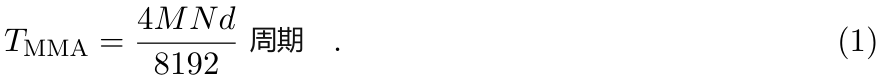

共享内存流量。两次 MMA 中，一次是共享—共享（SS）操作，两个操作数均来自共享内存（QKT）；另一次是张量—共享（TS）操作，A 来自张量内存、B 来自共享内存（PV）。每条 MMA 指令处理 128×128 分块，因此计算 M×N 输出需 ⌈M/128⌉×⌈N/128⌉ 条 MMA 指令。关键在于，当需要多条 MMA 指令时，共享内存操作数会被重复读取。

对于 QKT（SS），计算 M×N 输出需要 ⌈M/128⌉×⌈N/128⌉ 条 MMA 指令，每条从共享内存读取 128×d 的 Q 块和 d×128 的 KT 块。总读取量为 ⌈M/128⌉×⌈N/128⌉×(128d+128d) = ⌈M/128⌉⌈N/128⌉×256d 个元素。对于 PV（TS），计算 M×d 输出需要 ⌈M/128⌉×⌈d/128⌉ 条 MMA 指令，每条从共享内存读取 N×128 的 V 块，共 ⌈M/128⌉×⌈d/128⌉×128N 个元素。每元素 2 字节（BF16），带宽为每周期 128 字节，因此共享内存读取时间 Tsmem 为

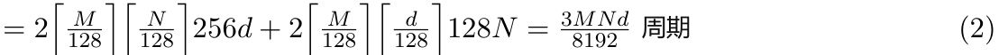

（假设 M、N、d 均为 128 的倍数。）

指数运算单元。指数运算单元执行 softmax 所需的逐元素运算。前向传播需对 M×N 个值（对应注意力矩阵 S）求指数。吞吐量为每周期 16 次操作，因此所需时间为

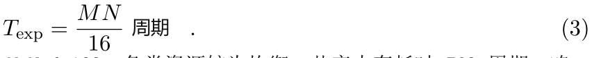

表 1 汇总两种典型分块配置的分析。对于 M=N=d=128，各类资源较为均衡：共享内存耗时 768 周期，略低于 MMA计算与指数运算（均为 1024 周期）。对于更大的分块 M=256、N=d=128，由于多次读取 MMA 操作数，共享内存耗时增至 1536 周期；MMA 计算与指数运算均翻倍至 2048 周期。由此，我们的内核设计旨在：（1）使用大分块，最大程度重叠 MMA 与 softmax；（2）利用其他硬件单元提高指数运算吞吐量；（3）减少不必要的非矩阵乘法操作耗时。

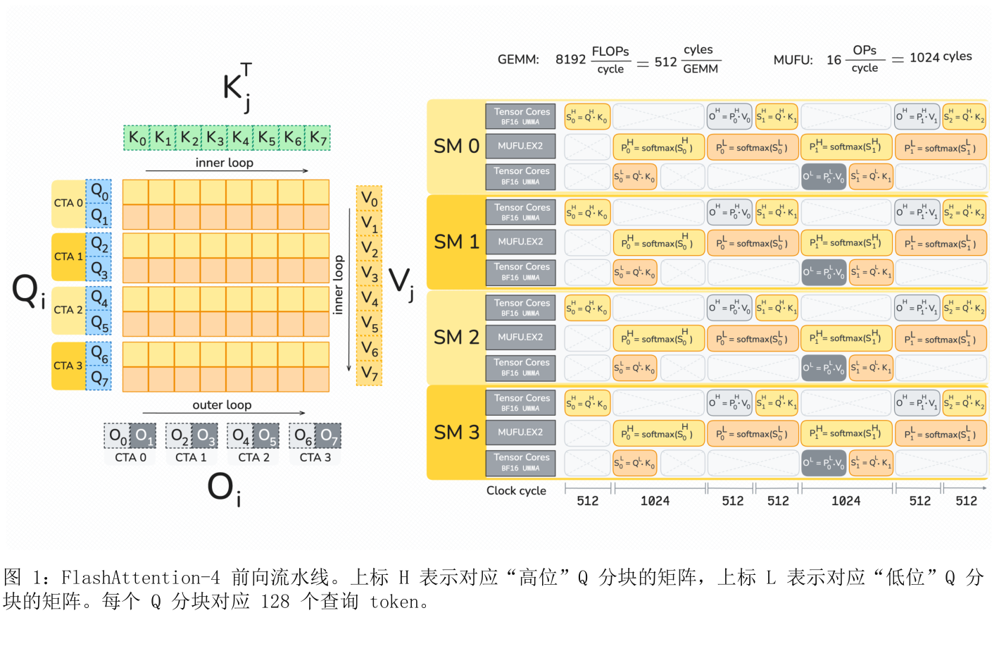

| 资源 | 1283 | 256 × 1282 |
| --- | --- | --- |
| MMA 计算 | **1024** | **2048** |
| 共享内存 | 768 | 1536 |
| 指数运算单元 | **1024** | **2048** |

**表 1：注意力前向传播的 Roofline 分析（单位：周期）。两种分块大小下，MMA 计算和指数运算单元均为主要瓶颈。**

#### 3.1.2　重叠矩阵乘法与 softmax 的新流水线

Blackwell 架构再次将 Tensor Core FLOPS 翻倍，因此重叠 softmax 与 Tensor Core 操作比在 Hopper 上更加关键。我们沿用类似 FA-3 的乒乓调度，每个线程块计算两个输出分块。一个分块执行 Tensor Core 操作时，另一个计算 softmax。Hopper 将累加器保存在寄存器中，每行由四个线程按交错模式持有；Blackwell 则将累加器保存在张量内存中。此外，Blackwell 的单个累加器分块为 128×128 元素，而 Hopper 为 64×128。

一种自然的工作分配方式是使用两个线程束组，每组包含 128 个线程，每个线程处理完整的一行。这消除了归约行最大值时的线程束间 shuffle，也无需每个线程持有多套统计量寄存器。与 FA-3 一样，我们显式同步两个 softmax 线程束组，使其关键区段（指数运算部分）不重叠。每个 softmax 线程束组先将整行加载到寄存器，计算最大值，再执行 softmax（减去最大值、缩放、求指数、转换到输入精度），最后计算行和。

另一个区别是，我们通过张量内存而非寄存器文件传递 P，因此可以将输出重新缩放交给独立的“修正”线程束组，使其离开关键路径。

有多种张量内存划分方式可以实现上述流水线重叠。所有方案都须为两个输出分块分配空间；在头维度为 128 时，剩下一半张量内存保存 S 和 P。这些空间可容纳两个 S 副本，或四个 P 副本（假设 Tensor Core 输入为 FP16 或 BF16）。因此大致有两种选择：一个 S 分块和两个 P 分块，或两个与 P 复用空间的 S 分块。我们选择后者，因为可以在软件流水线开始时立即计算两个 S 分块，还能留出部分张量内存，将重新缩放统计量传给修正线程束组。

Blackwell 更大的分块和上述线程分配带来一个问题：除非从张量内存重新加载，否则必须在寄存器中保存一整行 128 个元素。我们使用两个 softmax 线程束组、一个修正线程束组，以及一个驱动 Tensor Core 与 TMA 的线程束组，因此为 softmax 分配足够寄存器、避免溢出十分关键。BF16 输入需要 128 个寄存器保存输入，最多还需 64 个寄存器保存输出，外加其他及临时寄存器。为降低寄存器压力，我们分阶段存储 P：先一次存储前三个四分之一，并触发对应 MMA 操作，再单独存储最后一个四分之一。

#### 3.1.3　指数函数的软件模拟

指数运算吞吐量瓶颈。在现代 GPU 上，指数函数由多功能单元（MUFU）计算，其吞吐量远低于用于矩阵乘法的 Tensor Core。B200、GB200 的 MUFU 每时钟周期、每 SM 提供 16 次操作，而矩阵乘法为 8192 次。softmax 需要大量指数求值，因此这种差距使指数函数成为注意力内核的关键瓶颈。

通过多项式近似进行软件模拟。为提高指数运算吞吐量，我们利用可与 MUFU 并行工作的浮点 FMA 单元，用软件模拟 2x。我们先采用经典的范围缩减方法（Cody–Waite），再进行多项式近似 [16]。核心思路是将指数运算分解：

2x = 2⌊x⌋ 2x−⌊x⌋　（4）

其中 ⌊x⌋ 为整数部分，x−⌊x⌋ ∈ [0,1) 为小数部分。整数部分 2⌊x⌋ 可通过操作 IEEE 754 浮点表示的位高效计算。由于指数域直接表示 2 的幂，计算 2⌊x⌋ 相当于对指数位移位和加法，可用整数 ALU 指令完成。对于小数部分 xfrac ∈ [0,1)，我们用多项式近似 2xfrac：

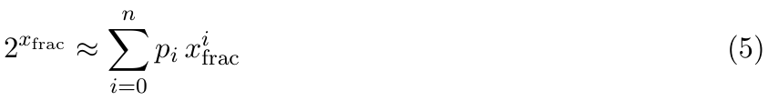

其中 p0=1.0，其余系数通过最小化相对近似误差确定，在 [0,1) 区间使用 Sollya 软件包 [4] 计算。多项式求值采用 Horner 方法和 FMA 指令，以获得高吞吐量。完整算法如下：
1. 将 x 的下限截断为 −127，避免下溢。

| 方法 | FP32 最大相对误差 | FP32 平均相对误差 | BF16 最大相对误差 | BF16 平均相对误差 |
| --- | --- | --- | --- | --- |
| 理想值（FP64→BF16） | — | — | 3.89 × 10−3 | 1.41 × 10−3 |
| 硬件 MUFU.EX2 | 1.41 × 10−7 | 3.04 × 10−8 | 3.89 × 10−3 | 1.41 × 10−3 |
| 三次多项式 | 8.77 × 10−5 | 5.43 × 10−5 | 3.90 × 10−3 | 1.41 × 10−3 |
| 四次多项式 | 3.05 × 10−6 | 1.84 × 10−6 | 3.89 × 10−3 | 1.41 × 10−3 |
| 五次多项式 | 1.44 × 10−7 | 5.48 × 10−8 | 3.89 × 10−3 | 1.41 × 10−3 |

**表 2：在 [0,1) 上模拟 2x 的多项式准确性，以 400 万个随机输入的 FP64 结果为参考。FP32 列衡量多项式直接输出；BF16 列衡量舍入到 BF16 后的结果。对于所有次数 ≥3 的多项式，BF16 量化误差均占主导。**

2. 采用向下舍入模式计算 ⌊x⌋：先给 x 加上 223+222（使小数位进入尾数），再按向下舍入模式将其减回。

3. 计算小数部分：xfrac = x−⌊x⌋。

4. 对多项式求值，得到 2xfrac。

5. 合并整数与小数部分：将 ⌊x⌋ 移入指数域，并加上 2xfrac 的尾数位。

将指数计算分配到 MUFU 与 FMA 两类单元，能够有效提高指数运算吞吐量，缓解注意力计算中的关键瓶颈。

部分模拟。多项式模拟提高吞吐量的同时也有代价：需要额外寄存器保存中间值和系数，消耗更多寄存器带宽，且延迟高于 MUFU 指令。如果全部指数求值都使用模拟，会增加寄存器压力，甚至发生溢出，抵消吞吐量收益。因此，我们只对每行 softmax 的一部分元素（10%–25%）使用模拟，其余由硬件 MUFU.EX2 计算。具体比例根据给定分块配置下 MMA 与指数运算吞吐量之比，通过实验调优。

数值准确性。表 2 在 [0,1) 上的 400 万个随机输入中，将不同次数的多项式近似与硬件 MUFU.EX2 指令比较。我们报告 FP32 级误差（量化前）和 BF16 级误差（FP32 输出舍入到 BF16 后），均以 FP64 结果为参考。

在 FP32 下，三次多项式的最大相对误差为 8.8×10-5，约为硬件的 600 倍。但舍入到 BF16 后，误差几乎无法区分：对所有次数 ≥3 的多项式，BF16 量化误差（约 3.9×10-3）都占主导。三次多项式在 99% 的输入上与硬件结果相差不超过 1 个 BF16 ULP；由于注意力中的 softmax 输出以 BF16 精度被使用，这已足够。更高次多项式可以缩小 FP32 误差差距：五次多项式的最大相对误差不超过硬件的 2 倍，代价是每次求值多两条 FMA 指令。

#### 3.1.4　跳过在线 softmax 重新缩放

FlashAttention 的在线 softmax。FlashAttention 分块计算注意力 softmax(QKT)V，以尽量减少内存流量。为保证数值稳定性，算法在处理各块时维护运行统计量。计算第 j 块时，设 Sj=QKjT 为该块的注意力分数。在线 softmax 跟踪：

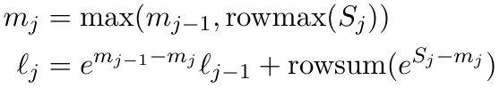

其中 mj 为运行最大值，ℓj 为指数运行和（归一化因子）。中间输出更新为 Oj = emj-1−mjOj-1 + eSj−mjVj。遇到更大值时，缩放因子 emj-1−mj 会重新归一化之前的结果，以保证数值稳定性。

条件式重新缩放。步骤 emj-1−mjOj-1 需要一次向量乘法。我们作出两点简单观察：
1. 只有 mj > mj-1，即出现新的更大值时，才需要重新缩放。

2. 重新缩放可以容许一定“余量”：仅当 mj−mj-1 > τ 时才缩放，其中阈值 τ 通常设为 log2(256)=8.0，对应缩放因子 256.0。只要跟踪统计量（已施加的总缩放），最后仍能得到正确分母和最终输出。

FlashAttention-4 将算法修改为：

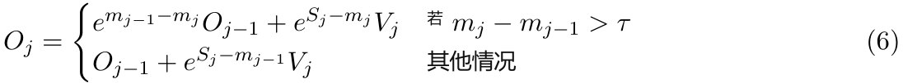

当 mj−mj-1 ≤ τ 时，跳过 m 的更新，继续使用 mj-1。其正确性得以保持，因为计算结束时，所有累加值都会根据真实最大值 mfinal 和最终归一化因子 ℓfinal 重新归一化：

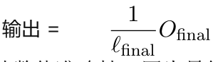

这一修改显著减少重新缩放次数，同时保持数值准确性，因为最终归一化步骤会修正跳过中间缩放所引入的微小偏差。

实际实现中，为避免线程束分歧，只要线程束中任一线程需要重新缩放，就执行缩放。

### 3.2　注意力反向传播

#### 3.2.1　数据供给与运算速度

与前向传播类似，我们首先根据矩阵乘法单元（Tensor Core）、共享内存（SMEM）和指数运算单元的吞吐量进行 Roofline 分析，以解释内核设计与优化的依据。

设沿 Q、K 序列长度维度的分块形状为 M×N，头维度为 d。我们分析计算与内存访问需求，以识别性能瓶颈。与前向传播不同，此处假设 M=N=d=128，以简化 SMEM 周期数公式，但为清楚起见仍保留变量名。

MMA 计算。反向传播每轮执行五次矩阵乘加。每次 MMA 涉及一个 M×N 矩阵、一个 M×d 矩阵和一个 d×N 矩阵（输出矩阵随操作而变），需要 2MNd 次浮点运算。Tensor Core吞吐量为每周期 8192 FLOPs，因此总计算时间为

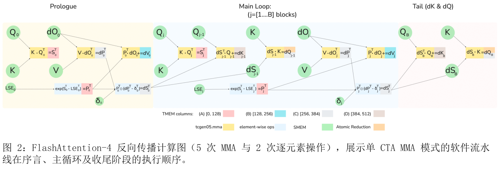

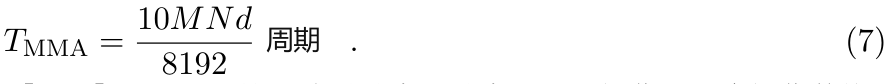

共享内存流量。五次 MMA 中，ST=KQT、dPT=VdOT、dQ=dSK 这三次是共享—共享（SS）操作，两个操作数均来自共享内存；dV=PTdO、dK=dSTQ 这两次是张量—共享（TS）操作，A 来自张量内存，B 来自共享内存。SS MMA 共读取 2Md+3Nd+MN 个元素；TS MMA 共读取 2Md 个元素。共享内存带宽为每周期 128 字节，每元素 2 字节（BF16），因此耗时为

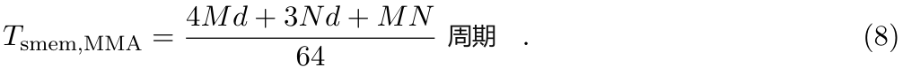

此外，算法将大小为 M×N 的中间梯度 dS 以 BF16 写入共享内存，需要 2MN 字节，即 MN/64 周期。大小为 M×d 的梯度 dQ 以 FP32（每元素 4 字节）写入共享内存，再通过 TMA 读回执行归约，共产生 8Md 字节流量，即 Md/16 周期。因此，总共享内存访问时间 Tsmem 为

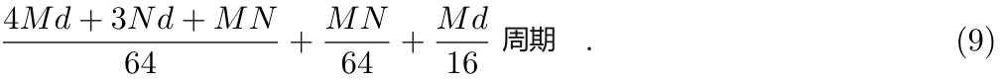

指数运算单元。指数运算单元计算 softmax 及其梯度所需的逐元素操作，包括指数、对数和相关非线性函数。反向传播需对 M×N 个值（对应注意力矩阵 S 及相关项）求指数。吞吐量为每周期 16 次操作，因此耗时为

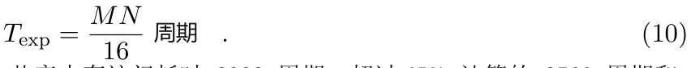

表 3 汇总了典型配置 M=N=d=128 的分析。共享内存访问耗时 3328 周期，超过 MMA 计算的 2560 周期和指数运算的 1024 周期，表明共享内存带宽是主要瓶颈，但严重程度低于仅依据全局内存流量所作的估计。因此，我们的内核设计尽量重叠 MMA 与其他计算，以隐藏共享内存延迟。

#### 3.2.2　重叠矩阵乘法与 softmax 的新流水线

FlashAttention 的反向传播执行五次 MMA，分别对应 S 的重计算、QK 引出的两个梯度计算（得到 dQ、dK），以及 PV 引出的两个梯度计算（得到dP、dV）。FA-3 将累加器放在寄存器中，而寄存器资源有限，因而对执行顺序施加强约束，实质上将计算图串行化：依次计算 S、dP、dV、dQ、dK，只有 TMA 加载显著偏离这一顺序。除此之外，算法整体相似：沿 KV 序列长度维度迭代，计算相对于前向传播转置后的值，因为 dV、dK 梯度计算要求这种布局，才能从张量内存读取其中一个操作数。dQ 则通过原子操作累加。

| 资源 | 单 CTA：M=128，N=d=128（周期） | 双 CTA：M=256，N=d=128（周期） |
| --- | --- | --- |
| MMA 计算 | 2560 | 2560 |
| 共享内存（MMA 操作数） | 2048 | 1536 |
| 共享内存（dS 写入） | 256 | 256 |
| 共享内存（dS DSMEM） | 0 | 384 |
| 共享内存（dQ 写入＋读取） | 1024 | 512 |
| 共享内存总计 | **3328** | **2688** |
| 指数运算单元 | 1024 | 1024 |

**表 3：注意力反向传播的 Roofline 分析。M=N=d=128 时，共享内存流量是瓶颈，耗时比 MMA 计算高约 30%。在双 CTA 设置 M=256、N=d=128 下（dQ MMA 例外，其 M=N=128、d=256），共享内存耗时比 MMA 计算高约 5%。**

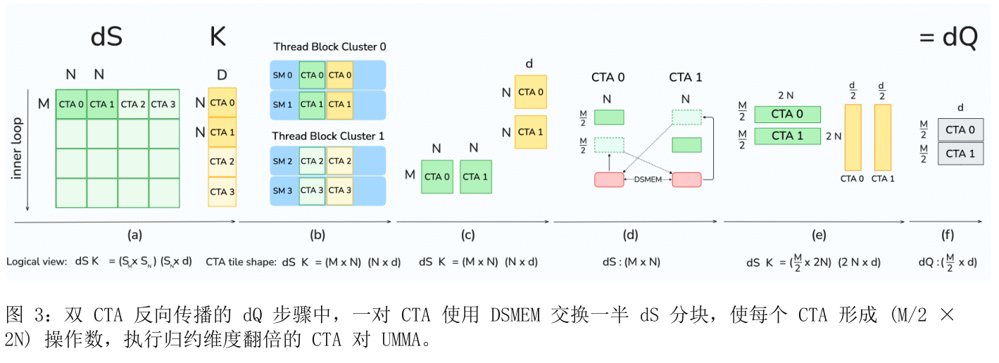

与 FA-3 相比，FA-4 的 TMEM 支持更多调度方式，使 MMA 与非 MMA 操作显著重叠。与前向传播一样，我们试图隐藏 softmax 延迟。在 FA-3 中，softmax 与 dP 的 MMA 重叠；根据上一节可知，在 Blackwell 上至少需要两个 MMA 操作与之并发执行。

我们利用上一轮迭代的 dQ、dK MMA 实现这一点。这需要谨慎协调加载、MMA、逐元素计算和归约之间的共享内存、张量内存资源。尤其要注意，张量内存不足以容纳五个累加器分块，最多只能放四个 128×128 分块。dV、dK 持续累加，因而不能与其他数据共享空间。我们的实现让 S、P 共享一个 TMEM 块（偏移 0），让 dP、dS、dQ 共享另一个。图 2 展示 FA-4 反向传播计算图。

#### 3.2.3　双 CTA 反向传播：减少共享内存流量与全局原子加法

即使改善流水线，并将十个 GEMM 操作数中的两个保存在张量内存中，共享内存带宽仍主导反向传播。五次 GEMM 的其余八个 BF16 操作数均从共享内存加载以供给 Tensor Core，所需周期比 Tensor Core 计算多约 30%。为进一步缓解瓶颈，我们使用 Blackwell 引入的双 CTA MMA 模式，沿 M 维度划分输出累加器。采用 M=256、N=K=128 的 MMA 分块时，两个 CTA 协同构成一个更大的分块：每个 CTA 只加载、暂存一半 B，并保留自己对应的累加器切片。

共享内存流量。反向传播的五次 GEMM 使用 M=256、N=K=128 的分块，使 B 的共享内存流量大致减半。在 FlashAttention 反向传播中，每个 CTA 持有固定 KV 分块（外层循环在 N 个 CTA 上并行），内层循环流式遍历 M 分块。dQ 的累加是外层循环沿 KV 序列进行的归约，但双 CTA MMA 只划分输出块，不划分归约轴；而 dQ MMA 的归约维度为 N，自然分布在一对 CTA 上。因此，每个 CTA 对其拥有的行仍需要完整归约。为解决这一冲突，同簇的两个 CTA 通过分布式共享内存（DSMEM）交换一半 dS，重新打包 dS，使其沿非归约轴划分。每个 CTA 拥有 M/2 行，并持有完整的 2N 归约维度。因此，每个 CTA 的 dQ MMA 分块形状为 (M/2, 2N)(2N, d)，在张量内存中累加 (M/2, d) 分块。双 CTA 模式下，S、dP、dV、dK 的 MMA 使用 M=256，而 dQ 使用 M=128、翻倍后的归约维度 2N=256。

为隐藏 DSMEM 延迟，我们调整了相对于单 CTA 版本的软件流水线顺序：先计算当前分块的 dP，再计算上一次迭代分块的 dQ。dQ 分块足够小，可与 P 一同放入 TMEM，并复用 S 所在区域，因此无需像单 CTA 模式那样让 dP、dQ 共享区域。新的顺序使当前分块的逐元素 dS 计算与上一轮分块的 dQ MMA 并行。图 3 展示 dQ 步骤的分解。

dQ 原子加法。这种 dQ 分解还将全局原子归约次数减半。原子更新引入非确定性，而且在内层循环每轮执行，代价较高。采用此方案后，每个 CTA 只写一半 dQ 分块，全局原子归约次数是对应单 CTA 实现的一半。

#### 3.2.4　确定性反向传播

反向内核在全局内存中执行跨 CTA 归约，因此梯度计算具有非确定性：通常影响 dQ，在 GQA 中也影响 dK/dV。为保证可复现性并支持可靠的训练调试，我们提供确定性执行模式。标准方案是使用信号量锁将全局归约串行化，我们也采用此方法。具体来说，写入同一 dQ 分块的每个 CTA，必须按预定义顺序获取锁，执行归约，再递增信号量计数器释放锁。

基于锁的方法主要因两点影响性能：（1）必须发射内存栅栏，保证信号量写入在整个设备上可见，以实现正确的获取—释放语义；（2）各 CTA 需等待先前对同一 dQ 分块执行归约的 CTA 完成，产生停顿。负载不均衡时，朴素的 CTA 顺序可能严重降低性能。通常，我们在头维度和批次维度对 CTA 调度顺序进行重排（swizzling），以减少停顿，重排范围受 L2 缓存容量限制，见第 3.3 节。对于因果掩码，我们还按降序启动 KV 块，从对角线起按升序遍历查询块，并按查询块索引降序执行 dQ 归约。这种“最短处理时间优先”（SPT）调度保证各 CTA 在首次写入 dQ 时不会停顿。

### 3.3　调度

在因果掩码、可变序列长度（varlen）等情况下，注意力内核天然存在负载不均衡：分配给各 SM 的工作分块具有不同的主循环长度，因为有些分块需要更多加载和 MMA 操作。此外，我们可以选择 SM 处理分块的顺序，例如定义网格坐标的优先线性化方式。撇开注意力的具体特征后，可以将同构并行处理器上最小化总完成时间的一般结论用于此场景。具体而言，FlashAttention-4 使用经典的最长处理时间优先（LPT）调度思想 [9]。这种应用方式适用于所有 GPU 架构；我们也验证了它能改善 Hopper 上 FlashAttention-3 的性能。

因果掩码的 LPT。标准注意力网格为 (mblocks, heads, batches)，按从左到右递增的顺序计算。但对角线上方的分数会被掩蔽，因此在头和批次固定时，SM 实际按从最短到最长的顺序处理工作分块，效率较低。朴素 LPT 顺序也不是最优：不同批次的主循环 KV 加载无法命中同一 L2 缓存；若先加载所有 KV 头，超过容量时又可能造成 L2 抖动。因此，我们始终将批次作为最外层维度，并在头维度重排。具体而言，把注意力头分成不超出 L2 容量的若干区段；分块调度器依次遍历区段内各头、逆序 mblocks、各区段，最后是批次。尤其对于 MQA、GQA，始终先遍历每个 KV 头对应的全部查询头，再改变 mblocks。实验验证此 LPT 顺序非常有效：在 H200 上使用 BF16、头维度 128 时，MHA 的 FLOPS 提升 4%–8%，MQA 8 提升 7%–14%。

可变序列长度的 LPT。varlen 还需处理批次之间差异引起的负载不均衡。例如，解码时不同批次可能关注不同长度的上下文；混合或连续批处理时，一些批次可能处于预填充阶段，另一些则在解码。各批次的查询与 KV 序列长度通常作为注意力元数据存储在设备上，标准 varlen 内核运行时读取这些整数，并按递增批次顺序处理。但给定顺序在负载均衡上可能任意不佳，例如先处理较短的方形预填充，再处理长上下文解码。为改善这一点，可以启动预处理内核，根据各批次工作分块的最大执行时间排序，实施 LPT；同时写出虚拟批次索引到实际批次索引的映射。注意力内核随后读取该元数据，按排序后的顺序遍历批次。元数据可以缓存，因此排序不会造成性能损失。

## 4　语言与框架

我们完全使用嵌入 Python 的 CuTe-DSL [21] 编写 FlashAttention-4，不包含任何 CUDA C++ 组件。CuTe-DSL 编译器将 Python 源码降级为 PTX，再调用 PTX 编译器 ptxas，最终生成汇编代码 SASS。

清晰抽象与完整表达能力。CuTe-DSL 编程模型与 CUTLASS C++ 同构，使 FlashAttention-4 保留底层 GPU 编程的完整表达能力，同时受益于 Python 元编程（取代 C++）带来的开发效率，以及快速 JIT 编译。CuTe-DSL 还提供直接访问 PTX 的底层接口，让开发者能够实现所需的任何功能，不受框架限制。例如，对于 CuTe-DSL API 尚未完整暴露的操作，我们使用自定义 PTX 指令序列（这些操作将集成到后续版本），说明框架不会将开发者限制在 GPU 能力的某个子集中。

通过 JIT 快速编译。复杂的 C++ 模板元程序曾使编译时间成为 FlashAttention 实现的瓶颈。将 CuTe-DSL 嵌入 Python 并采用即时编译（JIT）后，FlashAttention-4 比传统 C++ 模板方案构建更快。如表 4 所示，相比 FlashAttention-3，编译时间缩短 20–30 倍。快速迭代显著提高开发效率，使内核开发中的实验与调试更迅速。

| 方法 | 前向传播 | 反向传播 |
| --- | --- | --- |
| FlashAttention-3 | 55s | 45s |
| FlashAttention-4 | 2.5s | 1.4s |
| 加速比 | 22× | 32× |

**表 4：单个内核编译时间：FA3 使用 C++ 模板，FA4 使用 CuTe-DSL。FA2、FA3 通常需为不同注意力变体预编译数百个内核。**

灵活性与易用性。基于 Python 的框架已在实践中展示灵活性：开发者无需修改核心框架，便在 FlashAttention-4 上成功构建了 FlexAttention 和块稀疏注意力变体。通过降低入门门槛，仅有数月 GPU 编程经验的研究者与工程师也能贡献有价值的扩展，无需深入掌握 C++ 模板元编程。这加快了创新，使注意力研究社区能够更迅速探索新算法变体。

我们的愿景是提供全面的框架，以一流性能构建各种注意力变体。FlashAttention-4 将通用功能拆分为独立、可组合的原语，无需为每种变体从头实现。块稀疏模式、掩码策略、可变序列长度处理和工作调度等操作，都以彼此正交、可自由组合的原语提供。这种模块化设计使优化与新特性能惠及建立在该框架上的所有注意力实现，同时通过编译成高效 GPU 内核获得最高性能。

## 5　实验评估

我们将 FlashAttention-4 与多种开源、闭源基线比较，评估其效率。

注意力性能基准。我们测量不同序列长度和头维度下 FlashAttention-4 的耗时，并与 PyTorch 标准实现、FlashAttention-21、Triton（使用 B200 专用指令 [26]）、Gluon（比 Triton 控制粒度更细的底层 GPU 编程语言 [25]），以及 cuDNN（针对 B200 优化的厂商库）比较。结果确认，相比 cuDNN 9.13 最高加速 1.3 倍，相比 Triton 最高加速 2.7 倍。FlashAttention-4 最高达到 1613 TFLOPs/s，约为 B200 理论最大吞吐量的 71%。

> 1FlashAttention-3 无法在 B200 上运行。

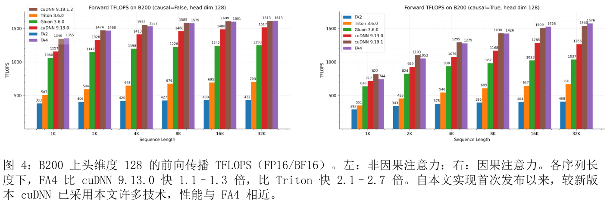

基准设置。我们在 B200 GPU 上使用 BF16 输入，测试有、无因果掩码以及头维度为 64、128、(192,128) 的配置。序列长度取 1k、2k、……、32k，并调整批大小，使 token 总数为 32k。隐藏维度设为 2048；头维度 64 或 128 分别对应 32 或 16 个头。对于 DeepSeek V3 [7] 使用的 (192,128) 配置，采用 16 个头，查询维度 192、键/值维度 128。前向 FLOPs 计算为 4×序列长度2×头维度×注意力头数。因果掩码下，由于大约只计算一半元素，将其除以 2。反向 FLOPs 为前向的 2.5 倍：前向有两次矩阵乘法，反向因重计算而有五次。

### 5.1　前向传播

图 4、5 给出前向传播结果。FlashAttention-4 比 cuDNN 9.13 快 1.1–1.3 倍，比 Triton 快 2.1–2.7 倍。对于中长序列（4k 及以上），在不同头维度和因果掩码设置下，FlashAttention-4 始终优于所有基线。因果注意力的收益更大，我们将其归因于最长处理时间优先（LPT）调度器。

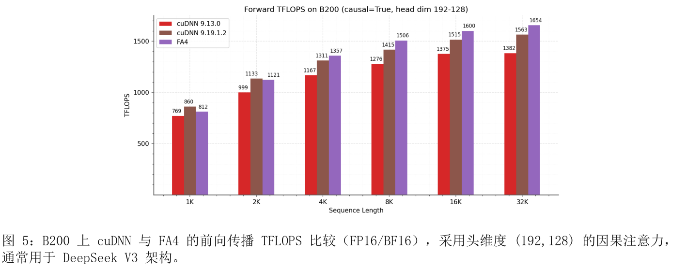

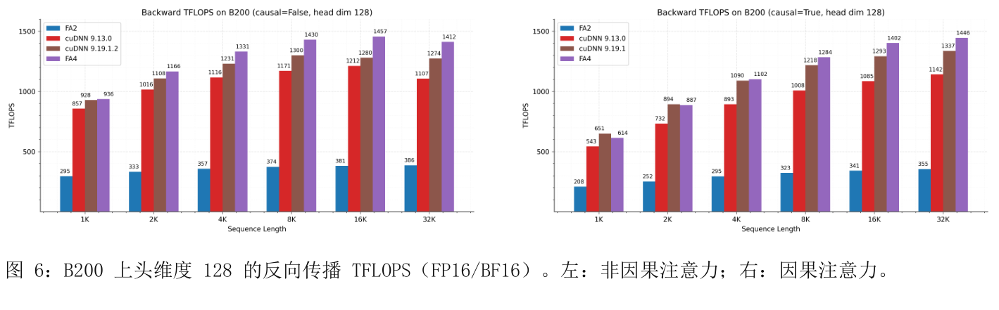

### 5.2　反向传播

图 6 给出反向传播结果。FlashAttention-4 在长序列和因果掩码设置下均稳定加速，证明双 CTA 反向传播有效。

图 7 还展示确定性反向传播的性能。通过精心设计重排与调度，确定性反向传播显著加快，最高达到单 CTA 非确定性反向传播速度的 75%。

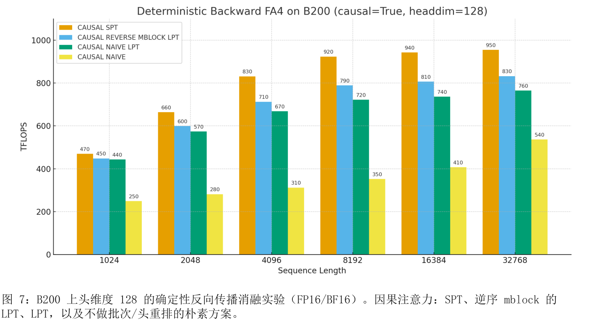

## 6　讨论与结论

FlashAttention-4 针对硬件非对称扩展：Tensor Core 速度增长如此之快，以至主要瓶颈转向共享内存流量和指数运算吞吐量，因此需要算法与内核协同设计来缓解限制。我们围绕完全异步 MMA 重新设计流水线，使 softmax 与更大分块的矩阵乘法重叠，并通过软件模拟指数函数和条件式 softmax 重新缩放，减少非矩阵乘法操作。我们利用张量内存与双 CTA MMA 减少共享内存流量；双 CTA 还支持重构全局原子累加，将全局原子加法次数减半。FlashAttention-4 完全由嵌入 Python 的 CuTe-DSL 实现，在保留底层控制能力的同时，比 C++ 模板内核编译快 20–30 倍。虽然针对 Blackwell 优化，但随着计算能力持续超过非矩阵乘法单元的增长，部分算法也可推广到其他加速器。

## 致谢

感谢 Together AI、Meta、xAI 和 Princeton Language and Intelligence（PLI）提供计算资源。感谢 Schmidt Sciences AI2050 fellowship、Google ML and Systems Junior Faculty Awards，以及 Google Research Scholar program 的支持。还要感谢 NVIDIA 的 cuDNN、TensorRT-LLM 和 CUTLASS 团队持续提供讨论、想法与反馈。

## 参考文献

[1] Michael Bauer, Henry Cook, and Brucek Khailany. CudaDMA：通过线程束专门化优化 GPU 内存带宽. In Proceedings of 2011 International Conference for High Performance Computing, Networking, Storage and Analysis, SC ’11, New York, NY, USA, 2011. Association for Computing Machinery. ISBN 9781450307710. doi: 10.1145/2063384.2063400. URL https://doi.org/10.1145/2063384.2063400.

[2] Tom Brown, Benjamin Mann, Nick Ryder, Melanie Subbiah, Jared D Kaplan, Prafulla Dhariwal, Arvind Neelakantan, Pranav Shyam, Girish Sastry, Amanda Askell, et al. 语言模型是少样本学习器. Advances in neural information processing systems, 33:1877–1901, 2020.

[3] Richard J Chen, Chengkuan Chen, Yicong Li, Tiffany Y Chen, Andrew D Trister, Rahul G Krishnan, and Faisal Mahmood. 通过分层自监督学习将视觉 Transformer 扩展到十亿像素图像. In Proceedings of the IEEE/CVF Conference on Computer Vision and Pattern Recognition, pages 16144–16155, 2022.

[4] Sylvain Chevillard, Mioara Jolde ̧s, and Christoph Lauter. Sollya：用于开发数值代码的环境. In Mathematical Software – ICMS 2010, volume 6327 of Lecture Notes in Computer Science, pages 28–31. Springer Berlin Heidelberg, 2010.

[5] Tri Dao. FlashAttention-2：通过更好的并行性和工作划分实现更快的注意力, 2023. URL https://arxiv.org/abs/2307.08691.

[6] Tri Dao, Daniel Y. Fu, Stefano Ermon, Atri Rudra, and Christopher R ́e. FlashAttention：具备 IO 感知能力的快速、内存高效精确注意力. In Advances in Neural Information Processing Systems, 2022.

[7] DeepSeek-AI. DeepSeek-V3 技术报告. arXiv preprint arXiv:2412.19437, 2024.

[8] Alexey Dosovitskiy, Lucas Beyer, Alexander Kolesnikov, Dirk Weissenborn, Xiaohua Zhai, Thomas Unterthiner, Mostafa Dehghani, Matthias Minderer, Georg Heigold, Sylvain Gelly, et al. 一幅图像相当于 16×16 个词：面向大规模图像识别的 Transformer. In International Conference on Learning Representations, 2020.

[9] R. L. Graham. 多处理器计时异常的界限. SIAM Journal on Applied Mathematics, 17(2):416–429, 1969. doi: 10.1137/0117039.

[10] Mandy Guo, Joshua Ainslie, David Uthus, Santiago Ontanon, Jianmo Ni, Yun-Hsuan Sung, and Yinfei Yang. LongT5：面向长序列的高效文本到文本 Transformer. arXiv preprint arXiv:2112.07916, 2021.

[11] Jonathan Ho, Tim Salimans, Alexey Gritsenko, William Chan, Mohammad Norouzi, and David J Fleet. 视频扩散模型. Advances in Neural Information Processing Systems, 35:8633–8646, 2022.

[12] Jintao Lin, Mingye Luo, Jingwen Zeng, Jianfei Zhai, and Jun Hu. SageAttention2：通过充分的离群值平滑与逐线程 INT4 量化实现高效注意力. arXiv preprint arXiv:2411.10958, 2024.

[13] Jintao Lin, Jia Zhang, Haofeng Zheng, Jingwen Zeng, Jianfei Zhai, and Jun Hu. SageAttention：用于即插即用推理加速的准确 8 位注意力. arXiv preprint arXiv:2410.02367, 2024.

[14] Jintao Lin, Mingye Luo, Jia Zhang, Zheng Xu, Haofeng Zheng, Jingwen Zeng, Jianfei Zhai, and Jun Hu. SageAttention3：通过 FP4 量化在 Blackwell GPU 上实现快速注意力. arXiv preprint arXiv:2505.11594, 2025.

[15] Weile Luo, Ruibo Fan, Zeyu Li, Dayou Du, Hongyuan Liu, Qiang Wang, and Xiaowen Chu. 通过微基准测试与多层次分析剖析 NVIDIA Hopper 架构. arXiv preprint arXiv:2501.12084, 2025.

[16] Jean-Michel Muller, Nicolas Brunie, Florent de Dinechin, Claude-Pierre Jeannerod, Mioara Joldes, Vincent Lef`evre, Guillaume Melquiond, Nathalie Revol, and Serge Torres. 浮点算术手册. Birkh ̈auser Boston, 2nd edition, 2018. ISBN 978-3-319-76525-9.

[17] NVIDIA. NVIDIA H100 Tensor Core GPU 架构, 2022.

[18] NVIDIA. CUDA 编程指南 12.4 版, 2024. URL https://docs.nvidia.com/ cuda/cuda-c-programming-guide/index.html.

[19] NVIDIA. NVIDIA Blackwell 架构技术简介, 2024. https://nvdam.widen.net/s/ xqt56dflgh/nvidia-blackwell-architecture-technical-brief.

[20] NVIDIA. cuDNN 发行说明. https://docs.nvidia.com/deeplearning/cudnn/backend/ latest/release-notes.html, 2025.

[21] Nvidia. NVIDIA CUTLASS 文档, 2025. URL https://docs.nvidia.com/cutlass/ media/docs/pythonDSL/cute_dsl_general/dsl_introduction.html.

[22] Baptiste Roziere, Jonas Gehring, Fabian Gloeckle, Sten Sootla, Itai Gat, Xiaoqing Ellen Tan, Yossi Adi, Jingyu Liu, Tal Remez, J ́er ́emy Rapin, et al. Code Llama：面向代码的开放基础模型. arXiv preprint arXiv:2308.12950, 2023.

[23] Jay Shah, Ganesh Bikshandi, Ying Zhang, Vijay Thakkar, Pradeep Ramani, and Tri Dao. FlashAttention-3：利用异步执行与低精度实现快速、准确的注意力, 2024. URL https://arxiv.org/abs/2407.08608.

[24] Uri Shaham, Elad Segal, Maor Ivgi, Avia Efrat, Ori Yoran, Adi Haviv, Ankit Gupta, Wenhan Xiong, Mor Geva, Jonathan Berant, et al. SCROLLS：长语言序列的标准化比较. arXiv preprint arXiv:2201.03533, 2022.

[25] Triton Team. Gluon：一种更底层的 GPU 编程语言. https://github.com/ triton-lang/triton/blob/main/python/tutorials/gluon/01-intro.py, 2024.

[26] Philippe Tillet, Hsiang-Tsung Kung, and David Cox. Triton：面向分块神经网络计算的中间语言与编译器. In Proceedings of the 3rd ACM SIGPLAN International Workshop on Machine Learning and Programming Languages, pages 10–19, 2019.

[27] Ashish Vaswani, Noam Shazeer, Niki Parmar, Jakob Uszkoreit, Llion Jones, Aidan N Gomez, Lukasz Kaiser, and Illia Polosukhin. 注意力就是你所需要的一切. Advances in neural information processing systems, 30, 2017.

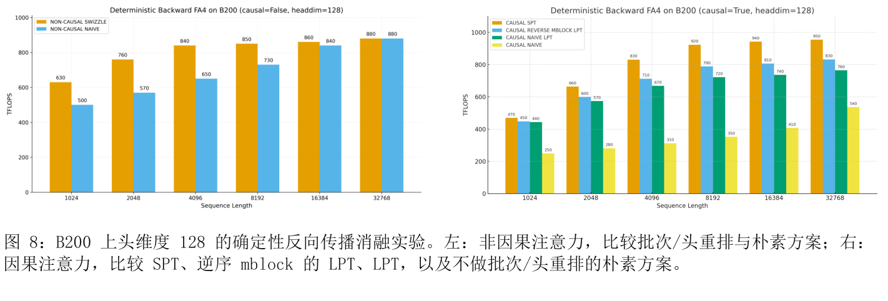

## A　实验与基准测试补充细节

### A.1　系统与软件库

我们在 B100 180GB SXM6（1000W）上测试速度。先预热运行 5 次，再重复基准测试 10 次，取平均耗时。

通常使用撰写论文时（2025 年 3 月）的最新库版本，具体如下：

• CUDA 13.1

• FlashAttention 2.8.3

• Triton 3.6

• PyTorch 2.10.0

• CuTe-DSL 4.4.1

cuDNN 方面，正文与 cuDNN 9.13 及最新的 9.19.1.2 比较。从 9.13、9.14 版本 [20] 开始，我们与 cuDNN 团队合作，将 FlashAttention-4 的部分技术集成到 cuDNN 中，使尽可能多的实践者受益。

### A.2　非因果确定性反向传播

为完整起见，图 8 同时给出无因果掩码的确定性反向内核性能，并与因果掩码设置并列展示。
