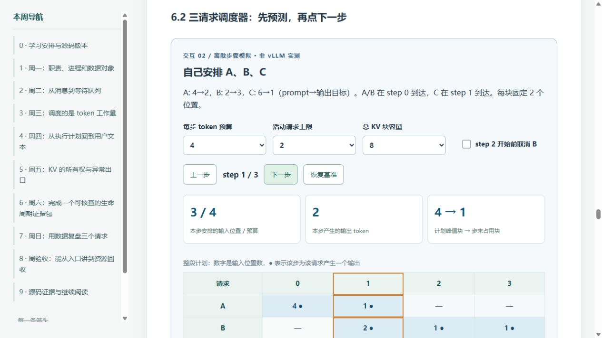

# 第三周教材交付核验

日期：2026-10-07。核验对象是教材、源码证据与教学模拟；未启动 vLLM 引擎，未运行 GPU benchmark，未确认学习者已通过第三周验收。

## 对照原定七天任务

| 要求 | 已检查的教材与产物 | 结论 |
| --- | --- | --- |
| 周一：固定版本，识别 API/Core/Worker | 教材第 0–1 节；完整锁文件；architecture.svg；源码范围声明 | 本地完整内容可恢复并已核验；上游 commit 仍未知，未冒用导读 commit |
| 周二：入队与状态 | 第 2 节；states.svg；S01–S13、S40；每日题与折叠答案 | 涵盖渲染、登记、ADD 消息、输入队列和 Scheduler 状态 |
| 周三：组 batch | 第 3 节；budget.png、counters.png；S14–S15、S41 | 区分输入位置/输出 token、预算/活动上限/容量、乐观计数/in-flight |
| 周四：执行和返回 | 第 4 节；S16–S28、S44–S45；参考调用链 | 包含 Executor、WorkerWrapperBase、Worker、Runner、采样、core 更新、IPC、detokenizer、SSE |
| 周五：KV 分配、释放与异常 | 第 5 节；kv.png；共享引用交互；S29–S39、S43 | 正常结束、取消、分配失败/抢占分别说明；包括 connector 和 in-flight 延迟释放边界 |
| 周六：完整源码调用链 | 第 6 节；week03-reference-chain.md；source-evidence.json；模板 | 提供静态参考图与逐阶段证据表；区分函数调用、消息和循环阶段 |
| 周日：三请求案例与验收 | 第 7–8 节；6 组 JSON、summary.csv、10 道验收题及答案 | 四步基准有独立手算；给出取消、容量不足与参数变化反例 |
| 图文与数据可视化 | 2 张 SVG、4 张 PNG/PDF 数据图、单文件 HTML、3 个交互 | 图中文字与箭头已目视检查；图中未完成场景单独标识 |
| 可复现、Git 维护 | 构建脚本、固定依赖、源锁、模拟代码、测试和数据 | 存放学习仓库；112.5 MiB 左右的原始源树保存在忽略的本地压缩归档中，不上传完整外部源码 |

## 实际执行与结果

| 命令/检查 | 本次结果 | 证明范围 |
| --- | --- | --- |
| `py -3.11 scripts/full_source_snapshot.py capture`（首次捕获）与 `verify` | 7,289 个源文件、全部目录与归档内容一致 | 完整本地内容与归档身份，不证明上游 commit |
| `py -3.11 lessons/week03/source_evidence.py` | 45 个符号与调用/字段锚点通过 | AST 定位、源文件哈希、指定文本；仍需人工解释分支 |
| `py -3.11 -m unittest discover -s experiments/w03-lifecycle -p test_simulate.py -v` | 8 个测试全部通过，包含 192 种参数组合的不变量 | 教学模型的手算一致性、预算/容量/取消/失败状态 |
| `py -3.11 experiments/w03-lifecycle/simulate.py` | 生成 6 个场景与 summary.csv | 确定性合成数据，无 GPU 计时 |
| 再生成到临时目录后逐字节比较 | 7 个数据文件全部相同 | 模拟数据可重建 |
| `.venv/Scripts/python.exe lessons/week03/build.py` | 生成 6 图和约 959 KB 的 HTML | 图片、CSS、JS 均内嵌；附加文件与源码仍需目录 |
| `node lessons/week03/check_interactive.cjs` | 6 个固定场景和 192 组 Python/JavaScript trace 全字段一致；UI 状态检查通过 | 两个实现的一致性，不证明它们等同真实 vLLM |
| 文档链接与 HTML 结构 | 168 个本地文档路径存在；104 个静态 ID 唯一，内部片段链接有效；6 张图片均为 data URI，无外部脚本 | 文件/导航完整性；不承诺 localhost 提供仓库外源码 |

构建环境：Windows，Python 3.11.0，markdown 3.11，matplotlib 3.11.2，numpy 2.4.6。模拟与快照工具只依赖标准库；浏览器交互不依赖 Python 或 GPU。

## 浏览器与视觉核验

在 Codex 内置浏览器打开本机 `127.0.0.1:8841/lessons/week03/index.html`。实际执行逐步推进、恢复基准、容量降为 2、取消 B、依次释放 A/B 引用、请求阶段切换、S20 锚点跳转与验收答案展开，结果与模拟/源码标识相符。

检查时页面宽度与内容宽度均为 1265 px，没有整页水平溢出；六张内嵌图片均加载，三个交互区均存在，未观察到页面控制台错误。源码文件链接面向本地文件阅读，localhost 预览没有暴露仓库外源文件，教材已说明如何按路径在编辑器中打开。未进行独立移动设备或实际打印机验证。

## 教学边界

完整源码归档的 SHA-256 为 `2206fef40dab95f56279053ce516a9f012c2feac43ee64dd7a403711844c5029`；归档位于 `artifacts/raw/vllm-local-2026-10-07.zip`，换电脑需要另行复制。

实际运行的模型、权重、tokenizer、解析配置、GPU、驱动与构建环境仍待 GPU 阶段补充。教材以静态源码阅读和可运行 CPU 教学模拟满足本周内容；不把这些验证写成真实引擎性能、调度一致性或学习者的验收通过。
