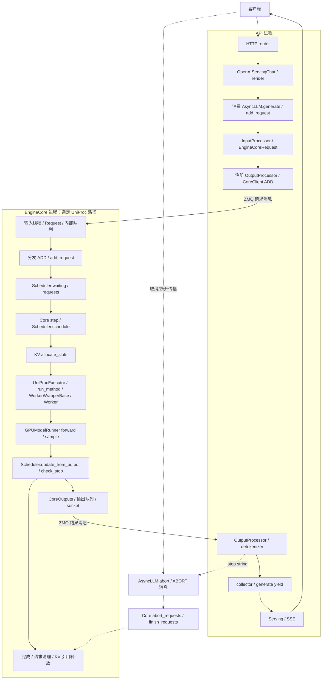

# W03 完整参考调用链（静态源码分析）

这份参考答案用于核对学习者的生命周期图。它不是引擎运行日志。源码身份为 `vllm-local-2026-10-07`，完整归档 SHA-256 为 `2206fef40dab95f56279053ce516a9f012c2feac43ee64dd7a403711844c5029`；对应[完整锁文件](../sources/vllm-local-2026-10-07.lock.json)和[逐符号证据](../lessons/week03/source-evidence.json)。

范围：在线 Chat Completions、n=1、普通 decoder-only 文本、非流式输入、单卡、TP/PP/DP=1、UniProcExecutor、V1 GPUModelRunner、无推测解码、无前缀命中、无 connector、无异步调度与 batch queue。源码允许其他配置；本图不概括所有部署。

## 完整流转图

图中边表示数据流或触发关系，不等于一个同步调用栈；`ADD` 与普通 `step` 属于不同的消息/循环阶段。分配不足不进入执行成功路径，而转入等待或抢占分支；为了让图可读，具体条件列在下表。

## 每个阶段如何取证

下表引用直接跳到[教材附录](../lessons/week03/README.md#s01)，那里列出每个符号的文件、定义行、证据行。JSON 中另存完整函数范围和原文件哈希。`driver_worker` 是 `WorkerWrapperBase`；`vllm/v1/worker/worker_base.py:352` 的包装方法再调用实际 Worker，读执行器时不要漏掉这一层。该文件也包含在完整锁定快照中。

| 阶段 | 实际入口与关系 | 输入 → 输出 / 关键条件 | 证据 |
| --- | --- | --- | --- |
| HTTP 到 Serving | router `create_chat_completion` 调 handler；handler 包装 `_create_chat_completion` | ChatCompletionRequest → 异步流生成器或完整响应；路由按返回类型包装 | [S01](../lessons/week03/README.md#s01)、[S02](../lessons/week03/README.md#s02) |
| 输入渲染 | `render_chat_request` → `online_renderer.render_chat` | 消息和模板设置 → engine inputs；错误可在入队前返回 | [S03](../lessons/week03/README.md#s03) |
| 引擎输入 | 消费 `AsyncLLM.generate` → `add_request` → InputProcessor | engine input → EngineCoreRequest；已渲染与原始 prompt 分支不同 | [S04](../lessons/week03/README.md#s04)、[S05](../lessons/week03/README.md#s05)、[S42](../lessons/week03/README.md#s42) |
| 本地登记与 IPC | `_add_request` 先登记 OutputProcessor，再调 AsyncMPClient；其 `_send_input` 编码，`_send_input_message` 发送 | EngineCoreRequest → ADD/ZMQ 消息；消息发出不等于已调度 | [S06](../lessons/week03/README.md#s06)–[S08](../lessons/week03/README.md#s08) |
| 接收与分发 | Core 输入线程调用 `preprocess_add_request` 构造内部 Request，再进 input_queue；主循环 `_handle_client_request` 分发 ADD | 请求消息 → `(Request, wave)` → `EngineCore.add_request` | [S09](../lessons/week03/README.md#s09)–[S12](../lessons/week03/README.md#s12) |
| 排队与选择 | `Scheduler.add_request` 登记 waiting/requests；`_process_engine_step` 另行触发选定 step_fn | 请求状态 + 预算 + 资源 → SchedulerOutput | [S13](../lessons/week03/README.md#s13)、[S14](../lessons/week03/README.md#s14)、[S44](../lessons/week03/README.md#s44) |
| 计划与计数 | `schedule` 申请 KV 槽位；`_update_after_schedule` 推进 computed / in-flight | 逻辑输入位置数 → 已预留资源的执行计划；未必已完成 GPU 工作 | [S14](../lessons/week03/README.md#s14)、[S15](../lessons/week03/README.md#s15)、[S39](../lessons/week03/README.md#s39)、[S41](../lessons/week03/README.md#s41) |
| 执行分派 | Core `step` → UniProcExecutor `execute_model` → `collective_rpc` → `run_method(driver_worker,...)` → Worker | SchedulerOutput → Future / Runner 结果；UniProc 这一步不必跨 OS 进程 | [S16](../lessons/week03/README.md#s16)–[S19](../lessons/week03/README.md#s19) |
| Forward 与采样 | Worker 调 Runner；Runner 准备输入/元数据并执行；若返回 None，Core 调 executor 的采样接口 | 输入缓冲区/positions/KV 元数据 → token 结果；部分 prefill 可无新 token | [S20](../lessons/week03/README.md#s20)、[S21](../lessons/week03/README.md#s21)、[S16](../lessons/week03/README.md#s16) |
| Core 结果更新 | `update_from_output` → `_update_request_with_output` → `check_stop` | token IDs → 请求输出序列/结束状态/CoreOutputs；真实实现还处理多种附带结果 | [S22](../lessons/week03/README.md#s22)、[S45](../lessons/week03/README.md#s45)、[S23](../lessons/week03/README.md#s23) |
| 结果 IPC | `_process_engine_step` 将输出入队，`process_output_sockets` 发送；客户端后台接收后供 `get_output_async` 消费 | CoreOutputs → API 进程；不是 HTTP SSE 直接从 GPU 发出 | [S44](../lessons/week03/README.md#s44)、[S24](../lessons/week03/README.md#s24)、[S25](../lessons/week03/README.md#s25) |
| 用户输出 | AsyncLLM 后台 handler → OutputProcessor → collector；generate yield 给 Serving 流生成器 | token IDs → 增量文本/RequestOutput → SSE；stop string 可反向中止 core | [S26](../lessons/week03/README.md#s26)–[S28](../lessons/week03/README.md#s28)、[S04](../lessons/week03/README.md#s04) |
| 正常完成 | Core 的 stopped 分支 → `_free_request` → `_free_blocks` → `_free_request_blocks` | 解除请求占用；connector 或在途执行可延迟物理复用 | [S22](../lessons/week03/README.md#s22)、[S32](../lessons/week03/README.md#s32)、[S33](../lessons/week03/README.md#s33) |
| 块池释放 | KVCacheManager → Coordinator → 各 SingleTypeKVCacheManager → BlockPool | 请求 ID/块列表 → 引用计数递减；归零与缓存淘汰有区别 | [S34](../lessons/week03/README.md#s34)–[S37](../lessons/week03/README.md#s37) |
| 取消 | generate 处理取消；AsyncLLM.abort 清本地状态并提交 ABORT；Core 调 Scheduler.finish_requests | WAITING 或 RUNNING → FINISHED_ABORTED → 同样的资源清理入口 | [S04](../lessons/week03/README.md#s04)、[S29](../lessons/week03/README.md#s29)–[S31](../lessons/week03/README.md#s31)、[S43](../lessons/week03/README.md#s43) |
| 资源不足 | allocate_slots 返回 None，scheduler 根据分支等待或选择抢占对象；`_preempt_request` 重置并排回 waiting | RUNNING → PREEMPTED；恢复与复用/重算另行判断 | [S39](../lessons/week03/README.md#s39)、[S14](../lessons/week03/README.md#s14)、[S38](../lessons/week03/README.md#s38) |

## 三请求图的数据

完整输入、逐步状态和输出见 [baseline.json](../experiments/w03-lifecycle/data/baseline.json)；手算表在教材第 7 节。基准是 4 步、15 输入位置、6 个输出 token、峰值 5 块、最后占用 0 块。它验证教学规则的自洽性，不验证真实 vLLM 的调度顺序和性能。

## 仍需运行环境才能验证的事

真实模型的输出一致性、所选配置实际落入哪条 executor/runner 分支、运行时进程拓扑、GPU 形状和时长、取消传播延迟、connector 收尾，都需要实际引擎与模型环境的日志/trace。教材不把这些未运行事项写成已测结果；本周静态调用链和手算验收不依赖 GPU 主机就绪。
