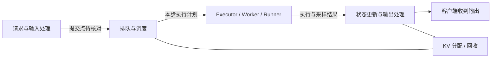

# 第三周 vLLM 资料阅读导航

这份导航把用户提供的两份教程接入原定 16 小时的“请求生命周期”学习周，供后续图文教材编写与源码阅读使用。当前已完成资料登记、章节映射和选定文件指纹，完整第三周教材尚未编写。

## 三份材料各自怎么用

| 材料 | 本地目录 | 本周用途 |
| --- | --- | --- |
| 中文源码主线 | `C:\Users\jiang\Desktop\study\inference\vllm-learning-book-main` | 先建立 API、Engine Core、scheduler、worker 的职责，再读输入与输出处理 |
| 英文示例补充 | `C:\Users\jiang\Desktop\study\inference\tutorials-vllm-main` | 看 API 请求、分词、连续批处理的例子；按需要补充，不从头刷完整课程 |
| 实现依据 | `C:\Users\jiang\Desktop\study\inference\vllm-main` | 核对真实类、函数、条件分支与数据结构；导读中的伪代码不能直接作为实现证据 |

文中的“中文”“英文”分别指上面两份教程。相对链接面向本机同级目录布局；GitHub 网页不包含这些外部源码。换电脑可按 [路径示例](local-paths.example.json)恢复目录，指纹范围见 [catalog.json](catalog.json)。

## 先把版本区别记清

核查日期：2026-10-07。以下信息来自本地文件，未据此宣称已完成完整上游版本校验。

| 对象 | 本次能确认什么 | 仍不能确认什么 |
| --- | --- | --- |
| 中文手册 | [source.lock.json](../../vllm-learning-book-main/source.lock.json) 声明被讲解 vLLM commit 为 `b23bd73f540175f9e117eaee5029cd7d8df63964`；[README](../../vllm-learning-book-main/README.md) 的版本栏与之相符 | 手册目录本身无 `.git`；声明不证明每段讲解已正确对应，也不证明本地 `vllm-main` 就是该 commit |
| 中文手册内的源码目录 | [.gitmodules](../../vllm-learning-book-main/.gitmodules) 声明 `vllm` 子模块；本次查看该目录为空 | 解压文件没有可直接阅读的完整子模块源码 |
| 英文教程 | 已检查入口 README、相关 `slides.md`，并记录文件指纹 | 本次检查未确认全教程对应的统一 vLLM commit；实际安装版本、默认参数和指标名需另查 |
| 本地 vLLM | 可读取 V1 文件，已对下列入口计算 SHA-256 | 无根目录 `.git`，上游 commit 未知；选定文件指纹不是可恢复的完整源码快照 |

开始本周正式调用链分析前，先按 [完整版本锁定要求](README.md#版本与指纹的边界)完成其中一种：取得并固定真实上游 commit，或保存本地源码完整归档及 SHA-256、来源记录。保留现有目录用于对照。此项列入周一任务；不能把手册的 commit 直接贴在当前本地源码上。

## 七天阅读安排

工作日仍按 **15 分钟回忆 + 35 分钟原理/导读 + 50 分钟追源码 + 20 分钟留证**。每天先读主线对应小节；补充材料只用于解答当日问题。源码不要求一页页读完，先追一个普通文本生成请求。

| 天 / 时长 | 主线与补充入口 | 本次追踪任务 / 留证问题 |
| --- | --- | --- |
| 周一 / 2 h | 中文：[整体架构](../../vllm-learning-book-main/01-overview/02-architecture.md)、[V0 与 V1](../../vllm-learning-book-main/01-overview/03-v0-vs-v1.md)，按需查[进程与 IPC](../../vllm-learning-book-main/01-overview/05-process-and-ipc-internals.md)；英文：[OpenAI API](../../tutorials-vllm-main/06-openai-api-standard/slides.md) | 固定完整源码版本；画 API、Engine Core、Worker 职责框图。区分进程边界与普通函数调用 |
| 周二 / 2 h | 中文：[入口](../../vllm-learning-book-main/03-code-walkthrough/01-entry-points.md)、[输入与分词](../../vllm-learning-book-main/03-code-walkthrough/08-input-processing-and-tokenization.md)中的请求转换小节；英文：[输入输出与 tokenization](../../tutorials-vllm-main/12-input-output-tokenization/slides.md) | 追一个 request ID：消息如何变成 token IDs，何时进入调度队列，状态由谁修改？ |
| 周三 / 2 h | 中文：[Scheduler](../../vllm-learning-book-main/03-code-walkthrough/02-scheduler.md) 中 `schedule` 相关小节；英文：[Continuous Batching](../../tutorials-vllm-main/14-continuous-batching/slides.md)，结合下方版本差异阅读 | 找本步 token 预算、等待队列和运行请求；说明 batch 成员与每请求 token 数为何会变化 |
| 周四 / 2 h | 中文：[Model Runner](../../vllm-learning-book-main/03-code-walkthrough/04-model-runner.md) 的执行路径、[输出与流式返回](../../vllm-learning-book-main/03-code-walkthrough/09-output-processing-and-streaming.md) 的处理流程 | 连接 scheduler 输出、模型执行、采样、状态更新和文本输出；标出“产生 token”与“客户端收到 chunk”的区别 |
| 周五 / 2 h | 中文：[KV Cache Manager](../../vllm-learning-book-main/03-code-walkthrough/03-kv-cache-manager.md) 的分配/释放小节；英文：[KV Cache Optimization](../../tutorials-vllm-main/15-kv-cache-optimization/slides.md) 按需查阅 | 只追正常完成、取消、分配不足三条路径：谁拥有块，谁触发释放或回收？块哈希与复用机制细读留到 W04 |
| 周六 / 3 h | 中文：[跟踪一次请求](../../vllm-learning-book-main/07-hands-on/02-trace-a-request.md)；英文：[Observability](../../tutorials-vllm-main/26-observability/slides.md) 补充事件与指标 | 30 分钟选路径；90 分钟补齐跨文件证据；60 分钟画图并检查中断、返回分支。无 GPU 时做静态调用链阅读，运行日志留待有环境时验证 |
| 周日 / 3 h | 回查前六天的证据；第二周[指标与实验协议](../experiments/w02-performance/protocol.md) | 60 分钟用三个请求手动模拟；60 分钟核对源码约束；60 分钟讲解与验收。交付一张带证据的生命周期图 |

英文 [首次部署](../../tutorials-vllm-main/05-first-model-serving/slides.md) 只在配置真实运行环境时选读；[Benchmarking](../../tutorials-vllm-main/27-benchmarking/slides.md) 可回查第二周的方法。英文教程的目录编号以实际文件夹为准，README 部分后续章节编号与目录名不一致。

## 本地源码入口地图

这是**定位清单**，用于正式学习时逐边追踪；尚不是已经验证完毕的端到端调用链。行号对应 [本次扩充基线](baseline-2026-10-07-w03-guides.json) 中项目 `vllm` 的文件，源码变化后先查符号再更新行号。

| 关注点 | 本地文件（相对 vllm-main） | 符号与当前起始行 |
| --- | --- | --- |
| 异步请求入口 | `vllm/v1/engine/async_llm.py` | `AsyncLLM`:80；`add_request`:372；普通请求提交到 `engine_core.add_request_async` 的一处位置为 548 |
| 输入处理 | `vllm/v1/engine/input_processor.py` | `InputProcessor`:40；`process_inputs`:308 |
| Core 入队与迭代 | `vllm/v1/engine/core.py` | `EngineCore`:111；`add_request`:489；`step`:633；另有 `step_with_batch_queue`:673，读主路径后检查其适用条件 |
| 调度 | `vllm/v1/core/sched/scheduler.py` | `Scheduler`:79；`schedule`:553；`_preempt_request`:1526；`add_request`:2473 |
| KV 分配与释放 | `vllm/v1/core/kv_cache_manager.py` | `KVCacheManager`:131；`allocate_slots`:371；`free`:610 |
| Worker 执行入口 | `vllm/v1/worker/gpu_worker.py` | `Worker`:182；`execute_model`:1152 |
| 一种 GPU runner 实现 | `vllm/v1/worker/gpu_model_runner.py` | `GPUModelRunner`:479；`execute_model`:4149；实际 runner 选择需结合配置核对 |
| 输出处理 | `vllm/v1/engine/output_processor.py` | `OutputProcessor`:464；`process_outputs`:641 |

查函数时不要只匹配名字：不同类中可能都有 `add_request`、`step`。笔记必须同时记录文件、类和函数。Executor、CoreClient、输入预处理与 API handler 的中间步骤仍需在正式调用链中补齐。

## 已发现的两处易混点

**在线与离线入口。** 中文 `03-code-walkthrough/01-entry-points.md` 第 16 行复核提示按 `AsyncLLM → EngineCoreClient → EngineCoreProc` 阅读在线主链，但第 40、98、307 行仍保留把在线路径概括为 `LLMEngine` 或其包装的说法。当前本地源码定义 `AsyncLLM(EngineClient)`（`async_llm.py:80`），`add_request` 在一条普通请求路径直接调用 `engine_core.add_request_async`（548）。因此先明确追在线还是离线入口，再核对每一跳；不要把这些不同层次的概述拼成同一条精确调用栈。

**抢占不等于一定换出到 CPU。** 英文 `14-continuous-batching/slides.md:87、269` 使用 waiting/running/swapped 三队列示意。当前本地 V1 的 `scheduler.py:209–212` 可见 `waiting`、`skipped_waiting` 和 `running`；`_preempt_request` 在 1544–1548 行调用块释放辅助方法、设为 `PREEMPTED` 并将 `num_computed_tokens` 清零，1568 行放回 waiting。阅读这条路径时应继续检查恢复调度和重算条件，不能仅凭幻灯图就断言进行了 GPU→CPU KV 交换。外部 connector/offload 的路径应单独核查。

这些差异用于指导核对，不代表已审完两份教程。图中“始终满载”一类表述也应结合第二周的到达率、token 预算、KV 容量和实际测量理解。

## 本周产物的填写方式

只要求一个主要产物：**带版本与证据的请求生命周期图**。先沿下面的问题框架补证据，而不是把概念箭头当作已经找到的函数调用。

图旁用一张证据表记录：`请求阶段 | 输入/输出对象 | 文件:类.函数:行号 | 进程与通信方式 | 正常与异常出口 | 版本/指纹`。标清其中哪些是静态阅读结论、哪些是手算假设、哪些有运行日志。

三请求练习可从 A（4 prompt tokens、2 output tokens）、B（2、3）、C（6、1）开始，明确到达时刻、每步 token 预算和简化规则后再填表。不要预先认定真实调度顺序；首个输出 token 与 prefill 的关系、完成请求移除时机、chunking 和资源限制都要核对。手算结果不计为引擎实测或性能数据。

周日应能回答：请求在哪里排队？每一步实际执行多少 token？KV 在什么条件下释放？一次客户端取消如何传播？输出 token 何时转成用户可见文本？每个答案都应找到对应证据；找不到的边保留为待查项。
